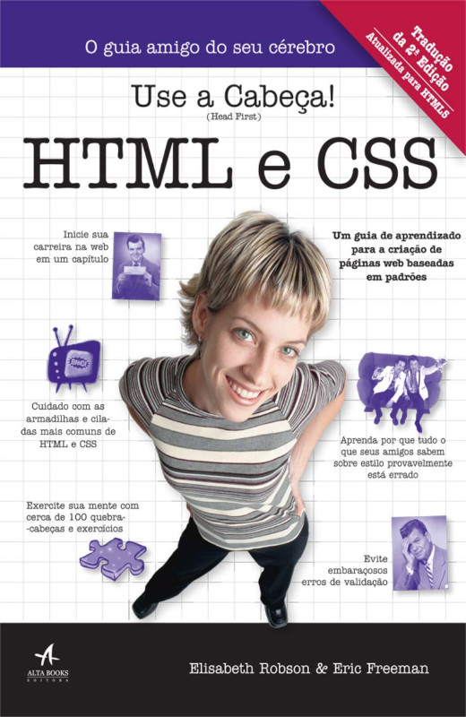
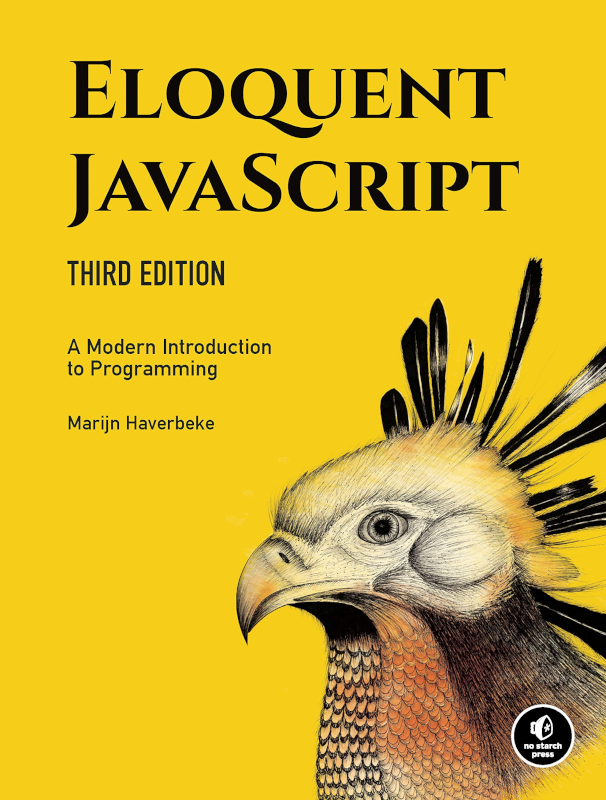

<!-- {"layout": "title"} -->
# **Programação** Web
## Plano de Ensino por **Flávio Coutinho**

---
<!-- {"layout": "section-header"} -->
# Plano de Ensino
## Sumário do conteúdo

[Slides](#slides)
  ~ Conteúdo das aulas em _slides_

[Ementa](#ementa)
  ~ Objetivo e a descrição da matéria

[Bibliografia](#bibliografia)
  ~ Livros e materiais básicos e complementares

[Avaliação](#avaliacao)
  ~ O formato e os itens de distribuição dos pontos
<!-- {dl:.content} -->

---
<!-- {"hash": "slides"} -->
# Aulas <small>(1/3)</small>

[Intro](classes/intro/) <!-- {dl:.width-10.full-width} -->
~ História e introdução à programação Web

[HTML1](classes/html1/)
~ Funcionamento da Web, Estrutura do HTML e CSS

[HTML2](classes/html2/)
~ Listas, inline/block, Tabelas, Links e Plantas Carnívoras 🦖

[HTML3](classes/html3/)
~ Ferramentas, Metadados, Multimídia e DIV/SPAN

[CSS 1](classes/css1/)
~ Reaproveitamento, História, Seletores float/clear e Abelhas 🐝

[CSS 2](classes/css2/)
~ Especificidade de seletores, prop. display, posicionamento

[HTML4](classes/html4/)
~ Tags semânticas, pseudocoisas, entrada/botões, o Box Model e Assombrações 👻

[JS 1](classes/js1/) 
~ História, sintaxe básica (tipos, variáveis, funções)

[JS 2](classes/js2/)
~ DOM, alteração de atributo, eventos e a Exploração Espacial 👽

---
# Aulas <small>(2/3)</small>

[CSS 3](classes/css3/) <!-- {dl:.width-10.full-width} -->
~ Flexbox, grid, visibilidade, web fonts

[CSS 4](classes/css4/)
~ _Layout_, _custom properties_ e o Coral 55 🌴

[JS 3](classes/js3/)
~ Template strings, objetos, prototype, função seta

[JS 4](classes/js4/)
~ Estilos, campos de entrada, eventos de mouse e o 📷 PhotoSnap

<!-- - [HTML 5](classes/html5/) - Formulários e Monstros (Prática) -->
<!-- - [Javascript 5](classes/js5/) - APIs do HTML5 -->
<!-- - [Node.js 1](classes/ssn1/) - Servidores Web -->
<!-- - [Node.js 2](classes/ssn2/) - NPM, arquivos e _learnyounode_ (Prática) -->
<!-- - [Node.js 3](classes/ssn3/) - Express.js -->
<!-- - [Node.js 4](classes/ssn4/) - HTML Dinâmico e o Geiser (Prática) -->

<!-- 
# Aulas <small>(3/3)</small>

- [Node.js 5](classes/ssn5/) - Sessão e Biscoitos :cookie:
- [Node.js 6](classes/ssn6/) - Bancos de Dados e Zumbis (Prática)
- [Mongo DB](https://fegemo.github.io/cefet-nosql/classes/mongodb-nodejs/)
- [CSS 5](classes/css5/) - Animações e _Edukids Animals_ (Prática)
- [CSS 6](classes/css6/) - _Responsive Design_
- [Javascript 3](classes/js3/) - Padrões de Projeto
- [Javascript 7](classes/js7/) - EcmaScript 2015/2016 -->

---
<!-- {"hash": "ementa", "layout": "section-header" } -->
# Ementa
## Objetivos

1. Criar páginas **HTML com uso de CSS e Javascript**
1. Desenvolver **sistemas web dinâmicos** com banco de dados e Node.js
1. Fazer trabalhos práticos legais
1. Tornar-se um **ninja** Javascript
<!-- {ol:.content} -->

---
<!-- {"hash": "bibliografia", "layout": "section-header"} -->
# Bibliografia
## Os textos e materiais que vamos usar

Veja a bibliografia básica e a complementar.

<!-- {p:.content} -->

---
<!-- { "layout": "centered", "styles": ["styles/classes/books.min.css"] } -->
## **Livro texto** da parte 1

::: figure .book
-  <!-- {.full-width.full-height} -->
- .
<!-- {ul:.hardcover_front} -->
- .
- [Sobre](https://www.altabooks.com.br/produto/use-a-cabeca-html-e-css/) <!-- {a:.book-btn target="_blank"} -->
- .
- .
- .
<!-- {ul:.page} -->
- .
- .
<!-- {ul:.hardcover_back} -->
- .
- .
<!-- {ul:.book_spine} -->
:::

**Título**
	 ~ Use a Cabeça! HTML e CSS

**Autores**
	 ~ Eric Freeman, Elisabeth Robson

**Editora**
   ~ Alta Books, 2015

---
<!-- {"layout": "centered"} -->
## **Livro texto** sobre JavaScript

::: figure .book
-  <!-- {.full-width.full-height} -->
- .
<!-- {ul:.hardcover_front} -->
- .
- [Ler de graça](https://eloquentjavascript.net/) <!-- {a:.book-btn target="_blank"} -->
- .
- .
- .
<!-- {ul:.page} -->
- .
- .
<!-- {ul:.hardcover_back} -->
- .
- .
<!-- {ul:.book_spine} -->
:::

**Título**
  ~ Eloquent JavaScript, Third Edition

**Autores**
  ~ Marijn Haverbeke

**Editora**
  ~ No Starch Press, 2018

---
<!-- {"layout": "centered"} -->
## **Livro texto** da parte 2

::: figure .book
-  <!-- {.full-width.full-height} -->
- .
<!-- {ul:.hardcover_front} -->
- .
- [Sobre](https://www.manning.com/books/node-js-in-action) <!-- {a:.book-btn target="_blank"} -->
- .
- .
- .
<!-- {ul:.page} -->
- .
- .
<!-- {ul:.hardcover_back} -->
- .
- .
<!-- {ul:.book_spine} -->
:::

**Título**
  ~ Node.js in Action, First Edition

**Autores**
  ~ Mike Cantelon, Marc Harter, T.J. Holowaychuk, Nathan Rajlich

**Editora**
  ~ Manning

---
<!-- {"layout": "main-point", "state": "emphatic"} -->
# Bibliografia Complementar

---
<!-- {"layout": "centered"} -->
## Dive into HTML5

  
  

- [Online](http://diveintohtml5.com.br/), gratuito

---
<!-- {"layout": "centered"} -->
## Use a Cabeça! Programação JavaScript

  
  

- **Título** Use a Cabeça! Programação JavaScript
- **Autores**	Eric Freeman, Elisabeth Robson
- **Editora** Alta Books, 2016

---
<!--{"hash": "avaliacao", "layout": "section-header"} -->
# Avaliação
## Distribuição de pontos

- ~10 Práticas
- Seminário
- Trabalhos Práticos
  - TP0
  - Projeto
<!-- {ul^1:.content} -->

---
<!-- {"layout": "centered-horizontal"} -->
# Distribuição de pontos

- Atividades Práticas (30 pontos)
- [Seminário: APIs HTML5][seminar] (20 pontos)
- Trabalhos Práticos
  - [TP0: Git][tp0] (3 pontos extras)
  - Projeto (TBD)
    - Entrega 1: (10 pontos)
    - Entrega 2: (10 pontos)
    - Entrega 3: (30 pontos)

*[TBD]: to be defined

[tp0]: assignments/tp0
[project]: https://github.com/fegemo/cefet-web/tree/master/assignments/project-craftfoliogotchi/README.md
[seminar]: https://github.com/fegemo/cefet-web/tree/master/assignments/seminar-html5/README.md
