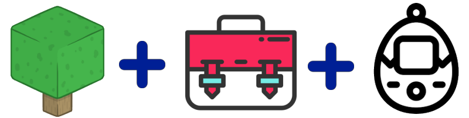

# Projeto (TP1 + TP2) - CraftFolioGotchi®

:microphone: "O que acontece quando a (a) liberdade de se construir um mundinho
virtual se une à possibilidade de se (b) mostrar suas habilidades
em um portfolio, que também se liga aos (c) cuidados que um jogador
deve ter para cuidar de um bichinho virtual? Senhoras e senhores,
dêem boas vindas ao **CraftFolioGotchi**® :musical_note: :notes:".

O CraftFolioGotchi® é um sistema Web que dá a seus usuários a (a) possibilidade
de criar e personalizar uma (e apenas uma) página/mundo. Nela, ele pode colocar
(b) textos e galerias de imagens mostrando os seus trabalhos, ou seja, seu
portfolio. Além disso, cada usuário possui (a,c) um personagem/avatar que pode
ser controlado por ele e pode: andar no seu próprio mundo ou visitar o
mundo de outros usuários.

De tempos em tempos o personagem de um jogador pode (c) passar por necessidades,
como precisar de um remédio, de atenção ou de comida. Para atender essas
demandas, basta que o usuário dono do personagem (ou algum outro) visite
a sua página e clique nele.

O desenvolvimento do CraftFolioGotchi® deve ser feito em grupos de até 03
alunos e será dividido em duas etapas (TP1 e TP2) e os entregáveis
de cada parte estão descritos a seguir. As notas de cada etapa e o cronograma
estão definidos no [plano de ensino][plano-ensino] e no Moodle.

[plano-ensino]: https://fegemo.github.io/cefet-web/

## Trabalho Prático 1: _front-end_

Na primeira parte, o grupo deve entregar o _front-end_ com todas suas funções
implementadas, mas com dados _mocked_ em vez de usando um _back-end_ com
banco de dados e tal (TP2).

O sistema deve conter, pelo menos, as seguintes páginas:

1. Página de **cadastro/login** (pode ser a mesma, ou podem ser duas diferentes)
   - Essa página deve explicar brevemente o sistema de forma a "vender" a ideia
     para potenciais usuários
   - Nesta entrega (_front-end_ apenas), os botões logar/cadastrar devem
     apenas redirecionar o usuário para a página do mundo virtual
1. Página do **mundo virtual do usuário**
   - A página não deve ter uma barra de rolagem vertical
     (considere evitar a barra horizontal também)
   - Ela deve mostrar os _widgets_ (galeria de imagens, plaquinha etc., que
     serão descritos mais adiante) que foram adicionados à página
   - Na parte de baixo da página deve haver um "chão", que pode ser plano, e
     que deve ter uma imagem de fundo (tipo uma "textura")
   - O personagem/avatar do dono da página deve ser exibido em algum local
     do chão da página
     - O personagem pode ser controlado via teclado para andar para a
       esquerda/direita
   - A página pode estar em um modo de edição ou no modo de visualização
     - No modo de edição, o dono da página pode personalizar a página, bem como
       adicionar _widgets_ a ela
     - No modo de visualização o usuário pode interagir com os _widgets_ que
       possuem interação, como a galeria de fotos, a plaquinha de leitura etc.
       (descritos mais tarde)
1. Página de **configuração de _widget_**
   - Devem existir pelo menos 04 tipos de _widget_:
     1. **Fundo da página**, que pode ser apenas uma cor, um gradiente linear
        ou uma imagem (que pode ser uma URL hospedada em um servidor pra não
        precisar de _upload_)
     1. **Chão** plano na parte de baixo da tela, que deve ter uma "textura"
        aplicada a ele (_i.e._, imagem de fundo repetida, que pode ser passada
        como uma URL, ou que o usuário possa escolher a partir de um conjunto
        de e.g. 4 opções)
     1. **Caixa de texto**, que é um espacinho onde o usuário pode escrever
        alguma coisa e configurar a aparência: tamanho, posição, bordas,
        fonte e cor
     1. **Galeria de imagens**, uma sequência de imagens (URLs) opcionalmente
        com textos e um hiperlink associados. A galeria pode ser de slides ou
        mostrar um número máximo de imagens lado a lado. As imagens podem ser
        entradas como URLs para imagens hospedadas em algum servidor
   - Você pode ter uma única página para criar todos os tipos de _widget_, ou
     então uma página para cada um
   - Ao configurar um _widget_, seus valores de configuração devem ser
     armazenados no `localStorage`, para que a página de **mundo virtual** possa
     ler esses valores e "remontar" a página
   - Observação: para o usuário, uma experiência melhor seria configurar um
     _widget_ na mesma página onde ele se encontra (no caso,
     na página do mundo virtual em modo de edição), por exemplo, dentro de
     uma ["janelinha modal"][bootstrap-modal]. Implementar a funcionalidade
     de configuração de _widget_ na própria página do mundo virtual é um
     item opcional (que será descrito mais adiante)

[bootstrap-modal]: https://getbootstrap.com/docs/4.0/components/modal/

A implementação do _front-end_ dessas páginas e das suas respectivas
funcionalidades equivalem ao valor de 70% da nota do trabalho (TP1). Para
conseguir mais pontos, o grupo pode escolher um subconjunto de funcionalidades
extras para implementar, limitado a uma nota percentual total de 120%:

- **Relativos à aparência**:
  - (8%) fazer todas as **páginas _responsive_**
  - (1%) colocar um **_favicon_** bacaninha :star:
  - (2%)
- **Relativos ao uso de ferramentas**:
  - (0%) usar um **framework CSS** como Bootstrap ou MaterializeCSS
  - (3%) usar um **préprocessador CSS** como Sass, Less, Stylus ou o :star:
    postcss-cssnext (CSS4 convertido para CSS3)
  - (0%) usar um **framework JavaScript** para ajudar na estrutura dos
    programas, como Angular, React, Vue.js etc.
  - (2%) :star: **dividir o código** JavaScript em múltiplos arquivos por
    página em vez de fazer um único arquivão
    - (+2%) :star: usando o recurso de **módulos ES6** ([tutorial][tut-modules])
- **Sobre os _widgets_**:
  - (7%) **adição/configuração** de _widgets_ **na própria página do
    mundo virtual**
  - (5%) **arraste do mouse** para configurações de posição e tamanhos
  - (3%-??) novos tipos de _widget_
    - (5%) _widget_ de **áudio** - usuário pode passar um áudio (uma URL)
      que será exibido com seus controles em algum local (configurável)
      da página
    - (7%) _widget_ de **vídeo** - usuário pode passar um vídeo (uma URL)
      que será exibido com seus controles em algum local (configurável) da página
    - (6%) _widget_ de **plaquinha fincada no chão** - usuário configura um
      texto (ou, talvez, um HTML) que vai aparecer quando um visitante clica na
      plaquinha, dentro de uma janela modal

      
    - (4%) _widget_ de **contador de visitas** - que pode ser posicionado pelo
      usuário e deve registrar em `localStorage` a quantidade de visitas
      recebidas (no TP2 isso será adaptado para persistir no banco de dados)
    - (4%) _widget_ de **imagem sozinha** - pra possibilitar o usuário colocar,
      posicionar e dimensionar elementos como uma árvorezinha, estrelas piscando
      no céu etc.
    - (5%) _widget_ de **condição do tempo** - mostrando a temperatura e clima
      (eg, sol, nublado, chuva) dentro do mundinho virtual - usuário pode
      definir qual é e o _widget_ deve mostrar um íconezinho e a temperatura
    - (3%) _widget_ de **_favicon_**
    - (2%+?? por cada) **novas _widgets_** propostas pelo grupo
- **Sobre o personagem**:
  - (4%) **salto** quando uma tecla é pressionada (e.g., <kbd>SPACE</kbd> ou
    <kbd>⬆️</kbd>)
  - Sobre animação de andar/saltar do personagem:
    - (2%) **animação com imagens `.gif` ou APNG** (verificar suporte dos
      navegadores no caniuse.com)
    - (4%) **animação com CSS sprites** (como o
      [incrível monstro verde][monstro-verde]) :star:
    - (10%) **animação em tempo de execução** usando algo como
      [Spriter][spriter] ([demo][spriter-demo]), [Spine][spine] ou
      [DragonBones][dragonbones]
  - (4-8%) **máquina de estados** do personagem para colocar um comportamento
    nele estilo um tamagotchi: pode ficar com fome, doente, com sono etc. Algo
    na interface precisa comunicar essa mudança de estado (eg, um balãozinho
    com um ícone). Também deve ser possível transitar de volta ao
    "estado normal" de alguma forma (eg, clicando no personagem/balão,
    ou, quem sabe, digitando um comando: "comer")
  - (4-10%) **interação do personagem com "o cenário"** - algumas _widgets_
    podem ser obstáculos, ou serem empurradas, ou ficarem meio transparentes
    quando o personagem passa por elas
- **Extras gerais**:
  - (2%) incluir o **Google Analytics** pra saber quem está visitando a página
  - (2-6% cada) **implementar APIs do HTML5** que façam sentido para a aplicação.
    Por exemplo:
    - **_Page visibility API_** pra detectar que a aba não está mais "à mostra"
    - **_Geolocatoin API_** pra detectar onde o usuário está no mundo real
      (poderia ter um _widget_ que usasse essa info, como a de clima/tempo)
    - **_Speech recognition API_** pra dar comandos de voz para o
      avatar (_e.g._, "comer!")
    - **_Canvas API_** para desenhar _e.g._ efeitos climáticos, ou o próprio
      personagem, usando JavaScript
  - (3-6% cada) **integrar a uma API de algum serviço** na web. Por exemplo:
    - (4%) :star: **previsão/condição atual do tempo** para uma localidade real,
      definida pelo usuário criador ou determinada com _geolocation API_ para o
      usuário visitante
      - (+6%) :star: **efeitos visuais**
    - (4%) **API de mapas** (Google maps, Bing maps, OpenStreetMaps etc.) para
      criar um _widget_ de mapa, por exemplo
    - (6%) **API do GitHub** pra mostrar os principais repositórios, ou as
      últimas atividades do usuário (um _widget_)

[tut-modules]: https://www.sitepoint.com/understanding-es6-modules/
[monstro-verde]: http://terrivel.herokuapp.com/monster
[spriter-demo]: https://cdn.rawgit.com/flyover/spriter.ts/master/demo/index.html
[spriter]: https://brashmonkey.com/
[spine]: http://pt.esotericsoftware.com/
[dragonbones]: http://dragonbones.com/en/index.html

### Hospedando o TP1

Você pode usar o serviço [Github Pages][gh-pages] (se estiver usando o GitHub)
para hospedar seus arquivos. Senão, pode procurar algum serviço de
hospedagem gratuito.

[gh-pages]: https://pages.github.com/

## Trabalho Prático 2: _back-end_ (integrado ao _front-end_)

Na segunda parte do projeto, o grupo deve criar um _back-end_ para a
aplicação e integra-lo ao _front-end_. A tecnologia utilizada deve ser a
mesma vista em sala de aula (Node.js + Express), podendo variar o
_framework_ web - por exemplo, Node.js + Hapi, Node.js + Sails, Meteor. Se
estiver em dúvidas quanto a poder usar uma tecnologia ou não, consulte
o professor.

O sistema (_back_ + _front_) deve permitir o cadastro de usuários. Uma
página de um usuário pode ser visualizada por qualquer usuário, mas a edição
deve ser permitida apenas para o usuário dono. Logo, é necessário que o usuário
faça login e que algumas funcionalides (eg, edição, movimentar o avatar)
sejam possíveis apenas em alguns casos (dono do mundo visualizando-o).

Cada mundo tem uma URL única (eg, `/world/87497`) para que uma pessoa possa
mostrá-lo para outras. Se um usuário que está logado acessa o mundo de outra
pessoa, o avatar do visitante deve ser exibido, além do avatar do dono
do mundo. O visitante logado pode controlar seu avatar, no mundo visitado.

A informação de todos os mundos deve ser persistida em um banco de dados
(eg, mysql, mongodb) de forma que seja possível reconstruir o mundo com
todas suas _widgets_ configuradas, além do avatar.

Quando um usuário logado altera alguma coisa em seu mundo (exceto pela posição)
do avatar, uma requisição AJAX deve ser enviada para o _back-end_ persistir
essa alteração.

A implementação dessas funcionalidades vale 70% da nota do TP2. Para
conseguir mais pontos, o grupo pode implementar alguns itens opcionais:

- :star2: (12%) **upload de arquivos** para possibilitar o usuário enviar
  suas próprias imagens (pelo menos), músicas etc.
  - Deve ser criada uma página para que o usuário logado faça upload
    de arquivos, e mostre todos os arquivos que ele já enviou
    - (+2%) **enviar via AJAX** mostrando o progresso, em vez de
      uma requisição síncrona (envio de formulário tradicional)
  - As _widgets_ que envolvem imagens, músicas, vídeos devem ser
    alteradas para possibilitar o uso dos arquivos do usuário
- :star2: (12%) um usuário vê os **personagens dos outros em tempo real**
  (_e.g._, posição x,y) graças ao uso de :star: WebSockets
- (5%) **envio de emails** para o usuário quando ele cadastra e em outras
  oportunidades importantes (e.g, o mundo dele recebeu 10/100/1000 visitas)
- (4%) **Contador de visualizações**: toda "visualização única" a uma página
  deve ser registrada e exibida em algum cantinho da página
  - (+8%) Criar uma **máquina de estados no _back-end_** (persistida no banco)
    que representa a situação do avatar (tipo Tamagotchi)
    - O avatar começa "sadio", mas deve ter "fome", que vai sendo
      saciada a cada visita
      - Se a fome fica alta por muito tempo, ele fica "doente"
      - Se "doente" por muito tempo, "morto"
    - Toda vez que algum usuário entrar em uma página, o _back-end_ deve
      consultar o estado do avatar dono do mundo da página visitada e
      atualizar o estado (digamos, verificar quando foi a última visita a ela,
      "adicionar fome" relativa ao tempo que se passou e "saciar um pouquinho a fome" - referente a esta visita)
    - (+8%) Em vez de fazer o processamento de "adicionar fome" a cada visita,
      fazer isso de maneira agendada, em um **serviço que deve ser agendado**
      no sistema operacional (no Linux, um _cron job_)
- (6%) Usar um serviço de **autenticação de terceiros** como Google, Facebook,
  Twitter, Github etc.
- (7% ou 10%) Acesso aos dados do servidor exclusivamente por meio de um
  _web service_ usando **arquitetura RESTful** ou **arquitetura GraphQL**
  - Observação: requer um tipo de autenticação diferente (eg, JWT)

### Entrega

O projeto final deve ser disponibilizado publicamente em algum serviço de
hospedagem gratuito e apresentado em sala de aula em data combinada
no cronograma (Moodle).

Em termos de artefatos, devem ser entregues via Moodle:
- Link para o repositório com o código fonte da aplicação
- Link para o servidor onde a aplicação está hospedada
- Link para (ou upload da) apresentação de slides
- Lista de itens opcionais implementados (ou um formulário a ser preenchido,
  caso o professor o envie)

**A apresentação** do trabalho deve ter, no máximo, 7 minutos e seguir este **roteiro**:

1. "Capa" com o nome do seu aplicativo e o grupo [1 slide]
1. Demonstrar a aplicação usando o servidor de hospedagem (4 min)
1. Mostrar a arquitetura geral, contendo elementos como (3 min) [máx. 3 slides]
  - banco(s) de dados usados
  - como o banco de dados foi acessado (Mongoose? _driver do Mongo_?
    _web service_?)
  - tecnologias de _back-end_ usadas
  - tecnologias de _front-end_ usadas
  - mostrar `package.json` e comentar sobre os pacotes NPM usados

#### Hospedagem do TP2

Você deve usar um serviço de hospedagem gratuito para aplicações Node.js.
Abaixo, uma lista desses serviços que possuem um plano gratuito:

- [Heroku](https://www.heroku.com/) (Java, Grails, Node, Ruby)
- [Appfog](https://www.appfog.com/) (Java, Grails, Node, Ruby)
- [cloudno.de](http://cloudno.de/) (Node)
- Outros...

## Critérios de avaliação

O código do serviço Web será avaliado, dentre outros fatores, segundo:

1. **Aderência** da implementação dos elementos obrigatórios **à especificação**
1. **Separação de responsabilidades** (HTML -> estrutura, CSS -> apresentação,
   JS -> comportamento)
1. **Boas práticas de programação** tanto no cliente quanto no servidor
1. Utilização de **HTML5 e CSS3 válidos** e de compatibilidade entre os
   principais navegadores

## Instruções gerais

O trabalho deve ser produzido integralmente pelo grupo. **Trabalhos muito
semelhantes receberão nota 0**, independente de quem copiou de quem.
Trabalhos semelhantes aos de outras pessoas (ex-alunos, pessoas na Internet)
também receberão nota 0.

### O que faz perder nota

Alguns descuidos podem fazer com que sua nota fique muito abaixo do esperado:
- Cópia de trabalho de outrem: nota 0
- Ausência de qualquer item obrigatório da entrega
- Ausência de itens da especificação obrigatória
- Baixa legibilidade do código
- Baixa qualidade da implementação
- **O trabalho não pode ser entregue em atraso**
