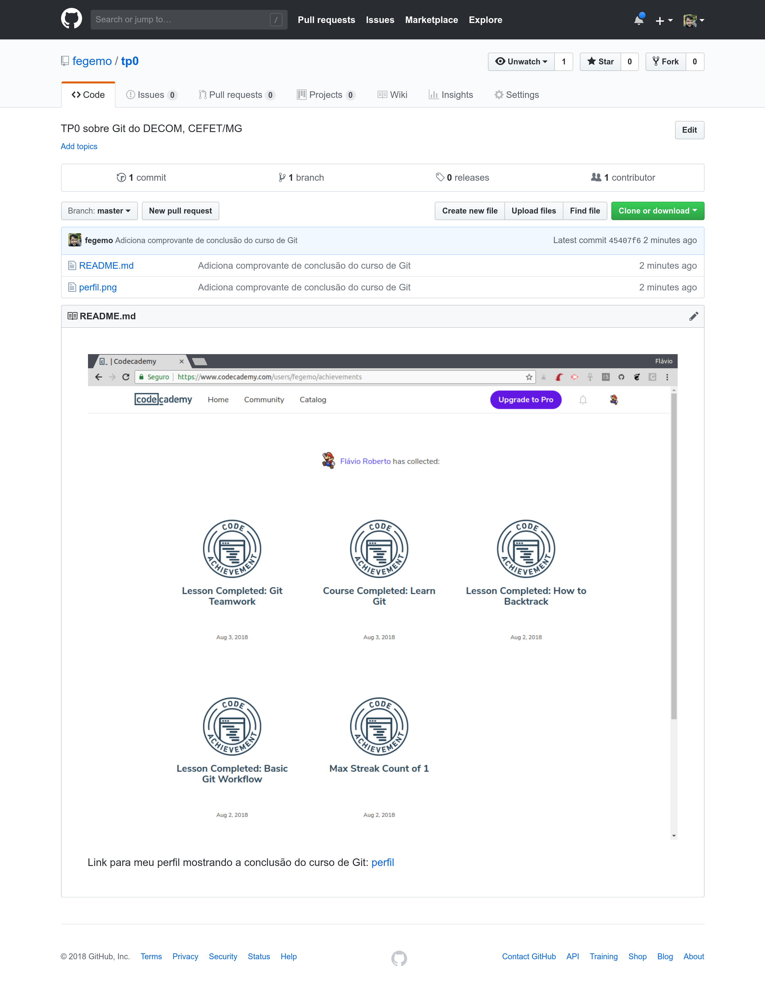

<!-- {"layout": "title"} -->
# Trabalho Prático **0**

## Conhecendo o  <!-- {style="height:1em;"} -->

_Data de entrega e valor em pontos vide Moodle/Sistema Acadêmico_

---
<!-- {"layout": "regular"} -->
# O que é?

**Git** é um sistema de controle de versão (SCV) e de **gerenciamento de
código fonte** (assim como CVS, SVN, SourceSafe, TFS etc.)
que é descentralizado (ou distribuído).

Ele foi originalmente proposto e criado por Linus Torvalds para possibilitar
que várias pessoas pudessem **eficientemente** trabalhar no Kernel do Linux
ao mesmo tempo.

*[SCV]: Sistema de Controle de Versão*

---
<!-- {"backdrop": "linus"} -->


_Fonte: foto ~~do filme Harry Potter e o Cálice de Fogo~~ de Linus Torvalds_
<!-- {em:style="background-color: #fffa; padding: 0.15em 0.25em; border-radius: 5px"} -->
<!-- {s:style="color: #666"} -->

---
<!-- {"backdrop": "git-trends"} -->
## Por que **Git**?

---
## Além disso,

- Toda **empresa/organização precisa** gerenciar código
- O Git é uma opção de _SCM_ **muito usada em empresas** e em **projetos de
  código aberto**
-  <!-- {.push-right} -->
  Todos os **trabalhos da disciplina** deverão ser entregues via [GitHub](http://www.github.com),
  um serviço de hospedagem de repositórios Git

  _Descrição: Octocat, mascote do GitHub.com_ <!-- {em:.push-right} -->

*[SCV]: Sistema de Controle de Versão*

---
<!-- {"layout": "regular"} -->
# O Trabalho

1. Aprender a usar o Git
   1. Fazer o curso gratuito sobre Git [no Codecademy](https://www.codecademy.com/learn/learn-git)
      - É necessário fazer apenas as **4 "aulas interativas" gratuitas**
   1. Instalar o Git no seu computador (sugiro usar em linha de comando)
1. Registrar-se no [GitHub](https://github.com/)
1. Criar um **repositório público** (gratuito) no GitHub com o nome
   `"tp0"` e descrição `"TP0 sobre Git do DECOM, CEFET/MG"`
1. Clonar o repositório criado no GitHub **para o seu computador**
   ```bash
   $ git clone https://github.com/SEU_USUARIO/tp0.git
   ```

---
<!-- {"layout": "regular"} -->

5. Tirar uma screenshot do seu perfil do Codecademy mostrando suas medalhas
   e salvá-la na pasta raiz do repositório com o nome `perfil.png`
5. Criar um arquivo com o nome `README.md`, no seu computador, na mesma pasta,
   com o conteúdo:

   ```markdown
   

   Link para meu perfil mostrando a conclusão do curso de Git:
   [perfil](https://www.codecademy.com/users/fegemo/achievements)
   ```

   Apenas troque `SEU_USUARIO` pelo correspondente ao seu usuário no
   site Codecademy.

---
<!-- {"layout": "regular"} -->

7. Adicionar os arquivos ao repositório:
   ```bash
   $ git add README.md perfil.png
   ```
7. Marcar essa inclusão do arquivo na "história" do repositório (_commit_)
   ```bash
   $ git commit -m "Adiciona comprovante de conclusão do curso de Git"
   ```
7. Enviar o _commit_ para o servidor remoto - no caso, estamos hospedando
   no GitHub
   ```bash
   $ git push -u origin master
   ```

---
<!-- {"layout": "regular"} -->


-  <!-- {.push-right style="height: 50vh"} -->
  **Enviar o link do repositório** (https://github.com/SEU_USUARIO/tp0) para o
  professor via Moodle/Sistema acadêmico da disciplina.
  - Carinha do repositório do professor: https://github.com/fegemo/tp0
