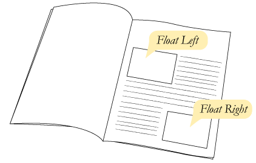

<!-- {"layout": "title"} -->
# **CSS** parte 1
## História, a Cascata e outros Seletores, Float/Clear e Abelhas 🐝

---
<!-- {"layout": "centered"} -->
# Roteiro de hoje

1. [Reaproveitando código CSS](#reaproveitando-codigo-css)
1. [Aprofundando em CSS](#aprofundando-em-css)
   1. História
   1. A cascata
   1. Seletores
1. [Flutuando coisas](#flutuando-coisas) (`float` e `clear`)
1. Atividade: [Abelhas](#abelhas-e-suas-castas) 🐝

---
<!-- {"layout": "section-header", "hash": "reaproveitando-codigo-css"} -->
# Reaproveitando código CSS
## Seletor de classe, incluindo arquivo e mais sobre cores

- Seletor de classes
- Incluindo arquivos **CSS**
- Cores e Gradientes
<!-- {ul:.content} -->

---
<!-- {"layout": "centered-horizontal", "embedSVG": "img[src$='.svg']", "styles": ["../../styles/classes/css-rule-anatomy.min.css"]} -->
## Relembrando... **regra CSS**

-  <!-- {.css-rule-anatomy.rule.push-right data-viewbox="56 0 90 10" style="width: 250px"} -->
-  <!-- {.css-rule-anatomy.declaration.value.push-right data-viewbox="60 10 140 65" style="width: 370px"} -->
-  <!-- {.css-rule-anatomy.property.value.push-right data-viewbox="56 30 90 65" style="width: 250px"} --> <!-- {ul:.card-list} -->


---
## Problema: **selecionando** elementos

- Como fazemos para selecionar (_e.g._): <!-- {ul:.bulleted} -->
  1. apenas **alguns parágrafos** em vez de todos?
  1. apenas o **primeiro título h2** da página?
  1. apenas **uma imagem em especial**?
- Uma solução possível é usar os atributos universais¹ HTML chamados
  **`class`** e **`id`** para identificar os elementos e estilizá-los
  > ¹**Atributos universais**: aqueles que qualquer elemento pode ter <cite>Coutinho & Hasan, 2021</cite>
  >
- Vamos ver diferentes formas para isso...

---
## Selecionar **por nome de _tag_**

- Até agora, estilizamos elementos HTML de duas formas:
- **Primeira forma:** selecionando a _tag_:
  ```css
  p {
    color: blue;
  }
  ```
  - Isso faz com que **todos os parágrafos** fiquem com a cor azul

---
## Selecionar **por `id`**

- **Segunda forma:** selecionando 01 elemento em específico
  - Supondo que temos: `<p id="resumo">Este é o resumo da notícia...</p>`:
  ```css
  #resumo {
    color: blue;
  }
  ```
  - Deixando de cor azul apenas quem tem um `id` igual a `resumo`.
  - Contudo, <u>não pode haver mais de 1 elemento</u> com o mesmo `id` <!-- {li:.bullet} -->
  - Como fazemos, então, para estilizar não apenas 01, mas **um subconjunto de
    elementos** da forma como queremos? <!-- {li:.bullet} -->
    - Resposta: usando **classes** <!-- {li:.bullet} -->

---
<!-- {"hash": "css-seletor-por-classe"} -->
## Selecionar **por classe** <small>(1/2)</small>

- Dada a seguinte estrutura de um `<body></body>`:
  ```html
  <p>Primeiro</p>
  <p>Segundo</p>
  <p>Terceiro</p>
  ```
- Para criar uma regra CSS para, digamos, os dois primeiros parágrafos, podemos
  alterar a estrutura HTML para:
  ```html
  <p class="destacado">Primeiro</p>
  <p class="destacado">Segundo</p>
  <p>Terceiro</p> <!-- continua no próximo slide -->
  ```

---
## Selecionar por classe <small>(2/2)</small>

- E, em um arquivo CSS, podemos escrever o nome da _tag_, seguido por um ponto
   "`.`", seguido pelo nome da classe:
  ```css
  p.destacado {
    font-weight: bold; /* negrito */
  }
  ```
- Ou, se quisermos usar a classe `destacado` para outros elementos além de
  `<p></p>`, podemos omitir o nome da _tag_:
  ```css
  .destacado {
    font-weight: bold;
  }
  ```

---
<!-- {"hash": "incluindo-css"} -->
# Incluindo arquivo CSS

- Por enquanto, colocamos o CSS **dentro do arquivo HTML**
   ```html
   <style> /* reaproveitamento de código CSS dentro do arquivo */
     p {
       color: #fff;
     }     /* misturamos código CSS dentro do arquivo HTML */
   </style>
   ```
   - Mas **isto é uma prática ruim**! :scream:

---
## Referenciando o **CSS usando a tag _link_**

- Um arquivo HTML pode referenciar ("incluir") um CSS assim:
  ```html
  <link rel="stylesheet" href="arquivo-de-estilos.css">
  ```
  - Mais de um arquivo HTML pode usar esse CSS
    - **Reaproveitamento** de código CSS
  - **_Caching_** do arquivo CSS: o arquivo é baixado apenas uma vez e
    usado sempre que necessário
    - Útil se o site tem várias páginas
- Quando o navegador lê essa linha, ele baixa esse arquivo CSS e o interpreta

---
<!-- {"layout": "section-header", "hash": "aprofundando-em-css"} -->
# Aprofundando<br>em **CSS**
## CSS: Folhas de Estilo<br>em **Cascata**

- História
- A cascata
- Seletores
<!-- {ul:.content} -->

*[CSS]: Cascading Style-Sheets

---
## História

1989 - 1993 <!-- {.bullet-old} -->
  ~ Tim Berners-Lee cria a WWW em CERN e a deixa aberta ao público
    geral <!-- {dd:.bullet-old} -->

1994
  ~ ::: figure .floating-portrait-container.push-right
      
    :::
    Håkon Wium Lie propõe uma linguagem com a responsabilidade
    de alterar a aparência de páginas web chamada CSS

1996
  ~ Juntamente com Bert Bos, Håkon publica a especificação do  **CSS1**

1998
  ~ Já gerenciado pela W3C, o **CSS2** foi publicado

1999 - atual
  ~ Desenvolvimento da especificação do **CSS3** (_living standard_)

1999 - 2016
  ~ Håkon tornou-se CTO na _Opera Software_

*[CERN]: European Organization for Nuclear Research*

---
<!-- {"classes": "compact-code-more"} -->
## A **Cascata**

- CSS é a sigla para _**Cascading** Style Sheets_
- Algumas propriedades são **herdadas** dos elementos ascendentes
  ```css
  body {
    color: #ff0000; /* mesmo que 'red' */
  }
  ```
  - Todo o texto que estiver dentro de `<body>...</body>`, mesmo que dentro de
    parágrafos ou outros elementos, ficarão vermelhos (!)
    - <!-- {ul^0:.compact-code.no-bullets.no-padding} -->
      ::: result .push-right margin-left: 1.5em; 
      # Título <!-- {style="font-family: serif; color: red;"} -->
      :::
      ```html
      ⋮
      <style>
        body {
          color: red;
        }
      </style>
      </head>
      <body>
        <h1>Título</h1>
        ⋮
      ```

---
## Exemplo da **cascata**

<iframe width="100%" height="300" src="//jsfiddle.net/fegemo/gqgacz36/embedded/result,html,css/" allowfullscreen="allowfullscreen" frameborder="0"></iframe>

- Clique nas abas "HTML", "CSS" e "Result". Para editar o código, clique
  em "Edit in JSFiddle"

Algumas propriedades (ex: `color`) são herdadas pelos descendentes, outras não (ex: `border`) <!-- {p:.note.info} -->

---
## Cascata: propriedades **não-herdadas**

- Para as **propriedades que não são herdadas** por padrão (_e.g._, `border`),
  podemos forçar que sejam herdadas usando o valor `inherit`:
  ```css
  p {
    border: 1px solid red;
  }
  em {
    border: inherit;
  }
  ```
  ::: result
  <p style="border: 1px solid red;">Este é um <em style="border: inherit">parágrafo</em> (&lt;em&gt; em 'parágrafo')</p>
  :::

---
## Cascata: **sobrescrita** de propriedade

- Também podemos sobrescrever a herança de uma propriedade:
  ```css
  body {
    font-weight: bold;
  }
  em {
    font-weight: normal;  /* ou, então, font-weight: initial */
  }                       /* initial é o valor padrão para aquela tag */
  ```
  ::: result
  <p style="font-weight: bold;">Este é um <em style="font-weight: normal">parágrafo</em> (&lt;em&gt; em 'parágrafo')</p>
  :::

---
<!-- {"hash": "outros-seletores", "embedSVG": "img[src$='.svg']", "styles": ["../../styles/classes/css-rule-anatomy.min.css"]} -->
# Seletores

-  <!-- {.push-right.css-rule-anatomy.selector width="280" data-viewbox="50 0 90 60"} -->
  Já sabemos **selecionar elementos de <u>03 formas</u>**:
  1. Pelo **nome de sua _tag_**: `p { color: white; }`
  1. Por (uma de) suas **classes**: `.livro { color: red;}`
  1. Por seu **id**: `#manchete-principal { color: green; }`
- Contudo, a vida não para por aí...
  - Há 20+ tipos de seletores (já vimos 3)
  - Não é necessário decorar todos, apenas saber que existem para poder
    consultá-los (Google) depois ;)

---
## Desafio #1

> Colorir de laranja **apenas os <u>links dentro da lista</u> não ordenada**:
>  <!-- {.centered} -->
<!-- {p:style="text-align: left"} -->

- Poderíamos usar uma classe (`.marca-de-sabao`) nos links da lista <!-- {ul:.full-width} -->
  - Mas há uma forma melhor!
  - É possível **fazer isso sem alterar o HTML**! <!-- {li:.bullet} -->
    - ```css
      ul a {  /* todo <a> dentro de uma <ul> */
        color: orange;
      }
      ```
      <!-- {ul^0:.bullet.no-list-icon.layout-split-2} -->
    - :::result . margin-left: 1em
      - Sabão [Omo](http://omo.com.br) <!-- {style="color: orange"} -->
      - Sabão [Ariel](http://ariel.com.br) <!-- {style="color: orange"} -->

      [Voltar para cima](#) <!-- {style="color: blue"} -->
      :::

---
## Seletores de **Descendente** e **Filho direto**

- Formato: `X Y` _(antecessor, espaço, elemento selecionado)_ <!-- {ul:.code-split-2.no-padding.no-list-icon} -->
  - Exemplo:
    ```css
    ul a {
      text-decoration: none;
    }
    ```
    - Descrição: seleciona todos hiperlinks `a` que têm um `ul` como
      antecedente (pai, avô, bisavô etc.)
- Formato: `X > Y` _(pai, sinal de maior, elemento selecionado)_
  - Exemplo:
    ```css
    #menu-principal > ul {
      padding: 20px;
    }
    ```
    - Descrição: seleciona todos os `ul` que têm `#menu-principal` como pai

---
<!-- {"classes": "compact-code"} -->
## Exemplo: **Descendente** vs **Filho direto**

- ```html
  <p>
    <strong>Ola! <a href="http://www.google.com">Este é meu link! </a></strong>
    <a href="http://www.terra.com.br">Esta é uma outra pagina</a>
  </p>
  <a href="http://google.com">Este é outro link</a>
  ```
- &nbsp;
  - ```css
    p > a { /* <a>s filhos de um <p> */
      text-decoration: line-through;
    }
    p a { /* <a>s descendentes de um <p> */
      color: red;
    }
    ```
  - :::result
    <p>
      <strong style="color:black;">Ola! <a style="color:red;" href="http://www.google.com">Este é meu link! </a></strong>
      <a style="color:red;text-decoration: line-through;" href="http://www.terra.com.br">Esta é uma outra pagina</a>
    </p>
    <a style="color:blue" href="http://google.com">Este é outro link</a>
    :::

    <!-- {ul^0:.no-list-icon.no-padding.layout-split-2}-->
    <!-- {ul^1:.no-list-icon.no-padding}-->

---
<!-- {"hash": "desafio-seletor-atributo"} -->
## Desafio #2

> Colocar uma borda rosa **apenas nas imagens .jpg**:
> 
<!-- {p:style="text-align: left"} -->

- Poderíamos usar uma classe (`.formato-jpg`) nessas imagens...
  - Mas há uma forma melhor! <!-- {li:.bullet} -->
  - É possível **selecionar elementos de acordo com seus atributos**! <!-- {li:.bullet} -->
    ```css
    img[src$=".jpg"] {
      border: 5px solid hotpink;
    }
    ```

---
## Seletores de **Atributo**

- Podemos selecionar elementos HTML **de acordo com <u>seus atributos</u>**:
  - ```css
    a[href] {
      color: blue;  /* [a] */
    }
    a[href="http://google.com"] {
      color: blue;  /* [b] */
    }
    a[href^="http"] {
      color: blue;  /* [c] */
    }
    a[href$=".com"] {
      color: blue;  /* [d] */
    }
    a[href*="google"] {
      color: blue;  /* [e] */
    }
    ```
  - Há **5 variações**: <!-- {li:style="margin-left: 1em"} -->
    - [a] existência do atributo: `[atributo]` <!-- {li:.push-code-right} -->
      - Neste caso, todo `<a>` que possua `href`
    - [b] valor inteiro: `[atrib="valor"]` <!-- {li:.push-code-right} -->
    - [c] começo do valor: `[atrib^="inicio"]` <!-- {li:.push-code-right} -->
    - [d] fim do valor: `[atrib$="final"]` <!-- {li:.push-code-right} -->
    - [e] trecho do valor: `[atrib*="trecho"]` <!-- {li:.push-code-right} -->
    - Repare que esses seletores podem ser **usados com qualquer elemento**:
      ```css
      img[alt] {
        border: 5px solid red;
      }
      ```
    <!-- {ul^2:.layout-split-2.no-list-icon.no-padding.compact-code} -->

---
<!-- {"layout": "2-column-content", "classes": "compact-code-more"} -->
## Exemplos de seletores de atributos

```css
img[alt*="ninja"] {     /* alt contém ninja */
  border: 3px solid black;
}
a[href^="http"] {       /* href começa com http */
  color: cyan;
}
a[href$=".br"] {        /* href termina com .br */
  background: linear-gradient(45deg, green, red);
}
```

```html


<a href="http://www.terra.com.br">Um site brasuca<a>
<a href="http://www.cnn.com">Um site gringo<a>
```

:::result .span-columns margin: 1em auto;


<a style="color:cyan;background-image: linear-gradient(45deg, green, red);" href="http://www.terra.com.br">Um site brasuca<a>
<a style="color:cyan;" href="http://www.cnn.com">Um site gringo<a>
:::

---
<!-- {"hash": "desafio-seletor-estado"} -->
## Desafio #3

> Tirar o sublinhado do hyperlink **quando passar o mouse sobre ele**:
> 
<!-- {p:style="text-align: left"} -->

- A única forma de fazer é usando **seletores de estado**: <!-- {li:.bullet} -->
  - ```css
    a:hover {
      text-decoration: none;
    }
    ```
    <!-- {li:.bullet} -->

---
<!-- {"embeddedStyles": ".link:link {color: blue; text-decoration: underline;}.link:hover {color: cyan;}.link:active {color: gold;}"} -->
## Seletores de **Estado**

- Podemos selecionar elementos HTML **de acordo com <u>seus atributos</u>**:
  - ```css
    a:link {
      color: blue;  /* [a] */
    }
    a:hover {
      color: cyan;  /* [b] */
    }
    a:active {
      color: gold;  /* [c] */
    }
    a:visited {
      color: gray;  /* [d] */
    }
    ```
    ::: result
    [Um link](#um-link) <!-- {a:.link} -->
    :::
  - Há pelo menos **3 estados**: <!-- {li:style="margin-left: 1em"} -->
    - [a] situação inicial `:link`
    - [b] mouse em cima: `:hover`
    - [c] começo do valor: `:active`
    - [d] já visitado: `:visited`
    - Repare que os seletores `:hover` e `:active` podem ser **usados com outros elementos**:
      ```css
      tr {
        background-color: white;
      }
      tr:hover {
        background-color: silver;
      }
      ```
    <!-- {ul^1:.layout-split-2.no-list-icon.no-padding.compact-code} -->

---
<!-- {"hash": "desafio-seletor-negacao"} -->
## Desafio #4

> Centralizar todas imagens **exceto uma ou outra**:
> 
<!-- {p:style="text-align: left"} -->

- Isso poderia ser feito colocando classes/ids nos elementos <!-- {li:.bullet} -->
  - Mas há outra forma, com o **seletor de negação**:
    ```css
    img:not(#logo) {
      display: block;
      margin: 0 auto; /* vertical: 0, horizontal: auto */
    }
    ```
    <!-- {li:.bullet} -->

---
## Seletor: **Negação**

- Formato: `X:not(seletor)`
- Exemplo:
  ```css
  p:not(.destacado) {
    color: gray;
  }
  ```
- Descrição: seleciona todos os elementos que **não passem pelo teste** do
  `seletor`
  - Ou seja, no exemplo, seleciona todos os **`<p>` que
    não possuam a classe `.destacado`**

---
<!-- {"slideStyles": {"display": "block"}, "embeddedStyles": ".tabela tr:nth-child(2n){background:white;}.tabela tr:nth-child(2n+1){background:silver;} .tabela { line-height: 1.25em; } .tabela td { border: 1px solid black; } .tabela {border: none!important}", "classes": "compact-code"} -->
## Outros seletores

::: did-you-know .push-right width: 400px; margin-left: 1em;
A parte dos seletores "com dois pontos" (eg, `:not()`, `:hover`) é chamada
de **pseudoclasse**. Veja [todas aqui](https://developer.mozilla.org/pt-BR/docs/Web/CSS/Pseudo-classes).
:::

- Seletores **de posição** dentro do pai: <!-- {li:.bullet} -->
  - `X:first-child`
  - `X:last-child`
  - `X:nth-child(n)` <!-- {ul^0:.multi-column-list-2}-->
- Seletores **de posição** de um tipo:
  - `X:first-of-type`
  - `X:last-of-type`
  - `X:nth-of-type(n)` <!-- {ul^0:.multi-column-list-2}-->
- Exemplo de `nth-child`: <!-- {li:.bullet} -->
  - ```html
    <table>
      <tr><td>Linha 1</td></tr>
      <tr><td>Linha 2</td></tr>
      <tr><td>Linha 3</td></tr>
      <tr><td>Linha 4</td></tr>
    </table>
    ```
  - ```css
    tr:nth-child(2n) {   /*par*/
      background: white;
    }
    tr:nth-child(2n+1) { /* ímpar */
      background: silver;
    }
    ```
  - ::: result
    <table class="tabela smaller-text-70">
      <tr><td>A</td><td>Linha 1</td></tr>
      <tr><td>B</td><td>Linha 2</td></tr>
      <tr><td>C</td><td>Linha 3</td></tr>
      <tr><td>D</td><td>Linha 4</td></tr>
    </table>
    :::
    <!-- {ul^0:.layout-split-3.no-list-icon.no-padding style="justify-content:space-between;"}-->

[css-selectors-30]: https://code.tutsplus.com/pt/tutorials/the-30-css-selectors-you-must-memorize--net-16048


---
<!-- {"layout": "section-header", "hash": "flutuando-coisas","embeddedStyles": ".guia-do-mochileiro { position: fixed; bottom: -225px; left: calc(50% + 20px); transition: all 200ms ease-out; } .guia-do-mochileiro-container { cursor: help; } .guia-do-mochileiro-container:hover .guia-do-mochileiro { bottom: -10px; box-shadow: 6px 3px 6px rgba(0, 0, 0, .5), -6px 3px 6px rgba(0, 0, 0, .5); }"} -->
# Flutuando coisas

> Para voar, basta errar o chão.
> <cite>Douglas Adams no Guia do Mochileiro das Galáxias</cite>  <!-- {.guia-do-mochileiro} -->
<!-- {blockquote:.guia-do-mochileiro-container style="max-width: 42%; margin-left: 1em;"} -->

- Relembrando o fluxo estático
  - `inline` e `block`
- Propriedade _float_
- Possíveis "problemas":
  1. Interrompendo o _float_ com _clear_
  1. Remoção do fluxo
<!-- {ul^1:.content} -->

---
<!-- {"layout": "centered-horizontal", "backdrop": "oldtimes"} -->
## Elementos **`block`**

 <!-- {style="max-height: 60vh"} -->
---
<!-- {"layout": "centered-horizontal", "backdrop": "oldtimes", "state": "show-active-slide-and-previous", "containerStyles": {"--show-2-slides-x-distance": "300px", "--show-2-slides-z-distance": "-150px", "--show-2-slides-rotation": "5deg"}} -->
## Elementos **`inline`**

 <!-- {style="max-height: 60vh"} -->

---
<!-- {"layout": "centered-horizontal", "backdrop": "oldtimes"} -->
## `block` e `inline`, juntos

 <!-- {style="max-height: 60vh"} -->

---
# Flutuando coisas

>  <!-- {.push-right style="height: 200px;"} -->
  **Jornais e revistas** costumam colocar **imagens junto ao texto** para
  fazer uma bela diagramação do conteúdo
> <cite>Coutinho, 2017</cite>
> Isso se chama **deixar o elemento** (_e.g._, imagem) **flutuando**
> <cite>Hasan, 2017</cite>

- Na web também queremos fazer isso!

---
<!-- {"layout": "main-point", "state": "emphatic"} -->
## Como flutuar elementos usando CSS?


Vamos conhecer um nova propriedade: `float`

---
## Propriedade `float`

- Usado para alterar o fluxo tradicional da página
  - Em CSS:  
    ```css
    img#abelha-operaria {
      float: left; /* left, right, none */
    }              /* none é o valor padrão - sem flutuação */
    ```
  - No HTML:
    ```html
    
    <p>Texto ...</p>
    ```

---
## Como funciona o `float`

-  <!-- {.push-right} -->
  Um elemento flutuante é removido do fluxo tradicional e
  - os elementos `block` depois dele fingem que ele não está ali
  - os elementos `inline` depois dele respeitam seu formato
- Vamos fazer com que o parágrafo com `id="amazing"`
  flutue à direita **nos próximos 2 slides**...

---
## Exemplo de `float` (1º passo)

-   <!-- {.push-right style="max-height: 440px;"} -->
  Alterando a largura de um parágrafo para 200px
  ```css
  p#amazing {
    width: 200px;
  }
  ```

---
## Exemplo de `float` (2º passo)

-   <!-- {.push-right style="max-height: 350px;"} -->
  Flutuando o parágrafo à direita
  ```css
  p#amazing {
    width: 200px;
    float: right;
  }
  ```
  - Repare que:
    - Elementos declarados <u>antes</u> do parágrafo flutuante
      **não são alterados**
    - Elementos declarados <u>depois</u>:
      - Se forem `block`, **ignoram** o elemento flutuante
      - Se forem `inline`, **respeitam** o elemtno flutuante

---
## Flutuando elementos com **`float`**

- ::: figure .figure-slides.push-right
  <div class="bullet figure-step bullet-no-anim"><figcaption>Sem float</figcaption></div>

  <div class="bullet figure-step bullet-no-anim"><figcaption>Com float</figcaption></div>
  :::
  Flutuando o parágrafo à direita: <!-- {ul:.compact-code} -->
  ```css
  p#amazing {
    width: 200px;
    float: right;
  }
  ```
- Quem flutua é **removido do fluxo**
  - _i.e._, não ocupa mais espaço
- Elementos **<u>depois</u> do flutuante**:
  - Os `block`: passam a ignorar o elemento flutuante
  - Os `inline`: respeitam o flutuante

---
## Exemplo: **flutuando** uma imagem

<iframe width="100%" height="460" src="//jsfiddle.net/fegemo/7cofhyLc/embedded/result,html,css/dark/" allowfullscreen="allowfullscreen" frameborder="0"></iframe>

- Repare os **parágrafos** (`block`) e o **texto** dentro deles (`inline`)...

---
<!-- {"layout": "main-point", "state": "emphatic", "hash": "problemas-com-flutuacao"} -->
## Possíveis "problemas" com flutuação


- É possível que um elemento **interrompa uma flutuação**
  - Para isso, usamos **a propriedade `clear`** no
    **elemento _interruptor_ <!-- {.underline.upon-activation.delay-2000} -->**

---
<!-- {"layout": "2-column-content"} -->
## Exemplo: **interrompendo** uma flutuação

<iframe width="100%" height="460" src="//jsfiddle.net/fegemo/vxb79m2c/embedded/result,html,css/dark/" allowfullscreen="allowfullscreen" frameborder="0"></iframe>

- A **propriedade `clear`** pode ser:
  - `left` ou `right`: interrompe apenas as flutuações à esquerda ou à direita
  - `both`: interrompe **ambos** lados
  - `none`: **não interrompe** (valor padrão)
- Neste exemplo:
  ```css
  #proximo-assunto {
    clear: right;
  }
  ```

---
<!-- {"layout": "section-header", "hash": "abelhas-e-suas-castas"} -->
# Abelhas :honeybee: e suas castas
## :honey_pot: :honey_pot: :honey_pot: :honey_pot: :honey_pot:

- A atividade das abelhas
- Flutuando coisas
- Pesquisando novas propriedades CSS/elementos HTML
<!-- {ul:.content} -->

---
<!-- {"backdrop": "pratica-abelhas"} -->

---
# Abelhas :honeybee: e suas castas

1. Crie um _fork_ do repositório
   - https://github.com/fegemo/cefet-web-bees/
1. Veja [instruções detalhadas aqui](https://github.com/fegemo/cefet-web-bees/blob/master/README.md)
1. Vamos estilizar a página das abelhas conforme o enunciado. Ex:
   - Fundo com gradiente
   - Imagens flutuantes
   - Topo da página com fundo
   - Estilizações com seletores diversos
   - Bordas arredondadas

---
<!-- {"hash": "arredondando-bordas"} -->
# Arredondando bordas

-  <!-- {.push-right} -->
  Como arredondar bordas?
  - Há muitas propriedades CSS que não teremos tempo de ver no curso
  - Contudo, a Web é uma ótima fonte de informação
  - Pesquise ["como arredondar bordas em CSS" no Google][border-radius-google],
    por exemplo

[border-radius-google]: https://www.google.com.br/search?hl=pt-BR&q=como+arredondar+bordas+em+css&meta=

---
<!-- {"hash": "cores-e-gradientes", "layout": "main-point", "state": "emphatic"} -->
<style>
.color-text { color: #ffff0a; }
.gradient-text {
    background: linear-gradient(to right, #0f9000, #c900d6);
    -webkit-background-clip: text;
    -webkit-text-fill-color: transparent;
  }
</style>

# <span class="color-text">Cores</span> e <span class="gradient-text">Gradientes</span>

---
<!-- {"layout": "3-column-content", "slideStyles": {"grid-template-columns": "auto auto auto", "grid-template-rows": "auto auto auto"}, "classes": "compact-code-more", "styles": "../../styles/classes/color-portraits.min.css"} -->
## Notações: Nome, RGB e Hexadecimal

- ### **Nomes** <!-- {ul:.no-bullets.no-padding.no-margin} -->
  <pre class="hljs"><code><span class="color-portrait red"></span> red
  <span class="color-portrait cyan"></span> cyan
  <span class="color-portrait gold"></span> gold
  <span class="color-portrait forestgreen"></span> forestgreen
  <span class="color-portrait cornflowerblue"></span> cornflowerblue
  <span class="color-portrait rebeccapurple"></span> rebeccapurple
  ⋮</code></pre>
1. ### Notação **RGB** <!-- {ol:.no-bullets.no-padding.no-margin} -->
   <pre class="hljs"><code>rgb(<span style="color: #fb4d4d">verme</span>, <span style="color: #18dc18">verde</span>, <span style="color: cornflowerblue;">azul</span>)</code></pre>
   - rgb(...) com número entre 0...255 para <u>verme</u>lho, <u>verde</u>, <u>azul</u> <!-- {li:.smaller-text-80} -->
- ### Notação **Hexadecimal** <!-- {ul:.no-bullets.no-padding.no-margin} -->
  <pre class="hljs"><code>#<span style="color: #fb4d4d">vm</span><span style="color: #18dc18">vd</span><span style="color: cornflowerblue">az</span></code></pre>
  - '#' + 2 caracteres para <u>v</u>er<u>m</u>elho, <u>v</u>e<u>r</u>de, <u>az</u>ul <!-- {li:.smaller-text-80} -->
  - (0...9, A(10)...F(15)) <!-- {li:.smaller-text-80} -->

1. Exemplo: <!-- {ol:.no-bullets.no-padding.no-margin} -->
   ```css
   p {
     color: cyan;
   }
   ```
- Exemplo:<!-- {ul:.no-bullets.no-padding.no-margin} -->
  ```css
  p {
    color: rgb(0, 255, 255);
  }
  ```
1. Exemplo:<!-- {ol:.no-bullets.no-padding.no-margin} -->
   ```css
   p {
     color: #00ffff;
   }
   ```

---
<!-- {"layout": "3-column-content", "slideStyles": {"grid-template-columns": "auto auto auto", "grid-template-rows": "auto auto auto"}, "classes": "compact-code-more", "styles": "../../styles/classes/color-portraits.min.css"} -->
## Cores **com opacidade** <!-- {.underline.upon-activation.delay-1000} --> (transparência)

- ### **Nomes** <!-- {ul:.no-bullets.no-padding.no-margin} --> ❌
  <pre class="hljs"><code><span class="color-portrait red"></span> red
  <span class="color-portrait cyan"></span> cyan
  <span class="color-portrait gold"></span> gold
  <span class="color-portrait forestgreen"></span> forestgreen
  <span class="color-portrait cornflowerblue"></span> cornflowerblue
  <span class="color-portrait rebeccapurple"></span> rebeccapurple
  ⋮</code></pre>
  - Não tem como <!-- {li:.smaller-text-80} -->
1. ### Notação **RGB<u>A</u>** <!-- {ol:.no-bullets.no-padding.no-margin} -->
   <pre class="hljs"><code>rgb<ins>a</ins>(verme, verde, azul, <ins style="color: black; font-weight: bolder">alpha</ins>)</code></pre>
   - `alpha` é a opacidade da cor <!-- {li:.smaller-text-80} -->
     - opacidade = 1 - transparência <!-- {li:.smaller-text-80} -->
   - De 0 (transp.) até 1 (opaco) <!-- {li:.smaller-text-80} -->
- ### Notação **Hexadecimal <u>+AA</u>** <!-- {ul:.no-bullets.no-padding.no-margin} -->
  <pre class="hljs"><code>#vmvdaz<ins style="color: black; font-weight: bolder">aa</ins></code></pre>
  - 2 caracteres para `alpha` <!-- {li:.smaller-text-80} -->
  - De 0 (transp.) até FF (opaco) <!-- {li:.smaller-text-80} -->

1. Exemplo: <!-- {ol:.no-bullets.no-padding.no-margin} -->
   - Não tem!
- Exemplo:<!-- {ul:.no-bullets.no-padding.no-margin} -->
  ```css
  p {
    color: rgba(0, 255, 255, 0.5);
  }
  ```
1. Exemplo:<!-- {ol:.no-bullets.no-padding.no-margin} -->
   ```css
   p {
     color: #00ffff80;
   }
   ```

---
## Mais exemplos de cores

- ```css
  #FF0033 /* maiúsc. ou min. */
  #ff0033
  #f03
  ```
  <!-- {ul:.push-code-right} -->
  Se ambos caracteres de cada componente em hexa são iguais (ex: `#ff0033`), pode escrever só 1 de cada (ex: `#f03`)
- ```css
  rgb(255, 0, 51)
  rgb(100%, 0%, 20%)
  rgba(255, 0, 0, 0.1)         
  ```
  Em vez de 0...255, pode escrever 0%...100% <!-- {li:.clearer} -->
- ```css
  hsl(60, 100%, 50%)
  hsla(240, 100%, 50%, 0.05)   
  ````
  Também existe `hsl(hue, sat, light)`, mas é menos comum <!-- {li:.clearer} -->

---
<!-- {"hash": "gradientes"} -->
## Gradientes (ou degradês)

- `linear-gradient` é um **valor válido para `background-image`**,
      e não para `background-color` nem para `color`
  - Veja a documentação do que é um [`gradient`](https://developer.mozilla.org/en-US/docs/Web/CSS/gradient)

1. <!-- {ol:.item-code-with-image.full-width.compact-code-more} -->
   ::: result . max-width: calc(100% - 600px);
   0 graus, iniciando com azul e terminando como verde <!-- {style="background-image: linear-gradient( 0deg, blue, #00FF00 ); font-size: 75%; color: white; text-shadow: 1px 1px black;"} -->
   :::
   ```css
   p {
     background-image: linear-gradient( 0deg, blue, #00FF00 );
   }
   ```
1. ::: result . max-width: calc(100% - 650px);
   Começa amarelo e termina azul no canto esquerdo superior  <!-- {style="background-image: linear-gradient( to left top, yellow, blue ); font-size: 75%; color: white; text-shadow: 1px 1px black;"} -->
   :::
   ```css
   p {
     background-image: linear-gradient( to left top, yellow, blue );
   }
   ```
1. ::: result . max-width: calc(100% - 600px);
   Azul, branco e verde <!-- {style="background-image:linear-gradient( 90deg, blue, white 20%,#00FF00); font-size: 75%; color: white; text-shadow: 1px 1px black;"} -->
   :::
   ```css
   p {
     background-image: linear-gradient( 90deg, blue, white 20%, #00FF00 );
   }
   ```

---
<!-- {"layout": "centered"} -->
# Referências

1. Capítulos 5, 6 e 7 do livro
1. [Os 30 seletores CSS que você precisa memorizar (inglês)][css-selectors-30]

[css-selectors-30]: http://code.tutsplus.com/tutorials/the-30-css-selectors-you-must-memorize--net-16048
[Print a Book in CSS]: http://alistapart.com/article/boom
