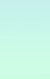

<!-- {"layout": "title"} -->
# **CSS** parte 2
## Especificidade, propriedade display e posicionamento

---
# Na última aula... (1/3)

- Além de selecionar por _tag_, id ou classe, há diversos **outros seletores**:

descend./filho <!-- {dl:.no-margin} -->
  ~ `p strong`: todo `<strong>` descendente de `<p>` (filho, neto etc.)
  ~ `p > strong`: todo `<strong>` filho direto de `<p>`

atributo
  ~ `img[alt]`: toda `` que tem atributo `alt="..."`
  ~ `a[href$=".html"]`: todo `<a>` apontando para um `.html` etc.

estado do link
  ~ `a:link`, `a:visited`, `a:hover`, `a:active`

negação
  ~ `img:not([alt])`: `` sem o atributo `alt`


---
<!-- {"layout": "centered"} -->
# Hoje veremos

1. [Especificidade de seletores](#especificidade-de-seletores)
1. A [propriedade display](#a-propriedade-display)
1. [Posicionamento](#posicionamento)
   1. Estático
   1. Relativo
   1. Absoluto
   1. Fixo
   1. Grudento (_sticky_)

---
<!-- {"layout": "section-header", "hash": "especificidade-de-seletores"} -->
# Especificidade de seletores
## Aplicando regras

- Mais de uma regra definindo a mesma propriedade
- Regras de especificidade
- Especificator Tabajara(tm)
<!-- {ul:.content} -->

---
## Motivação

- Dadas <u>mais de uma regra CSS definindo a mesma propriedade</u> para
  um elemento, qual prevalece?
  - Como determinar qual a cor do elemento?
    ```html
    <style>
      h4 { color: black; }
      h4 { color: white; }      
    </style>

    <h4>Arthur Dent</h4> <!-- qual a cor de Arthur Dent? -->
    ```

---
## Mais Difícil...

```html
<style>
  .destaque { color: red; }
  #titulo   { color: green; }
  h4        { color: blue; }
</style>

<h4 id="titulo" class="destaque">Ford Prefect</h4>
```
- E agora??
- Os **3 seletores <u>se aplicam</u>** ao elemento! <!-- {ul:.bulleted} -->
  - Mas com **prioridades diferentes**
  - (↑) mais específico o seletor da regra → (↑) maior sua prioridade
    - Neste caso, <h4 style="display: inline; color: green;">Ford Prefect (`green`)</h4>

---
## Regras gerais de especificidade

Regra 1 <!-- {dl:.bulleted} -->
  ~ Cada seletor tem uma **pontuação de especificidade**

Regra 2
  ~ Se dois seletores selecionam o mesmo elemento, mas com pontuações
    diferentes, ganha aquele com pontuação maior

Regra 3
  ~ Se dois seletores selecionam o mesmo elemento e têm a mesma
    pontuação, ganha o que foi declarado por último

Regra 4
  ~ Estilo Inline &gt;&gt; Arquivo Externo &gt;&gt; Incorporado

Regra 5
  ~ ID &gt;&gt; classe &gt;&gt; atributo &gt;&gt; tag

---
## Cálculo da **pontuação de especificidade**

- [Especificação na W3C sobre _CSS3 Selectors_](http://www.w3.org/TR/css3-selectors/#specificity)
- Algoritmo
  1. Contar o número de IDs no seletor (variável `a`)
  1. Contar o número de classes, atributos e pseudo-classes no seletor (`b`)
  1. Contar o número de tags e pseudo-elementos no seletor (`c`)
  1. Concatenar os três números (`abc`)

```css
#posts-recentes .post.novidade > h2 {
  /* id: 1, classes: 2, tag: 1 */
  /* pontuação: 121 */
}
```

---
## Exemplos

```css
/* seletor { propriedades }  abc */
li { }                    /* 001 */
.destaque { }             /* 010 */
li.destaque { }           /* 011 */

#rodape { }               /* 100 */
#rodape #logo { }         /* 200 */

a[href^="www"] { }        /* 011 */
p strong em { }           /* 003 */
```

---
## Exercício

- Qual é a cor do texto?
  ```html
  <style>
    #a .b .c { color: red; }
    .d .e .f { color: green; }
    .g .h #i { color: blue; }
  </style>
  <p id="a" class="d g">
      <strong class="b e h">
          <em id="i" class="c f">Qual é a minha cor?</em>
      </strong>
  </p>
  ```
  - [Resposta](https://jsfiddle.net/fegemo/bw1xt1az/) no JSFiddle

---
<!--
{
  "layout": "centered-horizontal",
  "hash": "specificator-tabajara",
  "scripts": ["../../scripts/classes/spec-tabajara.min.js"],
  "styles": ["../../styles/classes/spec-tabajara.min.css"]
}
-->

## **CoutoSan™** Specificity  <!-- {.emoji.portrait.bordered style="margin-left: 0.5em"} --> <!-- {.emoji.portrait.bordered} -->

<article id="spec-tabajara">
  <div>
    <input type="text" id="spec-tabajara-input" placeholder="Digite um seletor aqui...">
  </div>
  <div>
    <button id="spec-tabajara-button">Calcular</button>
  </div>
  <div>
    <div class="spec-class">
      <div id="spec-tabajara-output-a" class="spec-output">0</div>
      <div>(a) IDs</div>
    </div>
    <div class="spec-class">
      <div id="spec-tabajara-output-b" class="spec-output">0</div>
      <div>(b) Classes, atributos e pseudo-classes</div>
    </div>
    <div class="spec-class">
      <div id="spec-tabajara-output-c" class="spec-output">0</div>
      <div>(c) Elementos, pseudo-elementos</div>
    </div>
  </div>
</article>

---
<!-- {"layout": "section-header", "hash": "a-propriedade-display"} -->
# A propriedade **display**
## e seus diversos valores

- Valores:
  - `block`
  - `inline`
  - `inline-block`
  - `none`
  - `table`
  - `table-row`
  - `table-cell`
  - `flex` e `inline-flex`  <!-- {.emoji} -->
  - `grid` e `inline-grid`  <!-- {.emoji} -->
- Alterando a visibilidade

<!-- {ul^1:.content} -->

---
## A propriedade **display** (na [MDN](https://developer.mozilla.org/en-US/docs/Web/CSS/display))

- Define o **tipo de visualização** de um elemento e também seu
  **comportamento** no fluxo da página
- Os valores mais comuns
  - `block`, para definir um elemento com comportamento `block`
  - `inline`, similarmente, para `inline`
  - `inline-block`, similar a `block`, porém sem quebra de linha
  - `none`, sem renderização

---
## A propriedade **display** (cont.)

- É possível, por exemplo:
  ```css
  div { display: inline; }
  span { display: block; }
  ```

  - Mas é claro que você não vai fazer isso... ;)
- Para **remover um elemento do fluxo e não renderizá-lo** de forma alguma:
  ```css
  a[href*="xxx"] { display: none; }
  ```

---
## Display: **inline-block**

- Une a **capacidade de se <u>definir dimensões</u> de `block`** e a
  possibilidade de **ter um <u>fluxo lateral</u>** (sem quebra de linha), como
  `inline`. Exemplo:
  ```html
  <div class="passo">Instalar</div>
  <div class="passo">Aprender</div>
  <div class="passo">Programar</div>
  ```
  ```css
  .passo {
    display: inline-block;
    width: 150px;
    height: 150px; /* ... */
  }
  ```

---
## Resultado do display **inline-block**

<iframe width="600" height="400" src="//jsfiddle.net/fegemo/2gfkyrrh/3/embedded/result,html,css/" allowfullscreen="allowfullscreen" frameborder="0" class="flex-align-center bordered rounded"></iframe>

---
<!-- {"layout": "tall-figure-right", "scripts": ["../../scripts/classes/caniuse.min.js"]} -->
## Display: **table-***

<div class="caniuse" data-feature="css-table" style="justify-self: flex-end"></div>

- Alguns valores são para a criação de _layouts_ em formato de tabelas:
  - `table`, `table-cell`, `table-column`, `table-column-group`,
    `table-footer-group`, `table-header-group`, `table-row`,
    `table-row-group`, `inline-table`
- Veja alguns [exemplos de uso](http://colintoh.com/blog/display-table-anti-hero) no link

**Hoje em dia**: preferimos _flex_ ou _grid_ ;) <!-- {p:.span-columns.note.info} -->

---
<!-- {"layout": "tall-figure-left", "slideStyles": {"grid-template-columns": "auto 1fr"}} -->
## Display: **flex** e **inline-flex**  <!-- {.emoji} -->

<div class="caniuse" data-feature="flexbox"></div>

- Mais recentemente, o CSS3 introduziu o **flexbox** <!-- {ul:.bulleted} -->
- É uma forma **bem flexível** para dispor os elementos
- Cria uma linha (`row`) ou coluna (`column`) com os filhos
- Além de `display: flex` e `display: inline-flex`, foram introduzidas outras propriedades. Exemplos:

`flex-direction` <!-- {dl:.span-columns.width-20.full-width.no-margin.bulleted.bullet} -->
~ `row` (padrão), `column`, `row-reverse`, `column-reverse`
~ dispõe filhos na horizontal (se `row`) ou vertical (`column`)

`justify-content`
~ `flex-start` (padrão), `center`, `space-around`, `space-between`...
~ define como distribuir o espaço que sobrou

`align-items`
~ `stretch` (padrão), `flex-start`, `center`...
~ define posição dos elementos no "contraeixo"

---
<!-- {"layout": "2-column-content", "embeddedStyles": ".horizontal-flex-example li { font-size: .8em; flex: 1; margin-right: 4px; background: #fffc; outline: 1px solid silver; } .horizontal-flex-example { display: flex; justify-content: space-between; list-style-type: none; padding-left: 0; }"} -->
## Exemplo com flexbox: lista horizontal

```css
ul.horizontal {
  display: flex;
  justify-content: space-around;

  /* tirar coisas que vem na <ul> */
  list-style-type: none;
  padding-left: 0;
}

ul.horizontal > li {
  flex: 1; /* crescer com peso 1 */
  
  /* espacinho e centralização */
  margin-right: 4px;
  text-align: center;
}
```

- ::: result . text-align: center
  - Abacaxi <!-- {ul:.horizontal-flex-example} -->
  - Kiwi
  - Maçã
  - Uva
  - Limão
  :::
- Veremos mais sobre **flexbox** em outra aula <!-- {ul^1:.no-bullets.no-padding.bulleted-0} -->

---
<!-- {"layout": "tall-figure-right", "slideStyles": {"grid-template-columns": "auto 1fr"}, "embeddedStyles": ".grid-desc-dl dd {margin-bottom: .15em;}"} -->
## Display: **grid** <!-- {.alternate-color} --> e **inline-grid** <!-- {.alternate-color} -->  <!-- {.emoji} -->

<div class="caniuse" data-feature="css-grid"></div>

- **Flexbox** é uma ferramenta de **1 dimensão**:
  - Cria linha (`row`) ou coluna (`column`)
- Mas vários _layouts_ têm 2 dimensões (linhas+cols)
- O `display: grid` e `display: inline-grid` criam **_layouts_ 2D** <!-- {strong:.alternate-color} -->
- E, como o flexbox, há várias outras propriedades. Por exemplo: <!-- {ul^1:.bulleted} -->

`grid-template-rows`<br>`grid-template-columns`  <!-- {dl:.span-columns.smaller-text-90.width-20.full-width.no-margin.bulleted.bullet.grid-desc-dl} -->
~ determina os tamanhos das linhas ou colunas
~ ex: `auto 1fr auto` (3 partes, do meio ocupando o que sobrar)
~ ex: `200px 10% 1fr` (3 partes, 1ª fixa, 2ª fluida e 3ª restante)
~ ex: `1fr 3fr` (2 partes, 1ª ocupando 1/4 e 2ª 3/4 do espaço)

`grid-row`<br>`grid-column`
~ propriedade de cada filho, define onde ficar nas linhas e colunas, ex: `1 / 3`, `1 / 2`

---
<!-- {"layout": "2-column-content", "classes": "compact-code-more"} -->
## Exemplo usando `grid`

- HTML <!-- {ul:.no-bullets.no-padding} -->
  ```html
  <main>
    <header></header>
    <nav></nav>
    <section></section>
    <footer></footer>
  </main>
  ```
  CSS (elemento pai)
  ```css
  main {
    display: grid;
    grid-template-rows: 200px 1fr auto;
    grid-template-columns: 300px 1fr;
  }
  ```

1. CSS (dos filhos) <!-- {ol:.no-bullets.no-padding.two-column-code} -->
   ```css
   header {
     grid-column: 1 / 3;
   }

   nav {
     grid-column: 1 / 2;
     grid-row: 2 / 3;
   }
   section {
     grid-column: 2 / 3;
     grid-row: 2 / 3;
   }
   footer {
     grid-column: 1 / 3;
     grid-row: 3 / 4;
   }
   ```
   ::: result .full-width height: 250px; display: grid; grid-template-rows: 60px 1fr auto; grid-template-columns: 90px 1fr;
   <header style="background: lightblue; grid-column: 1/3;"></header>
   <nav style="background: black; grid-column: 1/2; grid-row: 2/3;"></nav>
   <section style="background: green; grid-column: 2/3; grid-row: 2/3;"></section>
   <footer style="background: gray; grid-column: 1/3; grid-row: 3/4; min-height: 40px;"></footer>
   :::

---
<!-- {"layout": "section-header", "hash": "posicionamento"} -->
# Posicionamento
## Diferentes fluxos de layout

- A propriedade `position`
- Fluxos:
  1. Estático (padrão)
  1. Relativo
  1. Absoluto
  1. Fixo
  1. Grudento (_sticky_)
- Propriedade `z-index`
<!-- {ul:.content} -->

---
<!-- {"layout": "tall-figure-right", "backdrop": "oldtimes"} -->
# Relembrando o fluxo padrão


Elementos **`block`**
  ~ Ocupam **toda a largura** disponível
  ~ Dispostos de **cima para baixo**
  ~ **Quebram linha**

Elementos **`inline`** <!-- {strong:.alternate-color} -->
  ~ Ocupam o **espaço necessário**  <!-- {.alternate-color} --> (não mais)
  ~ Dispostos da **esquerda para direita**  <!-- {.alternate-color} -->

---
<!-- {"backdrop": "oldtimes"} -->
## Alterando o fluxo com `float` e `clear`

- ::: figure .figure-slides.push-right
  <div class="bullet figure-step bullet-no-anim"><figcaption>Sem float</figcaption></div>

  <div class="bullet figure-step bullet-no-anim"><figcaption>Com float</figcaption></div>
  :::
  Flutuando o parágrafo à direita:
  ```css
  p#amazing {
    width: 200px;
    float: right;
  }
  ```
  <!-- {ul:.full-width} -->
- Quem flutua é **removido do fluxo**
  - _i.e._, não ocupa mais espaço
- Elementos **<u>depois</u> do flutuante**:
  - Os `block`: passam a ignorar o elemento flutuante
  - Os `inline`: respeitam o flutuante


---
<!-- {"backdrop": "exemplo-position-absolute"} -->
## **Limitações** do fluxo padrão

- Mesmo com `float` e `clear` não é possível fazer algumas coisas
  - Por exemplo, como colocar um texto em cima de uma imagem?

---
# A propriedade `position`

- **A propriedade `position`** permite definirmos se o navegador vai
  dispor um elemento usando **o fluxo padrão ou outro fluxo**
- Valores possíveis:
  1. `position: static` (valor padrão, para o fluxo padrão)
  1. `position: relative`
  1. `position: absolute`
  1. `position: fixed`
  1. `position: sticky`  <!-- {.emoji} -->

---
## Posicionamento (1) **estático**

- O próprio navegador encontra as posições (x,y) dos elementos
- É o valor padrão - usa o posicionamento do fluxo padrão
  ```html
  <div class="estatico">Conteúdo</div>
  ```
  ```css
  .estatico {
    position: static; /* este já é o valor padrão */
  }
  ```

::: result .full-width.no-margin
<div style="position: absolute; right: 0.5em; top: 0.5em;font-size:.4em;">
  <input type="checkbox" checked id="button-estatico" class="switch" onclick="javascript: (function() { var b = document.getElementById('estatico'); b.classList.toggle('estatico');}())" />
  <label for="button-estatico">.estatico</label>
</div>
<style>.estatico {position: static;}</style>
<div id="estatico" class="estatico" style="border: 3px dashed rebeccapurple">Conteúdo</div>
:::

- Definir um `position: static` não altera nada

---
## Posicionamento (2) **relativo**

- O elemento é posicionado como se estivesse no fluxo padrão, mas pode ser
  **deslocado** com as propriedades `top`, `right`, `bottom` e `left` <!-- {ul:.compact-code} -->
  ```html
  <div class="relativo1">Comporta-se como static...</div>
  <div class="relativo2">...Mas pode ter um deslocamento.</div>
  <div>Mais uma divzinha.</div>
  ```
  ```css
  .relativo1 { position: relative; }
  .relativo2 { position: relative; left: 30px; top: -10px; }
  ```
::: result .full-width.no-margin font-weight: lighter
<div style="position: absolute; right: 0.5em; top: 0.5em; font-size:.4em;">
  <input type="checkbox" checked id="button-relativo2" class="switch" onclick="javascript: (function() { var b = document.getElementById('relativo2'); b.classList.toggle('relativo2');}())" />
  <label for="button-relativo2">.relativo2</label>
</div>
<style>.relativo2 { position: relative; left: 30px; top: -10px; }</style>
<div style="position: relative; border: 3px dashed rebeccapurple; background: var(--presentation-color);">Comporta-se como <code>static</code>...</div>
<div id="relativo2" class="relativo2" style="border: 3px dashed green; background: var(--presentation-color);">...Mas pode ter um deslocamento.</div>
<div style="border: 3px dashed cornflowerblue">Mais uma divzinha</div>
:::

---
## Detalhes sobre (2) `position: relative`

1. O elemento continua no **fluxo normal**, a menos que tenha suas propriedades
   `top` :arrow_up:, `right` :arrow_right:, `bottom` :arrow_down: e `left`
   :arrow_left: ajustadas
1. A posição do elemento será **ajustada com relação à sua posição original**
   (caso ele fosse `static`)
1. Os elementos posteriores a um elemento com `position: relative` **não
   são ajustados** para ocupar eventuais "buracos" na página

---
<!-- {"backdrop": "exemplo-position-relative"} -->
## **Utilidade** do (2) `position: relative` <small>(1/2)</small>

- É útil quando queremos que um elemento fique próximo de onde ele estaria,
  mas **levemente deslocado**
  - Legal para **"dar um charme"** no _layout_

---
## **Utilidade** do (2) `position: relative` <small>(2/2)</small>

<style>
.button-img {
  position: relative;
}
.button-img:active {
  left: 3px;
  top: 3px;
}
</style>

- Podemos fazer um pequeno deslocamento dando a ideia de botão:
  <!-- {li:.two-column-code.bullet} -->
  ::: figure .push-right.center-aligned
   <!-- {.button-img} -->
  <br>Click me!
  :::
  ```css
  img {
    position: relative;
  }

  img:active {
    left: 3px;
    top: 3px;
  }
  ```

Também utilizamos `position: relative` para definir um "plano de
referência" para os filhos que estiverem com `position: absolute`
(veremos mais adiante) <!-- {p:.note.info.bullet} -->

---
## Posicionamento (3) **absoluto**

- O elemento é colocado nas posições especificadas pelas propriedades
  `top` :arrow_up:, `right` :arrow_right:, `bottom` :arrow_down: e `left`
  :arrow_left:, considerando como referência **o ancestral
  mais próximo que esteja posicionado não estaticamente** (`relative`, `absolute` ou
  `fixed`)
  - Se não houver um ancestral, posiciona de acordo com elemento `<html>`
- **Não ocupa espaço**, já que o elemento é removido do fluxo

---
## Exemplo de posição (3) absoluta

- <!-- {ul:.full-width.compact-code.no-bullets.no-padding} -->
  ```html
  <div class="relativo">Este é um recipiente relativo.
    <div class="absoluto">Este é absoluto.</div>
  </div>
  ```
- <!-- {.two-column-code} -->
  ```css
  .relativo { 
    position: relative;
  }
  
  
  
  .absoluto {
    position: absolute;
    width: 50%;
    right: 30px;
    bottom: 10px;
  }
  ```
  ::: result .full-width.no-margin
  <div style="position: absolute; top: -0.5em; right: 0.5em;font-size:.4em;z-index:100">
    <input type="checkbox" checked id="button-absoluto" class="switch" onclick="javascript: (function() { var b = document.getElementById('absoluto'); b.classList.toggle('absoluto');}())" />
    <label for="button-absoluto">.absoluto</label>
  </div>
  <style>.absoluto { position: absolute; width: 50%; right: 30px; bottom: 10px; }</style>
  <div style="position: relative; height: 110px; border: 3px dashed rebeccapurple; background: var(--presentation-color)">Este é um recipiente relativo.
    <div id="absoluto" class="absoluto" style="border: 3px dashed green; background: var(--presentation-color)">Este é absoluto.</div>
  </div>
  :::

---
## **Utilidades** do (3) `position: absolute`

1. <video src="https://fegemo.github.io/cefet-front-end/videos/exemplo-position-absolute-steam.mp4" loop="0" class="push-right" controls></video>
   **Criar _"drop-downs"_** de opções que não "empurram" a página pra baixo
   (porque não ocupam espaço)
1. Colocar elementos "**um em cima do outro**"
    <!-- {.block.centered} -->
1.  <!-- {.push-right} -->
   **Posicionar** elementos em **qualquer lugar** na página
<!-- {ol:.bulleted} -->

---
<!-- {"layout": "2-column-content", "slideStyles": {"grid-template-columns": "auto 1fr", "grid-template-rows": "auto auto 1fr"}} -->
## **Detalhes** do (3) `position: absolute`

- O elemento **não tem espaço reservado para ele**. Em vez disso, ele fica
  exatamente na posição especificada por `top`, `right`, `bottom`, `left`
  relativo ao **seu mais próximo antecessor-posicionado (não _static_)**
  <!-- {strong:.underline.upon-activation.delay-1600} -->
  <!-- {ul:.span-columns} -->

<iframe width="300" height="320" src="//jsfiddle.net/fegemo/nt2bqmar/embedded/html/" allowfullscreen="allowfullscreen" frameborder="0" class="bordered rounded"></iframe>
<iframe width="100%" height="320" src="//jsfiddle.net/fegemo/nt2bqmar/embedded/result/" allowfullscreen="allowfullscreen" frameborder="0" class="bordered rounded"></iframe>

---
<!-- {"layout": "2-column-content", "slideStyles": {"grid-template-rows": "auto auto 1fr"}} -->
## Posicionamento (3) **fixo**

- O elemento é posicionado de acordo com os valores das propriedades `top`,
  `right`, `bottom` e `left`, assim como `absolute`, porém **seu ponto de
  partida é o canto superior esquerdo da _janela_** <!-- {em:.underline.upon-activation.delay-1200} -->
- Não acompanha a rolagem da página
- Não ocupa espaço, já que o elemento é removido do fluxo <!-- {ul:.span-columns} -->


1. <!-- {ol:.no-bullets.no-padding} -->
   ```html
   <div class="fixo">Este é um elemento fixo.</div>
   ```
   ```css
   .fixo { position: fixed; right: 0; bottom: 10px; }
   ```

<iframe width="100%" height="240" src="https://jsfiddle.net/fegemo/s01Lc3a8/2/embedded/result,html,css/" allowfullscreen="allowfullscreen" frameborder="0" class="bordered rounded"></iframe>

---
<!-- {"layout": "2-column-content-zigzag"} -->
## **Utilidade** do `position: fixed`

- Manter elementos **sempre na mesma posição**, independente da **barra
  de rolagem**

 <!-- {.block.centered.medium-width} -->


 <!-- {.block.centered.medium-width} -->
- Criar **caixas de diálogo modais** (que o usuário precisa interagir ou fechar)

---
## **position** -- Exemplo com todos

<style>
.minibola{
  display: inline-block;

  width:48px;

  padding: 4px 15px;
  border: 2px solid rebeccapurple;
  background: rgba(255, 255, 255, .5);
  border-radius: 70px;

}
</style>


- Considere que:
  - A `<div>` representado pelo **quadrado pontilhado** está como
    **`position: relative`**
  - A `<div>` <span class="minibola"> 2 </span> possui as propriedades:
    **`top: -20px`** e **`left: 30px`**

<iframe width="90%" height="50%" src="//jsfiddle.net/fegemo/jnjvsqy4/embedded/result,html,css/" allowfullscreen="allowfullscreen" frameborder="0" class="bordered rounded centered block"></iframe>

---
<!-- {"layout": "centered", "hash": "valores-position"} -->

| `position` | Descrição                                                         | Exemplos de uso                                                                                              | `top`, `right`, `bottom`, `left`      | `z-index`       |
|------------|-------------------------------------------------------------------|--------------------------------------------------------------------------------------------------------------|---------------------------------------|-----------------|
| `static`   | Fluxo normal                                                      | Elementos que **não requerem posicionamento especial**                                                       | ignorados                             | ignorado        |
| `relative` | Fluxo normal, deslocado                                           | Elementos que podem se **deslocar um pouco**; elementos **contextos para outros absolutamente posicionados** | **deslocamentos** nas 4 direções      | determina ordem |
| `absolute` | Removido do fluxo, posicionado em um (x,y) relativo a um contexto | Elementos que queremos **determinar os valores (x,y)** para posicioná-los exatamente em algum lugar          | **posições** referentes às 4 direções | determina ordem |
| `fixed`    | Removido do fluxo, posicionado em um (x,y) relativo à janela      | Idem ao `absolute`, mas a **posição é fixa na janela** (e não na página)                                     | **posições** referentes às 4 direções | determina ordem |

<!-- {table:style="transform: scale(.7)"} -->

---
## **z-index**

<style>
  .quadrado{
    height: 100px;
    width: 140px;
    border: 1px dashed black;
    position:absolute;
  }
  .q1{
    background-color:lightblue;
    z-index:1;
  }
  .q2{
    background-color:lightyellow;
    top:45px;
    left: 20px;
    z-index:2;
  }
  .q3{
    background-color:lightgreen;
    top:75px;
    left: 30px;
    z-index:3;


    }
</style>

- Define a ordem "no eixo Z" com a qual elementos que se tocam deve ser exibida

::: result .flex-align-center
  <div style="width:200px;height:170px;">
    <div class="quadrado q1">
      z-index=1
    </div>
    <div class="quadrado q2">
      z-index=2
    </div>
    <div class="quadrado q3">
      z-index=3
    </div>

  </div>
:::

- Útil apenas para elementos `position: absolute` ou `position: fixed`


---
<!-- {"layout": "centered"} -->
# Referências

- Capítulo 8 do livro
- [keeganstreet/specificity](https://github.com/keeganstreet/specificity)
  - O código por trás do Specificator Tabajara
