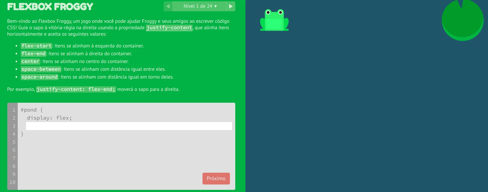
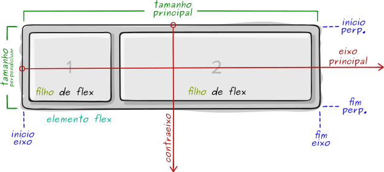
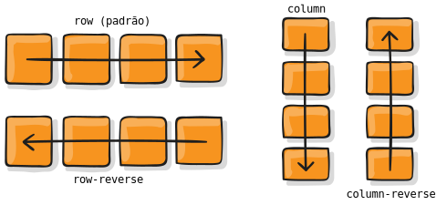
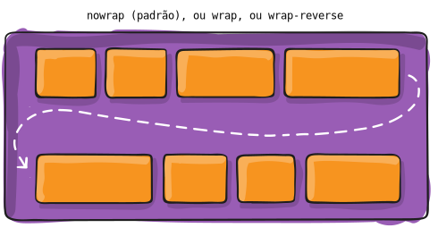
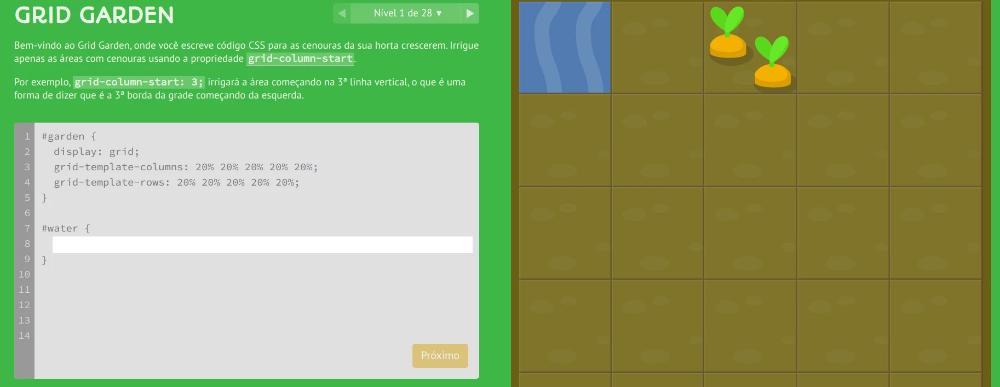
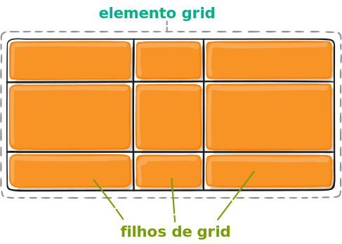
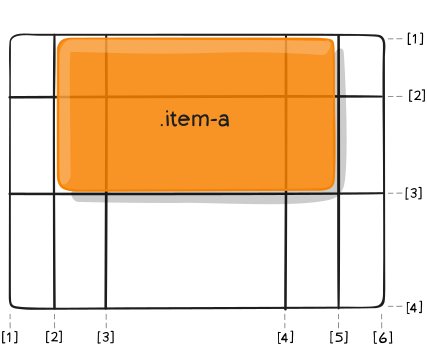
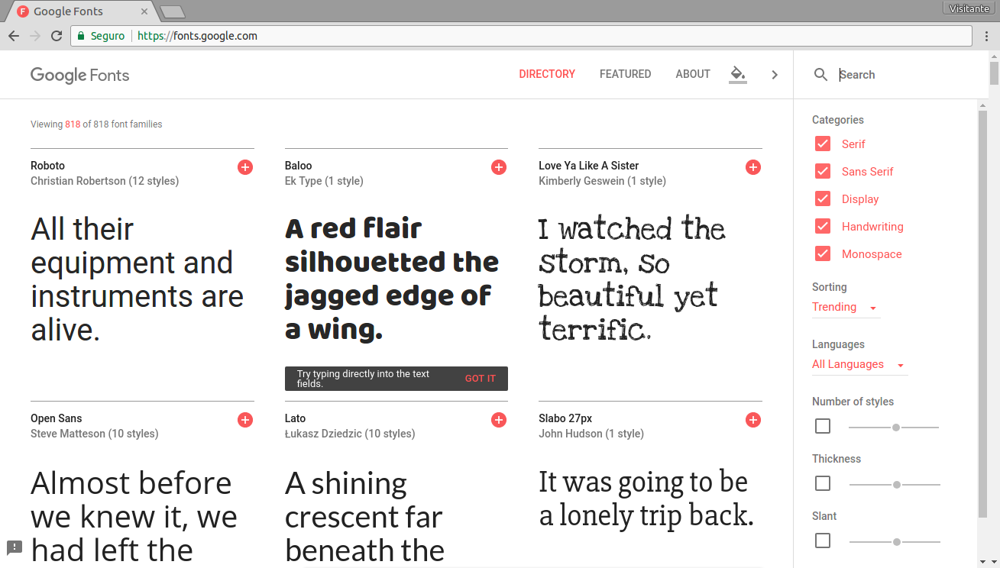

<!-- {"layout": "title"} -->
# **CSS** parte 3
## Flexbox, Grid, Visibilidade e Web Fonts

---
## Na última aula (1/3)

- Podemos precisar **agrupar elementos** <u>logicamente semelhantes</u> ou por
  <u>questões de estilização</u>
- Podemos usar os elementos `<div>...</div>` (_block_) e `<span>...</span>`
  (_inline_):
  ```html
  <div id="cabecalho-da-pagina">
    <h1>Título</h1>
    <h2>Subtítulo</h2>
  </div>
  ```
  ```html
  <p class="artista-musica">
    <span>MC Hammer</span>: <span>Can't Touch This</span>
  </p>
  ```

---
# Na última aula... (2/3)

-  <!-- {.push-right} -->
  Aprendemos sobre o **_box model_**
  - Todo elemento de conteúdo (dentro do `body`) é representado por uma caixa
  - Podemos especificar, para a caixa:
    - O espaço do conteúdo (`width`, `height`)
    - Um espaço de preenchimento (`padding`)
    - Uma borda (`border`)
    - Um espaço externo (`margin`)
  - Quando definimos `width` ou `height`, estamos definindo o tamanho do
    **conteúdo**, e não da caixa inteira
  - É possível alterar o significado de `width` e `height` usando `box-sizing`

---
# Na última aula (3/3)

-  <!-- {.push-right} -->
  Aprendemos que os elementos podem flutuar
  ```css
  img#principal {
    float: left; /* right, none */
  }
  ```
  - Elementos flutuantes alteram o fluxo dos elementos posteriores
    - `blocks` fingem que os flutuantes não estão ali
    - `inlines` adequam sua forma aos flutuantes

<!-- - [Questionário Maroto](https://moodle.cefetmg.br/mod/quiz/view.php?id=18171) -->

---
<!-- {"layout": "centered"} -->
# Hoje veremos...

1. [Flexbox](#flexbox)
1. [Grid](#grid)
1. [Visibilidade de elementos](#visibilidade-de-elementos)
1. [Web Fonts](#web-fonts)

---
<!-- {"layout": "section-header", "hash": "flexbox"} -->
# Flexbox
## Layouts de 1D

- Relembrando propriedade `display`
- `flex`, `inline-flex`
- Propriedades acessórias
- Exemplos
<!-- {ul:.content} -->

---
<!-- {"backdrop": "oldtimes"} -->
## A propriedade **display** (na [MDN](https://developer.mozilla.org/en-US/docs/Web/CSS/display))

- Define o **tipo de visualização** de um elemento e também seu
  **comportamento** no fluxo da página
- Os valores mais comuns
  - `block`, para definir um elemento com comportamento `block`
  - `inline`, similarmente, para `inline`
  - `inline-block`, similar a `block`, porém sem quebra de linha
  - `none`, sem renderização

---
<!-- {"backdrop": "oldtimes"} -->
## Resultado do display **inline-block**

<iframe width="600" height="400" src="//jsfiddle.net/fegemo/2gfkyrrh/3/embedded/result,html,css/" allowfullscreen="allowfullscreen" frameborder="0" class="flex-align-center bordered rounded"></iframe>

---
<!-- {"layout": "main-point", "state": "emphatic"} -->
# Conheça o FLEXBOX 🐸

---
<!-- {"layout": "2-column-content", "embeddedStyles": ".horizontal-flex-example li { font-size: .8em; flex: 1; margin-right: 4px; background: #fffc; outline: 1px solid silver; } .horizontal-flex-example { display: flex; justify-content: space-between; list-style-type: none; padding-left: 0; }", "backdrop": "oldtimes"} -->
## Exemplo com flexbox: lista horizontal

```css
ul.horizontal {
  display: flex;
  justify-content: space-around;

  /* tirar coisas que vem na <ul> */
  list-style-type: none;
  padding-left: 0;
}

ul.horizontal > li {
  flex: 1; /* crescer com peso 1 */
  
  /* espacinho e centralização */
  margin-right: 4px;
  text-align: center;
}
```

- ::: result . text-align: center
  - Abacaxi <!-- {ul:.horizontal-flex-example} -->
  - Kiwi
  - Maçã
  - Uva
  - Limão
  :::
- Veremos mais sobre **flexbox** em outra aula <!-- {ul^1:.no-bullets.no-padding.bulleted-0} -->

---
<!-- {"layout": "tall-figure-left", "slideStyles": {"grid-template-columns": "auto 1fr"}, "backdrop": "oldtimes"} -->
## Display: **flex** e **inline-flex**  <!-- {.emoji} -->

<div class="caniuse" data-feature="flexbox"></div>

- Mais recentemente, o CSS3 introduziu o **flexbox**
- É uma forma **bem flexível** para dispor os elementos
- Cria uma linha (`row`) ou coluna (`column`) com filhos
- Além de `display: flex` e `display: inline-flex`, foram introduzidas outras propriedades. Exemplos:

`flex-direction` <!-- {dl:.span-columns.width-20.full-width.no-margin} -->
~ `row` (padrão), `column`, `row-reverse`, `column-reverse`
~ dispõe filhos na horizontal (se `row`) ou vertical (`column`)

`justify-content`
~ `flex-start` (padrão), `center`, `space-around`, `space-between`...
~ define como distribuir o espaço que sobrou

`align-items`
~ `stretch` (padrão), `flex-start`, `center`...
~ define posição dos elementos no "contraeixo"

---
# Jogo [Flexbox Froggy 🌐][flex-frog] <!-- {target="_blank"} --> <span style="font-family: 'Source Code Pro', monospace; font-size: 0.25em; opacity: 0.5;">~ melhor professor de flexbox ~</span>

 <!-- {.full-width.bordered.rounded} -->

[flex-frog]: https://flexboxfroggy.com/#pt-br

---
<!-- {"layout": "2-column-content"} -->
## Como funciona o flexbox <small>(1/3)</small>

1. <!-- {li:.no-bullets.no-padding.no-margin} -->
    <!-- {.full-width} -->
1. Ideia: habilidade do elemento alterar o tamanho de seus filhos (e ordem) para ocupar o espaço disponível <!-- {ol:start="0"} -->
1. Há propriedades para o **elemento flex** e para seus **filhos** <!-- {.alternate-color} -->
   - Apenas o pai tem `display: flex`

- <!-- {ul:.no-bullets.no-padding.no-margin} -->
  **`flex-direction`** define o **eixo principal** e o contraeixo
-  <!-- {.large-width.centered.block} -->
- **`flex-wrap`** se precisar quebra linha?
-  <!-- {.large-width.centered.block} -->

---
<!-- {"layout": "3-column-content"} -->
## Como funciona o flexbox <small>(2/3)</small>

- <!-- {ul:.no-bullets.no-padding.no-margin} -->
  **`justify-content`** distribui espaço em branco no eixo principal
-  <!-- {.medium-width.centered.block} -->

1. <!-- {ol:.no-bullets.no-padding.no-margin} -->
   **`align-items`** alinhamento no contraeixo
1.  <!-- {.large-width.centered.block} -->

- <!-- {ul:.no-bullets.no-padding.no-margin} -->
  **`align-content`** distribui espaço em branco no contraeixo
-  <!-- {.large-width.centered.block} -->
- Só se `flex-wrap` !== `nowrap`

---
<!-- {"layout": "3-column-content"} -->
## Como funcionam os **filhos** de flexbox  <!-- {.alternate-color} -->   <small>(3/3)</small>

- <!-- {ul:.no-bullets.no-padding.no-margin} -->
  **`flex`** <!-- {.alternate-color} --> define o peso do elemento no eixo na hora de definir seu tamanho
-  <!-- {.large-width.centered.block} -->
- ⬆️ na verdade, é atalho para `flex-grow`, `flex-shrink` e `flex-basis`

1. <!-- {ol:.no-bullets.no-padding.no-margin} -->
   **`align-self`** <!-- {.alternate-color} --> alinhamento no contraeixo apenas deste filho
1.  <!-- {.large-width.centered.block.bullet} -->
1. **`gap`** define um espaço mínimo entre filhos
   <!-- {li:.bullet} -->
   -   <!-- {.medium-width} -->

- <!-- {ul:.no-bullets.no-padding.no-margin} -->
  **`order`** <!-- {.alternate-color} --> define uma ordem diferente da do código fonte
-  <!-- {.large-width.centered.block} -->

---
<!-- {"layout": "section-header", "hash": "grid"} -->
# Grid
## Layouts de 2D

- Propriedades acessórias
- Exemplos
- Grid Garden
<!-- {ul:.content} -->

---
# CSS **Grid** Layout

- Flexbox é ótimo para layouts de 1 dimensão (linhas ou colunas)
- Grid cria layouts de 2 dimensões (linhas e colunas)
- Além de `display: grid` (e `inline-grid`), várias novas propriedades foram introduzidas
- Há propriedades para o **elemento grid** e para os **filhos de grid** <!-- {.alternate-color} -->
  - Algumas propriedades do Flexbox também são usadas
- Deve-se definir as linhas e colunas e seus tamanhos

---
<!-- {"layout": "2-column-content", "classes": "compact-code-more", "backdrop": "oldtimes"} -->
## Exemplo usando `grid`

- HTML <!-- {ul:.no-bullets.no-padding} -->
  ```html
  <main>
    <header></header>
    <nav></nav>
    <section></section>
    <footer></footer>
  </main>
  ```
  CSS (elemento pai)
  ```css
  main {
    display: grid;
    grid-template-rows: 200px 1fr auto;
    grid-template-columns: 300px 1fr;
  }
  ```

1. CSS (dos filhos) <!-- {ol:.no-bullets.no-padding.two-column-code} -->
   ```css
   header {
     grid-column: 1 / 3;
   }

   nav {
     grid-column: 1 / 2;
     grid-row: 2 / 3;
   }
   section {
     grid-column: 2 / 3;
     grid-row: 2 / 3;
   }
   footer {
     grid-column: 1 / 3;
     grid-row: 3 / 4;
   }
   ```
   ::: result .full-width height: 250px; display: grid; grid-template-rows: 60px 1fr auto; grid-template-columns: 90px 1fr;
   <header style="background: lightblue; grid-column: 1/3;"></header>
   <nav style="background: black; grid-column: 1/2; grid-row: 2/3;"></nav>
   <section style="background: green; grid-column: 2/3; grid-row: 2/3;"></section>
   <footer style="background: gray; grid-column: 1/3; grid-row: 3/4; min-height: 40px;"></footer>
   :::

---
<!-- {"layout": "main-point", "state": "emphatic"} -->
# Conheça o Grid Garden 🥕

---
# Jogo [Grid Garden 🌐][grid-garden] <!-- {target="_blank"} --> <span style="font-family: 'Source Code Pro', monospace; font-size: 0.25em; opacity: 0.5;">~ melhor professor de grid ~</span>

 <!-- {.full-width.bordered.rounded} -->

[grid-garden]: https://cssgridgarden.com/#pt-br

---
<!-- {"layout": "3-column-content"} -->
## Conceitos sobre Grid

- **Elemento grid**: <!-- {ul:.no-padding.no-bullets} -->
  aquele que tem `display: grid` ou `inline-grid`
- **Filho de grid**: <!-- {.alternate-color} -->
  todos os filhos diretos de um **elemento grid**
   <!-- {.large-width.centered.block style="margin-top: 1.75em;"} -->

1. **Calha**<!-- {style="color: unset"} -->: <!-- {ol:.no-bullets.no-padding} -->
   traço entre linhas ou colunas (ou início/final)
    <!-- {.medium-width.centered.block} -->
1. **Célula**<!-- {style="color: unset"} -->:
   espaço entre quatro calhas
    <!-- {.medium-width.centered.block} -->

- **Trilha**<!-- {style="color: unset"} -->: linha ou coluna <!-- {ul:.no-bullets.no-padding} -->
   <!-- {.medium-width.centered.block} -->
- **Área**<!-- {style="color: unset"} -->: conjunto adjacente e retangular de células
   <!-- {.medium-width.centered.block} -->

---
<!-- {"layout": "2-column-content", "classes": "compact-code-more"} -->
## Como funciona o Grid <small>(1/3)</small>

- <!-- {ul:.no-bullets.no-padding.no-margin} -->
  **`grid-template-columns`**, **`grid-template-rows`** definem quantidade e tamanho de colunas e linhas
  ```css
  .container {
    grid-template-columns: 40px 50px auto 50px 40px;
    grid-template-rows: 25% 100px auto;
  }
  ```
-  <!-- {.medium-width.centered.block} -->

1. <!-- {ol:.no-bullets.no-padding.no-margin} -->
   **`grid-column`**<!-- {.alternate-color} -->, **`grid-row`** <!-- {.alternate-color} --> especifica as <u>calhas</u> da célula onde o filho será colocado 
   ```css
   .item-a {
     grid-column: 2 / 5;
     grid-row: 1 / 3;
   }
   ```
1.  <!-- {.medium-width.centered.block} -->

---
<!-- {"layout": "2-column-content", "classes": "compact-code-more"} -->
## Como funciona o Grid <small>(2/3)</small>

- <!-- {ul:.no-bullets.no-padding.no-margin} -->
  **`grid-template-areas`** dá nomes às áreas da grid
  ```css
  .container {
    display: grid;
    grid-template-columns: repeat(1fr, 4);
    grid-template-rows: repeat(1fr, 3);
    grid-template-areas: 
      "header header header header"
      "main main . sidebar"
      "footer footer footer footer";
  }
  ```
  - Um `.` é uma célula vazia
  - `repeat(n, valor)` é um atalho

1. <!-- {ol:.no-bullets.no-padding.no-margin.two-column-code} -->
   **`grid-area`**<!-- {.alternate-color} --> especifica nome da <u>área</u> onde o filho será colocado 
   ```css
   .item-a {
     grid-area: header;
   }
   .item-b {
     grid-area: main;
   }
   .item-c {
     grid-area: sidebar;
   }
   .item-d {
     grid-area: footer;
   }
   ```
1.  <!-- {.medium-width.centered.block} -->
<!-- {li:.no-bullets.no-padding} -->

---
<!-- {"layout": "2-column-content", "classes": "compact-code"} -->
## Como funciona o Grid <small>(3/3)</small>

- Além dessas propriedades, há várias outras
  1. **`gap`**: define espaço entre linhas e colunas
      <!-- {.small-width.centered.block} --> 
     ```css
     .container {
       gap: 15px 10px;
     }
     ```

1. **`justify-items`** <!-- {ol:start="2"} -->
1. **`align-items`**
1. **`justify-content`**
1. **`align-content`**
1. **`grid-auto-columns`**, **`grid-auto-rows`**
1. **`justify-self`** <!-- {.alternate-color} -->
1. **`align-self`** <!-- {.alternate-color} -->
1. Valor [`masonry`][masonry] para trilhas
1. Veja o [guia completo de Grid][grid-css-tricks] em CSS Tricks <!-- {li:.note.info} -->

[grid-css-tricks]: https://css-tricks.com/snippets/css/complete-guide-grid/
[masonry]: https://www.smashingmagazine.com/native-css-masonry-layout-css-grid/

---
<!-- {"layout": "section-header", "hash": "visibilidade-de-elementos"} -->
# Alterando a visibilidade
## Fazendo elementos aparecerem ou sumirem

- Com `display: none`
- Com `visibility: hidden`
- Com `opacity`
- Propriedade `overflow`
<!-- {ul:.content} -->

---
## Usando **display**

- É possível tornar um elemento invisível usando `display: none`
  ```css
  #logotipo {
    display: none;
  }
  ```
- O elemento é **removido do fluxo**, ou seja, o espaço onde ele seria
  posicionado é liberado
- O elemento deixa de responder a eventos

**Problema**: não é possível fazê-lo desaparecer/ressurgir **com <u>transição</u>** se ele vai para (ou de) `display: none` <!-- {p:.note.warning} -->

---
## A propriedade **visibility** ([na MDN](https://developer.mozilla.org/en-US/docs/Web/CSS/visibility))

- Usada para alterar a visibilidade de elementos
  ```css
  #logotipo {
    visibility: hidden; /* visible é o padrão */
  }
  ```
- Os elementos invisíveis (`hidden`) continuam ocupando espaço (não afetam o _layout_)
- Descendentes de elementos invisíveis herdam o valor `hidden`, mas podem
  tornar-se visíveis usando `visibility: visible;`

---
## A propriedade **opacity** ([na MDN](https://developer.mozilla.org/en-US/docs/Web/CSS/opacity))

- Usada para definir a opacidade ("transparência") de elementos <!-- {ul:.compact-code} -->
  ```css
  video {
    opacity: 0.5; /* 0.0 (transparente) a 1.0 (opaco) */
  }
  ```
- Os elementos transparentes continuam ocupando espaço, mas deixam transparecer
  quem está "atrás" deles
- Continua respondendo a eventos

1. <!-- {ol:.no-bullets.layout-split-2.no-margin.no-padding.full-width} -->
   <iframe width="600" height="180" src="//jsfiddle.net/fegemo/dr3546z9/embedded/result,html,css/" allowfullscreen="allowfullscreen"  allowpaymentrequest frameborder="0" class="bordered"></iframe>
1. ↙️ Comparação entre `display`, `visibility` e `opacity`

---
## A propriedade **overflow** ([na MDN](https://developer.mozilla.org/en-US/docs/Web/CSS/overflow))

- Controla se conteúdo que extrapola o elemento deve ser cortado, se deve ser
  mostrado ou se deve ser criada uma barra de rolagem
  ```css
  div {
    overflow: scroll; /* visible, hidden, scroll, auto */
  }
  ```
- Exemplo:
  - <!-- {li^0:.no-bullets.no-padding.layout-split-2.compact-code} -->
    ```css
    div {
      max-height: 175px;
      overflow: auto;

      /* para visualizar a div */        
      border: 1px dashed gray;
    }
    ```
    ::: result . max-width: 50%
    <div style="max-height: 175px; overflow: auto; border: 1px dashed gray;">
      <p class="smaller-text-70">Cultuadas ao longo da história por diversas civilizações como símbolo
        de riqueza, trabalho ou de perseverança, pela forma como defendem
        seu território, as abelhas surgiram muito antes do homem,
        há mais de 100 milhões de anos.
      </p>
      <p class="smaller-text-70">Pertencentes à ordem <em>Hymenoptera</em> e à superfamília dos
        <em>Apoidea</em> (grupo <em>Apiformes</em>), as abelhas se dividem em
        cerca de 20 mil espécies e a mais conhecida é a
        <em>Apis mellifera</em>.
      </p>
    </div>
    :::

---
<!-- {"layout": "section-header", "hash": "web-fonts"} -->
# _Web Fonts_
## Usando fontes não-instaladas

- Formatos de fontes
- A regra `@font-face`
- Google Fonts
<!-- {ul:.content} -->

---
# Web Fonts

- Motivação:
  - Utilizar **fontes que não estão instaladas** no computador
- Passos:
  1. Escolher a fonte
  1. Gerar **todos os formatos** para que funcione em todos os principais
     navegadores
     - `.ttf`
     - `.otf`
     - `.eot`
     - `.woff`
     - `.woff2` <!-- {ul:.multi-column-list-5} -->
  1. Publicar a fonte na Internet (ou no seu próprio site)

---
## Web Fonts (usando)

1. Descrever a fonte no arquivo CSS usando `@font-face {...}`: <!-- {ol:.compact-code} -->
   ```css
   @font-face {
     font-family: "Emblema One";    /* dando um nome à fonte */
     src: url("fonts/EmblemaOne-Regular.woff2") format('woff2'), /* 1º formato */
          url("fonts/EmblemaOne-Regular.woff")  format('woff'),  /* 2º formato */
          url("fonts/EmblemaOne-Regular.ttf")   format('ttf');   /* 3º formato */
   }
   ```
2. Usar a fonte:
   ```css
   h1 {
     font-family: "Emblema One", sans-serif;
   }
   ```
   - Sempre coloque uma segunda opção (_e.g._, `sans-serif`)


---
<!-- {"layout": "2-column-content", "scripts": ["../../scripts/classes/caniuse.min.js"], "slideStyles": {"grid-template-rows": "auto auto 1fr"}} -->
## **Formatos de fonte** e os navegadores

<div class="caniuse" data-feature="woff2" style="justify-self: center"></div>
<div class="caniuse" data-feature="woff" style="justify-self: center"></div>

- **WOFF2** é até 50% menor que **WOFF** <!-- {ul:.span-columns} -->
- **TTF** é suportado em todos navegadores

---
## Usando fontes "mais facinho"

-  <!-- {.push-right.small-width.bordered.rounded} -->
  Gerar os formatos de fonte necessários pode dar trabalho
- Outra alternativa é usar **sites que provêem diversas fontes** para
  serem usadas
  - Exemplos:
    1. [**Google Fonts**][google-fonts]
    1. [Dafont][dafont]
    1. [FontSpace][font-space]
  - Além de ter vários formatos das fontes, eles fornecem o código CSS

[google-fonts]: https://fonts.google.com/
[dafont]: http://www.dafont.com/pt/
[font-space]: http://www.fontspace.com

---
<!-- {"layout": "centered"} -->
# Referências

- Jogo [Flexbox Froggy 🐸](https://flexboxfroggy.com/)
- Jogo [Grid Garden 🥕](https://cssgridgarden.com/)
- [_A complete guide to Flexbox_](https://css-tricks.com/snippets/css/a-guide-to-flexbox/) em CSS Tricks
- [_A complete guide to CSS Grid_](https://css-tricks.com/snippets/css/complete-guide-grid/) em CSS Tricks