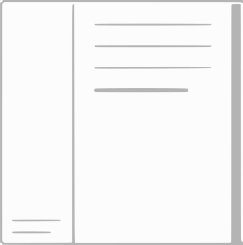
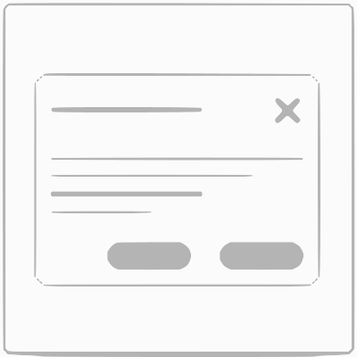

<!-- {"layout": "title"} -->
# **CSS** parte 4
## Layouts, _custom properties_ e a<br><span style="font-family: Ravie, serif; color: #e90c0c; text-shadow: 1px 1px black;">Lanchonete do Coral 55</span>

---
<!-- {"layout": "centered"} -->
# Roteiro de hoje

1. [Layouts comuns](#layouts-comuns")
1. [_Custom properties_](#custom-properties) ("variáveis") em CSS
1. [Lanchonete do Coral 55](#lanchonete-do-coral-55) <!-- {style="font-family: Ravie, serif; color: #e90c0c; text-shadow: 1px 1px black;"} -->

---
<!-- {"layout": "section-header", "hash": "layouts-comuns"} -->
# _Layouts_ comuns
## Padrões de desenho

- Unidades de medida em CSS
- Breve história
- Layouts de páginas
- Layouts de componentes
<!-- {ul:.content} -->

---
# Unidades de medida

- Absolutas (fixas)
  - `px`
  - `cm`, `mm`, `in`, `pt`, `pc`  <!-- {ul:.multi-column-list-2}-->
- Relativas ao tamanho do _container_:
  - `%`
- Relativas ao tamanho da fonte:
  - **`em`** (letra M)
  - `rem` (letra M - _root_)
  - `ex` (letra x)
  - `ch` (número 0) <!-- {ul:.multi-column-list-2}-->
- Relativas ao tamanho da janela:
  - `vh` (1/100 altura)
  - `vw` (1/100 largura)
  - `vmin` (1/100 menor dim.)
  - `vmax` (1/100 maior dim.) <!-- {ul:.multi-column-list-2}-->

---
# Como fazíamos _layout_

-  <!--{.bordered.rounded.push-right style="width: 440px"}-->
  Cronologicamente: <!-- {ul:.full-width.no-bullets.no-padding.no-margin} -->
  
  Era 1 <!-- {dl:.width-10} -->
  ~ Tabelas dentro de tabelas dentro de tabelas ➡️
  
  Era 2
  ~ DIV e SPAN + `display: table`
  
  Era 3
  ~ DIV e SPAN + `float` e `clear`
  
  Era 4
  ~ semânticas + `float` e `clear`
  
  Era 5
  ~ Flexbox
  
  Era 6
  ~ Grid + flexbox

---
<!-- {"layout": "main-point", "state": "emphatic"} -->
# Layout de páginas

---
## Características de um _layout_

- Um _layout_ pode ser:
  1. Tamanho fixo ou fluido
  1. Adaptável a diferentes telas (responsive)
  1. 100% HTML/CSS ou precisar de um pouco de JS
     - Neste caso, evitar (a menos que obrigatório)

---
<!-- {"classes": "compact-code"} -->
## Layout de páginas <small>(1/3)</small>

1. ### Holy Grail <!-- {.center-aligned} --> [🌐][holy-grail]
   <!-- {ol:.horizontal-list.no-bullets.no-padding.no-margin.full-width style="justify-content: space-around"} -->
    <!-- {.small-width.centered.block} -->

    ```css
    .container {
      display: grid;
      grid-template: auto 1fr auto
                   / auto 1fr auto;
    }
    ```
1. ### Barra lateral <!-- {.center-aligned} --> [🌐][sidebar]
    <!-- {.small-width.centered.block} -->

    ```css
    .container {
      display: flex;
    }
    .sidebar {
      width: 30%;
    }
    .content {
      flex: 1;
      overflow-y: auto;
    }
    ```

[holy-grail]: https://jsfiddle.net/fegemo/cdn8yuLe/
[sidebar]: https://jsfiddle.net/fegemo/f2bsvhqu/

---
<!-- {"classes": "compact-code"} -->
## Layout de páginas <small>(2/3)</small>

1. ### Fundo total <!-- {.center-aligned} --> [🌐][full-background]
   <!-- {ol:.horizontal-list.no-bullets.no-padding.no-margin.full-width style="justify-content: space-around"} -->
    <!-- {.small-width.centered.block} -->

    ```css
    .above-the-fold {
      background-image: url('...');
      background-size: cover;
      background-repeat: no-repeat;
      height: 100vh;
    }
    ```
1. ### Cabeçalho grudento <!-- {.center-aligned} --> [🌐][sticky-header]
    <!-- {.small-width.centered.block} -->
    
    ```css
    header {
      position: sticky;
      top: 0;
    }
    ```

[full-background]: https://jsfiddle.net/fegemo/vyfcwd28/
[sticky-header]: https://jsfiddle.net/fegemo/Ldxoch3j/

---
<!-- {"classes": "compact-code-more"} -->
## Layout de páginas <small>(3/3)</small>

1. ### Menu em gaveta <!-- {.center-aligned} --> [🌐][drawer-menu]
   <!-- {ol:.horizontal-list.no-bullets.no-padding.no-margin.full-width style="justify-content: space-around"} -->
    <!-- {.small-width.centered.block} -->

    ```css
    #menu {
      position: absolute; left: -200px;
      width: 200px; height: 100vh;
    }
    body.menu-open #menu {
      left: 0;
    }
    body.menu-open .content {
      left: 200px;
    }
    ```
1. ### Bricolagem <!-- {.center-aligned} --> [🌐][masonry-grid]
    <!-- {.small-width.centered.block} -->
    
    ```css
    .container {
      column-count: 3;
      column-gap: 1rem;
      width: 100%;
    }
    .item {
      break-inside: avoid;
      margin-bottom: 1rem;      
    }
    ```

[drawer-menu]: https://jsfiddle.net/fegemo/dj37kc7e/
[masonry-grid]: https://jsfiddle.net/fegemo/mcrjdxbf/

---
<!-- {"layout": "main-point", "state": "emphatic"} -->
# Centralizando as coisas

---
## Centralizando horizontalmente <small>(1/2)</small>

- Existem várias formas para centralizar elementos que se aplicam a situações
  diferentes
- Centralizando <u>qualquer</u> conteúdo `inline` de um elemento:
  ```css
  .container { 
    text-align: center; 🤯
  }
  ```
- Centralizando um elemento `block`:
  ```css
  .elemento-centralizado {
    margin-left: auto;
    margin-right: auto;
  }
  ```

---
<!-- {"classes": "compact-code", "hash": "centralizando-elementos-posicionados"} -->
## Centralizando elementos "posicionados" <small>(2/2)</small>

- Centralizando um elemento com `position` `absolute` ou `fixed`
  ```css
  .centraliza-position { left: calc(50% - LARGURA_ELEMENTO / 2); }
  ```
  - Onde `LARGURA_ELEMENTO` é a largura
    conhecida do elemento que queremos centralizar
- Centralizando elemento posicionado e sua <u>largura é fluida</u> ([exemplo][modal-fluid])
  ```css
  .centraliza-position-fluid {
    position: absolute;
    left: 50%;
    transform: translateX(-50%);
  }
  ```
  - Verticalmente é análogo a estas duas formas

[modal-fluid]: https://jsfiddle.net/fegemo/u6a91z5g/

---
<!-- {"layout": "main-point", "state": "emphatic"} -->
# Layout de componentes

---
## Layout de componentes <small>(1/2)</small>

1. ::: figure .push-right.center-aligned margin-top: 1em; 
    <!-- {.block.centered style="width: 125px; "} -->
   [exemplo][exemplo-cards]
   :::
   <!-- {ol:.full-width} -->
   ### Lista de _cards_
   - <!-- {ul:.no-padding.no-margin.no-bullets.compact-code-more} -->
     <!-- {li:.two-column-code} -->
     ```css
     .card-list {
       display: flex;
       flex-wrap: wrap;
       justify-content: space-between;
       gap: 1rem;
     }
     .product {
       min-width: 100px;
       height: 150px;
       flex: 1;
     } 
     ```
   - <iframe width="60%" height="220" src="//jsfiddle.net/fegemo/2pwxbqse/embedded/result/" allowfullscreen="allowfullscreen" allowpaymentrequest frameborder="0" class="push-right rounded bordered"></iframe>

     ```html
     <div class="card-list">
       <div class="product">...</div>
       <div class="product">...</div>
       <div class="product">...</div>
       <div class="product">...</div>
       <div class="product">...</div>
       <div class="product">...</div>
     </div>
     ```

[exemplo-cards]: https://jsfiddle.net/fegemo/2pwxbqse/

---
## Layout de componentes <small>(2/2)</small>

2. <!-- {ol:.full-width} -->
   ### Janelinha Modal + máscara
   - <!-- {ul:.no-padding.no-margin.no-bullets.compact-code-more} -->
     <!-- {li:.three-column-code} -->
     ```css
     .modal {
       position: fixed;
       left: 50%; top: 50%;
       transform: translate(-50%, -50%);
       z-index: 100;
       opacity: 0;
       pointer-events: none;
     }
     .modal.visible {
       opacity: 1;
       pointer-events: initial;
     }
     #mask {
       position: fixed;
       background-color: #0003;
       inset: 0; z-index: 10;
       opacity: 0;
       pointer-events: none;
     }
     .modal.visible ~ #mask {
       opacity: 1;
       pointer-events: initial;
     }
     ```
   - ::: figure .push-right.center-aligned margin-top: 1.75em; 
      <!-- {.block.centered style="width: 125px; "} -->
     [exemplo][exemplo-modal]
     :::
     ```html
     <body>
      ...
      <div class="modal visible">
        ...
      </div>
      <div class="modal">
        ...
      </div>
      <div id="mask"></div>
     </body>
     ```

[exemplo-modal]: https://jsfiddle.net/fegemo/62onpwmL/

---
<!-- {"layout": "section-header", "hash": "custom-properties"} -->
# _Custom Properties_
## "Variáveis" em CSS

- Motivação
- Definindo e usando
- Alterando via JavaScript
<!-- {ul:.content} -->

---
# Por que novas propriedades/variáveis?

1. <!-- {.push-code-right} -->
   ```css
   :root {
     --cor-de-destaque: #339966;
   }
   strong {
     color: var(--cor-de-destaque);
   }
   ```
   <!-- {ol:.full-width.compact-code} -->
   Dar nome a valores
   - Evitando "números mágicos"
1. Não repetir valores
   - Possibilita reuso de valores
1. Criar temas
   - ::: did-you-know .push-right.clearer width: 420px;
     Antes das CSSCP, usávamos preprocessadores CSS
     que compilavam de uma linguagem para CSS.
     :::
     Alterando um conjunto de valores para outro
1. Apoiar criação de _design systems_
   - Configuração de componentes
1. Controlar via JavaScript
   - Alterável programaticamente

*[CSSCP]: CSS Custom Properties

---
# Usando _custom properties_ em CSS

- Devem ser criadas dentro de uma regra e o seletor define seu escopo
  - Utiliza a cascata, ou seja, `outro-seletor` deve descender de `seletor`
- Anatomia do uso: <!-- {li:.two-column-code} -->
  ```css
  seletor {
    --nome: valor;
  }
  outro-seletor {
    propriedade: var(--nome);
  }
  ```
  - Nome da propriedade começa com `--`
  - Para usar, `var(nome)` no valor

---
<!-- {"layout": "2-column-content", "classes": "compact-code-more"} -->
# Exemplos de _custom properties_

```css
:root { /* ⬅️ escopo global */
  --cor-texto: #333;
  --cor-fundo: #fff;
  --cor-texto-destaque: #396;
  --largura-pagina: 800px;
  --largura-produto: calc(
    var(--largura-pagina) / var(--produtos-por-linha)
    - var(--espaco-produtos)
  );
  --espaco-produtos: 2rem;
  --produtos-por-linha: 4;
}
.container {
  max-width: var(--largura-pagina);
  display: flex; flex-wrap: wrap;
  gap: var(--espaco-produtos);
}
.produto {
  width: var(--largura-produto, 200px);
}
```

- ✅ Dar nomes a valores <!-- {ul:.no-bullets.no-padding} -->
- ✅ Não repetir valores
- ✅ Uso em expressões calculadas
- ↙️ Exemplo de definição de valor padrão (`.produto`)

---
<!-- {"layout": "3-column-content", "classes": "compact-code-more"} -->
# Usando a cascata

```css
body {
  --background: white;
}
.sidebar {
  --background: gray;
}
.module {
  background: var(--background);
}
```

```html
<body>
  <main>
    <div class="module">
      Tenho fundo branco.
    </div>
  <main>
  <aside class="sidebar">
    <div class="module">
      Tenho fundo cinza.
    </div>
  </aside>
</body>
```


- <!-- {ul:.span-columns.full-width} -->
  O `.module` terá cor diferente dependendo de onde aparece na árvore (cascata do CSS)

---
<!-- {"layout": "tall-figure-right"} -->
# Definindo tipo e herança

::: did-you-know . width: 520px; margin-left: 1rem;
Tipos de dados válidos:
- `length`
- `number`
- `percentage`
- `length-percentage`
- `color`
- `image`
- `url`
- `integer`
- `angle`
- `time`
- `resolution`
- `transform-list`
- `transform-function`
- `custom-ident` <!-- {ul:.multi-column-list-2} -->
:::


- É possível definir metadados sobre uma _custom property_ usando a _at-rule_ `@property`:
  ```css
  @property --x {
    syntax: '<number>';
    inherits: false;
    initial-value: 42;
  }
  ```

---
# Usando _custom properties_ em JavaScript

- Para usar em JavaScript: <!-- {.full-width} -->
  ```js
  elemento.style.setProperty('--x', value);
  ```

<iframe width="100%" height="400" src="//jsfiddle.net/fegemo/0x9s3rqL/embedded/result,js,css,html" allowfullscreen="allowfullscreen" allowpaymentrequest frameborder="0" class="bordered rounded"></iframe>

---
<!--
{
  "embeddedStyles": ".siri { background: linear-gradient(to bottom, #5da6d3, #2e2e2e); border: 3px double #000; } .ravie { font-size: 2em; font-family: Ravie, serif; color: #e90c0c; }",
  "layout": "section-header",
  "hash": "lanchonete-do-coral-55"
}
-->
# Lanchonete do<br>Coral 55 <!-- {.ravie} -->
## Ajude a criar nosso cardápio

 <!-- {.portrait.siri} -->
<!-- {p:.center-aligned} -->

---
<!-- {"layout": "2-column-content"} -->
# Comp / Specs <!-- {h1:.center-aligned} -->

 <!-- {.full-width.bordered.rounded} -->

 <!-- {.full-width.bordered.rounded} -->

*[Comp]: Comprehensive Layout
*[Specs]: Specifications

---
## Passos para o exercício

1. Criar um _fork_ do repositório do professor em:
   - https://github.com/fegemo/cefet-web-coral-55
1. Fazer o exercício e fazer _commits_ e _push_ no seu repositório
1. Enviar a URL do seu _fork_
1. Atividade:
   1. Web fonts
   1. Layout geral e das partes
   1. Borbolhas (JavaScript)
   1. Modo escuro

---
<!-- {"hash": "a-propriedade-line-height"} -->
## A propriedade **line-height** ([na MDN](https://developer.mozilla.org/en-US/docs/Web/CSS/line-height))

- Define a altura de uma linha de texto.
- Inicialmente, `line-height: 1em;`, mas qualquer valor de medida de tamanho
  pode ser usado
  - Exemplo:
    ```css
    .espacamento-simples { line-height: 1em; }
    .espacamento-duplo   { line-height: 2em; }
    ```

    <p style="float: left; width: 45%; line-height: 1em; height: 100px; overflow: auto; border: 3px solid black">
      Lorem ipsum dolor sit amet, consectetur
    adipiscing elit. Curabitur mauris eros, fermentum eget dolor sit amet.</p>

    <p style="float: right; width: 45%; line-height: 2em; height: 100px; overflow: auto; border: 3px solid black">
    Lorem ipsum dolor sit amet, consectetur
    adipiscing elit. Curabitur mauris eros, fermentum eget dolor sit amet.</p>

---
<!-- {"layout": "centered"} -->
# Referências

- Capítulo 11 do livro
- [Layout patterns](https://csslayout.io/patterns)