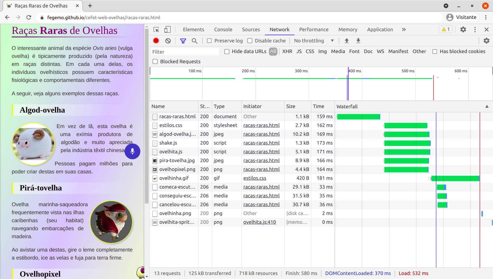

<!-- {"layout": "title"} -->
# HTML
## HTML, seus ingredientes (_tags_) e<br>temperando com CSS

---
<!-- {"layout": "regular"} -->
# Na última aula...

- Conversamos sobre a história da Internet e da Web
-  <!-- {.portrait.push-right} --> Vimos as proezas de Tim (Berners-Lee), o coração valente, ao criar:
  - O protocolo http
  - A linguagem HTML
  - Um servidor web (CERN httpd)
  - O primeiro navegador (WorldWideWeb)
  - ~~A linguagem CSS~~
  - ~~A linguagem JavaScript~~

---
# Hoje vamos falar sobre

1. Funcionamento da Web
1. Estrutura básica de um arquivo `html`
1. Tags `html`
1. Um pouco de estilo `css`

---
<!-- {"layout": "section-header"} -->
# Funcionamento da Web

- Uma **conversa** entre o servidor e o navegador
  - Navegador envia **requisições**
  - Servidor recebe-as e envia **respostas**

<!-- {ul^1:.content} -->

---
## **Servidores** Web e **Navegadores**


---
# O que um **servidor web** faz?


Ele **fica escutando**, em determinadas **portas** (geralmente 80 e 443),
**requisições de** "arquivo" (na verdade, **recursos**) **realizadas por
navegadores**

---
<!-- {"layout": "regular"} -->
## O que um **servidor web** faz (cont.)?

- Vários tipos de requisições
  - Arquivos **html**
  - Arquivos de imagem
  - Vídeos etc.
- Envia resposta com o recurso solicitado de volta ao navegador

---
<!-- {"layout": "regular"} -->
## O que um **navegador** faz?


- Quando o usuário "vai" até um novo endereço (URL), o navegador solicita esse
  **recurso** ao servidor

---
<!-- {"layout": "regular"} -->
## O que um **navegador** faz (cont.)?

- URL: Unique **Resource** Locator
  - É o endereço de coisas na Internet - páginas, imagens, arquivos, etc.

    
- Assim que a resposta é recebida, o navegador a exibe na tela, caso **consiga**
  - Por exemplo, os navegadores não conseguem exibir um arquivo .zip

---
<!-- {"layout": "regular"} -->
# Simulando um navegador

- A ferramenta `curl` é um **cliente web** (_aka_ _user-agent_), assim
  como é um navegador, porém, em linha de comando
  - Como o navegador trabalha:
    1. **Solicita a página** das ovelhas: `curl -v https://fegemo.github.io/cefet-web-ovelhas/racas-raras.html`
      - Então, **começa a fazer o _parsing_** do arquivo HTML
    1. Encontra a referência e **solicita o arquivo CSS**: `curl -v https://fegemo.github.io/cefet-web-ovelhas/estilos.css`
    1. Solicita **o ícone**... depois, **cada imagem**...
    1. Solicita os **dois arquivos JavaScript**... fim.

---
[](https://fegemo.github.io/cefet-web-ovelhas/racas-raras.html)

---
<!-- {"layout": "section-header"} -->
# Estrutura Básica do **HTML**

-
---


---


- Demonstração: criando uma página no "blocão"

---
<!-- {"layout": "regular"} -->
# Estrutura

- Um punhado de **tags** no texto
  - As _tags_ fazem a marcação da estrutura do texto
  - Existem dezenas de tags (umas 50? 60?) e cada uma tem um propósito e um
    resultado visual
  - A grande maioria delas precisam ser fechadas (e.g., `<p>...</p>`)
- Indentação e espaçamento são livres e não afetam o resultado
- Um arquivo html é _plain-text_, ou puramente textual
  - em contraposição a um arquivo binário, por exemplo
- Questionário Maroto: [Elementos HTML básicos](https://moodle.cefetmg.br/mod/quiz/view.php?id=17713)

---
## Estrutura (cont.)


---
## Exemplo de _tag_: &lt;p&gt;...&lt;p&gt;

- Para marcar onde um parágrafo começa e onde ele termina
  ```html
  <p>
      You'll find us right in the center of
      downtown Webville. Come join us!
  </p>
  ```
- Resultado: apenas um bloco de texto, como esperávamos
  <iframe width="100%" height="120" src="http://jsfiddle.net/fegemo/ofs1csr0/embedded/result/" allowfullscreen="allowfullscreen" frameborder="0"></iframe>  

---
## Exemplo de tag: &lt;p&gt;...&lt;p&gt; (cont.)

- **Quebras de linha são feitas automaticamente** dentro de um parágrafo e não
  necessariamente no mesmo lugar que você quebrou a linha no seu código fonte
```html
<p>
  "Um dos maiores problemas encontrados em viajar no tempo não é
  vir a se tornar acidentalmente seu próprio pai ou mãe. Não há
  nenhum problema em tornar-se seu próprio pai ou mãe com que
  uma família de mente aberta e bem ajustada não possa lidar."
</p>
```

---
## Exemplo de tag: &lt;p&gt;...&lt;p&gt; (cont.)

- Resultado: um bloco de texto com quebras de linha onde foram necessárias.

<p style="font-family: serif; font-size: 100%; padding: 1em; background: #333; color: white; border-radius: 0.25em; width: 50%">
  "Um dos maiores problemas encontrados em viajar no tempo não é
  vir a se tornar acidentalmente seu próprio pai ou mãe. Não há
  nenhum problema em tornar-se seu próprio pai ou mãe com que
  uma família de mente aberta e bem ajustada não possa lidar."
</p>

- [Exemplo no jsfiddle](http://jsfiddle.net/fegemo/62afu86f/)

---
## Anatomia de uma _tag_


- _tag_ de fechamento: `</h1>`
  - É idêntica à _tag_ de abertura, porém com uma barra antes do nome da _tag_
- Chamamos `<TAG>CONTEÚDO</TAG>` de um **elemento** da página
- Tags de abertura podem ter **atributos**:
  ```html
  
  ```
  - Em ``, o atributo `src="..."` aponta para a URL do arquivo
  - Não deve haver espaço entre seu nome e seu valor: `` (errado!)
---
## Voltando ao arquivo completo...

<iframe width="100%" height="500" src="//jsfiddle.net/fegemo/weft22qL/embedded/html,result/" allowfullscreen="allowfullscreen" frameborder="0"></iframe>

---
## A _tag_ &lt;html&gt;

- Envolve todas* as outras _tags_
  - *Exceto a _tag_ especial `<!DOCTYPE html>`
- Dentro dela, **devem existir todas e apenas**, nesta ordem:
  - `<head>...</head>`
  - `<body>...</body>`

---
## A _tag_ &lt;head&gt;

- Do inglês: cabeça
- Contém **meta-informação** sobre este arquivo `html`
  - Título da página (obrigatório)
  - Descrição da página
  - Ícone
  - Inclusão de arquivos (`.css`, `.js`)
- Trecho de código

```html
<html>
  <head>
    <title>Este é o título que aparece na aba</title>
    ...
  </head>
  ...
```

---
## A _tag_ &lt;body&gt;

- Do inglês: corpo
- Contém **todo o conteúdo da página**: _tags_ de
  - parágrafos
  - títulos e subtítulos (`<h1>...</h1>`)
  - imagens (``), etc.
- Trecho de código
```html
<html>
  <head>...</head>
  <body>
    ...
  </body>
<html>
```

---
## Como o navegador decide **como vai exibir** as _tags_ html?

- Usando seus estilos padrão
  - Cor: preta
  - Fundo de tela: branca
  - Fonte: Times New Roman, ou alguma fonte _serif_
- Cada navegador pode ter um estilo padrão diferente
- É possível e altamente recomendável **criar estilos próprios**
- Vamos conhecer agora uma segunda linguagem: CSS

---
<!-- {"layout": "section-header"} -->
# Um pouco de estilo
## Conhecendo CSS - Cascading Stylesheets

- Definindo estilo
- Algumas regras e propriedades CSS
- O atalho para `padding`

<!-- {ul:.content} -->

---
## Definindo o estilo

- Adicionamos um novo elemento: `<style>...</style>`
- Podemos colocá-lo no &lt;head&gt; ou no &lt;body&gt;, mas a **melhor prática é
  no cabeçalho**
```html
<html>
  <head>
    <title>Título da página</title>
    <style>

    </style>
  </head>
  ...
```

---
## Definindo o estilo (cont.)

```css
body {
  background-color: #d2b48c;
  margin-left: 20%;
  margin-right: 20%;
  border: 2px dotted black;
  padding: 10px 10px 10px 10px;
  font-family: sans-serif;
}
```

...e o resultado...

---
## Definindo o estilo (cont.)

<iframe width="100%" height="500" src="//jsfiddle.net/fegemo/9po3sd1m/2/embedded/result,html,css" allowfullscreen="allowfullscreen" frameborder="0"></iframe>

---
## Entendendo o estilo

- Define a cor (_color_) do fundo (_background_) para marrom (definido em
  hexadecimal):
  ```css
  background-color: #d2b48c;
  ```
- Define as margens laterais da página:
  ```css
  margin-left: 20%;
  margin-right: 20%;
  ```

---
## Entendendo o estilo (cont.)

- Coloca uma borda preta (_black_) com largura de 2px e pontilhada (_dotted_):
  ```css
  border: 2px dotted black;
  ```
- Altera a fonte para `sans-serif` (parecida com Arial):
  ```css
  font-family: sans-serif;
  ```

---
## Entendendo o estilo (cont.)

- Define um espaço de preenchimento de 10px entre a borda e o conteúdo
  ```css
  padding: 10px 10px 10px 10px;
  ```
  - `padding:` é um atalho para
    - `padding-top:`
    - `padding-right:`
    - `padding-bottom:`
    - `padding-left:`
  - Se usarmos a propriedade de atalho, definimos valores para as propriedades
    originais **na ordem** acima (**cima, direita, baixo, esquerda**)

---
## Mais sobre atalhos

- Os **resultados são idênticos** de se fazer:
- ```css
  padding: 10px 10px 10px 10px;
  ```
- ```css
  padding-top: 10px;
  padding-bottom: 10px;
  padding-left: 10px;
  padding-right: 10px;
  ```
- ```css
  padding: 10px;
  ```

---
# Referências

1. Capítulo 1 do livro
