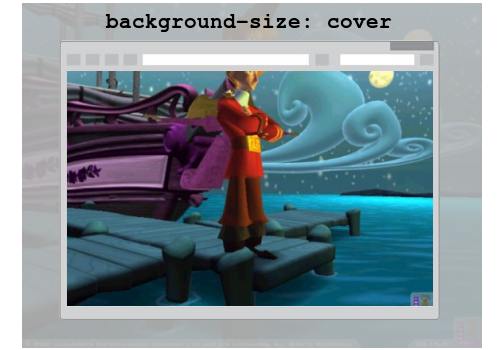

<!-- {"layout": "title"} -->
# **HTML** parte 2
## Listas, inline/block, Tabelas, Links<br>e Plantas Carnívoras 🦖

---
# Na última aula...

1. **Estrutura de um arquivo HTML**
    ```html
    <!DOCTYPE html>
    <html>
      <head>...</head> <!-- meta-informação sobre a página -->
      <body>...</body> <!-- tudo que é visível -->
    </html>
    ```
1. Algumas **_tags_ básicas**, como `<p>`, ``, `<h1...6>`, `<a href="">`
1. Um **pouquinho de CSS**: `color`, `margin`,
    `background-color`, `font-family`

---
<!-- {"layout": "centered"} -->
# Hoje veremos

- [_Tags_ que indicam importância](#tags-de-importancia)
- [_Tags_ de listas](#tags-de-listas) de itens
- [Elementos _inline_ _vs._ _block_](#elementos-inline-vs-block)
- [Tabelas](#tabelas)
- Atividade: [Plantas Carnívoras](#plantas-carnivoras)

---
<!-- {"layout": "section-header", "hash": "tags-de-importancia"} -->
# _Tags_ de importância
## Destacando partes do texto

1. _Tag_ `<strong></strong>`
1. _Tag_ `<em></em>`
1. _Tags_ `<del></del>` e `<ins></ins>`
1. _Tag_ `<mark></mark>`
<!-- {ol:.content} -->

---
## (1) _Tag_ **`<strong></strong>`** :muscle:

- Usada para marcar **texto com alta importância**, seriedade ou urgência:
  ```html
  <p><strong>Não se esqueça!</strong> Tragam seus fones de ouvido.</p>
  ```
- Por padrão, elementos `<strong>` são desenhados em **negrito**:
  ::: result
  <strong style="color: inherit">Não se esqueça!</strong> Tragam seus fones de ouvido.
  :::

---
## (2) _Tag_ **`<em></em>`**

- Usada para **dar ênfase** ("dar entonação") **ao texto**. A ideia é
  alterar como uma frase deve ser lida:
  ```html
  <p>Gatos são animais <em>bonitinhos</em>.</p>
  ```
  - Ao enfatizar _"bonitinhos"_, a frase está reafirmando a caractística dos
    gatos
- Por padrão, elementos `<em>` são desenhados em **itálico**:
  ::: result
  Gatos são animais <em>bonitinhos</em>.
  :::

---
## (3) _Tags_ **`<del></del>`** e **`<ins></ins>`** :pencil:

- Usadas para indicar **texto que foi removido** ou **inserido**:
  ```html
  <p>O jardineiro é Jesus.</p>
  <p>E as árvores... somos <del>nós</del> <ins>nozes</ins>.</p>
  ```
- Por padrão, elementos `<del>` são **riscados** e `<ins>` são **sublinhados**:
  ::: result
  O jardineiro é Jesus.<br>
  E as árvores... somos <del>nós</del> <ins>nozes</ins>.
  :::

---
## (4) _Tag_ **`<mark></mark>`** :part_alternation_mark:

- Usada para **realçar parte do texto** considerada **importante para o
  leitor**. Tipo quando usandos caneta marcadora de texto:
  ```html
  <p><mark>HTML, CSS e JavaScript</mark> são as três linguagens da Web.</p>
  ```
- Por padrão, elementos `<mark>` possuem o **fundo com a cor amarela**:
  ::: result
  <mark>HTML, CSS e JavaScript</mark> são as três linguagens da Web.
  :::

---
<!-- {"layout": "section-header", "hash": "tags-de-listas"} -->
# _Tags_ de listas
## E _tags_ de citações

- Lista numerada: `<ol></ol>`
- Lista não-numerada: `<ul></ul>`
- ~~[Lista de termos e definições][dl]~~ (_veja você mesmo_)
~ Citação: `<q></q>` e `<blockquote></blockquote>`

[dl]: https://developer.mozilla.org/pt-BR/docs/Web/HTML/Element/dl
<!-- {ul:.content} -->

---
## Listas de itens **`<ol></ol>`** e **`<ul></ul>`** 

- Lista **numerada** (também conhecida como _ordenada_):
  - ```html
    <ol>
      <li>Linux</li>
      <li>Windows</li>
    </ol>
    ```
    <!-- {li:style="flex-grow: 1; margin-right: 1em;"} -->
  - ::: result
    <ol>
      <li>Linux</li>
      <li>Windows</li>
    </ol>
    :::
    <!-- {ul:.layout-split-2.no-list-icon.no-padding} -->
    <!-- {li:style="flex-grow: 1;"} -->
    <!-- {ul^1:style="width: 100%;"} -->
- Lista **<u>não</u>-numerada** (ou _não-ordenada_):
  - ```html
    <ul>
      <li>Uva</li>
      <li>Maçã</li>
    </ul>
    ```
    <!-- {li:style="flex-grow: 1; margin-right: 1em;"} -->
  - ::: result
    <ul>
      <li>Uva</li>
      <li>Maçã</li>
    </ul>
    :::
    <!-- {ul:.layout-split-2.no-list-icon.no-padding} -->
    <!-- {li:style="flex-grow: 1;"} -->
    <!-- {ul^1:style="width: 100%;"} -->

---
<!-- {"layout": "2-column-content", "slideStyles": {"grid-template-columns": "1fr 1fr"}} -->
## Tags de Citação

- Citação “em linha”:
  ```html
  Romário disse: <q>o Pelé calado é um poeta.</q>
  ```
  ::: result
  Romário disse: <q>o Pelé calado é um poeta</q>.
  :::

1. Citação “em bloco”:
   ```html
   <blockquote>Tô quebrado, peixe</blockquote> -  Romário
   negando-se a pagar mais de R$ 3 mil de pensão
   ```
   ::: result
   <blockquote>Tô quebrado, peixe</blockquote>  - Romário negando-se a pagar mais de R$ 3 mil de pensão
   :::

---
<!-- {"layout": "section-header", "hash": "elementos-inline-vs-block"} -->
# Elementos _inline_ _vs._ _block_
## Quebrar ou não quebrar linha? :thought_balloon:


 <!-- {.portrait.centered style="display: block"} -->

Pergunta
~  Por que um **parágrafo** está sempre **abaixo do outro**, mas
  um elemento **`<strong>`** pode ficar **ao lado** de outro texto?

<!-- {dl:.content.width-30} -->

---
## Vamos fazer um *teste*... <!-- {.bullet} -->

1. Colocando dois `<p>` seguidos (lado a lado) no código <!-- {ol:.bulleted} -->
   - ```html
     <p>Primeiro</p> <p>Segundo</p>
     ```
     <!-- {li:style="flex-grow: 1;"} -->
   - ::: result . margin-left: 1em;
     <p>Primeiro</p> <p>Segundo</p>
     :::
     <!-- {ul:.layout-split-2.no-list-icon.no-padding} -->
     <!-- {li:style="flex-grow: 1;"} -->
     <!-- {ol:style="width: 100%;"} -->
1. Colocando dois `<strong>` seguidos
   - ```html
     <strong>Primeiro</strong> <strong>Segundo</strong>
     ```
     <!-- {li:style="flex-grow: 1;"} -->
   - ::: result . margin-left: 1em;
     <strong style="color: inherit;">Primeiro</strong> <strong style="color: inherit;">Segundo</strong>
     :::
     <!-- {ul:.layout-split-2.no-list-icon.no-padding} -->
     <!-- {li:style="flex-grow: 1;"} -->
     <!-- {ol:style="width: 100%;"} -->

Por quê isso acontece? <!-- {.bullet} -->

---
## Elementos **block** e elementos **inline** <!-- {.alternate-color} -->

- Ao desenhar uma página, o navegador precisa decidir **como <u>dispor</u>
  os elementos**
- Alguns elementos são do tipo `block`, outros são `inline`:

  Elementos **`block`** <!-- {dl:.bullet} -->
    ~ são dispotos um <u>abaixo do outro</u>
    ~ ex: parágrafos, títulos e subtítulos, listas <!-- {dd:.bullet} -->

  Elementos **`inline`** <!-- {.alternate-color} -->
    ~ são dispostos um <u>à direita do outro</u>
    ~ ex: links, strong, em, imagens <!-- {dd:.bullet} -->

Vamos ver como o navegador faz... <!-- {.bullet} -->

---
## Elementos **`block`**

 <!-- {p:.flex-align-center} -->

---
## Elementos **`inline`** <!-- {.alternate-color} -->

 <!-- {p:.flex-align-center} -->

---
<!-- {"layout": "2-column-content", "slideStyles": {"grid-template-columns": "auto 1fr"}} -->
## **`block`** e **`inline`** <!-- {.alternate-color} -->, juntos

 <!-- {.bullet} -->

`block` <!-- {dl:.width-20.bullet} -->
~ ocupa largura toda
~ cima para baixo
~ podemos definir `width` e `height`
~ podemos definir `margin` e `padding`

`inline`
~ tem o tamanho suficiente
~ esquerda para direita
~ ignora `width` e `height`
~ ignora `margin-top` e `margin-bottom`

---
<!-- {"layout": "2-column-content"} -->
## De volta ao **`<p>` _vs._ `<strong>`** <!-- {.alternate-color} -->...

- São elementos **`block`**: <!-- {ul:.no-bullets.no-padding} -->
  - **`<p>`**
  - `<h1>, <h2> ... <h6>`
  - `<ul>`, `<ol>`, `<li>`
  - e outros...

1. São elementos **`inline`**: <!-- {.alternate-color} --> <!-- {ol:.no-bullets.no-padding} -->
   - **`<strong>`** <!-- {.alternate-color} -->
   - `<em>`
   - `<del>`, `<ins>`
   - `<mark>`
   - `<em>`
   - `<a>`
   - ``
   - e outros...

---
<!-- {"hash": "margin-e-padding"} -->
## Margem e _Padding_

 <!-- {p:.flex-align-center.medium-width.invert-colors-dark-mode} --> <!-- {.full-width} -->

**`padding`** 
~ Espaçamento interno, da borda para dentro

**`border`**
~ Tamanho da borda

**`margin`**
~ Espaçamento externo, da borda para fora

---
<!-- {"layout": "2-column-content"} -->
## Margem e _Padding_ - Exemplo

<iframe width="100%" height="450" src="https://jsfiddle.net/fegemo/ovt08qcb/embedded/result,css,html/" allowfullscreen="allowfullscreen" frameborder="0"></iframe>

- Todo elemento pode ter: <!-- {ul:.bulleted-0} -->
  1. `padding` (esp. interno)
  1. uma borda
  1. `margin` (esp. externo)
- Versão sem atalho ou com: <!-- {li:.two-column-code.compact-code-more} -->
  ```css
  margin-top: 12px;
  margin-right: 3px;
  margin-bottom: 6px;
  margin-left: 9px;

  margin: 12px 3px 6px 9px;
  /*
   ordem: ⬆️  ➡️  ⬇️  ⬅️
   (tipo um relojinho)
  */
  ```
  - Mesmo vale para `padding`
- Na vertical, as margens colapsam:
  - Margem: max(cima, baixo)

---
<!-- {"hash": "largura-de-elementos"} -->
## **Largura** e **altura** dos elementos

- Especificamos as dimensões dos elementos _**block**_ por meio das
  propriedades **width** e **height**
  - <iframe width="320" height="206" src="https://jsfiddle.net/fegemo/4z6d68gw/embedded/result,css/" allowfullscreen="allowfullscreen" frameborder="0" style="margin-top: -1.7em" class="push-right bordered"></iframe>

    ```css
    p {
      width: 260px;
    }
    ```
    <!-- {ul^0:.no-list-icon.no-padding} -->

**Observação**: não é possível definir as dimensões de elementos **inline**.
Esses elementos possuem exatamente o tamanho necessária para apresentar seu conteúdo <!-- {p:.note.alert} -->

---
<!-- {"layout": "section-header", "hash": "tabelas"} -->
# Tabelas
## _Tags_ e estilos

- Tabelas simples:
  - `<table></table>`
  - `<tr></tr>`
  - `<td></td>` e `<th></th>`
- Mais complexas:
  - `<caption>...</caption>`
  - `<thead>...</thead>`
  - `<tbody>...</tbody>`
  - `<tfoot>...</tfoot>`
- Propriedades CSS
<!-- {ul^2:.content} -->

---
<!-- {"hash": "tags-basicas-de-tabela"} -->
## **_Tags_ básicas** de uma Tabela

-  <!-- {.push-right.invert-colors-dark-mode width="500" height="218"} -->
  Tabelas são criadas com as tags:
  - **`<table>...</table>`**
  - **`<tr>...</tr>`**, linha da tabela
  - **`<td></td>`**, célula de dados
  - **`<th></th>`**, célula do cabeçalho
- A **tabela** inicia-se com `<table>` e finaliza com `</table>`
- Cada **linha** possui a _tag_ `<tr>` correspondente, finalizada com `</tr>`
- A _tag_ `<td>...</td>` armazena os dados de uma **célula** da tabela
  - Para o **cabeçalho**, ao invés de `<td>`, utiliza-se a _tag_ `<th>`
- As _tags_ `<td>` e `<th>` **devem SEMPRE** estar dentro de uma linha (`<tr>`) <!-- {ul:.full-width} -->

---
<!-- {"layout": "centered-horizontal", "playMediaOnActivation": {"selector": "#simple-table" }} -->
<video src="https://fegemo.github.io/cefet-front-end-large-assets/videos/coding-simple-table.mp4" id="simple-table" width="742" height="458" controls></video>

Repare que, por padrão, as células `<th>` ficam em <span style="font-weight: bold;">negrito</span>

---
<!-- {"hash": "meclando-celulas-horizontais-e-verticais", "layout": "2-column-content"} -->
## Mesclando células **horizontais** e **verticais**

- <!-- {ul:.no-bullets.no-padding.compact-code} -->
  ```html
  <table>
    <tr>
      <th colspan="2">Pessoas</th>
    </tr>
    <tr>
      <td>2005046102</td>
      <td>Epaminondas</td>
    </tr>
  </table>
  ```
  <iframe width="100%" height="150" src="//jsfiddle.net/fegemo/o6gsb0t9/embedded/result,html,css/" allowfullscreen="allowfullscreen" allowpaymentrequest frameborder="0" class="bordered"></iframe>

1.  <!-- {.push-right.invert-colors-dark-mode} -->
   **`colspan="X"`** faz com que aquela **célula ocupe `X` colunas**
   - Para mesclar células "para baixo", usamos **`rowspan="Y"`**, onde `Y` é o
    **número de linhas** que a célula vai ocupar
1. Exemplos: de [`colspan`](https://jsfiddle.net/fegemo/o6gsb0t9/) e
   de [`rowspan`](https://jsfiddle.net/fegemo/65rvt05m/) (clique para ver)

---
<!-- {"hash": "tag-de-cabecalho-e-rodape", "layout": "2-column-content", "embeddedStyles": "pre.hljs { max-height: 100%; }", "classes": "compact-code-more", "slideStyles": {"grid-template-columns": "auto 1fr", "align-items": "baseline"} } -->
## _Tags_ de **cabeçalho**, **corpo** e **rodapé** da tabela

<!-- {h2:.} -->

```html
<table>
  <caption>Gastos em janeiro</caption>
  <thead> <!-- cabeçalho -->
    <tr>
      <th>Descrição</th><th>Valor</th>
    </tr>
  </thead>
  <tbody> <!-- corpo -->
    <tr>
      <td>Alimentação</td><td>300,00</td>
    </tr>
    <tr>
      <td>Transporte</td><td>100,00</td>
    </tr>
  </tbody>
  <tfoot> <!-- rodapé -->
      <tr>
        <td>Total</td><td>400,00</td>
      </tr>
  </tfoot>
</table>
```

- [Exemplo no jsfiddle](https://jsfiddle.net/danielhasan/z62vg9xq/5/)
- `<thead>`, `<tbody>` e `<tfoot>` devem **marcar _as linhas_** que compõem o
  corpo, o cabeçalho e o rodapé
  - Útil para:
    - aplicarmos **estilos** diferentes no **corpo**, **cabeçalho** e
      **rodapé**
    - impressão: se a tabela for maior que a página, o cabeçalho
      aparecerá em todas as páginas

---
<!-- {"backdrop": "oldtimes", "hash": "colocando-bordas", "embedSVG": "img[src$='.svg']", "styles": ["../../styles/classes/css-rule-anatomy.min.css"]} -->
## Colocando bordas         

- A **propriedade `border`** é atalho para `border-width`, `border-style` e
  `border-color`
  - Exemplo (os dois são **equivalentes**):
     <!-- {.css-rule-anatomy.property.value.push-right data-viewbox="56 30 90 65" style="width: 250px"} -->
    ```css
    p {
      border-width: 1px;    /* largura de 1 pixel */
      border-style: solid;  /* borda toda colorida */
      border-color: red;    /* cor vermelha */
    }
    ```
    ```css
    p {  /* preferimos esta forma, mais sucinta */
      border: 1px solid red;
    }
    ```

---
## Estilos de borda

- Há diversos estilos de borda:
  - `border-style: solid` <!-- {code:style="border: 4px solid red"} -->
  - `border-style: double` <!-- {code:style="border: 4px double red"} -->
  - `border-style: groove` <!-- {code:style="border: 4px groove red"} -->
  - `border-style: outset` <!-- {code:style="border: 4px outset red"} -->
  - `border-style: dotted` <!-- {code:style="border: 4px dotted red"} -->
  - `border-style: dashed` <!-- {code:style="border: 4px dashed red"} -->
  - `border-style: inset` <!-- {code:style="border: 4px inset red"} -->
  - `border-style: ridge` <!-- {code:style="border: 4px ridge red"} --> <!-- {ul:.multi-column-list-2} -->
- Veja a descrição dos [estilos de bordas na MDN](https://developer.mozilla.org/pt-BR/docs/Web/CSS/border-style)


---
<!-- {"hash": "bordas-em-cada-direcao"} -->
## Bordas _em cada direção_

- De forma similar, podemos exibir apenas a borda do
  **topo**, **direita**, **abaixo** ou **esquerda**
- Para isso, usamos:  `border-top`, `border-right`, `border-bottom` e
  `border-left`
  - ```css
    p {
      border-top: 1px solid red;
      border-bottom: 2px dotted blue;
    }
    ```
    <!-- {li:style="flex-grow: 1;"} -->
  - ::: result
    <p style="border-top: 1px solid red; border-bottom: 2px dotted blue;">Sou o mestre das bordas!</p>
    :::
    <!-- {ul^0:.layout-split-2.no-list-icon.no-padding} -->
    <!-- {li:style="flex-grow: 1;"} -->
- Também podemos usar a forma mais extensa. Por exemplo, `border-top-width`,
  `border-top-style` e `border-top-color` definem, respectivamente, a largura,
  o estilo e a cor da borda do topo

---
<!-- {"hash": "propriedade-border-collapse"} -->
## Colocando **bordas na tabela**

- <iframe width="360" height="165" src="https://jsfiddle.net/danielhasan/nmrbhqkb/23/embedded/result,css,html/" allowfullscreen="allowfullscreen" frameborder="0" class="push-right" style="margin-top: -1em"></iframe>
  Ao adicionar a borda nas células de uma tabela o resultado ficaria assim ➡️
  <pre class="hljs compact-code-more"><code>td {
    border: 1px solid black;
  }</code></pre>
- <iframe width="360" height="200" src="https://jsfiddle.net/danielhasan/nmrbhqkb/24/embedded/result,css,html/" allowfullscreen="allowfullscreen" frameborder="0" class="push-right" style="clear: right; margin-top: 2em"></iframe>
  
  Para mudarmos isso, usamos na tabela `border-collapse: collapse` <!-- {style="white-space: nowrap"} -->: <!-- {li:.two-column-code} --> <!-- {ul:.bulleted-0} -->
  <pre class="hljs compact-code-more two-column-code"><code>td {
    border: 1px solid black;
  }
  table {
    border-collapse: collapse;
  }</code></pre>
  
  - Este é o **comportamento desejado** praticamente **sempre** para as bordas

---
<!-- {"layout": "2-column-content"} -->
## Estilizando uma tabela

- <!-- {ul:.no-padding.no-bullets} -->
  <iframe width="100%" height="250" src="https://jsfiddle.net/fegemo/yezb7ebo/embedded/result/" allowfullscreen="allowfullscreen" frameborder="0"></iframe>
- **Dica**: é uma boa ideia colocar bordas apenas "de forma estratégica" <!-- {li:.note.info} -->

<iframe width="98%" height="400" src="https://jsfiddle.net/fegemo/yezb7ebo/embedded/css,html/" allowfullscreen="allowfullscreen" frameborder="0"></iframe>


---
<!-- {"layout": "section-header", "hash": "plantas-carnivoras"} -->
# Plantas Carnívoras
## Atividade de hoje

- Você encontrou um documento solto em um antigo livro do seu tio e, depois de lê-lo, decidiu
**criar uma página web com seu conteúdo**
- Além disso, você também tem
uma **pequena loja de sementes** dessas plantas e deseja divulgá-la em uma
página web
<!-- {ul:.content} -->

---
## Passos para o exercício

1. Instalar o git na máquina, caso ele não esteja instalado
1. **Criar um _fork_** do repositório do professor em [`https://github.com/fegemo/cefet-web-piranha-plant`](https://github.com/fegemo/cefet-web-piranha-plant)
  e **cloná-lo para seu computador**
1. Fazer o exercício, fazer _commits_ e dar _push_ no seu repositório
   - O arquivo `README.md` do repositório contém o enunciado do exercício
1. Enviar, via **Moodle**, o link do seu repositório até o final da aula

---
## Atividade: Plantas Carnívoras  <!-- {.emoji} -->

- DESCREVER AQUI (para motivar o que vem pela frente)


---
<!-- {"hash": "centralizando-imagens"} -->
## Centralizando imagens

- Para centralizar uma imagem, podemos definir "margens
  laterais automáticas":
  ```css
  #imagem-principal {
    display: block;
    margin-left: auto;
    margin-right: auto;
  }
  ```
  - As margens "automáticas" fazem com que o navegador divida o espaçamento
    horizontal igualmente nos dois lados
  - `display: block` é necessário porque `` é `inline` e não é possível distribuir o espaço lateral sobrando para um elemento `inline`


---
<!-- {"backdrop": "oldtimes"} -->
## *Relembrando* hiperlinks

- [Link externo](http://www.google.com) (para fora da página):
  ```html
  <a href="http://www.google.com">Link externo</a>
  ```
- [Link interno](../../attachments/exemplo.zip) (para algo hospedado no
  próprio servidor)
  ```html
  <a href="downloads/exemplo.zip">Link interno</a>
  ```

1.  <!-- {.portrait.push-left.bullet} --> <!-- {ol:.flex-align-end.no-bullets.no-padding.bullet} -->
   - Mas como criar um link para **outra página do meu próprio site**? <!-- {ul:.no-bullets.no-padding.bullet} -->

---
<!-- {"hash": "links-para-emails-e-telefones"} -->
## Links para emails e telefones

- Link para [enviar um email](mailto:coutinho@decom.cefetmg.br) para alguém:
  ```html
  <a href="mailto:fegemo@cefetmg.br">Me envie um email</a>
  ```
  - Ao clicar no link, o navegador abre o email do usuário
- Link para [número de telefone](tel:+553133196870):
  ```html
  <a href="tel:+553133196870">Liga pra mim</a>
  ```

1.  <!-- {.portrait.push-left.bullet} --> <!-- {ol:.flex-align-end.no-bullets.no-padding.bullet style="margin-top: 1.5em"} -->
   - Como fazer para o link **abrir em outra aba**? <!-- {ul:.no-bullets.no-padding.bullet} -->

---
## O **atributo `target="..."`** dos links

A _tag_ de hiperlink possui um atributo `target="..."` que pode ter
  os seguintes valores:

  `_self` <!-- {dl:.width-10.full-width} -->
    ~ O recurso "linkado" **abre <u>na própria aba</u>** (valor padrão)
    ~ _Exemplo_: `<a href="..." target="_self">Sobre mim</a>`

  `_blank`
    ~ O recurso "linkado" abre em **uma <u>nova</u> aba**
    ~ _Exemplo_: `<a href="..." target="_blank">Salgadinhos</a>`

---
## Link para dentro de uma página

- <video style="float: right; width: 380px; height: 331px; margin-left: 1em" controls autoplay loop="0" src="https://fegemo.github.io/cefet-front-end/videos/link-interno.mp4"></video>
  Para criar um link para dentro da própria página:
  ```html
  <a href="#id-de-um-elemento">Link interno</a>
  ```
  Repare o `#id-de-um-elemento` ↖️
  ```html
  <h2 id="id-de-um-elemento">Um título</h2>
  ```
  - Ao clicar no link, o navegador rola a barra até que esse `<h2></h2>`
    fique visível e no topo da tela (**mas o que é esse atributo `id`?**)

---
<!-- {"hash": "id-de-um-elemento-html"} -->
## O **`id`** de um elemento HTML

- É possível **definir um nome** que **identifique um elemento** da página <!-- {ul:.bulleted} -->
- Todo elemento HTML pode ter um atributo `id`. Exemplos:
  ```html
  
  ```
  ```html
  <h1 id="titulo-principal">Origem da Polícia Intergalática</h1>
  ```
  ```html
  <ul id="melhores-pokemon">...</ul>
  ```
  - O atributo `id` **<u>deve ser único</u> na página**
    - Não pode haver 2+ elementos com um mesmo `id`
  - Podemos **usar o `id` para <u>estilizar elementos</u> em CSS**!

---
<!-- {"layout": "centered", "embedSVG": "img[src$='.svg']", "styles": ["../../styles/classes/css-rule-anatomy.min.css"]} -->

::: figure .figure-slides.clean
 <!-- {.css-rule-anatomy} --> <!-- {p:.bullet.figure-step.bullet-no-anim} -->

 <!-- {.css-rule-anatomy.rule} --> <!-- {p:.bullet.figure-step.bullet-no-anim} -->
:::
---
<!-- {"layout": "centered", "embedSVG": "img[src$='.svg']", "state": "show-active-slide-and-previous", "containerStyles": {"--show-2-slides-x-distance": "200px", "--show-2-slides-z-distance": "-150px", "--show-2-slides-rotation": "5deg"}} -->

 <!-- {.css-rule-anatomy.selector.declaration} -->

---
<!-- {"layout": "centered", "embedSVG": "img[src$='.svg']"} -->

 <!-- {.css-rule-anatomy.property.value} -->

---
<!-- {"layout": "tall-figure-left", "embedSVG": "img[src$='.svg']", "hash": "seletores-css", "slideStyles": {"grid-template-columns": ".2fr 1fr"}} -->
## **Seletores** CSS

 <!-- {.css-rule-anatomy.selector style="width: 242px" data-viewbox="50 0 100 65"} -->

- O seletor define a **que(ais) elemento(s)** HTML da página a **regra CSS será aplicada** <!-- {ul:.bulleted-0} -->
- Há [diversos tipos de seletores][outros-seletores]. Veremos 2 hoje:
  1. _tag_
  1. `id`
- Regras podem ter 1+ seletor, separados por vírgula:
  ```css
  /* tanto <p>, qto <h1>, qto <ul> */
  p, h1, ul {
    color: black;
  }
  ```

[outros-seletores]: http://localhost:8080/classes/css2/#outros-seletores

---
<!-- {"hash": "seletor-de-tag"} -->
## Seletor de <u>_tag_</u>

- Se usarmos um seletor que é **o nome de uma _tag_**...
  ```css
  p { /* usamos 'p', que é o nome da tag de parágrafo */
    margin-left: 5%;
  }
  ```
  - ...selecionamos **todos os elementos da página <u>com aquela _tag_</u>**
    (_e.g._, todos os parágrafos)
- Outros exemplos: <!-- {li:.three-column-code} -->
  ```css
  img {
    border-radius: 50%;
  }
  body {
    font-size: 20px;
  }
  strong {
    color: forestgreen;
  }
  ```

---
<!-- {"hash": "seletor-de-id"} -->
## Seletor de <u>`id`</u>

- Se usarmos um seletor **que começa com o símbolo `#`** (_hashtag_)...
  ```css
  #titulo-principal {
    font-family: 'Verdana', sans-serif;
  }
  ```
  - ...selecionamos **<u>apenas o</u> elemento que possua aquele <u>atributo `id`</u>**
    (_e.g._, um `<h1 id="titulo-principal">...</h1>`)

---
<!-- {"layout": "2-column-content"} -->
## Exemplo: estilizando apenas um título `<h2>`

```html
    ...
    <style>
      #ponche-vermelho {
        color: red;
      }
    </style>
  </head>
  <body>
    <h1>Receitas para Monstros</h1>
    <h2 id="ponche-vermelho">
      Ponche Vermelho</h2>
    <h2>Joelhos de Lagartixa</h2>
    <h2>Orelhas Verdes Fritas</h2>
  </body>
</html>
```

::: result
<h1 style="font: unset; font-size: 125%;">Receitas para Monstros</h1>
<h2 style="color: red; font: unset;">Ponche Vermelho</h2>
<h2 style="color: unset; font: unset;">Joelhos de Lagartixa</h2>
<h2 style="color: unset; font: unset;">Orelhas Verdes Fritas</h2>
:::

---
<!-- {"hash": "imagem-de-fundo"} -->
# Imagem de fundo

```css
body {
  background-image: url(caminho-para-a-imagem);
  background-repeat: no-repeat;
  background-position: left bottom;
  background-size: cover;
}
```

- `background-image` para escolher que imagem será usada
- `background-repeat: no-repeat` para que a imagem apareça só 1x
- `background-position: left bottom` para fixar que o canto **inferior
  esquerdo** da imagem fique sempre visível
- `background-size: cover` para que a imagem **cubra todo o espaço** da tela

---
## **Ancorando** a imagem **em um canto da tela**


<!-- {p:style="margin-bottom: 0;"} -->

- Deixando um canto da imagem sempre visível com `background-position`
- Outros valores possíveis: `left top`, `center center`, `center bottom` etc.


---
## Ajustando o **tamanho da imagem**




<!-- {p:style="margin-bottom: 0;"} -->

- `background-size: cover`: imagem redimensionada para cobrir todo o espaço
- `background-size: contain`: imagem redimensionada para aparecer completamente

---
<!-- {"hash": "ocupTags de Citação
Citação “em linha”:

Romário disse: o Pelé calado é um poeta.
Romário disse: <q>o Pelé calado é um poeta.</q>
Citação “em bloco”:

Tô quebrado, peixe - Romário negando-se a pagar mais de R$ 3 mil de pensão
<blockquote>Tô quebrado, peixe</blockquote> - Romário
negando-se a pagar mais de R$ 3 mil de pensãoando-toda-altura-navegador"} -->
## Ocupando toda a altura do navegador


---
## Ocupando toda a altura do navegador (cont.)

- **1ª tentativa**: definir a altura do elemento `body` como `100%`:
   <!-- {.push-right style="height: 134px; margin-top: 1em;"} -->
  ```css
  body {
    height: 100%;
  }
  ```
- **Jeito certo**: definir a altura **do elemento `body` <ins>e do
  `html`</ins>** como `100%`:
   <!-- {.push-right style="height: 134px; margin-top: 1em;"} -->
  ```css
  html, body {
    min-height: 100%;
  }
  ```

---
<!-- {"hash": "textos-sombreados"} -->
## Textos <span style="text-shadow: 2px 2px purple; color: hotpink;">sombreados</span>


<!-- {p:style="margin-bottom: 0;"} -->

- Colocar sombras em textos facilita sua leitura quando o texto está sobre uma
  imagem que pode ter muitas cores
  ```css
  #titulo {
    text-shadow: 2px 2px black;
  }
  ```

---
<!-- {"layout": "centered"} -->
# Referências

1. Capítulos 1, 2 e 3 do livro
