<!-- {"layout": "title"} -->
# **HTML** parte 3
## Ferramentas, Metadados, Multimídia e DIV/SPAN

---
# Na última aula... <small>(1/4)</small>

- _Tags_ de importância: `<strong>`, `<em>`, `<mark>`, `<del>` e `<ins>`
- Listas numeradas (`<ol>`) e não-numeradas (`<ul>`)
- Podemos **criar hiperlinks** com o elemento
  `<a href="caminho-do-recurso">nome</a>`
  - Link interno da página referenciando o `id` do elemento:
    ```html
    <a href="#banda-calypso">Ir para banda Calypso</a>
    ...
    <h2 id="banda-calypso">Calypso</a>
    ```

---
<!-- {"embedSVG": "img[src$='.svg']", "styles": ["../../styles/classes/css-rule-anatomy.min.css"]} -->
## Na última aula... <small>(2/4)</small>

- Alguns elementos são `inline` e outros são `block`
  - **`block`**: fazem quebra de linha (e.g., `<blockquote>`, `<p>` etc.)
  - **`inline`**: <!-- {.alternate-color} -->
   não fazem quebra de linha (e.g, `<q>`, `<strong>` etc.)
-  <!-- {.css-rule-anatomy.rule.declaration.selector.push-right style="width: 300px" data-viewbox="56 0 144 120"} -->
  Formato de uma regra **CSS**
  - **Regra**: conjunto de declarações aplicadas em alguém
  - **Seletor**: a quem se aplica uma regra
  - **Declaração**: um par de &lt;propriedade, valor&gt;
- **Estilizando elementos um a um** utilizando o seu **id** e o seletor
  iniciando com **#**

---
## Na última aula... <small>(3/4)</small>

- Colocação de bordas por meio da propriedade `border`, ou então
  `border-width`, `border-style` e `border-color`
-  <!-- {.push-right} -->
  Para **centralizar imagens**:
  ```css
  img {
    display: block;
    margin-left: auto;
    margin-right: auto;
  }

---
## Na última aula... <small>(4/4)</small>

- <!-- {ul:.full-width} -->
  Tabelas são criadas com as tags
  - **`<table>...</table>`**, para marcar a tabela
  - `<thead>...</thead>`, cabeçalho, contém linhas
  - `<tbody>...</tbody>`, corpo, contém linhas
  - `<tfoot>...</tfoot>`, rodapé, contém linhas
  - 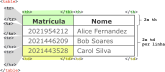 <!-- {.push-right.invert-colors-dark-mode width="400" height="174"} -->
    **`<tr>...</tr>`**, linha da tabela
  - **`<td>...</td>`**, célula de dados
  - `<th>...</th>`, célula do cabeçalho
  - `<caption>...</caption>`, legenda
- [Tabelas na MDN][mdn-table]

[mdn-table]: https://developer.mozilla.org/en-US/docs/Web/HTML/Element/table

---
<!-- {"layout": "centered"} -->
# Hoje veremos

1. [Editores de texto](#editores-de-texto)
1. [Metadados](#metadados) das páginas
1. Elementos [Multimídia](#multimidia)
1. Elementos [DIV e SPAN](#div-e-span)

---
<!-- {"layout": "section-header", "hash": "editores-de-texto"} -->
# Editores de texto
## Ferramentas para edição e melhoria da produtividade

- Editores de texto
- Atalhos e facilidades
<!-- {ul:.content} -->

---
## Como ser mais **produtivo**

- Na hora de escrever código HTML, CSS e JavaScript, queremos ter:
  - **Destacamento (_highlighting_) de código fonte**
  - **Indentação** automática
  - 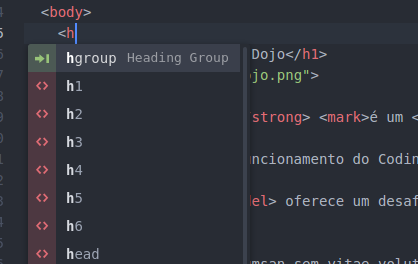 <!-- {.push-right} -->
    **Auto-completar** tags HTML, propriedades CSS etc.
- Editores indicados:
  - [VSCode][vscode] (gratuito 🌟)
  - [Atom][atom] (gratuito)
  - [Sublime Text 3][sublime] (pago, faz vista grossa com quem não paga)

[atom]: https://atom.io/
[sublime]: https://www.sublimetext.com/3
[vscode]: https://code.visualstudio.com/

---
<!-- {"layout": "2-column-content"} -->
## Sugestão do professor: **VS Code** 🌟

- Benefícios: <!-- {ul:.no-padding} --> <!-- {li:style="list-style-type: none"} -->
  - **Gratuito**
  - Altamente **personalizável**
  - **Atalhos** úteis
- **Atenção:** os atalhos e sugestões no VS Code só irão **funcionar após salvar**
  o arquivo como `.html` <!-- {li:.note.warning style="margin-top: 1em"} -->

[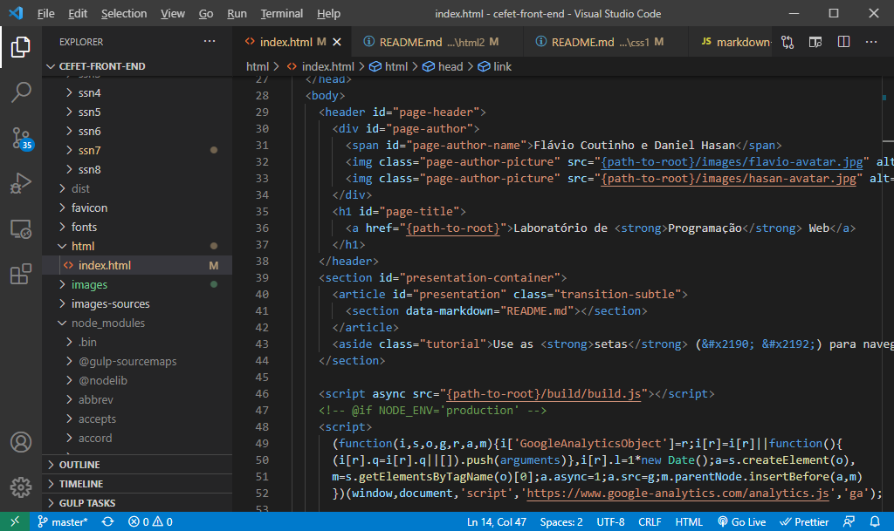](https://code.visualstudio.com/) <!-- {style="max-width: 540px; margin-top: 1.5em;"} -->

---
<!-- {"layout": "2-column-content"} -->
## Abrindo uma pasta inteira

<video src="https://fegemo.github.io/cefet-front-end-large-assets/videos/vscode-opening-project.mp4" width="100%" controls></video>

- Evite "Open File" (1 arquivo só), abra uma pasta inteira (**"Open Folder"**)
  - Deixa claro quais arquivos compõe a página/site
- Salve o arquivo (ex, `.html`) para ter coloração de sintaxe
- Mantenha a indentação. Se precisar corrigir:
  1. <kbd>Ctrl</kbd>+<kbd>Shift</kbd>+<kbd>P</kbd> (guia de comandos)
  1. _Format Document_

---
<!-- {"layout": "2-column-content"} -->
## Digitando sem erros

- Solicite do editor o **esqueleto básico** de uma página HTML
  - Digite a palavra "html" e pressione <kbd>Tab ↔️</kbd>
- Evite usar as teclas <kbd>&lt;</kbd> e <kbd>&gt;</kbd>
  - Digite apenas o nome da _tag_, depois <kbd>Tab ↔️</kbd>
  - Assim você fica muito mais rápido
- Use os atalhos sugeridos
  - Algumas _tags_ já vêem com atributos básicos (ex, ``)

<video src="https://fegemo.github.io/cefet-front-end-large-assets/videos/vscode-autocomplete.mp4" width="100%" controls></video>

---
<!-- {"layout": "2-column-content"} -->
## Atualização automática ao salvar

<video src="https://fegemo.github.io/cefet-front-end-large-assets/videos/vscode-auto-reload.mp4" width="100%" controls></video>

- Instale uma extensão (_plugin_ ou _add-on_) para **atualizar automaticamente o navegador** sempre que salvar um arquivo
  
  VS Code <!-- {dl:.width-30} -->
  ~ Live Server ([link][live-server])

  Atom
  ~ Atom Live Server ([link][atom-live-server])
- Efeito colateral: estará acessando o site usando um **servidor web**

[live-server]: https://marketplace.visualstudio.com/items?itemName=ritwickdey.LiveServer
[atom-live-server]: https://atom.io/packages/atom-live-server

---
<!-- {"layout": "section-header", "hash": "metadados"} -->
# Metadados
## Informação sobre a página

- Tag `<meta>`
- Dados estruturados
- Codificação do arquivo
- Versão do HTML
<!-- {ul:.content} -->

---
# Meta _tags_

```html
<html>
  <head>
    <meta charset="utf-8">
    <title>Aprendendo sobre as meta tags</title>
    <meta name="author" content="Flávio">
    <meta name="description" content="Textão explicativo">
    <meta name="keywords" content="web,css,html,js">
    ⋮
  </head>
```

- As _tags_ meta são elementos _void_ (não fecham)
- Referência na [MDN](https://developer.mozilla.org/en-US/docs/Web/HTML/Element/meta)

---
<!-- {"layout": "2-column-content", "backdrop": "old-paper", "classes": "compact-code-more"} -->
## Meta _tag_: **keywords** e **description**

- <!-- {ul:.no-bullets.no-padding} -->
  ```html
  <meta name="keywords" content="...">
  ``` 
  - Palavras-chave da página
  - Limite de ~150 caracteres
  - Separadas por vírgula, geralmente minúsculas
    ```html
    <meta name="keywords" 
        content="livro,games,celular,ipad">
    ```
    - Trecho de submarino.com.br

1. <!-- {ol:.no-bullets.no-padding} -->
   ```html
   <meta name="description" content="...">
   ```
   - Sumário do conteúdo da página
   - Navegador pode usar como a descrição da página quando
     adicionada aos favoritos
     ```html
     <meta name="description" 
         content="Meet the global face of [...]">
     ```
     - Trecho de ign.com

---
## Meta _tags_: **author** e **robots**

- `author`: nome dos autores da página
  - Exemplo:
    ```html
    <meta name="author" content="Flávio Coutinho">
    ```
- `robots`: indicar a motores de busca (e.g., Google) se eles devem indexar
  a página ou não
  - Exemplo:
    ```html
    <meta name="robots" content="index,follow">
    ```
  - A forma mais recente é usar um arquivo
    [/robots.txt com descrições](http://www.robotstxt.org/orig.html)

---
<!-- {"backdrop": "old-paper"} -->
## Meta _tag_: **refresh**

- Formato:
  ```html
  <meta name="refresh" content="X Y">
  ```
- Faz um redirecionamento dentro de X segundos para o endereço Y
- Exemplo:
  ```html
  <meta name="refresh" content="5 ;url=http://www.pudim.com.br/">
  ```

---
## Meta _tag_: **viewport**

- Sugere ao navegador qual o tamanho inicial da _viewport_ (área visível) da página
- Usado especialmente por navegadores de dispositivos móveis
- Exemplo:
  ```html
  <meta name="viewport" content="width=device-width, initial-scale=1">
  ```
  - [Referência completa na W3C](http://dev.w3.org/csswg/css-device-adapt/#viewport-meta)

---
<!-- {"layout": "2-column-content"} -->
## Meta _tag_: **theme-color** e **color-scheme**

1. <!-- {ol:.no-padding.no-bullets} -->
   - Sugere cor predominante
   - Navegadores mobile podem colorir o entorno
     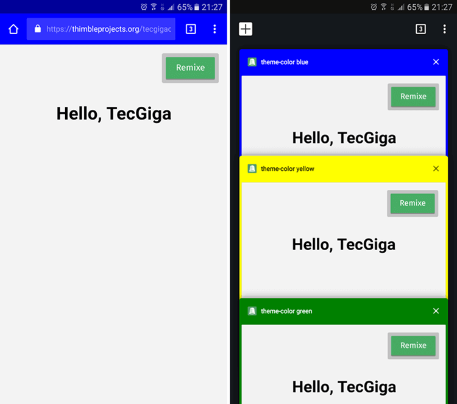 <!-- {.large-width.bordered.rounded} -->

- <!-- {ul:.no-padding.no-bullets} -->
  ```html
  <meta name="color-scheme" content="...">
  ```
  - Define modos de cores existentes: _light_ e/ou _dark_
  - Exemplos:
    ```html
    <meta name="color-scheme" 
            content="light dark">
    <meta name="color-scheme" 
            content="only light">
    ```

---
<!-- {"layout": "2-column-content", "classes": "compact-code-more", "slideStyles": {"grid-template-rows": "auto auto 1fr"}} -->
## Compartilhamento em mídias sociais

- Para que meios de compartilhamento consigam gerar _cards_: <!-- {ul:.span-columns} -->

1. <!-- {ol:.no-padding.no-margin.no-bullets} -->
   ::: figure
   ```html
   <meta property="twitter:card" content="summary">
   <meta property="twitter:title" 
         content="Programação Web">
   <meta property="twitter:description"
         content="Slides...">
   <meta property="twitter:image" 
         content="https://site.com/capa-1x1.webp">
   <meta property="twitter:image:alt"
         content="Capa dos slides...">
   ```
   <figcaption>Twitter</figcaption>
   :::
    <!-- {.large-width.bordered.rounded} -->

- ::: figure
  ```html
  <meta property="og:type" content="website">
  <meta property="og:title" content="Programação Web">
  <meta property="og:description"
        content="Slides do curso de...">
  <meta property="og:image"
        content="https://site.com/capa-wide.webp">
  <meta property="og:image:width" content="2354">
  <meta property="og:image:height" content="1356">
  <meta property="og:image:alt"
        content="Capa dos slides com os dizeres...">
  <meta property="og:url" 
        content="https://fegemo.github.io/cefet-web/">
  <meta property="og:local" content="pt_BR">
  ```
  <figcaption>Facebook et al.</figcaption>
  :::
  - Para gerar: [metatags.io][metatags.io] <!-- {target="_blank"} -->
    <!-- {ul^1:.bulleted.no-bullets.no-padding.no-margin} -->

[metatags.io]: https://metatags.io

---
<!-- {"layout": "2-column-content", "classes": "compact-code-more"} -->
## _Rich Snippets_ em buscadores <small>(<a href="https://www.bloomingdales.com/shop/product/chloe-faye-small-leather-shoulder-bag?ID=1273751" target="_blank">visitar exemplo</a>)</small>

```html
<script type="application/ld+json">
{
  "@context": "http://schema.org",
  "@type": "Product",
  "name": "Faye Small Leather Shoulder Bag",
  "category": "Handbags",
  "brand": {
      "@type": "Brand", "name": "Chloé"
  },
  "image": "https://images.bloomingdalesassets...",
  "productID": "1273751",
  "url": "https://www.bloomingdales.com/shop/...",
  "description": "Shop Faye Small Leather...",
  "offers": [
    {
      "@type": "Offer",
      "itemOffered": {
        "@type": "Product",
        "color": "Black/Gold/Silver"
      },
      "price": "1450.00", "priceCurrency": "USD",
      "url": "https://www.bloomingdales.com/...",
      "availability": "http://schema.org/InStock"
    }
  ],
```

- ```js
    "aggregateRating": {
      "@type": "AggregateRating",
      "ratingValue": 3.5, "reviewCount": 4,
      "bestRating": 5, "worstRating": 0
    },
    "review": [{
      "@type": "Review",
      "description": "This bag is gorgeous...",
      "name": "Gorg!",
      "reviewRating": {
        "@type": "Rating",
        "ratingValue": 5,
        "bestRating": 5, "worstRating": 1
      }
    }]
  }
  </script>
  ```
  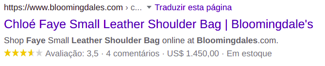 <!-- {.large-width.block.centered.rounded.bordered} -->
  - Google: [_Intro to structured data_][structured-data]
    <!-- {ul^1:.no-bullets.no-padding.no-margin.bulleted} -->
    <!-- {ul^0:.no-padding.no-bullets} -->
    <!-- {a:target="_blank"} -->

[structured-data]: https://developers.google.com/search/docs/guides/intro-structured-data#structured-data

---
## Codificação **Unicode** e UTF-8

- Unicode provê o suporte multilíngua <!-- {ul:.full-width.bulleted-0} -->
  - Diversos alfabetos, não apenas o romano/latino
- **UTF-8** é uma codificação que usa uma sequência de **8 bits** para
  armazenar códigos UNICODE
  - Os 128 primeiros caracteres UTF-8 são idênticos aos ASCII
    - Ou seja, todo o alfabeto, pontuações mais comuns e números
- <!-- {li:.push-code-right.compact-code-more} -->
  ```html
  ...
  <head>
    <meta charset="utf-8">  <!-- USE ESTA META TAG -->
    <title>...</title>
    ...
  ```
  Em HTML, dentro do `<head>` da página, usamos uma `<meta>` _tag_ com
  o atributo `charset` para isso ➡️
  - Essa _tag_ deve aparecer nos primeiros 1024 caracteres da página ([entenda][mdn-charset])

[mdn-charset]: https://developer.mozilla.org/pt-BR/docs/Web/HTML/Element/meta#attr-charset

---
## Codificação em uma página web

- 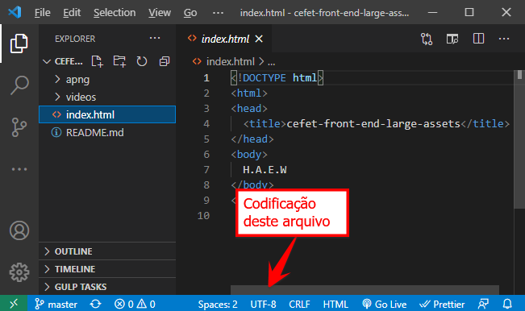 <!-- {.push-right style="max-width: 360px"} -->
  Além do arquivo HTML especificar, o próprio arquivo **deve estar salvo usando UTF-8**. No VS Code ➡️
- Opções de codificação são gerenciadas pela IANA e [podem ser vistas aqui](http://www.iana.org/assignments/character-sets/character-sets.xhtml)


1.  <!-- {.push-left style="max-width: 360px;"} --> <!-- {ol:.no-padding.no-bullets.no-margin} -->
  ⬅️ Caso haja divergência de codificação, alguns caracteres podem não aparecer corretamente

*[IANA]: Internet Assigned Numbers Authority

---
# DOCTYPE - Versão do HTML

- Especifica qual a versão do HTML que estamos usando. Formato: <!-- {ul:.full-width} -->
  ```html
  <!DOCTYPE ... >
  ```
- Deve ser a primeira "_tag_" em um arquivo HTML
  - Não pode haver nem comentários antes: <!-- {li:.two-column-code} -->
    ```html
    <!DOCTYPE html> ✔️
    <html>
    ...
    <!-- um comentário --> ❌
    <!DOCTYPE html>
    <html>
    ```

---
## Valores do DOCTYPE

HTML 4.01
~ ```html
  <!DOCTYPE html PUBLIC "-//W3C//DTD HTML 4.01//EN"
  "http://www.w3.org/TR/html4/strict.dtd">
  ```

XHTML 1.1
~ ```html
  <!DOCTYPE html
    PUBLIC "-//W3C//DTD XHTML 1.1//EN"
    "http://www.w3.org/TR/xhtml11/DTD/xhtml11.dtd">
  ```

HTML5
~ ```html
  <!DOCTYPE html>
  ```

Hoje em dia usamos sempre HTML5 😉 <!-- {.flex-align-center} -->

---
<!-- {"layout": "section-header", "hash": "multimidia"} -->
# Multimídia
## Elementos não-textuais

- Imagem
- Vídeo
- Áudio
<!-- {ul:.content} -->

---
## Imagens

- Há três _tags_ relacionadas a imagens:
  1. **``**
  1. `<figure>`
  1. `<picture>` <!-- {ol:.multi-column-list-3} -->
- A tag `` (mais tradicional e comum) é um **elemento _void_**
  - Ou seja, não tem conteúdo nem tag de fechamento
  - Formato geral:
    ```html
    
    ```
    - [Referência na Mozilla Developer Network][mdn-img]
- Mas que **formatos** <!-- {.underline.upon-activation} --> de imagens podem ser usados?

[mdn-img]: https://developer.mozilla.org/en-US/docs/Web/HTML/Element/img

---
## Imagens: **formato** <small>(1/2)</small>

- Existem vários formatos de imagens suportados por navegadores: <!-- {.bullet} -->

**JPEG** (ou JPG) <!-- {strong:.alternate-color} -->  <!-- {dl:.bulleted} -->
~ bom para **fotos** tiradas do mundo real, que possuem muita variação de cor. Não possui
  transparência

**GIF** <!-- {strong:.alternate-color} -->
~ **transparência** de 1 bit e suporta **animações** de quadros
~ apenas 256 cores na imagem (muito pouco!!)

**PNG** <!-- {strong:.alternate-color} -->
~ **transparência** de 8 bits e suporta **mais cores** que GIF
~ bom formato para imagens com pouca variação de cor

**SVG** <!-- {strong:.alternate-color} -->
~ imagens **vetoriais** que não perdem qualidade se **ampliadas**

**WebP AVIF APNG**
~ recentes, veremos mais adiante

*[JPEG]: Joint Photographic Experts Group
*[GIF]: Graphics Interchange Format
*[PNG]: Portable Network Graphics
*[SVG]: Scalable Vector Graphics
*[WebP]: Web Picture Format
*[AVIF]: AV1 Image File Format
*[APNG]: Animated PNG

---
<!-- {"layout": "2-column-content-zigzag"} -->
## Transparência: PNG _vs_ GIF

**GIF** <!-- {dl:.width-20} -->
~ Um pixel é totalmente transparente ou totalmente opaco

::: figure .no-margin
 <!-- {p:.center-aligned} -->
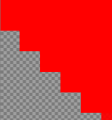
:::

**PNG** <!-- {dl:.width-20} -->
~ Opacidade pode variar entre 0 (transparente) e 255 (opaco), ou
0% e 100%

::: figure .no-margin
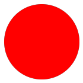 <!-- {p:.center-aligned} -->
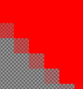
:::

---
<!-- {"layout": "2-column-content-zigzag"} -->
## Imagens **vetoriais** (_e.g._, SVG)

Imagem _bitmap_ (JPG, GIF, PNG) original (pequena) e aumentada
(fica "estourada")

::: figure .no-margin
 <!-- {p:.center-aligned} -->
<!-- {style="width: 100px"} -->
:::

Imagem **vetorial** (SVG) original (pequena) e aumentada (mantém a qualidade)

::: figure .no-margin
 <!-- {p:.center-aligned} -->
<!-- { style="width: 100px"} -->
:::

---
## Imagens: **formato** (2/2)

**APNG**  <!-- {dl:.width-10.full-width style="margin-bottom: 0.5em"} -->
~ Semelhante ao formato PNG, mas com suporte a animações
~ Melhor que PNG e GIF, menos eficiente que AVIF e WebP

**WebP**
~ Melhor que PNG e JPG, suporte a animação (sem rend. progres.)
~ ~26% menor que PNG, ~25-35% menor que JPG ([comparações][comparacoes-webp])

**AVIF**
~ Similar a WebP, mas ainda melhor (~50% menor que JPG)
~ Sem suporte para renderização progressiva

- <!-- {ul:.layout-split-3.no-padding.no-bullets.no-margin} -->
  <div class="caniuse push-right" data-feature="apng"></div> 
- <div class="caniuse push-right" data-feature="webp"></div> 
- <div class="caniuse push-right" data-feature="avif"></div> 

[comparacoes-webp]: https://developers.google.com/speed/webp/gallery1

*[WebP]: Web Picture Format
*[AVIF]: AV1 Image File Format
*[APNG]: Animated PNG

---
<!-- {"layout": "2-column-content", "slideStyles": {"grid-template-columns": "1fr auto", "grid-template-rows": "auto auto 1fr"}, "hash": "elemento-picture"} -->
## Elemento `<picture></picture>` <small>(1/2)</small>

```html
<picture>
  <source srcset="philosoraptor.avif" type="image/avif">
  <source srcset="philosoraptor.webp" type="image/webp">
  
</picture>
```

::: result
<picture>
  <source srcset="../../images/philosoraptor.avif" type="image/avif">
  <source srcset="../../images/philosoraptor.webp" type="image/webp">
  
</picture>
:::

- Um `<picture>` pode conter vários `<source>` e um `` <!-- {ul:.span-columns} -->
  - Cada `<source>` aponta pra uma imagem
  - O caminho da primeira "válida" substitui o `src` da ``
  - Colocamos como `src` da `` uma _fallback_ (carregado em último caso)
- O atributo `srcset="..."` pode conter mais de um caminho indicado <!-- {.compact-code-more} -->
  ```html
  <picture>
    <source srcset="logo-768.png 768w, logo-128.png 128w">
    ...
  ```

---
<!-- {"layout": "tall-figure-right"} -->
## Elemento `<picture></picture>` <small>(2/2)</small>

<div class="caniuse" data-feature="picture"></div>

- O elemento `<picture>` tem alguns casos de uso:
  1. Formatos alternativos de imagem (como vimos)
  1. Poupar banda e acelerar o carregamento
  1. Direção de arte: definir a imagem de acordo com o dispositivo
- Os itens (2) e (3) dependem do uso de _media queries_, que veremos
  em aula futura
  - Veja [imagens responsivas][mdn-responsive-images] na MDN

[mdn-responsive-images]: https://developer.mozilla.org/pt-BR/docs/Learn/HTML/Multimedia_and_embedding/Responsive_images

---
<!-- {"layout": "2-column-content", "classes": "compact-code"} -->
## Elemento `<figure></figure>`

- Um elemento à parte do texto (potencialmente com legenda). Ex: <!-- {ul:.span-columns} -->
  - Um gráfico, diagrama, uma imagem, código com legenda
- Não é recente: tão antigo quanto ``
- A legenda pode ser colocada com `<figcaption></figcaption>`

```html
<figure>
  <figcaption>Filosofia</figcaption>
  
</figure>
<figure>
  <p>Cavei cavei cavei<br>
     Não é um poema<br>
     Mas é profundo.
  </p>
  <figcaption>Ademar</figcaption>
</figure>
```

::: result .layout-split-2 justify-content: space-around;
<figure>
  <figcaption>Filosofia</figcaption>
  
</figure>
<figure>
  <p>Cavei cavei cavei<br>
     Não é um poema<br>
     Mas é profundo.
  </p>
  <figcaption>Ademar</figcaption>
</figure>
:::

---
# Vídeo

- Existem diversos **formatos de arquivo**:
  - WebM (.webm)
  - MP4 (.mp4, .m4v)
  - Ogg (.ogg)
  - AVI (.avi)
  - ASF (.asf) <!-- {ul:.multi-column-list-2} -->
- Nem todo navegador consegue exibir todos os formatos!
  - Às vezes, devemos disponibilizar mais de um formato do vídeo

---
## O elemento `<video></video>`

- Para exibir um vídeo, existe um elemento similar ao de imagem:
  ```html
  <video src="videos/fendadobiquini.mp4"></video>
  ```
- Resultado:

  <video src="../../videos/fendadobiquini.mp4" width="320" height="240" class="push-left" style="margin-right: 2em;"></video>
  - O `<video>` abre e fecha (_i.e._, `</video>`)
  - O elemento `<vídeo>` surgiu no HTML5
  - O que estiver dentro da _tag_ `<video>...</video>` é exibido caso
    o navegador não consiga exibi-lo
  - Por padrão, não há controles para o vídeo

---
## Querida, onde está o controle?

- O atributo `controls` associa um conjunto de controles ao `<video>`
  ```html
  <video src="videos/fendadobiquini.mp4" controls></video>
  ```
- Resultado:

  <video src="../../videos/fendadobiquini.mp4" width="320" height="240" controls class="push-left" style="margin-right: 2em;"></video>
  - Repare que `controls` é um atributo que não requer um valor
    - Isso se chama **atributo booleano**

---
## Opções (atributos) de **video**

`controls`
  ~ mostra um conjunto de controles

`autoplay`
~ começa a executar o vídeo assim que a página carregar

`muted`
~ tira o som

`preload="..."`
~ começa a baixar o vídeo assim que a página carrega
~ `preload="none"`: não pré-carrega
~ `preload="metadata"`: pré-carrega apenas metadados
~ `preload="auto"`: pré-carrega todo o vídeo

`loop="x"`
~ quantas vezes deve ser executado (0 = infinitas)

`poster="http://..."`
~ imagem mostrada antes do vídeo ser executado

`autopictureinpicture` <!-- {style="font-size: 70%"} -->
~ coloca em modo PiP quando muda de aba

- Também há os atributos `width="x"` e `height="y"`

*[PiP]: Picture in picture

---
## Suporte dos navegadores por formato

- Nem todos navegadores suportam **os mesmos formatos de vídeo**
- Assim, usamos uma outra forma do elemento `<video>`: <!-- {ul:.compact-code} -->
  ```html
  <video width="320" height="240" controls>
    <source src="bob-esponja.mp4" type="video/mp4; codecs=avc1.42E01E,mp4a.40.2">
    <source src="bob-esponja.webm" type="video/webm; codecs=vp8,vorbis">
    <source src="bob-esponja.ogv" type="video/ogg; codecs=theora,vorbis">
    Seu navegador não suporta o elemento video.
  </video>
  ```
- O navegador tentará abrir o vídeo `bob-esponja.mp4` (_i.e._, o primeiro)
  - se não conseguir, tentará o arquivo `bob-esponja.webm` (2º)
  - caso ainda não consiga, tentará o `bob-esponja.ogv` (3º)
  - se, mesmo assim, não conseguir, será exibido o texto

---
<!-- {"layout": "3-column-content", "scripts": ["../../scripts/classes/caniuse.min.js"], "slideStyles": {"align-items": "center"}} -->
## Suporte **hoje** (formatos de vídeo)

<div class="caniuse" data-feature="webm"></div>

<div class="caniuse" data-feature="mpeg4"></div>

<div class="caniuse" data-feature="ogv"></div>

---
# Áudio

- `<audio>` funciona **exatamente** da mesma forma que `<video>` <!-- {ul:.full-width.compact-code} -->
  - [Referência na MDN](https://developer.mozilla.org/en-US/docs/Web/HTML/Element/audio)
- Formatos mais comuns: **MP3** <!-- {strong:.alternate-color} --> e
  **OGG**. <!-- {strong:.alternate-color} --> Exemplo:
  <!-- {li:.compact-code-more} -->
  <audio src="../../audios/banjo-kazooie-short.mp3" controls loop="0" class="push-right" style="margin-left: 0.5em; margin-top: 1.25em"></audio>
  ```html
  <audio src="banjo-kazooie.mp3" controls loop="0"></audio>
  ```

1. <!-- {ol:.no-bullets.no-padding.layout-split-2.no-margin} -->
   <div class="caniuse" data-feature="mp3"></div>
1. <div class="caniuse" data-feature="ogg-vorbis" style="margin-left: 1em"></div>

*[MP3]: MPEG-1/2 Audio Layer 3*

---
<!-- {"layout": "section-header", "hash": "div-e-span"} -->
# **div** e **span**
## Agrupando outros elementos HTML

- Agrupando para estilizar
- O elemento `<div>...</div>`
- O elemento `<span>...</span>`
<!-- {ul:.content} -->

---
<!-- {"layout": "2-column-content-zigzag"} -->
# #comofaz?

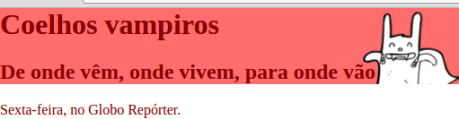 <!-- {.bordered} -->

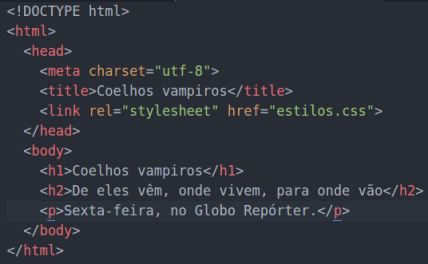 <!-- {.rounded} -->

1. E se quisermos estilizar de forma que o <u>título</u> e
  <u>subtítulo</u> ficassem **com o mesmo fundo**... <!-- {ol:.no-list-icon} -->

- ...a partir do HTML acima?  <!-- {ul:.no-list-icon} -->

---
<!-- {"layout": "2-column-content-zigzag"} -->
# 1ª tentativa

- Basta colocar o mesmo fundo tanto no `<h1>` quanto no `<h2>`!

```css
h1, h2 {
  background: url(coelho.png) #ff6d6d;
  background-repeat: no-repeat;
  background-position: right top;
}
```

- Acontece que, como são elementos diferentes, **cada um tem seu
  próprio fundo**

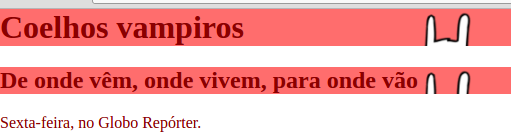 <!-- {.bordered} -->

---
<!-- {"layout": "2-column-content-zigzag"} -->
# O **jeito certo** <!-- {.underline.upon-activation} --><span class="jump upon-activation delay-800">:star2:</span>

- Colocamos os títulos **dentro de outro elemento** e o estilizamos
- Uma `<div>...</div>` pode ser usada para agrupar elementos

```html
<body>
  <div id="topo-da-pagina">  
    <h1>Coelhos Vampiros</h1>
    <h2>De onde vêm, onde...</h2>
  </div>
  <p>Sexta-feira no Globo Repórter</p>
</body>
```

 <!-- {.bordered} -->

```css
#topo-da-pagina {
  background: url(coelho.png) #ff6d6d;
  background-repeat: no-repeat;
  background-position: right top;
}
```

---
## **Div** ([na MDN](https://developer.mozilla.org/en-US/docs/Web/HTML/Element/div))

- `<div></div>` serve para agrupar outros elementos
- Não representa nada por si só (não tem semântica)
  - Um `<p>` é um parágrafo (_i.e._, conteúdo)
  - Uma `` é uma imagem (_i.e._, conteúdo)
  - Uma `<div>` é um agrupamento de elementos
- É um elemento `block`

> É um **mecanismo genérico** que nos permite criar uma estrutura ou agrupamento
> de elementos quando não há outro elemento HTML mais apropriado, e ela pode
> **ser estilizada usando CSS** ou manipulada com JavaScript
> <cite><a href="https://www.w3.org/wiki/Generic_containers_-_the_div_and_span_elements">Containers genéricos</a> na W3C</cite>

---
<!-- {"layout": "2-column-content"} -->
## Div (exemplo)

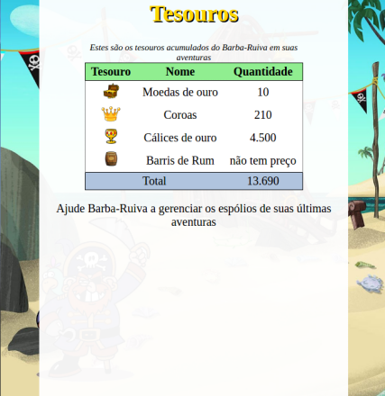 <!-- {.bordered.push-right} -->
- ```html
  <body>
  ➡️ <div id="conteudo">
        <h1>Tesouros</h1>
        <table><!-- ... --></table>
        <p>Ajude Barba-Ruiva ...</p>
  ➡️ </div>
  </body>
  ```
  ```css
  body { background: url(ilha.png) }
  #conteudo {
    background: white;
  }
  ```
  <!-- {ul:.no-list-icon.no-margin} -->

---
## **Span** ([na MDN](https://developer.mozilla.org/en-US/docs/Web/HTML/Element/span))

- `<span></span>` **tem _exatamente_ <!-- {.underline.upon-activation} -->
  a mesma função** que `div`, porém `inline`
  <!-- {.underline.upon-activation.delay-1200} -->

::: figure .figure-slides.no-margin.flex-align-center.invert-colors-dark-mode
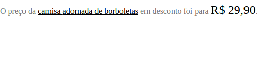 <!-- {.bullet.figure-step.bullet-no-anim} -->
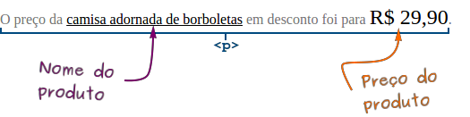 <!-- {.bullet.figure-step.bullet-no-anim} -->
:::

- Como estilizar o nome e o preço do produto? <!-- {ul:.bulleted} -->
  - Se usarmos `<div>`, vai quebrar linha (ele é `block`)
  - Então, usamos o `<span>`, que é `inline`!
    ```html
    O preço da <span id="produto">camisa adornada</span> é
    de <span id="preco">R$ 29,90</span>.
    ```

---
<!-- {"layout": "centered"} -->
# Referências

1. Capítulos 9 (parcial), 10 e 11 (parcial) do livro
1. Mozilla Developer Network (MDN)
