<!-- {"layout": "title"} -->
# **HTML** parte 3
## Ferramentas, Metadados, DIV/SPAN e o Box Model

---
# Na última aula... (1/4)

- _Tags_ de importância: `<strong>`, `<em>`, `<mark>`, `<del>` e `<ins>`
- Listas numeradas (`<ol>`) e não-numeradas (`<ul>`)
- Podemos **criar hiperlinks** com o elemento
  `<a href="caminho-do-recurso">nome</a>`
  - Link interno da página referenciando o `id` do elemento:
    ```html
    <a href="#banda-calypso">Ir para banda Calypso</a>
    ...
    <h2 id="banda-calypso">Calypso</a>
    ```

---
# Na última aula... (2/4)

- Mais sobre **hiperlinks**:
  - Link para email:
    `<a href="mailto:hasan@cefetmg.br">Me mande emails</a>`
  - O atributo `target` para abrir uma página em outra aba
    ```html
    <a href="http://www.pudim.com.br" target="_blank">Site legal</a>
    ```
- Alguns elementos são `inline` e outros são `block`

  **`block`**
  ~ fazem quebra de linha (e.g., `<blockquote>`, `<p>` etc.)
  
  **`inline`** <!-- {.alternate-color} -->
  ~ não fazem quebra de linha (e.g, `<q>`, `<strong>` etc.)

---
<!-- {"embedSVG": "img[src$='.svg']", "embeddedStyles": ".css-rule-anatomy:not(.selector,.declaration.property,.value) .other-rule { opacity: 1 !important; } .css-rule-anatomy.rule .other-rule path { fill: #999 !important; } .css-rule-anatomy.rule .rule,.css-rule-anatomy.selector .selector,.css-rule-anatomy.declaration .declaration,.css-rule-anatomy.property .property,.css-rule-anatomy.value .value { opacity: 1 !important; }"} -->
# Na última aula... (3/4)

-  <!-- {.css-rule-anatomy.rule.declaration.selector.push-right style="width: 300px" data-viewbox="56 0 144 120"} -->
  Formato de uma regra **CSS**
  - **Regra**: conjunto de declarações aplicadas em alguém
  - **Seletor**: a quem se aplica uma regra
  - **Declaração**: um par de &lt;propriedade, valor&gt;
- **Estilizando elementos um a um** utilizando o seu **id** e o seletor
  iniciando com **#**

---
# Na última aula... (4/4)

- Colocação de bordas por meio da propriedade `border`, ou então
  `border-width`, `border-style` e `border-color`
-  <!-- {.push-right} -->
  Para **centralizar imagens**:
  ```css
  img {
    display: block;
    margin-left: auto;
    margin-right: auto;
  }

---
# Na última aula... (5/5)

- Tabelas são criadas com as tags
  - **`<table>...</table>`**, para marcar a tabela
  - `<thead>...</thead>`, cabeçalho, contém linhas
  - `<tbody>...</tbody>`, corpo, contém linhas
  - `<tfoot>...</tfoot>`, rodapé, contém linhas
  - **`<tr>...</tr>`**, linha da tabela
  - **`<td>...</td>`**, célula de dados
  - `<th>...</th>`, célula do cabeçalho
  - `<caption>...</caption>`, legenda
- [Referência na Mozilla Developer Network][mdn-table]

[mdn-table]: https://developer.mozilla.org/en-US/docs/Web/HTML/Element/table

---
<!-- {"layout": "2-column-content-zigzag"} --
# Na última aula... (1/3)

- Vimos a **ferramenta do desenvolvedor** do Google Chrome
  - Usamos para **investigar erros** e **experimentar propriedades**

 <!-- {.push-right.large-width.bordered.rounded} --

 <!-- {.medium-width.centered.block} --

- Podemos enxergar o HTML da página como uma "árvore" de elementos

---
<!-- {"layout": "tall-figure-right"} --
#  <!-- {.portrait.push-right} -- Na última aula... (2/3)

<iframe width="100%" height="300" src="//jsfiddle.net/fegemo/gqgacz36/embedded/result,html,css/" allowfullscreen="allowfullscreen" frameborder="0" class="push-right"></iframe>

- CSS foi criada por Håkon Wium Lie em 1994
- Entendemos o que é **a cascata** no CSS:
  - Algumas **propriedades são herdadas** dos elementos ancestrais (_e.g._,
     cor do texto), outras não (_e.g._, a borda)
---
-->
# Na última aula... (3/3)

- Além de selecionar por _tag_, id ou classe, há diversos **outros seletores**:

descend./filho <!-- {dl:.no-margin} -->
  ~ `p strong`: todo `<strong>` descendente de `<p>` (filho, neto etc.)
  ~ `p > strong`: todo `<strong>` filho direto de `<p>`

atributo
  ~ `img[alt]`: toda `` que tem atributo `alt="..."`
  ~ `a[href$=".html"]`: todo `<a>` apontando para um `.html` etc.

estado do link
  ~ `a:link`, `a:visited`, `a:hover`, `a:active`

negação
  ~ `img:not([alt])`: `` sem o atributo `alt`

---
<!-- {"layout": "centered"} -->
# Hoje veremos

1. [Editores de Texto](#editores-de-texto)
1. [Metadados](#metadados)
1. [`div` e `span`](#div-e-span)
1. [O _Box Model_](#o-box-model)

---
<!-- {"layout": "section-header", "hash": "editores-de-texto"} -->
# Editores de texto
## Ferramentas para edição e melhoria da produtividade

- Editores de texto
- _Hotkeys_
<!-- {ul:.content} -->

---
## Como ser mais **produtivo**

- Na hora de escrever código HTML, CSS e JavaScript, queremos ter:
  - **Destacamento (_highlighting_) de código fonte**
  - **Indentação** automática
  -  <!-- {.push-right} -->
    **Auto-completar** tags HTML, propriedades CSS etc.
- Editores indicados:
  - [VSCode][vscode] (gratuito 🌟)
  - [Atom][atom] (gratuito)
  - [Sublime Text 3][sublime] (pago, faz vista grossa com quem não paga)

[atom]: https://atom.io/
[sublime]: https://www.sublimetext.com/3
[vscode]: https://code.visualstudio.com/

---
<!-- {"layout": "2-column-content"} -->
## Sugestão do professor: **VS Code** 🌟

- Benefícios: <!-- {ul:.no-padding} --> <!-- {li:style="list-style-type: none"} -->
  - **Gratuito**
  - Altamente **personalizável**
  - **Atalhos** úteis
- **Atenção:** os atalhos e sugestões no VS Code só irão **funcionar após salvar**
  o arquivo como `.html` <!-- {li:.note.warning style="margin-top: 1em"} -->

[](https://code.visualstudio.com/) <!-- {style="max-width: 540px; margin-top: 1.5em;"} -->

---
<!-- {"layout": "2-column-content"} -->
## Abrindo uma pasta inteira

<video src="https://fegemo.github.io/cefet-front-end-large-assets/videos/vscode-opening-project.mp4" width="100%" controls></video>

- Evite "Open File" (1 arquivo só), abra uma pasta inteira (**"Open Folder"**)
  - Deixa claro quais arquivos compõe a página/site
- Salve o arquivo (ex, `.html`) para ter coloração de sintaxe
- Mantenha a indentação. Se precisar corrigir:
  1. <kbd>Ctrl</kbd>+<kbd>Shift</kbd>+<kbd>P</kbd> (guia de comandos)
  1. _Format Document_

---
<!-- {"layout": "2-column-content"} -->
## Digitando sem erros

- Solicite do editor o **esqueleto básico** de uma página HTML
  - Digite a palavra "html" e pressione <kbd>Tab ↔️</kbd>
- Evite usar as teclas <kbd>&lt;</kbd> e <kbd>&gt;</kbd>
  - Digite apenas o nome da _tag_, depois <kbd>Tab ↔️</kbd>
  - Assim você fica muito mais rápido
- Use os atalhos sugeridos
  - Algumas _tags_ já vêem com atributos básicos (ex, ``)

<video src="https://fegemo.github.io/cefet-front-end-large-assets/videos/vscode-autocomplete.mp4" width="100%" controls></video>

---
<!-- {"layout": "2-column-content"} -->
## Atualização automática ao salvar

<video src="https://fegemo.github.io/cefet-front-end-large-assets/videos/vscode-auto-reload.mp4" width="100%" controls></video>

- Instale uma extensão (_plugin_ ou _add-on_) para **atualizar automaticamente o navegador** sempre que salvar um arquivo
  
  VS Code <!-- {dl:.width-30} -->
  ~ Live Server ([link][live-server])

  Atom
  ~ Atom Live Server ([link][atom-live-server])
- Efeito colateral: estará acessando o site usando um **servidor web**

[live-server]: https://marketplace.visualstudio.com/items?itemName=ritwickdey.LiveServer
[atom-live-server]: https://atom.io/packages/atom-live-server

---
<!-- {"layout": "section-header", "hash": "metadados"} -->
# Metadados
## Informação sobre a página

- Tag `<meta>`
- Codificação do arquivo
- Versão do HTML
<!-- {ul:.content} -->

---
# Meta _tags_

```html
<html>
  <head>
    <meta charset="utf-8">
    <title>Aprendendo sobre as meta tags</title>
    <meta name="author" content="Flávio">
    <meta name="description" content="Textão explicativo">
    <meta name="keywords" content="web,css,html,js">
    ⋮
  </head>
```

- As _tags_ meta são elementos _void_ (não fecham)
- Referência na [MDN](https://developer.mozilla.org/en-US/docs/Web/HTML/Element/meta)

---
<!-- {"layout": "2-column-content", "backdrop": "old-paper", "classes": "compact-code-more"} -->
## Meta _tag_: **keywords** e **description**

- <!-- {ul:.no-bullets.no-padding} -->
  ```html
  <meta name="keywords" content="...">
  ``` 
  - Palavras-chave da página
  - Limite de ~150 caracteres
  - Separadas por vírgula, geralmente minúsculas
    ```html
    <meta name="keywords" 
        content="livro,games,celular,ipad">
    ```
    - Trecho de submarino.com.br

1. <!-- {ol:.no-bullets.no-padding} -->
   ```html
   <meta name="description" content="...">
   ```
   - Sumário do conteúdo da página
   - Navegador pode usar como a descrição da página quando
     adicionada aos favoritos
     ```html
     <meta name="description" 
         content="Meet the global face of [...]">
     ```
     - Trecho de ign.com

---
## Meta _tags_: **author** e **robots**

- `author`: nome dos autores da página
  - Exemplo:
    ```html
    <meta name="author" content="Flávio Coutinho">
    ```
- `robots`: indicar a motores de busca (e.g., Google) se eles devem indexar
  a página ou não
  - Exemplo:
    ```html
    <meta name="robots" content="index,follow">
    ```
  - A forma mais recente é usar um arquivo
    [/robots.txt com descrições](http://www.robotstxt.org/orig.html)

---
<!-- {"backdrop": "old-paper"} -->
## Meta _tag_: **refresh**

- Formato:
  ```html
  <meta name="refresh" content="X Y">
  ```
- Faz um redirecionamento dentro de X segundos para o endereço Y
- Exemplo:
  ```html
  <meta name="refresh" content="5 ;url=http://www.pudim.com.br/">
  ```

---
## Meta _tag_: **viewport**

- Sugere ao navegador qual o tamanho inicial da _viewport_ (área visível) da página
- Usado especialmente por navegadores de dispositivos móveis
- Exemplo:
  ```html
  <meta name="viewport" content="width=device-width, initial-scale=1">
  ```
  - [Referência completa na W3C](http://dev.w3.org/csswg/css-device-adapt/#viewport-meta)

---
<!-- {"layout": "2-column-content"} -->
## Meta _tag_: **theme-color** e **color-scheme**

1. <!-- {ol:.no-padding.no-bullets} -->
   - Sugere cor predominante
   - Navegadores mobile podem colorir o entorno
      <!-- {.large-width.bordered.rounded} -->

- <!-- {ul:.no-padding.no-bullets} -->
  ```html
  <meta name="color-scheme" content="...">
  ```
  - Define modos de cores existentes: _light_ e/ou _dark_
  - Exemplos:
    ```html
    <meta name="color-scheme" 
            content="light dark">
    <meta name="color-scheme" 
            content="only light">
    ```

---
## Codificação **Unicode** e UTF-8

- Unicode provê o suporte multilíngua <!-- {ul:.full-width.bulleted-0} -->
  - Diversos alfabetos, não apenas o romano/latino
- **UTF-8** é uma codificação que usa uma sequência de **8 bits** para
  armazenar códigos UNICODE
  - Os 128 primeiros caracteres UTF-8 são idênticos aos ASCII
    - Ou seja, todo o alfabeto, pontuações mais comuns e números
- <!-- {li:.push-code-right.compact-code-more} -->
  ```html
  ...
  <head>
    <meta charset="utf-8">  <!-- USE ESTA META TAG -->
    <title>...</title>
    ...
  ```
  Em HTML, dentro do `<head>` da página, usamos uma `<meta>` _tag_ com
  o atributo `charset` para isso ➡️
  - Essa _tag_ deve aparecer nos primeiros 1024 caracteres da página ([entenda][mdn-charset])

[mdn-charset]: https://developer.mozilla.org/pt-BR/docs/Web/HTML/Element/meta#attr-charset

---
## Codificação em uma página web

-  <!-- {.push-right style="max-width: 360px"} -->
  Além do arquivo HTML especificar, o próprio arquivo **deve estar salvo usando UTF-8**. No VS Code ➡️
- Opções de codificação são gerenciadas pela IANA e [podem ser vistas aqui](http://www.iana.org/assignments/character-sets/character-sets.xhtml)


1.  <!-- {.push-left style="max-width: 360px;"} --> <!-- {ol:.no-padding.no-bullets.no-margin} -->
  ⬅️ Caso haja divergência de codificação, alguns caracteres podem não aparecer corretamente

*[IANA]: Internet Assigned Numbers Authority

---
# DOCTYPE - Versão do HTML

- Especifica qual a versão do HTML que estamos usando. Formato: <!-- {ul:.full-width} -->
  ```html
  <!DOCTYPE ... >
  ```
- Deve ser a primeira "_tag_" em um arquivo HTML
  - Não pode haver nem comentários antes: <!-- {li:.two-column-code} -->
    ```html
    <!DOCTYPE html> ✔️
    <html>
    ...
    <!-- um comentário --> ❌
    <!DOCTYPE html>
    <html>
    ```

---
## Valores do DOCTYPE

HTML 4.01
~ ```html
  <!DOCTYPE html PUBLIC "-//W3C//DTD HTML 4.01//EN"
  "http://www.w3.org/TR/html4/strict.dtd">
  ```

XHTML 1.1
~ ```html
  <!DOCTYPE html
    PUBLIC "-//W3C//DTD XHTML 1.1//EN"
    "http://www.w3.org/TR/xhtml11/DTD/xhtml11.dtd">
  ```

HTML5
~ ```html
  <!DOCTYPE html>
  ```

Hoje em dia usamos sempre HTML5 😉 <!-- {.flex-align-center} -->

---
<!-- {"layout": "section-header", "hash": "div-e-span"} -->
# **div** e **span**
## Agrupando outros elementos HTML

- Agrupando para estilizar
- O elemento `<div>...</div>`
- O elemento `<span>...</span>`
<!-- {ul:.content} -->

---
<!-- {"layout": "2-column-content-zigzag"} -->
# #comofaz?

 <!-- {.bordered} -->

 <!-- {.rounded} -->

1. E se quisermos estilizar de forma que o <u>título</u> e
  <u>subtítulo</u> ficassem **com o mesmo fundo**... <!-- {ol:.no-list-icon} -->

- ...a partir do HTML acima?  <!-- {ul:.no-list-icon} -->

---
<!-- {"layout": "2-column-content-zigzag"} -->
# 1ª tentativa

- Basta colocar o mesmo fundo tanto no `<h1>` quanto no `<h2>`!

```css
h1, h2 {
  background: url(coelho.png) #ff6d6d;
  background-repeat: no-repeat;
  background-position: right top;
}
```

- Acontece que, como são elementos diferentes, **cada um tem seu
  próprio fundo**

 <!-- {.bordered} -->

---
<!-- {"layout": "2-column-content-zigzag"} -->
# O **jeito certo** <!-- {.underline.upon-activation} --><span class="jump upon-activation delay-800">:star2:</span>

- Colocamos os títulos **dentro de outro elemento** e o estilizamos
- Uma `<div>...</div>` pode ser usada para agrupar elementos

```html
<body>
  <div id="topo-da-pagina">  
    <h1>Coelhos Vampiros</h1>
    <h2>De onde vêm, onde...</h2>
  </div>
  <p>Sexta-feira no Globo Repórter</p>
</body>
```

 <!-- {.bordered} -->

```css
#topo-da-pagina {
  background: url(coelho.png) #ff6d6d;
  background-repeat: no-repeat;
  background-position: right top;
}
```

---
## **Div** ([na MDN](https://developer.mozilla.org/en-US/docs/Web/HTML/Element/div))

- `<div></div>` serve para agrupar outros elementos
- Não representa nada por si só (não tem semântica)
  - Um `<p>` é um parágrafo (_i.e._, conteúdo)
  - Uma `` é uma imagem (_i.e._, conteúdo)
  - Uma `<div>` é um agrupamento de elementos
- É um elemento `block`

> É um **mecanismo genérico** que nos permite criar uma estrutura ou agrupamento
> de elementos quando não há outro elemento HTML mais apropriado, e ela pode
> **ser estilizada usando CSS** ou manipulada com JavaScript
> <cite><a href="https://www.w3.org/wiki/Generic_containers_-_the_div_and_span_elements">Containers genéricos</a> na W3C</cite>

---
<!-- {"layout": "2-column-content"} -->
## Div (exemplo)

 <!-- {.bordered.push-right} -->
- ```html
  <body>
  ➡️ <div id="conteudo">
        <h1>Tesouros</h1>
        <table><!-- ... --></table>
        <p>Ajude Barba-Ruiva ...</p>
  ➡️ </div>
  </body>
  ```
  ```css
  body { background: url(ilha.png) }
  #conteudo {
    background: white;
  }
  ```
  <!-- {ul:.no-list-icon.no-margin} -->

---
## **Span** ([na MDN](https://developer.mozilla.org/en-US/docs/Web/HTML/Element/span))

- `<span></span>` **tem _exatamente_ <!-- {.underline.upon-activation} -->
  a mesma função** que `div`, porém `inline`
  <!-- {.underline.upon-activation.delay-1200} -->

::: figure .figure-slides.no-margin.flex-align-center.invert-colors-dark-mode
 <!-- {.bullet.figure-step.bullet-no-anim} -->
 <!-- {.bullet.figure-step.bullet-no-anim} -->
:::

- Como estilizar o nome e o preço do produto? <!-- {ul:.bulleted} -->
  - Se usarmos `<div>`, vai quebrar linha (ele é `block`)
  - Então, usamos o `<span>`, que é `inline`!
    ```html
    O preço da <span class="produto">camisa adornada</span> é
    de <span class="preco">R$ 29,90</span>.
    ```

---
<!-- {"layout": "section-header", "hash": "o-box-model"} -->
# O _Box Model_
## Como os elementos são "vistos" pelo navegador

- Componentes da caixa
- `width` e `height`
- Alterando o _box-model_
<!-- {ul:.content} -->

---
<!-- {"embeddedStyles": ".box-model-part {color: #333; border-radius: 4px; font-style: normal; padding: 1px 3px; } .box-model-part code { background: initial; }"} -->
## _Box Model_ ([na MDN](https://developer.mozilla.org/en-US/docs/Web/CSS/box_model))

-  <!-- {.push-right} -->
  O navegador enxerga todo elemento de conteúdo como uma "caixa"
- A "caixa" é formada por:
  - Espaço do _conteúdo_ <!-- {.box-model-part style="background: #8bb4c0;"} -->
  - Espaço de _preenchimento (`padding`)_ <!-- {em:.box-model-part style="background: #c2ce89;"} -->
  - Bordas _(`border`)_ <!-- {em:.box-model-part style="background: #fddc9a;"} -->
  - Espaço _externo (`margin`)_ <!-- {em:.box-model-part style="background: #f9cc9d;"} -->

<!-- {ul^1:style="margin-bottom: 0;"} -->

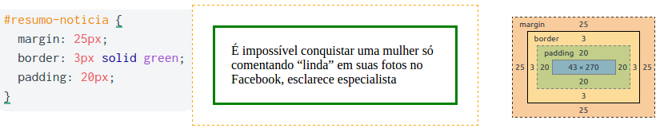 <!-- {p:.flex-align-center.no-margin.invert-colors-dark-mode} -->

---
<!-- {"layout": "centered-horizontal"} -->
## Visualizando a caixa de um elemento

<video src="https://fegemo.github.io/cefet-front-end/videos/tools-box-model.mp4" height="440" controls onloadstart="this.volume=0.1"></video>

---
## _Box Model_: **largura** e **altura**

- Quando definimos a **largura** (`width`) ou **altura** (`height`) de
  um elemento, estamos definindo o tamanho
  do _conteúdo da caixa_, <!-- {em:.box-model-part style="background: #8bb4c0;"} -->
  e não da caixa inteira

::: figure .figure-slides.flex-align-center.clean.invert-colors-dark-mode
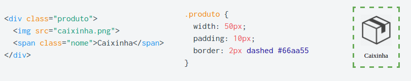<!-- {.bullet.figure-step.bullet-no-anim.rounded.bordered} -->
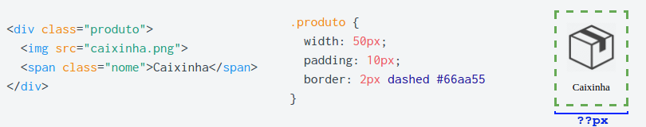<!-- {.bullet.figure-step.bullet-no-anim.rounded.bordered} -->
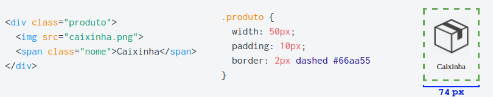<!-- {.bullet.figure-step.bullet-no-anim.rounded.bordered} -->
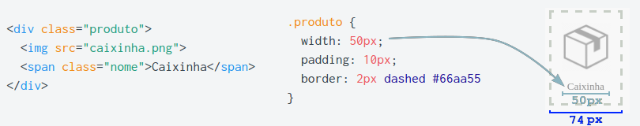<!-- {.bullet.figure-step.bullet-no-anim.rounded.bordered} -->
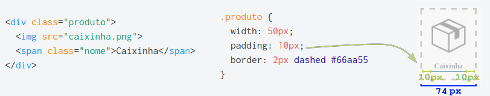<!-- {.bullet.figure-step.bullet-no-anim.rounded.bordered} -->
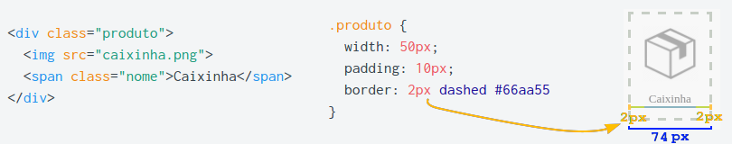<!-- {.bullet.figure-step.bullet-no-anim.rounded.bordered} -->
:::

---
<!-- {"layout": "tall-figure-right"} -->
## **Dimensionando** um elemento

::: did-you-know .push-right width: 320px; margin-right: 6px;
Elementos `inline` ignoram os valores de:
- `width`, `height`
- `margin-top`
- `margin-bottom`
:::

- Se sabemos a dimensão total de um elemento, que também contém
  `padding` e/ou `border`, como calcular seus (`width`, `height`)?
  ::: figure .figure-slides.push-right.invert-colors-dark-mode
  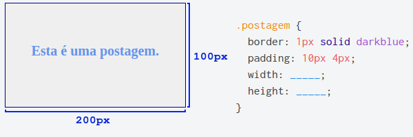<!-- {.bullet.figure-step.bullet-no-anim.rounded} -->
  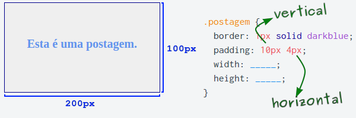<!-- {.bullet.figure-step.bullet-no-anim.rounded} -->
  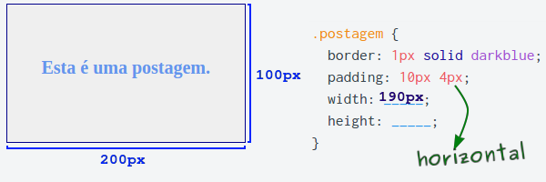<!-- {.bullet.figure-step.bullet-no-anim.rounded} -->
  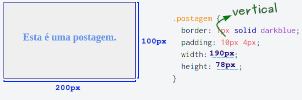<!-- {.bullet.figure-step.bullet-no-anim.rounded} -->
  :::
- Contudo, fazer essa conta "nós mesmos" pode resultar em erros... <!-- {li:.bullet} -->
  - É possível mudar isso!

---
<!-- {"layout": "2-column-content", "slideStyles": {"grid-template-columns": "1fr auto"}, "embeddedStyles": ".max-width img{max-width:100%;}"} -->
## Alterando o _box model_

- É possível alterar o significado da `width` e `height` de um elemento <!-- {ul:.no-bullets.no-padding} -->
   **usando _a propriedade `box-sizing`_** <!-- {em:.underline.upon-activation.delay-3000} -->:
  - `box-sizing: content-box` (valor padrão)
    - `width` = largura do _conteúdo_ <!-- {.box-model-part style="background: #8bb4c0;"} -->
  - `box-sizing: border-box`
    - `width` = _conteúdo_ <!-- {.box-model-part style="background: #8bb4c0;"} --> +
      _padding_ <!-- {.box-model-part style="background: #c2ce89;"} --> +
      _border_ <!-- {.box-model-part style="background: #fddc9a;"} -->
    - Esta forma é mais intuitiva :thumbsup: :thumbsup: :thumbsup: <!-- {ul^2:style="margin-bottom: 0.25em"} -->

::: did-you-know .push-right width: 284px; margin-left: 6px; padding-right: 0.5em
As **margens** do elemento formam um **espaçamento externo** e não usam
espaço dentro da caixa.
:::

::: figure .clean.span-columns.figure-slides.max-width.centered.invert-colors-dark-mode margin:0 auto; width: calc(100% - 290px); clear: both;
<!-- {.bullet.figure-step.bullet-no-anim.rounded.bordered} -->
<!-- {.bullet.figure-step.bullet-no-anim.rounded.bordered} -->
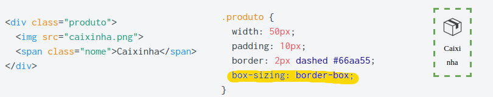<!-- {.bullet.figure-step.bullet-no-anim.rounded.bordered} -->
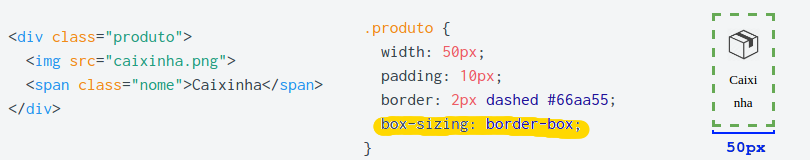<!-- {.bullet.figure-step.bullet-no-anim.rounded.bordered} -->
:::

