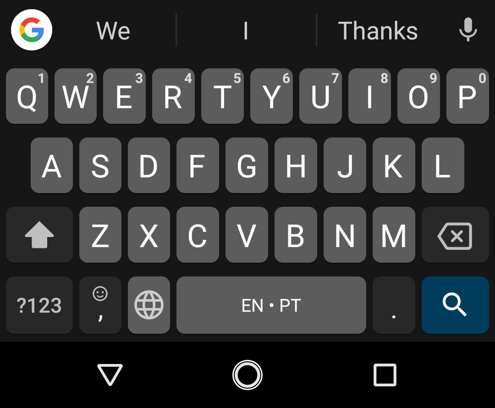
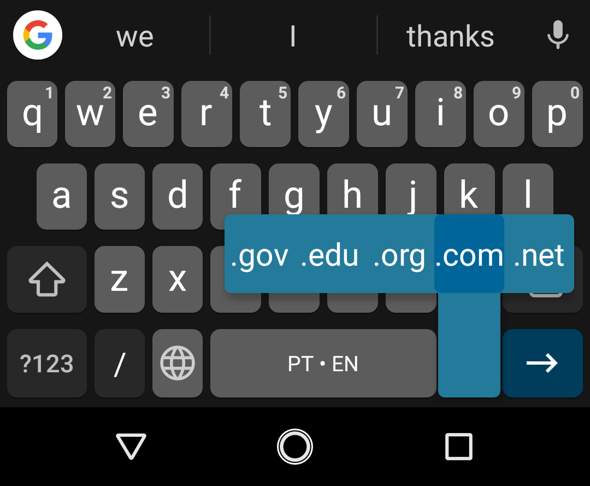
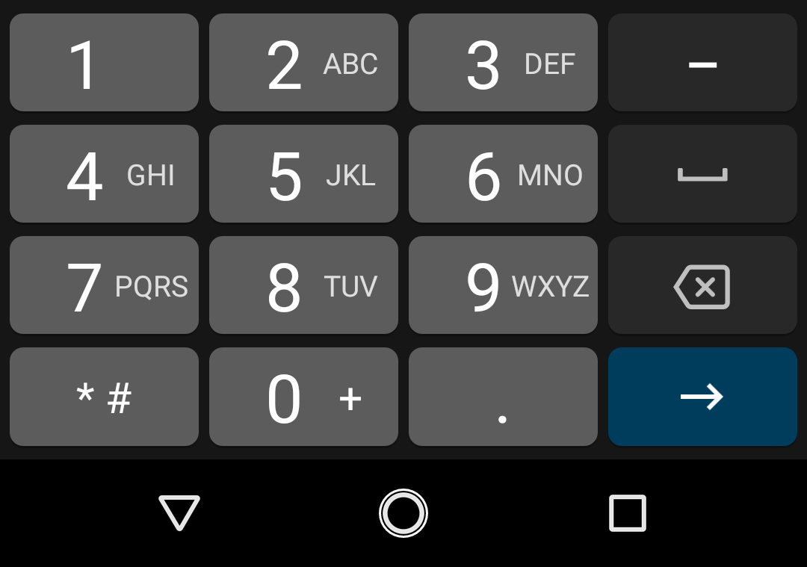
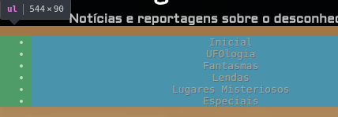

<!-- {"layout": "title"} -->
# **HTML** parte 4
## _Tags_ semânticas, pseudocoisas,<br>elementos de entrada e Assombrações 👻

---
<!-- {"layout": "centered"} -->
# Roteiro

1. Divitite e as [_tags_ semânticas](#tags-semanticas)
1. [Pseudo-elements e pseudo-classes](#pseudo-classes-e-pseudo-elements)
1. [Elementos de entrada e botões](#elementos-de-entrada-e-botoes)
1. Atividade: [Assombrações 👻](#assombracoes)

---
<!-- {"layout": "section-header", "hash": "tags-semanticas"} -->
# _Tags_ Semânticas
## Curando a divitite

Motivação
  ~ SEO e Acessibilidade na Web

Doença
  ~ a **divitite**

Cura
  ~ **_tags_ semânticas**
<!-- {dl:.content} -->

---
# SEO e Acessibilidade na Web

SEO
  ~ Sigla para _Search Engine Optimization_, ou Otimização para Motores de Busca
  ~ É um conjunto de técnicas para **aumentar a possibilidade de um site
    aparecer no topo** dos resultados do **Google** (e outros motores de busca)

Acessibilidade
  ~ Possibilidade de uma pessoa consumir conteúdo das páginas web independente
    de condições físicas
  ~ Pessoas cegas usam um programa especial (o **"leitor de tela"**) que **lê o
    código HTML em voz alta** para elas

*[SEO]: Search Engine Optimization*

---
<!-- {"backdrop": "divitite"} -->

---
## Divitite

- Sintomas
  - Um acúmulo grande de elementos `div` e `span` aninhados
- Muitas páginas Web usam `div`/`span` da seguinte forma:
  ```html
  <div id="header">...</div>
  <div id="footer">...</div>
  <div class="article">...</div>
  <span class="time">...</div>
  <div id="navigation">...</div>
  ```


---
## A cura da Divitite: **_tags_ semânticas**

- O dr. HTML5  <!-- {.emoji} -->
  propôs elementos idênticos às `divs`/`spans`, mas que **possuem
  sentido para o navegador**. Por exemplo:
  ```html
  <header></header>   <!-- em vez de <div id="header"></div> -->
  <footer></footer>   <!-- em vez de <div id="footer"></div> -->
  <article></article> <!-- em vez de <div id="article"></div> -->
  <time></time>       <!-- em vez de <span id="time"></span> -->
  <nav></nav>         <!-- em vez de <div id="navigation"></div> -->
  ```

---
<!-- {"hash": "elementos-semanticos"} -->
## Elementos semânticos <small>(1/3)</small>

- [`<main></main>`](http://www.w3.org/wiki/HTML/Elements/main) `(block)`
  - Conteúdo principal da página
- [`<header></header>`](http://www.w3.org/wiki/HTML/Elements/header) `(block)`
  - Cabeçalho da página ou de seções (`section`) ou artigos (`article`)
- [`<footer></footer>`](http://www.w3.org/wiki/HTML/Elements/footer) `(block)`
  - Análogo ao `header`, porém recomendado para que contenha informação típica
    de um rodapé de página
- [`<article></article>`](http://www.w3.org/wiki/HTML/Elements/article)
  `(block)`
  - Um componente "completo" (ou auto-contido) da página
    - Em um blog, seria um _post_
    - Em uma loja, seria um produto

---
## Elementos semânticos <small>(2/3)</small>

- [`<section></section>`](http://www.w3.org/wiki/HTML/Elements/sectionhtml)
  `(block)`
  - Uma seção lógica da página, tipicamente contendo um título
- [`<nav></nav>`](http://www.w3.org/wiki/HTML/Elements/nav) `(block)`
  - Uma seção da página que contenha _links_ de navegação
  - Exemplos:
    - O menu principal da página
    - Tabela de conteúdo (TOC) com
      _links_ internos

*[TOC]: Table of Contents*

---
## Elementos semânticos <small>(3/3)</small>

- [`<aside></aside>`](http://www.w3.org/wiki/HTML/Elements/aside) `(block)`
  - Uma seção de conteúdo periférico na página
  - Exemplos:
    - Barras laterais
    - _Widgets_ periféricos
    - Conteúdo à parte do principal
- [`<time></time>`](http://www.w3.org/wiki/HTML/Elements/time) `(inline)`
  - Representa uma data e/ou horário
- [`<mark></mark>`](http://www.w3.org/wiki/HTML/Elements/mark) `(inline)`
  - Representa uma marcação no texto
    (tipo <mark style="background-color: yellow">caneta marcadora</mark>)

---
## Exemplo de uso - Elementos semânticos

  <iframe width="98%" height="600" src="//jsfiddle.net/fegemo/oy82x4tu/embedded/result,html,css/" allowfullscreen="allowfullscreen" frameborder="0" class="rounded bordered block centered"></iframe>

---
## Elementos semânticos **pré-HTML5**

[`<address></address>`](http://www.w3.org/wiki/HTML/Elements/address) <!-- {dl:.width-30.full-width} -->
~ para endereços

[`<abbr title=""></abbr>`](http://www.w3.org/wiki/HTML/Elements/abbr)
~ para abreviações

[`<blockquote></blockquote>`](http://www.w3.org/wiki/HTML/Elements/blockquote)
~ para citação em bloco

[`<q></q>`](http://www.w3.org/wiki/HTML/Elements/q)
~ para citação em linha

[`<cite></cite>`](http://www.w3.org/wiki/HTML/Elements/cite)
~ para referência

[`<code></code>`](http://www.w3.org/wiki/HTML/Elements/code)
~ para código fonte

[`<kbd></kbd>`](http://www.w3.org/wiki/HTML/Elements/kbd)
~ para teclas do teclado

[`<figure></figure>`](http://www.w3.org/wiki/HTML/Elements/figure)
~ imagem, tabela ou gráfico

[`<figcaption></figcaption>`](http://www.w3.org/wiki/HTML/Elements/figcaption)
~ legenda de imagem, tabela ou gráfico

---
<!-- {"layout": "section-header", "hash": "pseudo-classes-e-pseudo-elements"} -->
# _Pseudo-classes_ e _Pseudo-elements_
## Mais alguns seletores

_Pseudo-class_
  ~ permitem **selecionar** elementos em **diferentes situações**

_Pseudo-element_
  ~ permitem **estilizar** <!-- {.alternate-color} --> certas **partes de elementos** <!-- {.alternate-color} -->
<!-- {dl:.content} -->

---
## _Pseudo-**classes**_

- Indicam um estado (situação) de um elemento. Exemplos:
  ```css
  .algo:hover { /* :hover (mouse em cima), mas tbm há :active, :visited... */
    text-decoration: underline;
  }
  ```
- Algumas das _pseudo-classes_ mais comuns:
  - `:focus` contém o foco
  - `:hover` mouse em cima
  - `:first-child` é o último filho
  - `:last-child` é o último filho
  - `:not()` exceto que
  - `:nth-child()` é o n-ésimo filho
  - `:nth-of-type()` n-ésimo filho de uma certa tag
  - `:checked` caixa marcada <!-- {ul:.multi-column-list-2} -->
- [Lista com todas](https://developer.mozilla.org/en-US/docs/Web/CSS/Pseudo-classes)
  na MDN

---
## Exemplos _com pseudo-**classes**_

- Estilização de links: <!-- {ul:.compact-code-more.horizontal-list.no-bullets.no-padding.full-width style="justify-content: space-around"} -->
  ```css
  a:link {
    text-decoration: none;
    color: cornflowerblue;
  }
  a:visited {
    color: gray;
  }
  a:hover {
    text-decoration: underline;
  } 
  a:active {
    color: darkred;
  }
  ```
  ::: result
  <style>
  .a:link {
    text-decoration: none;
    color: cornflowerblue;
  }
  .a:visited {
    color: gray;
  }
  .a:hover {
    text-decoration: underline;
  } 
  .a:active {
    color: darkred;
  }
  </style>
  [Site do Pudim](http://www.pudim.com.br) <!-- {.a} -->
  :::
- Realçando o foco:
  ```css
  *:focus {
    outline: 3px dashed yellow;
  }
  ```
  ::: result .b
  <style>
  .b *:focus {
    outline: 3px solid yellow;
  }
  .b input {
    width: 8em;
  }
  .b label, .b input {
    font-size: 0.75em;
  }
  .b label {
    display: block;
  }
  </style>
  <label>Digite seu nome: <input></label>
  <label>Digite seu email <input type="email"></label>
  <label>Digite a senha <input type="password"></label>
  <label>Confirme a senha <input type="password"></label> 
  :::
- Pegando 1º de tipo:
  ```css
  article:nth-of-type(1) {
    width: 100%;
  }
  article:not(:nth-of-type(1)) {
    width: 50%;
  }
  ```
  ::: result .c max-width: 320px; display: flex; flex-wrap: wrap;
  <style>
  .c article {
    font-size: 0.5em;
    border: 1px solid gray;
    margin-bottom: 0.75em;
    box-shadow: 3px 3px 8px #0003;
  }
  .c h3 {
    font-size: 1.25em;
  }
  .c p {
    font-size: 1em;
    line-height: 1;
    text-align: left;
  }
  .c article:nth-of-type(1) {
    width: 100%;
  }
  .c article:not(:nth-of-type(1)) {
    width: 50%;
  }  
  .c article:not(:nth-of-type(1)) p {
    height: 1em;
    overflow: hidden;
    text-overflow: ellipsis;
    line-height: 1;
    white-space: nowrap;
  }
  </style>
  <article><h3>Primeira manchete</h3><p>Esta é a primeira nóticia e ela fala sobre os animais que estão enjaulados no zoológico da asa leste da cidade de Itapecerica da Serra.</p></article>
  <article><h3>Segunda manchete</h3><p>Esta é a segunda nóticia e ela fala sobre os animais que estão enjaulados no zoológico da asa leste da cidade de Itapecerica da Serra.</p></article>
  <article><h3>Terceira</h3><p>Esta é a terceira nóticia e ela fala sobre os animais que estão enjaulados no zoológico da asa leste da cidade de Itapecerica da Serra.</p></article>
  :::


---
## _Pseudo-**elements**_ <!-- {.alternate-color} -->

- Indicam partes de um elemento. Exemplos: <!-- {ul:.full-width} -->
  ```css
  p::selection {
    color: white;
    background-color: hotpink;
  }
  ```
  ::: result
  <style>
    .different-selection::selection { background-color: hotpink; color: white; }
  </style>
  `<p>`<span class="different-selection">Me selecione, bem aqui &larr;</span>`</p>`
  :::
- Pode-se usar tanto `::pseudo-element` quanto `:pseudo-element`
  - Mas é legal usar `::` pra diferenciar das **pseudo-classes**

---
<!-- {"layout": "2-column-content"} -->
## _Pseudo-**elements**_ comuns <!-- {.alternate-color} -->

- Os _pseudo-elements_ mais comuns:
  - `::selection` - seleção de texto
  - `::placeholder` - descrição de `input`
  - **`::before` - conteúdo "pré-conteúdo"**
  - **`::after` - conteúdo "pós-conteúdo"**
  - `::first-letter` - primeira letra
  - `::first-line` - primeira linha
- [Lista com todos](https://developer.mozilla.org/en-US/docs/Web/CSS/Pseudo-elements)
  na MDN

1. Exemplo de `::first-letter`: <!-- {ol:.no-bullets.no-padding.compact-code} -->
   ```css
   p:first-of-type::first-letter {
      float: left;
      font-size: 5em;
      line-height: 0.6em;
      padding-top: 0.1em;
   }
   ```
   ::: result .d
   <style>
    .d p {
      text-align: left;
    }
    .d p:first-of-type::first-letter {
      float: left;
      font-size: 5.5em;
      line-height: 0.6em;
      padding-top: 0.1em;
    }
   </style>
   Esta é a primeira nóticia e ela fala sobre os animais que estão enjaulados no zoológico da asa leste da cidade de Itapecerica da Serra.
   :::

---
<!-- {"hash": "exemplo-de-before"} -->
## Exemplo de **::before**

- Por exemplo, como colocar um texto de "Novidade!" antes de cada notícia?
  ```css
  .novidade::before {
    content: "Novidade!";
    display: inline-block;
    background: orange; /* ... */
  }
  ```
  - Resultado:
    <iframe width="100%" height="120" src="//jsfiddle.net/fegemo/76wdcLao/embedded/html,result,css/" allowfullscreen="allowfullscreen" frameborder="0"></iframe>

---
<!-- {"layout": "section-header", "hash": "elementos-de-entrada-e-botoes"} -->
# Elementos de **entrada** e **botões**
## Interação "livre" com usuário

- O elemento `input` e alguns tipos:
  - texto, e-mail, telefone, número, cor
- Rótulos: `<label>`
- Elementos de escolha
- Outros elementos
- Botões
<!-- {ul^1:.content} -->

---
## Caixa de texto <small>(p/ usuário digitar)</small>

- Elemento HTML onde o usuário pode digitar qualquer coisa
- Formato:
  ```html
  <input id="palavra" type="text" placeholder="Digite..."> <!-- exemplo abaixo -->
  <input value="Já digitado">
  <input>
  ```
  - `type="text"` é o valor padrão para o `input`
  - `placeholder="um texto..."` define um texto de ajuda que só aparece
    quando não há nada digitado
  ::: result
  <input type="text" placeholder="Digite...">
  :::

---
## Rótulos <small>(ou etiquetas)</small>

- Tipicamente atribuímos rótulos (`<label></label>`) aos campos (`input`)
  - Podemos clicar nos rótulos e o foco será movido para dentro do `input`
    a ele associado
  - Há 02 formas de associação:
    ```html
    <label for="cidade">Cidade: </label><input id="cidade">
    <!-- ...ou... -->
    <label>Cidade:
        <input id="cidade">
    </label>
    ```
    ::: result
      <div><label>Cidade: <input id="cidade"></label></div>
    :::

---
<!-- {"layout": "tall-figure-right"} -->
## Caixa de texto para **e-mail**  <!-- {style="max-height: .75em"} -->

 <!-- {p:.centered} -->

- Idêntico à caixa de texto, porém o navegador espera um e-mail válido
- Formato:
  ```html
  <label>Remetente:
    <input id="remetente" type="email">
  </label>
  ```
  - Em _smartphones_, os navegadores mudam o _layout_ do teclado colocando
    "@" em posições mais fáceis
::: result
<div><label>Remetente:
  <input id="remetente" type="email">
</label></div>
:::

---
## Outros semelhantes à caixa de texto  <!-- {style="max-height: .75em"} -->

- Pesquisa<br> <!-- {ul:style="display: flex; flex-direction: row; justify-content: space-around"} -->
  `<input type="search">`: <input type="search" style="width: calc(100% - 1em); box-sizing: border-box; margin-bottom: 1em;">
   <!-- {style="width: calc(100% - 1em)"} -->
- URL<br>
  `<input type="url">`: <input type="url" style="width: calc(100% - 1em); box-sizing: border-box; margin-bottom: 1em;">
   <!-- {style="width: calc(100% - 1em)"} -->
- Telefone<br>
  `<input type="tel">`: <input type="tel" style="width: calc(100% - 1em); box-sizing: border-box; margin-bottom: 1em;">
     <!-- {style="width: calc(100% - 1em)"} -->

---
<!-- {"layout": "2-column-content"} -->
## Números, Escala e Cor  <!-- {style="max-height: .75em"} -->

- Formato: <!-- {ul:.no-bullets.no-padding} -->
  ```html
  <input type="number" step="0.5">
  <input type="range" min="0" max="100" step="1">
  <input type="color">
  ```
1. <!-- {ol:.no-bullets.no-padding} -->
   ::: result . background-color:white; margin-top: 1.25em
   1. <input type="number" step="0.5" size="4"><br>
   2. <input type="range" min="0" max="100" step="1"><br>
   3. <input type="color">
   :::

- `number` é indicado para digitação de um número específico <!-- {ul:.span-columns} -->
- `range` para uma escala (_e.g._, quente ou frio?)
  - `number` e `range` aceitam `min`, `max` e `step` (incremento)
- `color` para pegar o valor hexadecimal de uma cor

---
<!-- {"layout": "2-column-content"} -->
## Data e Hora  <!-- {style="max-height: .75em"} -->

- Formato: <!-- {ul:.no-bullets.no-padding} -->
  ```html
  <input type="date">
  <input type="time">
  <input type="datetime-local">
  <input type="month">
  <input type="week">
  ```

::: result . display: flex; flex-direction: column; margin-top: 2.25em;
<input type="date">
<input type="time">
<input type="datetime-local">
<input type="month">
<input type="week">
:::

- Observações: <!-- {ul:.span-columns} -->
  - `date` é apenas uma data, `time` apenas um horário
  - `datetime-local` é um dia/horário

---
## Checkbox: <small>caixinha de marcação</small>

- Formato:
  ```html
  <label>
    <input id="emails" type="checkbox" value="sim"> Inscrever?
  </label>
  ```
  - **!!** Se não colocarmos um `<label></label>`, o usuário precisará
    clicar exatamente na caixinha
    ::: result
      <div style="display: flex; justify-content: space-between"><label>
        <input type="checkbox"> Inscrever (com label)?
      </label><div><input type="checkbox"> Inscrever <del>(com label)</del>?</div></div>
    :::
- Atributos:
  - `checked`, para deixar **previamente marcado**
    ```html
    <input id="..." type="checkbox" checked>
    ```

---
<!-- {"layout": "2-column-content"} -->
## Radio: <small>escolha dentro de um grupo</small>

- Formato: <!-- {ul:.no-margin} -->
  ```html
  <label>
    <input type="radio" name="cor" value="azul">Azul
  </label>
  <label>
    <input type="radio" name="cor" value="verde">Verde
  </label>
  ```
1.  <!-- {style="max-width: 80%; margin-top: 1.5em;"} --> <!-- {ol:.no-bullets.no-padding.center-aligned.no-margin} -->
   ::: result
     <div><label>
       <input type="radio" name="cor" value="azul"> Azul
     </label>
     <label>
       <input type="radio" name="cor" value="verde"> Verde
     </label></div>
   :::

- **Atributo `name`**: define qual é o nome do input ao enviar o fomulário para o servidor <!-- {ul:.span-columns} -->
- Repare que apenas uma cor pode ser escolhida
  - porque **os dois `<input>` têm o mesmo `name`** <!-- {strong:.alternate-color} -->

---
## Select e options <small>(lista de opções)</small>

- ::: result .push-right margin-left: 1em; margin-top: 1.25em
  <label for="sabor" style="display: block">Sabor da pizza:</label> <select name="sabor" id="sabor">
    <option value="marg">Marguerita</option>
    <option value="muzza" selected>Frango</option>
  </select>
  :::
  Formato: <!-- {ul:.full-width.no-margin} -->
  ```html
  <label for="sabor">Sabor da pizza:</label>
  <select id="sabor">
    <option value="marg">Marguerita</option>
    <option value="muzza" selected>Frango</option>
  </select>
  ```
- Atributos:
  - `selected`, para o `option`, para deixar selecionado
  - `multiple`, para o `select`, para permitir mais de um `option`

---
<!-- {"layout": "centered-horizontal"} -->
## Outros elementos de dados

| Tipo               	| Markup                  	| Exemplo                 	|
|--------------------	|-------------------------	|-------------------------	|
| Seleção de arquivo 	| `<input type="file">`     | <input type="file" style="font-size: .5em">   	|
| Campo de senha     	| `<input type="password">`	| <input type="password"> 	|
| Texto oculto       	| `<input type="hidden">`	  |                          	|
| Texto multi-linha   | `<textarea></textarea>`   | <textarea></textarea>     |
<!-- {table:.aero-rows} -->

---
<!-- {"layout": "section-header", "hash": "assombracoes"} -->
# Assombrações :ghost:
## Faça o **Blog Assombrado**

- Atividade de hoje
- Transformando uma lista em **um menu**
<!-- {ul:.content} -->

---
<!-- {"backdrop": "assombrado-position"} -->

---
# Atividade de Hoje

- Completar a página inicial do "Blog Assombrado"
- [Baixe os arquivos][assombrado-seminal] contendo o HTML e faça os exercícios
  - O resultado final tem que ser semelhante ao [desta imagem](../../images/assombrado.jpg)
  - Leia as instruções detalhadas no arquivo `README.md`. No geral:
    1. Converter as `<div>`s e `<span>`s em _tags_ semânticas
       - Pode haver algumas que não possuem _tags_ semânticas
    1. Estilizar o menu principal
    1. Colocar "Novidade!" antes dos 2 posts mais recentes
    1. _Tags_ parecendo botões
    1. Títulos em cima das imagens
    1. Botão "voltar ao topo"
    1. +3 desafios ;)

[assombrado-seminal]: https://github.com/fegemo/cefet-front-end-assombrado/archive/master.zip

---
<!-- {"hash": "transformando-lista-em-menu"} -->
## Transformando uma lista em **um menu**

- É muito comum que um site tenha um "menu principal" que é uma **lista de itens
  na horizontal** <!-- {.underline.upon-activation} -->. #comofaz?
  1.  <!-- {.push-right} --> **Tirar
     o `padding-left`** da `<ul>` ➡️
  1. Transformar **`<li>`s em `inline-block`** ou **usar flexbox para a `<ul>`** <!-- {strong:.alternate-color} --> 🌟
  1. Tirar "bolinha" do item:
     ```css
     #menu-principal li {
       list-style-type: none;
     }
     ```
  1. Colocar uma **margem lateral** entre os `<li>`s
  1. Estilizar o `<li>` no estado de `:hover` para mostrar que ele é "clicável"

---
<!-- {"layout": "centered"} -->
# Referências

- Capítulos 5, 6 e 12 do livro
- [Capítulo _semantics_](http://diveintohtml5.info/semantics.html) do livro
  diveintohtml5.org
