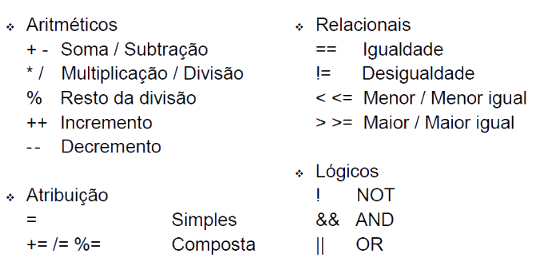

# Javascript - Parte 1

---
# Roteiro

1. História
1. Características da linguagem
1. Como usar em páginas web
1. Operadores
1. Variáveis
1. Tipos de dados
1. _Statements_
1. Funções

---
# História

<figure class="portrait">
  
  <figcaption>**Brendan Eich**, "pai" do Javascript</figcaption>
</figure>

---
## História

<dl>
  <dt class="bullet-old">1989 - 1993</dt><dd class="bullet-old">Tim Berners-Lee
    cria a WWW em CERN (_European Organization for Nuclear Research_) e a deixa
    aberta ao público geral</dd>
  <dt class="bullet-old">1994</dt><dd class="bullet-old">Håkon propõe uma linguagem para dar
    conta da responsabilidade de alterar a aparência de páginas web
    chamada CSS</dd>
  <dt>1995 (maio)</dt><dd>Brendan Eich, funcionário do Netscape, criou
    (em 10 dias!!) uma linguagem para alterar páginas web dinamicamente -
    o _Mocha_</dd>
  <dt>1995 (setembro)</dt><dd>_LiveScript_ (novo nome) é lançado com a versão
    beta do Netscape 2.0</dd>
  <dt>1995 (dezembro)</dt><dd>Nome alterado para JavaScript na versão 2.0 oficial para
    aproveitar a fama do Java</dd>
</dl>

---
## História (cont.)

<dl>
  <dt>1996 (agosto)</dt><dd>Microsoft adota o JavaScript sob o nome de JScript
    no navegador Internet Explorer 3.0</dd>
  <dt>1996 (novembro)</dt><dd>A Netscape submeteu o JavaScript para a
    _<abbr title="European Computer Manufacturers Association">Ecma</abbr>
     international_ para padronização. A especificação recebeu o nome de
     _ECMAScript_</dd>
  <dt>1997 (junho)</dt><dd>A _Ecma International_ publicou a primeira versão,
    o ECMA-262</dd>
  <dt>1998</dt><dd>Versão 2 do ECMAScript</dd>
  <dt>1999 (junho)</dt><dd>Versão 3 do ECMAScript</dd>
  <dt>2009</dt><dd>Versão 5 do ECMAScript</dd>
</dl>

---
## JavaScript nos anos 90

[](http://fegemo.github.io/pocketdragon/)

---
# Características da linguagem

---
## O que é Javascript?

- Linguagem imperativa, com tipagem dinâmica, interpretada
- Há um interpretador embutido em cada navegador
  - Chrome &#8594; V8
  - Firefox &#8594; SpiderMonkey
  - Opera &#8594; Carakan &#8594; V8 (2013)
  - Safari &#8594; SquirrelFish 
  - Internet Explorer &#8594; Chakra

---
## O que é Javascript?

- Linguagem **orientada a objetos**, mas não existem classes
  - _"Pode isso, produção?"_
- Programação dirigida por **eventos**
- Sintaxe parecida com C, C++, C# e Java
  - Javascript **não** é Java
- Memória auto-gerenciada (_garbage collector_)
- _case-sensitive_

---
# Como usar em uma página Web

---
## Três formas de inclusão

- O navegador executa o código assim que vê o elemento `<script></script>` e
  faz _download_ do arquivo apontado
- As formas de incluir código Javascript em uma página são semelhantes às de
  inclusão de CSS
  - Externa
      ```
        ...
        &lt;script src="topo.js"&gt;&lt;/script&gt;
      &lt;/head&gt;
      &lt;body&gt;
        ...
        &lt;script src="fim.js"&gt;&lt;/script&gt;
      &lt;/body&gt;
      ```

---
## Inclusão em páginas

- embutida
  ```html
  <script>
    // código aqui
  </script>
  ```
- inline
  ```html
  <button onclick="javascript: alert();">Mensagem</button>
  ```

---
# Operadores



---
# Variáveis

---
## Sintaxe

- Criamos variáveis com a palavra-chave `var`
  ```js
  var aula = 'js1';
  var num_alunos = 20;
  ```
- Para criar nomes de variáveis (e funções, parâmetros, propriedades etc.):
  - Começar com letra
  - Quaisquer combinações de **letra, número ou traço baixo _ **
- Alguns nomes, entretanto, são reservados da linguagem e não podem ser usados
  (continue...)

---
## Nomes reservados

<pre style="font-size: 1em; background: white; border-radius: 10px; padding: 20px">
  abstract
  boolean break byte
  case catch char class const continue
  debugger default delete do double
  else enum export extends
  false final finally float for function
  goto
  if implements import in instanceof int interface
  long
  native new null
  package private protected public
  return
  short static super switch synchronized
  this throw throws transient true try typeof
  var volatile void
  while with
</pre>

---
# Tipos de dados

---
## Tipos de dados

- Como dito, Javascript é **fracamente tipada** ou **dinâmica**
  - Não é necessário declarar o tipo, ele é reconhecido dinamicamente
    ```js
    var nota = 10;            // tipo numérico
    var aluno = 'Adamastor';  // tipo string
    ```
  - Uma mesma variável pode ter tipos diferentes em momentos diferentes
    ```js
    var nota = 10;            // nota é númerico
    var nota = 'Dó';          // agora virou string
    ```

---
## Tipos de dados (cont.)

- Seis tipos de dados **primitivos**:
  <ul class="multi-column-list-2">
    <li>`Boolean`</li>
    <li>`Number`</li>
    <li>`String`</li>
    <li>`Null`</li>
    <li>`Undefined`</li>
    <li>`Symbol` (ECMAScript 6)</li>
  </ul>
- Um tipo **complexo**
  - `Object`
- Podemos usar o operador `typeof` para determinar o tipo de uma variável
  naquele momento
  ```js
  var nota = 10;
  console.assert(typeof nota === 'number');
  var nota = 'Dó';
  console.assert(typeof nota === 'string');
  ```

---
## Boolean

- Representa uma entidade lógica e pode ter dois valores:
  - `true`
  - `false`

---
## Number

- Em Javascript há apenas um tipo numérico: 64bits (precisão dupla)
- Não há um tipo para representar inteiros
  - 1 e 1.0 são o mesmo valor
- De forma literal, pode ser expressado com parte inteira, decimal e expoente
  - Exemplos:
    ```js
    5
    5.674
    4e2       // 4 vezes 10 elevado a 2 (400)
    25e-2     // 25 vezes 10 elevado a -2 (0.25)
    ```

---
## Number (cont.)

- Valores especiais
  - `NaN` - _not a number_
  - `Infinity`
- Números têm métodos

---
## String

- Cadeia de caracteres
- Não existe o tipo "caractere"
  - Seria apenas uma string com 1 caractere
- Forma literal: áspas simples ou duplas
  ```js
  "Abc" === 'Abc'
  ```
- Propriedade `length`
  ```js
  'Cachorro'.length === 8
  ```

---
## String (cont.)

- Strings são imutáveis (como String em Java), mas criar novas strings é
  simples via concatenação
  ```js
  'c' + 'a' + 't' === 'cat'
  ```
- Strings têm métodos
  - Exemplos:
  ```js
  'barba negra'.toUpperCase() === 'BARBA NEGRA'
  'Mississippi'.indexOf('ss') === 2
  'Orinoco'.replace('noco', '') === 'Ori'
  ```

---
## Null

- O tipo Null contém apenas um valor
  - `null`
- Usado quando uma variável não tem um valor aplicável àquele momento
  ```js
  var x = null;
  console.assert(typeof x === 'null');
  ```

---
## Undefined

- O tipo Undefined é o tipo atribuido a variáveis que não foram associadas a
  nenhum valor
- Tem um único valor
  - `undefined`
- Exemplo:
  ```js
  var x;
  if (x === undefined) {
    // será executado
  }
  ```

---
## Object

- É um "container" de propriedades (nome &#8594; valor)
  - Propriedade: nome e valor
    - Nome: qualquer string
    - Valor: qualquer valor Javascript exceto `undefined`
- É como se cada objeto fosse um dicionário (Java, C#), só que as chaves
  devem ser strings
- Não existem classes
  - Mas um objeto pode "herdar" de outro
- Novas propriedades podem ser atribuidas mesmo após a instanciação

---
## Instanciando um Object

- Forma literal
  ```js
  var jogador = {
    pontos: 1420,
    vidas: 2
  };
  ```
  ```js
  var jogador = {};
  jogador['pontos'] = 1420;   // acesso à propriedade via índice
  jogador.vidas = 2;          // acesso via ponto
  ```

---
## Instanciando um Object (cont.)

- Forma usando operador `new`
  ```js
  var jogador = new Object();
  jogador['pontos'] = 1420;
  jogador['vidas'] = 2;
  ```

---
## Objetos dentro de objetos

```js
var flight = {
    airline: "Oceanic",
    number: 815,
    departure: {
        IATA: "SYD",
        time: "2004-09-22 14:55",
        city: "Sydney"
    },
    arrival: {
        IATA: "LAX",
        time: "2004-09-23 10:42",
        city: "Los Angeles"
    }
};
```

---
## Outros tipos

- O Javascript possui outros tipos complexos que são baseados em Object:
  - Function (sim! funções são objetos)
  - RegExp
  - Array

---
# _Statements_

---
## if/else

- Similar a C, Java
  ```js
  if (hora < 12) {
    manha = true;
  } else {
    manha = false;
  }
  ```
  ```js
  if (nota < 3)     { conceito = 'D'; }
  else if (nota === 3) { conceito = 'C'; }
  else if (nota === 4) { conceito = 'B'; }
  else if (nota === 5) { conceito = 'A'; }
  ```

---
## for

```js
for (var i = 0; i !== 10; i++) {
  console.log(i);
}
```
```js
var cores = ['azul', 'rosa', 'branco'];
for (var cor in cores) {
  console.log(cores[i]);
}
```

---
## while/do..while

```js
var i = 1;
while (i != 10) {
  console.log(i);
  i++;
}
```

```js
var i = 0;
do {
  i++;
  console.log(i);
} while (i != 10);

```

---
# Funções

---
## Funções

- Funções são objetos, então podem ser usadas em variáveis, objetos e arrays
  - Elas podem ser passadas como parâmetro ou retornadas de outras funções
  - Como elas são objetos, elas podem ter propriedades ou mesmo métodos

---
## Funções (cont.)

- São declaradas de forma literal:
  ```js
  function add(a, b) {
    return a + b;
  }
  ```
  ```js
  // Cria uma variável chamada add e armazena nela uma
  // função (anônima) que soma dois números
  var add = function(a, b) {
    return a + b;
  };
  ```

---
## Parâmetros

- Uma função declara que parâmetros ela utiliza, mas ela pode ser chamada com
  mais ou menos argumentos
  ```js
  function votar(governador, presidente) {
    console.log(governador);
    console.log(presidente);
  }

  votar('pink', 'cérebro');       // imprime os dois
  votar('mickey')                 // imprime mickey e undefined
  votar('gohan', 'goku', 'krill') // imprime os 2 primeiros
  ```

---
## Parâmetros (cont.)

- Toda função tem acesso a um objeto `arguments` que contém todos os valores
  passados como argumentos na chamada da função
  ```js
  function media() {
    for (var i = 0, acum = 0; i < arguments.length; i++) {
      acum += arguments[i];
    }
    return acum / arguments.length;
  }
  media();          // NaN
  media(1);         // 1
  media(5, 15);     // 10
  ```

---
## Funções (cont.)

- Funções podem ser definidas dentro de outras funções
  - As funções internas tem acesso ao escopo das externas (_closure_)
- Quando uma função é armazenada em uma propriedade de um objeto, chamamos ela
  de método
  ```js
  var passaro = {
    nome: 'Abelardo',
    voando: false;
    voar: function() {
      // pegar impulso e saltar
    }
  };
  ```

---
## Métodos

- Um objeto especial chamado `this` é disponibilizado para os métodos e são
  uma referência ao objeto "dono" do método
  ```js
  var passaro = {
    nome: 'Abelardo',
    voando: false;
    voar: function() {
      this.voando = true;
    }
  ```

---
## Valor de retorno

- Uma função (ou método) sempre retorna um valor
- Se não houver um `return` na função, esse valor é `undefined`
  - Mas em certas circunstâncias, também pode ser o valor de `this`

---
## Escopo

- Escopo em linguagens de programação são uma definição de visibilidade e tempo
  de vida de variáveis e parâmetros
- Javascript **não tem escopo de bloco**, apenas de **função**
  - Variáveis e parâmetros são visíveis em todo lugar dentro da função onde
    foram declarados, mas não fora dela
    ```js
    function construir(tipo) {
      if (tipo === 'casa') {
        var imovel = new Casa();
      }
      return imovel;
    }
    construir('casa');          // Ok, retorna a casa
    ```

---
# Referências

1. Capítulo 2 do livro "Javascript: The Good Parts"
1. Mozilla Developer Network (MDN)
