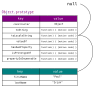

<!-- {"layout": "title"} -->
# **JavaScript** Parte 3
## Template strings, Criação de objetos<br>e Função seta

---
<!-- {"layout": "2-column-content"} -->
# Na última aula (1/2)

1. Variáveis: **let**, **const** e var 🗡❌ _(tipos de dados são inferidos)_
1. Tipos:
    - `1. Boolean` <!-- {.tipo-js.tipo-boolean} -->
    - `2. Number` <!-- {.tipo-js.tipo-number} -->
    - `3. String` <!-- {.tipo-js.tipo-string} -->
    - `4. Null` <!-- {.tipo-js} -->
    - `5. Undefined` <!-- {.tipo-js} -->
    - `6. Symbol` <!-- {.tipo-js} -->
    - `7. Object` <!-- {.tipo-js.tipo-object} --> <!-- {ul^0:.multi-column-list-2.no-bullets} -->

- Funções: <!-- {ul:.full-width.no-padding.no-bullets.compact-code-more} -->
  ```js
  // tradicional
  function nomeCompleto(nome, sobre) {
    return nome + ' ' + sobre;
  }
  ```
  ```js
  // anônima em variável
  const nomeCompleto = function(nome, sobre) {
    return nome + ' ' + sobre;
  }
  ```
  - Invocação da mesma forma: `nomeCompleto('Mijaro', 'Nomuro')`

---
<!-- {"classes": "compact-code-more"} -->
## Na última aula (2/2)

- Vetores <!-- {ul:.bulleted-0.full-width} -->
  - <!-- {li:.code-split-2} -->
    <!-- {ul:.no-bullets.no-padding.no-margin} -->
    ```js
    let radios = [106.1, 105.1, 98.3];
    let cores = ['azul', 'verde'];
    ```
    ```js
    let animais = [];         // <- vetor vazio
    animais.push('dogue');    // ['dogue']
    ```
- Repetição
  - <!-- {li:.code-split-3} -->
    <!-- {ul:.no-bullets.no-padding.no-margin} -->
    ```js
    // tradicional
    for(let i=0; i<cores.length;i++){
      console.log(cores[i]);
    }
    // impr. azul, verde
    ```
    ```js
    // for of                      👍
    for (let cor of cores) {
      console.log(cor);
    }
    // impr. azul, verde
    ```
    ```js
    // forEach                     👍
    cores.forEach(function(cor) {
      console.log(cor);
    });
    // impr. azul, verde
    ```
- Vários métodos de ↓ strings e de vetores ⤥
  - <!-- {li:.code-split-2} -->
    <!-- {ul:.no-bullets.no-padding.no-margin} -->
    ```js
    'Hannah'.toLowerCase() === 'hannah'
    'Ovo'.replace('O', 'Ou') === 'Ouvo'
    'BR4512348ZY'.substr(0, 2) === 'BR'
    'Charmander'.indexOf('arma') === 4
    ```
    ```js
    radios.push(92.5);      // insere no final
    radios.pop();           // remove do final
    cores.unshift('verm');  // insere no início
    cores.shift();          // remove do início
    ```

---
<!-- {"layout": "centered"} -->
# Roteiro

1. [_Template_ strings](#template-strings)
1. [Criação de objetos](#criacao-de-objetos)
   - Funções construtoras
   - Classes
1. [Função seta](#funcao-seta)

---
<!-- {"layout": "section-header", "hash": "template-strings"} -->
# _Template_ Strings
## Criando strings bacanudas

- Relembrando o tipo `String` <!-- {.tipo-js.tipo-string} -->
- _Template_ strings
  1. Interpolação de valores
  1. Strings multilinha
  1. [Função de transformação][tagged-templates]

[tagged-templates]: https://developer.mozilla.org/en-US/docs/Web/JavaScript/Reference/Template_literals#tagged_templates

<!-- {ul:.content} -->

---
<!-- {"hash": "o-tipo-string", "backdrop": "oldtimes"} -->
## O tipo **3. String** <!-- {.tipo-js.tipo-string} -->

- **Representa um texto** <!-- {.tipo-string} --> codificado em UTF-8
- Não existe o tipo `char` como em C/C++ e Java, apenas _string_ :wink:
- Usamos aspas **simples** ou duplas
  ```js
  "Abc" === 'Abc'   // simples é mais legal!! mas basta ser consistente
  ```
- Possui uma propriedade chamada `length` com o seu comprimento:
  ```js
  console.log('Cachorro'.length); // 8
  ```
- Exemplos:
  ```js
  let aranhas = 'fofofauna';
  const nomeCompleto = primeiro + ' ' + ultimo;     // concatenou
  ```


---
## _Template_ Strings: interpolação de valores (1/2)

- É uma forma mais recente para criar _strings_ <!-- {ul:.full-width.bulleted} -->
- Formato: **usa-se crase** para delimitar. Exemplo:
- <!-- {.code-split-2} -->
  ```js
  // template string
  let fruta = `Kiwi`;
  ```
  ```js
  // string normal
  let fruta =  'Kiwi';
  ```
- Permite **interpolar** (substituir) **variáveis** dentro de strings:
- <!-- {.code-split-2.compact-code-more} -->
  ```js
  const peso = 82;
  const nome = 'Kagaro Nakama';

  // com template strings
  const frase = `${nome} pesa ${peso}kg`;
  // "Kagaro Nakama pesa 82kg"
  ```
  ```js
  const peso = 82;
  const nome = 'Kagaro Nakama';
  
  // concatenando strings normais
  const frase = nome + ' pesa ' + peso + 'kg';
  // "Kagaro Nakama pesa 82kg"
  ```
- A sintaxe é mais sucinta e legível
  - Vejamos outros exemplos...
  
---
## _Template_ Strings: interpolação de valores (2/2)

- É possível **colocar expressões** dentre de `${...}`. Exemplo: <!-- {ul:.full-width.bulleted.compact-code} -->
  ```js
  // supondo que existem variáveis preco=5 e qtde=2
  let aConta = `Sua conta é R$ ${preco * qtde - 3}`;
  //           "Sua conta é R$ 7"
  ```
- <!-- {.code-split-2.compact-code-more} -->
  ```js
  // supondo variáveis dia, mês, ano e func. obtemMes
  const data = `${dia} de ${obtemMes(mes)} de ${ano}`;
  // Ex:       "20 de janeiro de 2021"
  ```
  ```js
  const tom = 128;
  const corCinza = `rgb(${tom}, ${tom}, ${tom})`;
  // Ex:           "rgb(128, 128, 128)"
  ```
- Mas qual é o tipo de dados??
  <!-- {li:.compact-code-more} -->
  ```js
  console.log(typeof "texto"); // imprime "string"
  console.log(typeof `texto`); // imprime "string"
  ```
  - É **String** <!-- {.tipo-js.tipo-string} --> mesmo! Só muda a sintaxe pra escrever
- Ou seja, a **interpolação** é apenas uma **sintaxe mais legal** para concatenar strings com variáveis/expressões

---
## _Template_ Strings: **texto multilinha**

- Digamos que você queira que uma variável string contenha uma poesia (ocupando várias linhas)
- As _template strings_ permitem que **uma string ocupe mais do que uma linha** no código fonte
- <!-- {.code-split-2} -->
  ```js
  // com template string
  let poesia = `Cavei cavei cavei
    Isto não é um poema
    Mas é profundo.`;
  ```
  ```js
  // com string normal
  let poesia = 'Cavei cavei cavei\n' +
    'Isto não é um poema\n' +
    'Mas é profundo.';
  ```
- Nesse caso, quando há uma quebra de linha no código fonte, é colocado um `\n` dentro da _template string_


---
<!-- {"layout": "section-header", "hash": "criacao-de-objetos"} -->
# Criação de objetos
## Diferentes formas de instanciação

- Formas _ad-hoc_
  - Notação literal
  - Operador `new`
- Seguindo um formato
  - Função construtora
  - Classe _(outra aula)_
- _Prototype_
<!-- {ul^2:.content} -->

---
<!-- {"backdrop": "oldtimes"} -->
## Instanciação de Objetos <small>(1/2)</small>

- Como visto, JavaScript possui 01 tipo de dados complexo `Object`
- Podemos instanciar objetos de duas formas:
  1. Forma **literal**:
     ```js
     let carro = {};  // mais comum, mais expressivo
     ```
  1. Operador `new`:
     ```js
     let carro = new Object();
     ```
- Podemos atrelar novas propriedades _on the fly_

---
<!-- {"backdrop": "oldtimes", "classes": "compact-code"} -->
## Instanciação de Objetos <small>(2/2)</small>

- Um objeto é simplesmente um _container_ de propriedades (nome: valor)
  ```js
  let carro = {
    cor: 'vermelho',
    fabricante: {
      nome: 'Fiat',
      origem: 'Itália'
    },
    ligar: function() {
      this.injetaCombustivel();
      // ...faz outras coisas
    },
    /* ... */
  };
  ```

---
<!-- {"layout": "main-point", "state": "emphatic"} -->
## E se quiser "forçar" uma forma para criar objetos? <!-- {.bullet} -->

1. Função construtora (forma antiga) <!-- {ol:.bulleted.flex-align-end} -->
1. Classe (veremos em outra aula)

---
<!-- {"hash": "funcao-construtora"} -->
## Função construtora

- Podemos invocar uma **função construtora** que vai instanciar e
  inicializar objetos:
  ```js
  function Moto(modelo, dono) {
    this.modelo = modelo;         // Lembre que 'this' dentro de um
    this.dono = dono;             // objeto aponta para ele mesmo
  }
  let moto1 = new Moto('Kawasaki', 'Ninja Jiraya');
  let moto2 = new Moto('Harley Davidson', 'Lula Molusco');
  ```
  - Todo objeto terá as propriedades `modelo` e `dono`

---
## Características da **função construtora**

- Uma função construtora é apenas uma função
  - Porém ela usa a referência `this` para definir propriedades de um
    objeto novinho que está sendo criado
  - Tipicamente, **o nome de toda função construtora começa com letra
    maiúscula** (apenas uma convenção). _E.g._:
    ```js
    function Leguminosa(nome, calorias) {   // legal!
      // this.nome = nome
      // ...
    }
    function verdura(nome, calorias) {   // funciona, mas evitamos
      // this....
    }
    ```
    - A letra maiúscula indica que não podemos esquecer do `new`
 
---
## Função construtora e **métodos**

- Se, além de propriedades de dados (`modelo`, `dono` etc.), colocarmos também
  alguns métodos, podemos falar que temos algo semelhante a uma
  **classe** das linguagens OO "tradicionais":
  ```js
  function Moto(modelo, dono) {
    /* ... */
    this.toString = function() {
      return `${this.modelo} do(a) ${this.dono}`;
    };
  }
  let motoca = new Moto('Honda Biz', 'Rubinho');
  console.log(motoca.toString());     // Honda Biz do Rubinho
  ```

*[OO]: Orientadas a objetos

---
## Exemplo: Lista de contatos <small>(1/4)</small>

- Considere um código para inicializar uma lista de contatos assim:
  <!-- {li:.two-column-code} -->
  ```js
  function Contato(nome, email) {
    this.nome = nome;
    this.email = email;
    this.linkParaMensagem = function() {
      return `mailto:${this.email}`;
    };
  }
  const lista = [
    new Contato('huguinho', 'h@gma.br'),
    new Contato('zezinho', 'j@gma.br'),
    new Contato('luizinho', 'l@gma.br')
  ];


  ```

---
## Exemplo: Lista de contatos <small>(2/4)</small>

- Se pudéssemos examinar a memória alocada, veríamos:
   <!-- {.centered.block} -->
  - Repare que o código fonte do método é repetido a cada instância
    - Dá para melhorar, se tivermos como definir **o método
      `linkParaMensagem` a nível da classe**, ao invés de
      na instância

---
## Exemplo: Lista de contatos <small>(3/4)</small>

- De fato, é possível definir um **método a nível da classe** usando uma
  propriedade chamada `prototype`:
  ```js
  function ContatoV2(nome, email) {
    this.nome = nome;
    this.email = email;
    // this.linkParaMensagem = function() { ... }
  }
  ContatoV2.prototype.linkParaMensagem = function() {
    return `mailto:${this.email}`;
  };
  // lembre-se: função é um objeto, logo, pode ter propriedades
  ```

---
## Exemplo: Lista de contatos <small>(4/4)</small>

- Se usarmos a classe `ContatoV2` para alocar a lista de contatos, teremos:
   <!-- {.centered.block} -->
  - Mas como isso funciona?

---
## O **Prototype** (protótipo) <small>(1/2)</small>

- Todo objeto possui uma propriedade especial chamada `prototype` de onde ele
  **pode "herdar" propriedades**
  - Podemos visualizar isso ao criarmos um objeto vazio e verificar que ele já
    tem algumas propriedades:
    ```js
    let novo = {};
    console.log(novo.toString());     // [object Object]
    ```
    - Isso acontece porque todo objeto que instanciamos na forma literal
      tem seu `prototype` apontado para um objeto que possui algumas
      propriedades (e.g., `toString`)
      - Esse objeto é o `Object.prototype`

---
## O **Prototype** <small>(2/2)</small>

-  <!-- {.push-right} -->
  Quando **acessamos uma propriedade** de um objeto, o motor JS **procura
  no próprio**
- Se não encontrar, ele continua procurando na **`prototype` _chain_**
- Isso é feito até chegar no último objeto e, então, o motor diz que essa
  propriedade está `undefined`. Por exemplo: <!-- {.compact-code-more} -->
  ```js
  let nome = { firstName: 'Paul', lastName: 'Irish' };
  nome.firstName;       // achou no próprio objeto
  nome.toString();      // achou em Object.prototype
  nome.middleName;      // não achou, undefined
  ```

---
## Invocação de funções

- Funções são objetos (invocáveis)
- Sendo objetos, as funções também possuem uma propriedade `prototype` que
  aponta para um objeto "global" e único, o **`Function.prototype`**
- Há 4 formas distintas para se invocar uma função
  1. Como uma função: `iniciaControlesVideo()`
  1. Como um método: `video.play()`
  1. Como um construtor `new VideoPlayer()`
  1. ~~Com `apply` ou `call`: `iniciaControlesVideo.call(null)`~~
- **Informação importante**: <!-- {li:.note.info} -->
  - O objeto para onde `this` aponta varia em cada uma das 4 formas

---
## (1) Invocação de funções (como **função**)

1. Como uma **função** propriamente dita, ou uma **subrotina**:
   - Quando a função não está associada a um objeto
     ```js
     function soma(a, b) {
       return a + b;
     }
     soma(40, 2);      // invocação. Retorna 42
     let s = soma;
     s(21, 21);        // invocação. Retorna 42
     ```
     - O valor de `this` é **sempre** definido para o objeto global `window`
       - Isto foi um erro de projeto da linguagem :worried:

---
## (2) Invocação de funções (como **método**)

2. Como um **método** (função que pertence a um objeto):
   ```js
   const contador = {
     valor: 0,
     incrementa: function(qtde) {
       this.valor += qtde ? qtde : 1;
     }
   }
   contador.incrementa();    // contador.valor = 1
   contador.incrementa(10);  // contador.value = 11
   ```
   - `this` aponta para a instância do objeto dono do método invocado

---
## Invocação de funções (como **método** vs **função**)

- Uma consequência do erro de projeto mencionado:
  ```js
  let usuario = {
    nome: 'Couto',
    cumprimenta: function() {           // invocação de método
      setTimeout(function() {
        console.log(`Olá, aqui é ${this.nome}`);
      }, 5000);
    }
  };
  usuario.cumprimenta();  // 'Olá, aqui é undefined'... pq??
  ```

---
## Invocação de funções (**método** vs **função** cont.)

- O que aconteceu no exemplo anterior:
  - O valor de `this` dentro de `usuario.cumprimenta` aponta para a
    instância do objeto `usuario`, como esperado
  - Porém, quando `setTimeout` invoca `usuario.cumprimenta` isso é feito como uma função (e não método)
    - `this` passa a apontar para `window`, que não tem uma variável `nome`
- Mas não desanime: dá pra consertar usando as **_arrow functions_**
  - Veremos elas no próximo tópico de hoje

---
## (3) Invocação de funções (como **construtor**)

3. Quando uma função é invocada, **precedida pelo operador `new`**, dizemos que
   a função é um **construtor**:
   ```js
   function Contato(nome) {
     this.nome = nome;
   }
   let presidente = new Contato('Seu Adamastor');  // construtor
   ```
   - Por causa do **operador `new`, três coisas acontecem**:
     1. Um **objeto vazio** é criado e seu **`prototype` é o mesmo do
        da função**
     1. O valor de **`this`** dentro da função **aponta para o novo objeto**
     1. Se não houver `return`, **`this` é retornado** automaticamente

---
## _Caveat_ da invocação por **construtor**

- Se uma função construtora é invocada sem o `new`, _shit will happen_
  - Veja por quê:
    ```js
    function Contato(nome) {
      this.nome = nome;
    }
    let presidente = Contato('Seu Custódio');   // invoc. função
    ```
    - Ao final do código acima, temos que:
      1. `window.nome === "Seu Custódio"`
      1. `presidente === undefined`

---
<!-- {"layout": "main-point", "state": "emphatic"} -->
# Herança

---
## Herança **pseudo-clássica**

- <!-- {ul:.no-padding.no-margin.no-bullets.two-column-code.compact-code-more} -->
  ```js
  let Mamifero = function(nome) {
    this.nome = nome;
  };

  Mamifero.prototype.diz = function() {
    return this.fala || '';
  };

  let mamiferoGenerico = new Mamifero('mamifero');
  mamiferoGenerico.diz();     // retorna ''

  let Gato = function(nome) {
    this.nome = nome;
    this.fala = 'Miau';
  }
  Gato.prototype = new Mamifero();

  let gato = new Gato('Tom');
  gato.diz();                 // retorna 'Miau'


  ```
  - **Veredito**: dá trabalho d+, suscetível a erros. Mas era o que tinha. Hoje usamos classes. <!-- {li:.note.info} -->

---
<!-- {"layout": "section-header", "hash": "funcao-seta"} -->
# Função Seta
## A 3ª forma para funções

- 3 Formas:
  - Função tradicional
  - Função anônima
  - Função seta (anônima também)
<!-- {ul^1:.content} -->

---
## Função **tradicional** e **anônima**

- <!-- {.code-split-2} -->
  <!-- {ul:.full-width} -->
  ```js
  function cadastrar() {
    // ...
  }
  ```
  ```js
  const cadastrar = function() {
    // ...
  };
  ```
 - **Função seta** é uma **sintaxe mais nova e sucinta** para as anônimas ⬆
 - <!-- {.code-split-2.bulleted style="flex-direction: row-reverse"} -->
   ```js
   const cadastrar = () => {
     // ...
   };
   ```
   1. Omitir `function`
   2. Seta entre parâmetros e corpo
   3. `return` implícito
   4. Mantém o valor do ponteiro `this`
- Vejamos alguns exemplos <!-- {li:.bullet} -->

---
<!-- {"classes": "compact-code-more", "hash": "funcao-seta-sintaxe"} -->
## Função seta: sintaxe

- <!-- {ul:.no-bullets.no-padding.full-width.two-column-code} -->
  ```js
  function ciao() {
    return 'Ciao';
  }

  function oi(prim, ult) {
    return `Oi ${prim} ${ult}`;
  }

  function hi(name) {
    return 'Hi ' + name;
  }

  function fatorial(n) {
    let resultado = 1;
    while (n > 1) {
      resultado *= n;
      n--;
    }
    return resultado;  
  }

  let ciao = () => 'Ciao';


  let oi = (prim, ult) => `Oi ${prim} ${ult}`;


  let hi = name => 'Hi ' + name;


  let fatorial = n => {
    let resultado = 1;
    while (n > 1) {
      resultado *= n;
      n--;
    }
    return resultado;  
  }
  ```

---
<!-- {"classes": "compact-code-more", "hash": "funcoes-seta-com-vetores"} -->
## Exemplo: funções seta com vetores

- <!-- {ul:.no-padding.no-margin.no-bullets.flex-align-center} -->
  ```js
  let usuarios = ['Joel', 'Fani', 'Fúlvio'];
  let alunos = [{ matricula: '...' }];
  let numeros = [1, 4, 2, 5];
  ```

1. Pegar apenas usuários que começam com letra 'F': <!-- {ol:.full-width.bulleted-0} -->
   - <!-- {.code-split-2} -->
     <!-- {ul:style="padding-left: 0"} -->
     ```js
     usuarios.filter(function(nome) {
       return nome.startsWith('F');
     });
     ```
     ```js
     usuarios.filter(nome => nome.startsWith('F'));
     
     
     ```
2. Buscar pelo aluno com uma matrícula:
   - <!-- {.code-split-2} -->
     <!-- {ul:style="padding-left: 0"} -->
     ```js
     alunos.find(function(aluno) {
       return aluno.matricula === '2005046102';
     });
     ```
     ```js
     alunos.find(al => al.matricula === '2005046102');
     
     
     ```
3. Vetor com os quadrados do original:
   - <!-- {.code-split-2} -->
     <!-- {ul:style="padding-left: 0"} -->
     ```js
     numeros.map(function(numero) {
       return numero ** 2;
     });
     ```
     ```js
     numeros.map(numero => numero ** 2);


     ```

---
# Mantendo o `this` léxico

- Métodos normais (`function`) perdem o valor do `this` léxico (que estava no contexto) se invocados como funções
  - Isso não pode ser corrigido na linguagem
- A função seta introduzida em ES2015 **mantém o `this` léxico**:
  <!-- {li:.two-column-code.compact-code-more} -->
  ```js
  let usuario = {                               // ❌
    nome: 'Couto',
    cumprimenta: function() {
      setTimeout(function() {
        console.log(`Olá, aqui é ${this.nome}`);
      }, 5000);
    }
  };
  usuario.cumprimenta();  // 'Olá, aqui é undefined'
  let usuario = {                               // ✅
    nome: 'Couto',
    cumprimenta: function() {
      setTimeout(() => {
        console.log(`Olá, aqui é ${this.nome}`);
      }, 5000);
    }
  };
  usuario.cumprimenta();  // 'Olá, aqui é Couto'
  ```  

---
<!-- {"layout": "centered"} -->
# Referências

1. Capítulos 3, 4 e 5 do livro "Javascript: The Good Parts"
1. Capítulos 9 e 10 do livro "Head First: JavaScript"
1. Mozilla Developer Network (MDN)
1. [Como prototypes funcionam](http://yehudakatz.com/2011/08/12/understanding-prototypes-in-javascript/)
1. [Entendendo prototypes](http://javascriptweblog.wordpress.com/2010/06/07/understanding-javascript-prototypes/)
