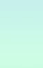
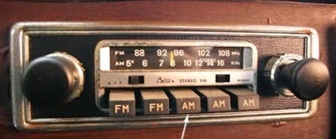

<!-- {"layout": "title"} -->
# **JavaScript** parte 4
## Estilizando elementos, Interação com campos, Eventos de mouse e o PhotoSnap 📷

---
## Na última aula... <small>(1/2)</small>

- O `document.querySelectorAll` retorna **todos** que forem selecionados <!-- {ul:.compact-code} -->
- É possível alterar o **conteúdo** de um elemento com `elemento.innerHTML`:
  <iframe width="250" height="130" src="//jsfiddle.net/fegemo/wLp3kv59/embedded/result/" allowfullscreen="allowfullscreen" frameborder="0" class="push-right" style="clear: right;"></iframe>
  <iframe width="250" height="153" src="//jsfiddle.net/fegemo/wLp3kv59/embedded/html/" allowfullscreen="allowfullscreen" frameborder="0" class="push-right" style="clear: right;"></iframe>

  ```js
  let contador = 0;
  let contadorEl = document.querySelector('#contador');
  
  // quando clicado, (1) conta e (2) altera conteúdo
  contadorEl.addEventListener('click', () => {
    contador++;                       // (1) conta
    contadorEl.innerHTML = contador;  // (2) altera
  });
  ```

---
## Na última aula... <small>(2/2)</small>

1. **Alterando classes** de um elemento: <!-- {ol:.full-width} -->
   ```js
   booEl.classList.toggle('selecionado');   // add, remove ou toggle (alternar)
   ```
1. **Alterando atributos** de um elemento:
   ```js
   pokemonLutandoEl.src = 'bulbasaur.png';  // qualquer atributo, aqui foi src
   ```
1. Usando o argumento da _callback_ de um evento:
   ```js
   booEl.addEventListener('click', function(e) {
     let clicadoEl = e.currentTarget;       // elemento alvo (target) do evento
     clicadoEl.classList.toggle('selecionado');
   });
   ```

---
<!-- {"layout": "centered"} -->
# Hoje veremos

1. [Estilizando elementos dinamicamente](#estilizando-elementos-dinamicamente)
1. [Interação com campos](#interacao-com-campos)
1. [Eventos de mouse e formulário](#eventos-de-mouse-e-campos)
1. [PhotoSnap](#photosnap) 📷

---
<!-- {"layout": "section-header", "hash": "estilizando-elementos-dinamicamente"} -->
# **Estilizando** elementos dinamicamente <!-- {h1:style="padding-top: 0"} -->
## Alterando propriedades CSS de elementos

- De **2 formas** diferentes:
  1. Usando classes (*já vimos*<!--{em:.underline.upon-activation.delay-1800}-->):
     - `el.classList.add(...)`
     - `el.classList.remove(...)`
     - `el.classList.toggle(...)`
  1. **Usando propriedade `style`**
<!-- {ul^1:.content} -->

---
<!-- {"hash": "alterando-o-estilo-de-elementos"} -->
## Alterando o **estilo** de elementos

- Há **2 formas** para alterar o estilo de elementos:
  1. Adicionando ou removendo classes (já vimos): <!-- {ol:.bulleted-0} -->
     <!-- {li:style="opacity: 0.5"} -->
     ```js
     booEl.classList.add('selecionado');    // adiciona .selecionado
     botaoEl.classList.remove('oculto');    // remove .oculto
     ```
     - Usa a **propriedade `.classList` do elemento**
  2. Alterando a propriedade `style`:
     ```js
     botaoEl.style.width = '80%';           // define largura como 80%
     botaoEl.style.paddingTop = '2px';      // padding-top vira paddingTop
     ```
     - Usa a **propriedade `.style` do elemento**

---
## Nomes das propriedades de estilo em JS

- Repare a mudança das propriedades **CSS para JS**:
  ```js
  botaoEl.style.backgroundColor = '#cccccc';
  ```
  - CSS ➡️ JavaScript
    - `background-color` ➡️ `backgroundColor` <!-- {ul^0:.multi-column-list-2} -->
    - `border-radius` ➡️ `borderRadius`
    - `margin` ➡️ `margin`
    - `list-style-type` ➡️ `listStyleType`
    - `z-index` ➡️ `zIndex`
    - etc.
- Isso acontece porque em JavaScript **não podemos usar hífens**:
  ```js
  let nome-da-variavel = 'incorreto'; // Uncaught SyntaxError: Unexpected token -
  ```

---
## Usar _classes_ ou `elemento.style`?

- Devemos **preferir usar _classes_**, porque a estilização fica por conta <!-- {ul:.bulleted-0} -->
  do arquivo CSS
  - Lembre-se do princípio da separação de responsabilidades
- Contudo, **em certos casos é melhor ou necessário usar `.style`**:
  -  <!-- {.push-right} -->
    Quando precisamos calcular, em JavaScript, o valor de uma propriedade
  - Exemplo: `abelhinhas.js`
    ```css
    .abelhinha {
      position: absolute;   /* precisamos de position: absolute */
      left: ??;             /* mas como calcular left e top? */
      top: ??;              /* tem que ser via JavaScript =) */
    }
    ```

---
<!-- {"classes": "compact-code-more"} -->
## Exemplo: _abelhinhas.js_

- <!-- {.code-split-2} -->
  <!-- {ul:.full-width} -->
  ```js
  // cria um objeto abelhinha
  let abelhinha = {
    x: 0,   // pos. x inicial
    y: 0,   // pos. y inicial
    imagemEl: document.querySelector('#abelhinha')
  };
  ```
  <iframe height="175" src="//jsfiddle.net/fegemo/a1vLv657/embedded/result,js,html,css/" allowfullscreen="allowfullscreen" frameborder="0" class="bordered rounded"></iframe>
- <!-- {.no-bullets style="margin-top: 1em"} -->
  ```js
  // função que acha a nova posição
  function atualizaAbel() {
    abelhinha.x += 1;
    abelhinha.y += Math.sin(abelhinha.x);

    abelhinha.imagemEl.style.left = `${abelhinha.x}px`;
    abelhinha.imagemEl.style.top = `${abelhinha.y}px`;
  }

  // registra a função em um intervalo
  setInterval(atualizaAbel, 33);
  ```

---
<!-- {"layout": "section-header", "hash": "interacao-com-campos"} -->
# Interação com campos
## Campos de entrada e escolha

- Relembrando
- Interação com campos de dados
- Interação com campos de escolha
<!-- {ul:.content} -->

---
<!-- {"backdrop": "oldtimes"} -->
## Caixa de texto <small>(p/ usuário digitar)</small>

- Elemento HTML onde o usuário pode digitar qualquer coisa
- Formato:
  ```html
  <input id="palavra" type="text" placeholder="Digite..."> <!-- exemplo abaixo -->
  <input id="palavra">
  <input>
  ```
  - `type="text"` é o valor padrão para o `input`
  - `placeholder="um texto..."` define um texto de ajuda que só aparece
    quando não há nada digitado
  ::: result
  <input type="text" placeholder="Digite...">
  :::

---
<!-- {"hash": "interagindo-js-campos-de-dados"} -->
## Interagindo via JavaScript

- Todo `<input>` possui o **atributo `value`**, que é o **valor <u>padrão</u>**.
  Exemplo:
  - `<input type="number" value="5">`: <input id="qtde-pizzas" type="number" value="5" style="width: 3em;">
    <button onclick="alert(document.querySelector('#qtde-pizzas').value)">(1) Pegar</button>
    <button onclick="document.querySelector('#qtde-pizzas').value = 25">(2) Definir</button>
- Para pegar (_get_) ou definir (_set_) o
  **valor <u>atual</u>** <!-- {.alternate-color} --> via JavaScript, (a) pegamos
  o elemento no DOM e (b) acessamos a
  **propriedade `value`**: <!-- {.alternate-color} -->
  ```js
  let quantidadePizzasEl = document.querySelector('#qtde-pizzas');


  // podemos pegar o valor atual no console acessando .value:
  let qtdePizzasAtual = quantidadePizzasEl.value; // botão 1
  alert(qtdePizzasAtual);


  // ou podemos definir um novo valor para o elemento:
  quantidadePizzasEl.value = 25;                  // botão 2
  ```

<!-- {li:.compact-code} -->

---
<!-- {"backdrop": "oldtimes"} -->
## Checkbox: <small>caixinha de marcação</small>

- Formato:
  ```html
  <label>
    <input id="emails" type="checkbox" value="sim"> Inscrever?
  </label>
  ```
  - **!!** Se não colocarmos um `<label></label>`, o usuário precisará
    clicar exatamente na caixinha
    ::: result
      <div style="display: flex; justify-content: space-between"><label>
        <input type="checkbox"> Inscrever (com label)?
      </label><div><input type="checkbox"> Inscrever <del>(com label)</del>?</div></div>
    :::
- Atributos:
  - `checked`, para deixar **previamente marcado**
    ```html
    <input id="..." type="checkbox" checked>
    ```

---
<!-- {"layout": "2-column-content", "backdrop": "oldtimes"} -->
## Radio: <small>escolha dentro de um grupo</small>

- Formato: <!-- {ul:.no-margin} -->
  ```html
  <label>
    <input type="radio" name="cor" value="azul">Azul
  </label>
  <label>
    <input type="radio" name="cor" value="verde">Verde
  </label>
  ```
1.  <!-- {style="max-width: 80%; margin-top: 1.5em;"} --> <!-- {ol:.no-bullets.no-padding.center-aligned.no-margin} -->
   ::: result
     <div><label>
       <input type="radio" name="cor" value="azul"> Azul
     </label>
     <label>
       <input type="radio" name="cor" value="verde"> Verde
     </label></div>
   :::

- **Atributo `name`**: define qual é o nome do input ao enviar o fomulário para o servidor <!-- {ul:.span-columns} -->
- Repare que apenas uma cor pode ser escolhida
  - porque **os dois `<input>` têm o mesmo `name`** <!-- {strong:.alternate-color} -->

---
<!-- {"backdrop": "oldtimes"} -->
## Select e options <small>(lista de opções)</small>

- ::: result .push-right margin-left: 1em; margin-top: 1.25em
  <label for="sabor" style="display: block">Sabor da pizza:</label> <select name="sabor" id="sabor">
    <option value="marg">Marguerita</option>
    <option value="muzza" selected>Frango</option>
  </select>
  :::
  Formato: <!-- {ul:.full-width.no-margin} -->
  ```html
  <label for="sabor">Sabor da pizza:</label>
  <select id="sabor">
    <option value="marg">Marguerita</option>
    <option value="muzza" selected>Frango</option>
  </select>
  ```
- Atributos:
  - `selected`, para o `option`, para deixar selecionado
  - `multiple`, para o `select`, para permitir mais de um `option`

---
<!-- {"classes": "compact-code", "hash": "interagindo-js-campos-de-escolha", "embeddedStyles": "#interactions-choices pre { margin-bottom: 0.5em; }"} -->
## Interagindo via JavaScript (2)

1. <!-- {ol:#interactions-choices} -->
   Verificando se um `checkbox` está marcado: <label><input type="checkbox" id="inscrever"> Inscrever?</label> <button onclick="alert(document.querySelector('#inscrever').checked)">💻 Executar</button>
   ```js
   let desejaInscreverEl = document.querySelector('#inscrever');
   let estaMarcado = desejaInscreverEl.checked;   // elemento.checked: true/false
   ```
1. Pegando qual opção selecionada em um `select`: <select id="pizza"><option value="marg">Marguerita</option><option value="muzza" selected>Muzzarela</option></select> <button onclick="alert(document.querySelector('#pizza').value)">💻</button>
   ```js
   let saborPizzaEl = document.querySelector('#pizza');
   let sabor = saborPizzaEl.value;   // elementoSelect.value: valor da option
   ```
1. Pegando qual a opção marcada em um grupo de `radio`: <label><input type="radio" name="cor" value="azul"> Azul</label><label><input type="radio" name="cor" value="verde"> Verde</label> <button onclick="alert(document.querySelector('[name=cor]:checked').value)">💻</button>
   ```js
   let corMarcadaEl = document.querySelector('[name="cor"]:checked');
   let cor = corMarcadaEl.value;   // elemento.value: valor do input
   ```
   - Repare o **seletor**<!--{.alternate-color}-->: todo elemento com
     **atributo `name="cor"`** e que **esteja no estado `:checked`** (marcado) <!-- {ol:.bulleted-0} -->

---
<!-- {"layout": "section-header", "hash": "eventos-de-mouse-e-campos"} -->
# Eventos de mouse e campos
## Acionados mouse ou teclado

- Relembrando _event handlers_
- Eventos ao movimentar o mouse
- Eventos de campos
<!-- {ul:.content} -->

---
<!-- {
  "scripts": ["../../scripts/classes/mouse-events.min.js"],
  "styles": ["../../styles/classes/mouse-events.min.css"]
} -->
## Eventos

- Eventos são **associados a elementos específicos** e causam a invocação
  de uma função "manipuladora" (_event handler_ ou apenas _handler_)
- Eventos relacionados ao mouse:
  - `click` (clique simples) **.**
  - `dblclick` (clique duplo) **.**
  - `mousedown` (press. um botão) **.**
  - `mouseup` (liberou um botão) **.**
  - `mousemove` (movimentou) **.**
  - `mouseover` (sobrevoou um elem.) **.**
  - `mouseout` (saiu de um elemento) **.** <!-- {ul:.multi-column-list-2#mouse-events}-->


---
## _Event handlers_

- Forma bacana :thumbsup::
  ```js
  botaoEl.addEventListener('click', umaFuncao);
  ```
  - Pode haver mais de um _handler_ :thumbsup:
- É possível retirar também:
  ```js
  botaoEl.removeEventListener('click', umaFuncao);
  ```

---
<!-- {"hash": "eventos-de-mouse-botoes"} -->
## Comparação: **click** vs **mousedown** vs **mouseup**

  - **mousedown**: evento invocado ao **apertar** o botão do mouse
  - **mouseup**: evento invocado ao **soltar** o botão  do mouse
  - **click**: após ter sido efetuado o click no mouse
  - Exemplo:
    <iframe width="100%" height="280" src="https://jsfiddle.net/fegemo/xxemf1eq/3/embedded/result,html,js/" allowfullscreen="allowfullscreen" frameborder="0" class="bordered rounded" style="padding: 1px"></iframe>

---
<!-- {"hash": "eventos-de-mouse-movimento"} -->
## Comparação: **mouseover** vs **mousemove** vs **mouseout**

- Eventos invocados quando:
  - **mouseover**: o mouse **entra** no elemento
  - **mousemove**: o mouse **se movimenta** dentro do elemento
  - **mouseout**: o mouse **sai** do elemento
  - Exemplo:
    <iframe width="100%" height="280" src="https://jsfiddle.net/fegemo/1eoacrkm/embedded/result,html,js/" allowfullscreen="allowfullscreen" frameborder="0" class="bordered rounded" style="padding: 1px"></iframe>

---
<!-- {"hash": "posicao-mouse"} -->
## Pegando (x,y) do mouse

- Todos os eventos de mouse informam a posição (x,y) do mouse
  - Essa informação está em `e.pageX` e `e.pageY`
  <iframe width="100%" height="300" src="https://jsfiddle.net/fegemo/79bnmhp7/embedded/result,js,css/dark/" allowfullscreen="allowfullscreen" frameborder="0" class="bordered rounded" style="padding: 1px"></iframe>

---
## Exemplo: _segue-mouse.js_

<iframe width="99%" height="500" src="//jsfiddle.net/fegemo/1zg25ebs/embedded/result,js,html,css/dark/" allowfullscreen="allowfullscreen" frameborder="0" class="bordered rounded" style="padding: 1px"></iframe>

---
# Eventos de campos de formulários

- Eventos de entrada de dados:
  - `change` ou `input` (modificou definitiva ou instantaneamente)
  - `blur` (perdeu foco)
  - `focus` (ganhou foco)
  - `keydown` (pressionou uma tecla)
  - `keyup` (liberou uma tecla)<!-- {ul:.multi-column-list-2}-->
- <iframe width="700" height="170" src="//jsfiddle.net/fegemo/novwcd56/embedded/result,js/" allowfullscreen="allowfullscreen" allowpaymentrequest frameborder="0" class="push-right bordered rounded"></iframe>
  (Muitos) outros tipos: <a href="https://developer.mozilla.org/en-US/docs/Web/Events" target="_blank">Eventos na MDN</a>

---
<!-- {"layout": "section-header", "hash": "photosnap"} -->
# PhotoSnap 📷
## Registrando seus clicks

- Atividade de hoje
- Atributos de dados
- Propriedade CSS `filter`
<!-- {ul:.content} -->

---
<!-- {"backdrop": "photosnap"} -->
---
# PhotoSnap 📷

- Crie a página **PhotoSnap** 📷
  - [Repositório no GitHub](https://github.com/fegemo/cefet-web-snap)
    para fazer seu _fork_
- Há 4 exercícios + 1 desafio
- Vamos exercitar:
  1. diferentes eventos (`mouseover`, `mouseout`, `mousemove`, `input`);
  1. colocar e remover classes;
  1. definir o conteúdo de um elemento;
  1. exercitar _template strings_;
  1. recuperar e definir atributos de dados;
  1. interagir com vários tipos de campos de dados e de escolha;
  1. uso da propriedade CSS `filter`...

---
<!-- {"hash": "atributos-de-dados"} -->
# Atributos de dados em HTML <small>(1/2)</small>

- Podemos criar novos atributos para elementos HTML <!-- {ul:.full-width.compact-code-more} -->
  - Seu nome deve começar com `data-` (atributos **de dados**)
- Podem ser usados para estilizar:
  - <!-- {ul:.code-split-2.no-padding.no-margin.no-bullets} -->
    ```html
    <a href="#" data-fecha-modal>✕</a>


    ```
  - ```css
    [data-fecha-modal] {
      border-radius: 50%;
      background: silver;
    }
    ```
- Podem ser usados em JavaScript:
  ```js
  const fecharEl = modalEl.querySelector('[data-fecha-modal'])
  fecharEl.addEventListener('click', ...)
  ```
- Mais exemplos no próximo slide

---
# Atributos de dados em HTML <small>(2/2)</small>

- Para acessar o valor de um atributo de dados, supondo um:<br>`<... data-nome-do-atributo="valor">` <!-- {ul:.full-width.compact-code-more} -->
  <!-- {li:.two-column-code} -->
  ```js
  // pegando o valor
  const valor = el.dataset.nomeDoAtributo;
  // definindo o valor
  el.dataset.nomeDoAtributo = valor;
  ```
  - Repare que o nome do atributo foi "camelCased"
- Armazenando informação e usando via JavaScript:
  - <!-- {ul:.code-split-2.no-padding.no-margin.no-bullets} -->
    ```html
    
    
    
    
    
    
    
    ```
  - ```js
    // da imagem que foi clicada, descobrir sua coleção
    const imgs = document.querySelectorAll('img');
    imgs.forEach(el => 
      el.addEventListener('click', e =>
        alert(e.currentTarget.dataset.colecao)
      )
    );
    ```

---
<!-- {"hash": "propriedade-css-filter", "scripts": ["../../scripts/classes/caniuse.min.js"]} -->
# Propriedade CSS `filter`

<div class="caniuse push-right" data-feature="css-filters" style="position: absolute; right: 1em; top: 1em;"></div>

- É possível aplicar diferentes efeitos em elementos: <!-- {ul:.full-width} -->
  - <!-- {ul:.layout-split-2.no-padding.no-margin.no-bullets.compact-code-more} -->
    ```css
      .f1 { filter: blur(2px); }
      .f2 { filter: brightness(1.5); }
      .f3 { filter: contrast(5); }
      .f4 { 
        filter: drop-shadow(2px 2px 2px black);
      }
      .f5 { filter: grayscale(1); }
      .f6 { filter: hue-rotate(45deg); }
      .f7 { filter: invert(1); }
      .f8 { filter: opacity(0.2); }
      .f9 { filter: sepia(1); }
      .f10 { filter: saturate(5); }
    ```
    - [Referência na MDN][mdn-filter]
  - <!-- {style="flex: 1"} -->
    ::: result .full-width display: grid; grid-template-rows: repeat(2, 1fr); grid-template-columns: repeat(5, 1fr); gap: 1em;
    <style>
      .f div {
        width: 90px;
        aspect-ratio: 1 / 1;
        background-image: url(../../images/mario-paper-avatar-transparent.png);
        background-size: cover;
      }
      .f::after {
        content: attr(data-filter);
        display: block;
        margin: 0 auto;
        font-size: 0.5em;
        line-height: 1em;
        text-align: center;
      }
      .f1 div { filter: blur(2px); }
      .f2 div { filter: brightness(1.5); }
      .f3 div { filter: contrast(5); }
      .f4 div { filter: drop-shadow(2px 2px 2px black); }
      .f5 div { filter: grayscale(1); }
      .f6 div { filter: hue-rotate(45deg); }
      .f7 div { filter: invert(1); }
      .f8 div { filter: opacity(0.2); }
      .f9 div { filter: sepia(1); }
      .f10 div { filter: saturate(5); }
    </style>
    <div class="f f1" data-filter="blur(2px)"><div></div></div>
    <div class="f f2" data-filter="brightnes(1.5)"><div></div></div>
    <div class="f f3" data-filter="contrast(5)"><div></div></div>
    <div class="f f4" data-filter="drop-shadow(2px 2px 2px black)"><div></div></div>
    <div class="f f5" data-filter="grayscale(1)"><div></div></div>
    <div class="f f6" data-filter="hue-rotate(45deg)"><div></div></div>
    <div class="f f7" data-filter="invert(1)"><div></div></div>
    <div class="f f8" data-filter="opacity(0.2)"><div></div></div>
    <div class="f f9" data-filter="sepia(1)"><div></div></div>
    <div class="f f10" data-filter="saturate(5)"><div></div></div>
    :::

[mdn-filter]: https://developer.mozilla.org/en-US/docs/Web/CSS/filter

---
<!-- {"layout": "centered"} -->
# Referências

- [Atributos de dados na MDN][mdn-data-attributes]
- [Propriedade CSS `filter` na MDN][mdn-filter]

[mdn-data-attributes]: https://developer.mozilla.org/en-US/docs/Learn/HTML/Howto/Use_data_attributes
[mdn-filter]: https://developer.mozilla.org/en-US/docs/Web/CSS/filter