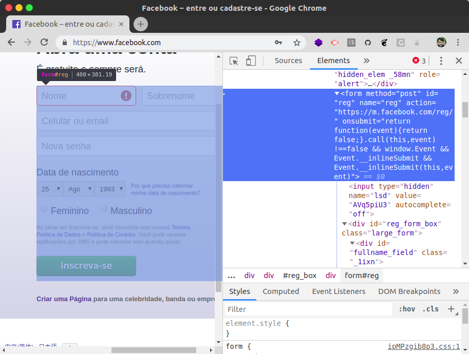
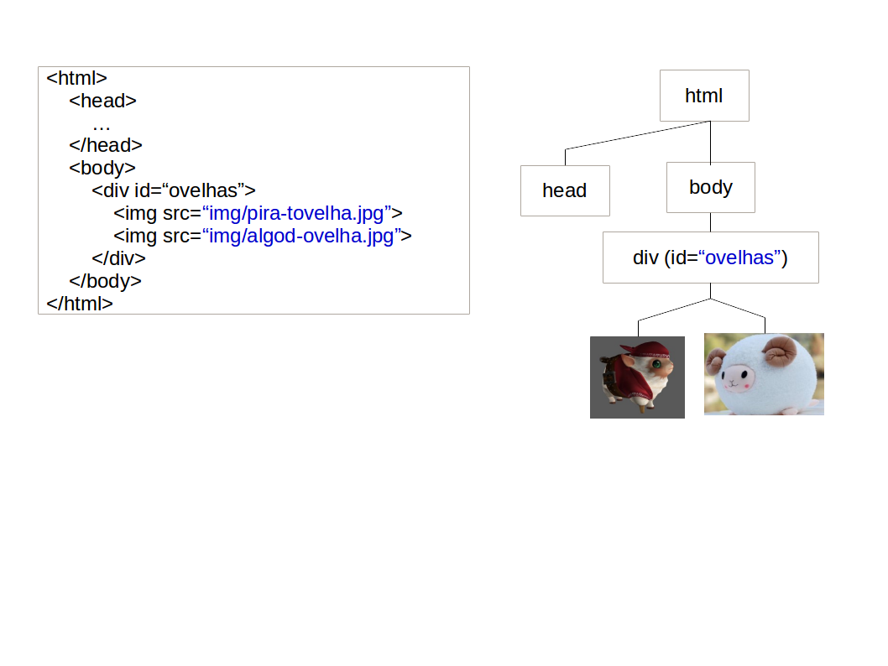
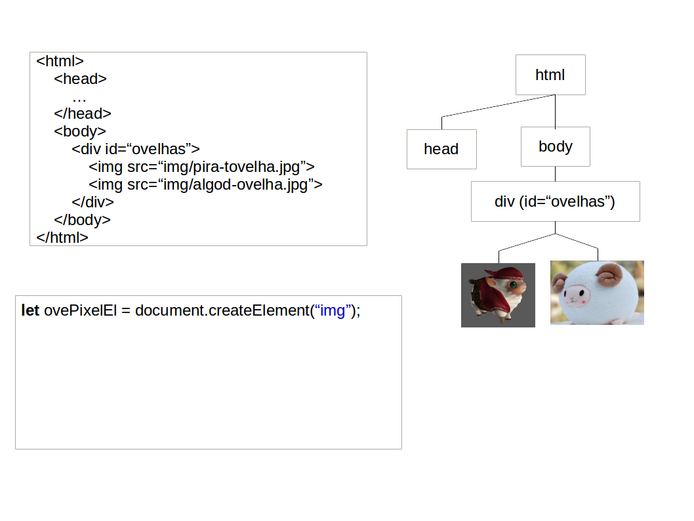
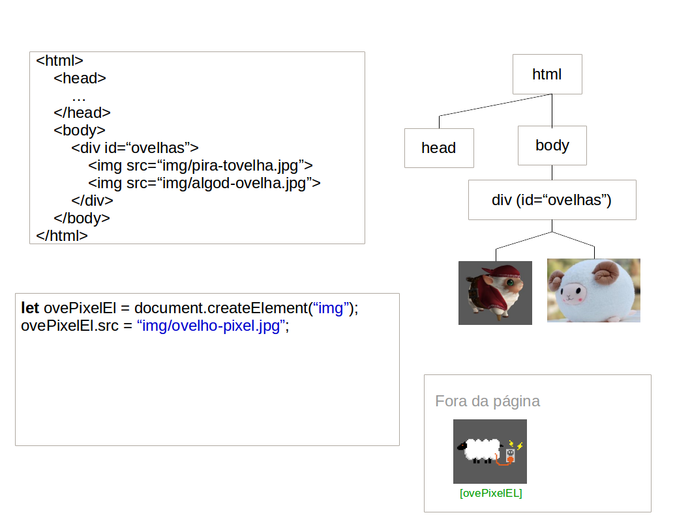
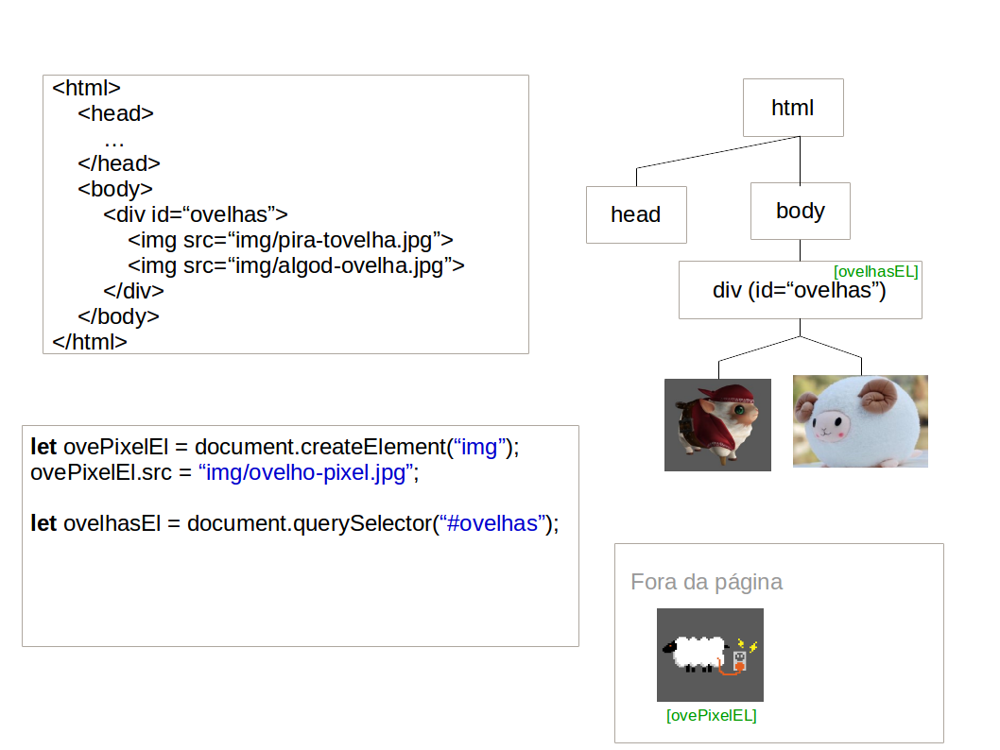
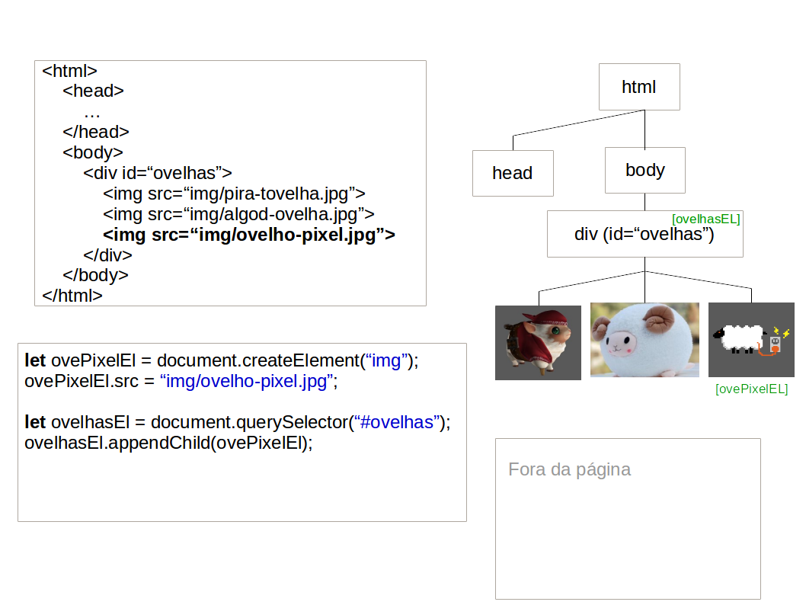
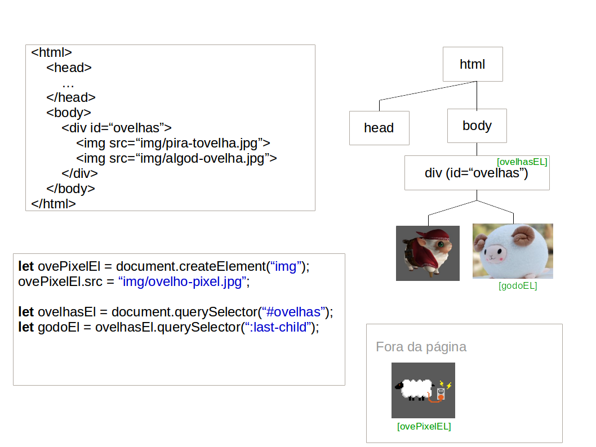
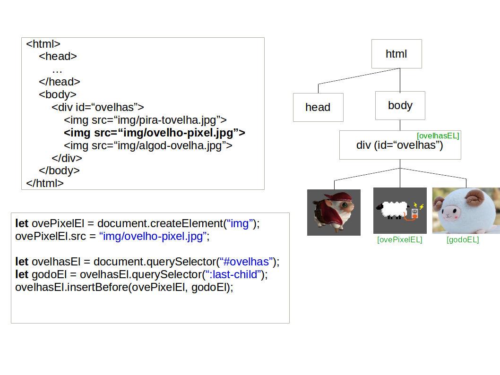
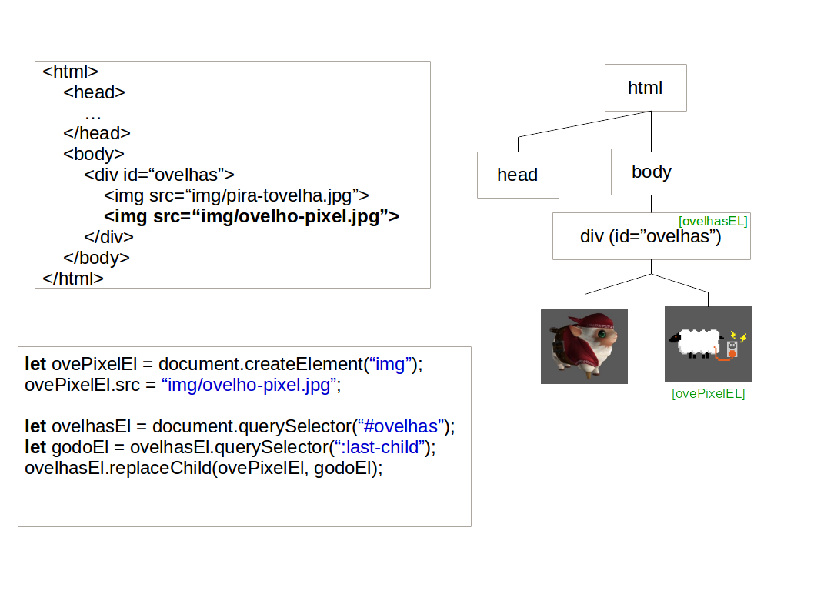
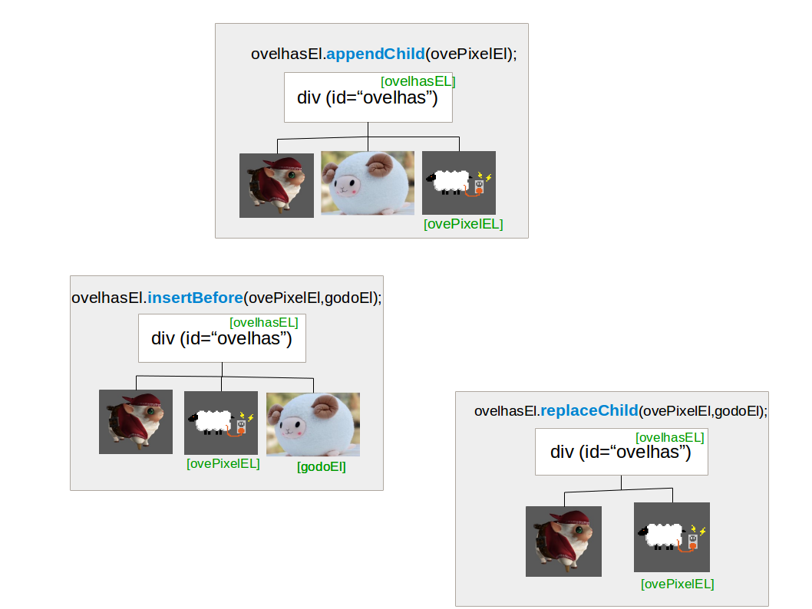

<!-- {"layout": "title"} -->
# **JavaScript** parte 6
## Formulários, criação dinâmica de elementos HTML<br>e a Lista de Tarefas 📓

---
<!-- {"layout": "centered"} -->
# Roteiro

1. [Formulários e validação](#formularios-e-validacao)
1. [Criando elementos HTML dinamicamente](#criando-elementos-html-dinamicamente)
1. [Lista de Tarefas](#lista-de-tarefas) :notebook:
   - Exemplo: [Albums de música](#albums-de-musica)

---
<!-- {"layout": "section-header", "hash": "formularios-e-validacao"} -->
# Formulários e Validação
## Enviando dados e verificando

- O elemento HTML **`<form></form>`** <!-- {ul:.content} -->
- Botões: _submit_, _reset_ e _button_
- Validação de campos e formulário

---
## O Elemento HTML `<form>...</form>`

- Um **formulário** é um conjunto de campos de dados (_i.e._, entrada/escolha)
  que pode ser **enviado** <!-- {.underline} --> a um servidor Web. Exemplos:
  -  <!-- {.push-right.bordered.rounded style="max-width: 450px"} -->
    Ao se cadastrar no Facebook (ou qualquer site)
  - Ao preencher e enviar um questionário
  - Ao editar seu perfil em algum site
- Além de **enviar os dados**, podemos também configurar os campos com
  algumas **restrições** (_e.g._, campo obrigatório)

---
## Formulário e Botões

- Um _form_ agrupa _inputs_ para, posteriormente, serem enviados a
  um servidor (por exemplo, para **cadastrar um usuário**):
  ```html
  <form action="cadastrar-usuario.php"> <!-- que "página" receberá os dados -->
    <label>Nome: <input name="nome" type="text"></label>
    <label>E-mail: <input name="email" type="email"></label>
    <label>Senha: <input name="senha" type="password"></label>

    <button type="submit">Enviar</button> <!-- veja no próximo -->
    <button type="reset">Limpar</button>  <!-- slide -->
  </form>
  ```
- Exemplo de [formulário](../../samples/form/index.html) <!-- {target="_blank"} -->

---
<!-- {"classes": "compact-code"} -->
## Botões de submissão e _reset_

- Dentro de um formulário, um botão do `type="submit"` envia os dados para
  o servidor: <button type="submit">Cadastrar</button>
  ```html
  <button type="submit">
    Cadastrar <!-- podemos colocar ícones nos botões =) -->
  </button>
  ```
- Um botão `type="reset"` volta os valores digitados para
  seus `value` padrão
  ```html
  <button type="reset">Limpar</button> <!-- muito pouco usado -->
  ```
- Também há botões que não fazem nada, mas podem ter algum comportamento
  associado (via JavaScript)
  ```html
  <button type="button">Ver detalhes</button> 
  <!-- type="button" é o padrão se fora de <form> -->
  ```

---
## Validação e Restrições nos Campos

- Podemos usar o atributo HTML `required` para marcar um campo como
  de preenchimento obrigatório:
  ```html
  <form action="verifica-login.php">
    <label>Digite seu login:
      <input type="email" id="email" required>
      <input type="password" id="senha" minlength="5" required>
    </label>
    <button type="submit">Entrar</button>
  </form>
  ```
  ::: result
  <form action="verifica-login.php">
    <label>Digite seu login:
      <input type="email" id="email" required size="10">
      <input type="password" id="senha" minlength="5"  required size="10">
    </label>
    <button type="submit">Entrar</button>
  </form>
  :::

---
## Outros Tipos de Restrições

| Tipo      	            | Código HTML                  	        | Exemplo                 	                   |
|-------------------------|---------------------------------------|--------------------------------------------- |
| Campo obrigatório 	    | `<input required>`                    | <form><input required size="5"><button>Enviar</button></form>     	|
| Quantidade de caracteres| `<input maxlength="2">`	              | <input maxlength="2" size="5"> 	|
| Número mínimo       	  | `<input type="number" min="5">`	      | <form><input type="number" min="5" style="width: 5em"><button>Enviar</button></form>	|
| Número máximo       	  | `<input type="number" max="10">`	    | <form><input type="number" max="10" style="width: 5em"><button>Enviar</button></form>	|
| Padrão                  | `<input pattern="[0-9]{4}">` | <form><input pattern="[0-9]{4}" size="5"><button>Enviar</button></form>     |
| Desabilitar             | `<input disabled>` | <input disabled size="5">     |

---
<!-- {"layout": "section-header", "hash": "criando-elementos-html-dinamicamente"} -->
# Criando<br>**Elementos HTML** Dinamicamente <!-- {h1:style="padding-top: 0"} -->
## Criando e removendo elementos na página

- De **2 formas** diferentes:
  1. Criando **elemento por elemento**
     - `createElement`
     - `insertBefore`, `replaceChild`, `appendChild`
     - `insertAdjacentElement`
  1. **HTML dentro de uma string**:
     - `innerHTML`
     - `createRange` + `createContextualFragment`
- Além disso, podemos:
  - **remover elementos**: `removeChild`, `remove` <!-- {ul^3:.content} -->

---
## Criando elementos dinamicamente

- É possível criar elementos dinamicamente, de duas formas:
  1. Definindo a propriedade de **`innerHTML` de um elemento** da árvore
     para **uma string descrevendo uma estrutura HTML** (já vimos):
     ```js
     let listaEl = document.querySelector('#lista-de-dados');
     listaEl.innerHTML = '<li></li>';
     ```
  1. Instanciando elementos e os adicionando ao DOM, que é feito em
     3 passos (detalhados a seguir):
     ```js
     // 1. Solicitamos ao document a criação de um elemento
     // 2. Configuramo-lo (atributos, id, classes etc.)
     // 3. Inserimo-lo na árvore
     ```

---
<!-- {"classes": "compact-code"} -->
# Instanciação de elementos HTML

- A função **document.createElement** cria um elemento HTML <!-- {ul:.no-margin.compact-code.bulleted-0} -->
  - Devemos especificar a _tag_ do elemento que iremos criar
- Exemplo - criação de uma imagem:
  ```js
  // 1. Solicitamos ao document a criação de um elemento
  let ovelhaEl = document.createElement('img');     // cria uma 
  // 2. Configuramos (atributos, id, classes etc.)
  ovelhaEl.src = 'images/ovelho-pixel.png';         // 
  ovelhaEl.classList.add('raca');                   // 
  ```
  - <!-- {ul^0:.no-margin} -->
    Resultado:
    ```HTML
    
    ```
- **Atenção**: você **criou** o elemento, mas <u>**ainda não
  o adicionou**</u> na árvore

---
<!-- {"classes": "compact-code-more"} -->
# Inserção do elemento na árvore DOM

- Para vincular o elemento criado, precisamos definir quem será o
  **pai**
- Logo após, podemos adicionar o elemento usando um dos comandos: <!-- {li:.bullet} -->
  1. `appendChild`: será o filho mais à direita
  1. `insertBefore`: será o filho que vem logo antes de outro
  1. `replaceChild`: substituirá um filho existente
  1. `insertAdjacentElement`: insere em posição especificada
- Exemplo com `pai.appendChild`: <!-- {li:.bullet} -->
  ```js
  let containerEl = document.querySelector('#ovelhas');
  let novaOvelhaEl = document.createElement('img');
  novaOvelhaEl.src = 'img/ovelho-pixel.png';
  containerEl.appendChild(novaOvelhaEl);
  ```

---
## Vinculação na árvore DOM com **(1) `appendChild`**

::: figure .figure-slides.clean.flex-align-center.medium-width.invert-colors-dark-mode
<!-- {.full-width.bullet.figure-step.bullet-no-anim} -->
<!-- {.full-width.bullet.figure-step.bullet-no-anim} -->
<!-- {.full-width.bullet.figure-step.bullet-no-anim} -->
<!-- {.full-width.bullet.figure-step.bullet-no-anim} -->
<!-- {.full-width.bullet.figure-step.bullet-no-anim} -->
:::

---
## Vinculação na árvore DOM com **(2) `insertBefore`**

::: figure .figure-slides.clean.flex-align-center.medium-width.invert-colors-dark-mode
<!-- {.full-width.bullet.figure-step.bullet-no-anim} -->
<!-- {.full-width.bullet.figure-step.bullet-no-anim} -->
<!-- {.full-width.bullet.figure-step.bullet-no-anim} -->
:::

---
## Vinculação na árvore DOM com **(3) `replaceChild`**

::: figure .figure-slides.clean.flex-align-center.medium-width.invert-colors-dark-mode
<!-- {.full-width.bullet.figure-step.bullet-no-anim} -->
<!-- {.full-width.bullet.figure-step.bullet-no-anim} -->
<!-- {.full-width.bullet.figure-step.bullet-no-anim} -->
:::

---
## Resumindo: `appendChild`, `insertBefore` e `replaceChild`


<!-- {p:.medium-width.centered} -->
<!-- {.full-width} -->

---
## Mais flexível: `insertAdjacentElement`

- Uma quarta forma, mais flexível, é `insertAdjacentElement(posicao, elemento)`
- O parâmetro `posicao` permite especificar a relação do novo elemento:
  1. <!-- {ol:.no-bullets.no-padding.no-margin.layout-split-2 style="justify-content: space-around"} -->
     ```js
     const posicao = 'beforebegin'
     const pai = document.querySelector('p')
     pai.insertAdjacentElement(posicao, elemento)
     ```
  1. ```html
     <!-- beforebegin -->
     <p>
       <!-- afterbegin -->
       conteúdo do parágrafo
       <!-- beforeend -->
     </p>
     <!-- afterend -->
     ```

---
## **Inserindo texto** nos elementos

- Podemos colocar texto nos elementos de 2 formas: <!-- {ul:.compact-code} -->
  1. Usando `document.createTextNode('texto aqui')`:
     ```js
     let bodyEl = document.querySelector('body');
     let pEl = document.createElement('p');
     let txtEl = document.createTextNode('Olá parágrafo!'); // <--
     bodyEl.appendChild(pEl);                   // põe o parágrafo em <body>
     pEl.appendChild(txtEl);                    // põe o texto no <p>
     ```
  1. Usando `elemento.innerHTML`:
     ```js
     let bodyEl = document.querySelector('body');
     let pEl = document.createElement('p');
     bodyEl.appendChild(pEl);                   // põe o parágrafo em <body>
     pEl.innerHTML = 'Olá parágrafo!';          // define o innerHTML do <p>
     ```

---
<!-- { "hash": "remocao-de-elementos", "classes": "compact-code"} -->
# Remoção de Elementos

- Usamos `containerEl.removeChild(el)` ou, para remover todos, `innerHTML`:  <!-- {ul:.compact-code} -->
  ```html
  <main>
    
  </main>
  ```
  ```js
  let mainEl = document.querySelector('main')
  let imgEl = document.querySelector('#urso')

  mainEl.removeChild(imgEl)      // remove a 
  // ou...
  imgEl.remove()                 // idem, porém não funciona on IE
  // ou...
  mainEl.innerHTML = ''          // remove tudo o que estiver em <main></main>
  ```

---
# Criação/inserção com template <small>(1/2)</small>

- Uma 2ª forma é atribuir código HTML para o `innerHTML` de um elemento
  <!-- {li:.two-column-code.compact-code-more} -->
  ```js
  const listaEl = document.querySelector('ul')
  const pessoa = {
    nome: 'Coutinho'
  }


  const template = `
    <div class="usuario">
      <li>${pessoa.nome}</li>
    </div>
    `
  listaEl.innerHTML += template
  ```
- Há uma **dificuldade**: como configurar elementos criados apenas no final?
  Classes e atributos: ok. Mas e eventos? <!-- {li:.note.warning} -->

---
## Criação/inserção com template <small>(2/2)</small>

- Podemos pedir ao navegador para gerar um **fragmento de DOM** e,
  assim, associar eventos antes de incluir os novos elementos na página
- Isso é feito com `document.createRange().createContextualFragment(template)`:
  <!-- {li:.two-column-code.compact-code-more} -->
  ```js
  const listaEl = document.querySelector('ul')
  const pessoa = {
    nome: 'Coutinho'
  }
  const template = `
    <div class="usuario">
      <li>${pessoa.nome}</li>
    </div>
    `
  // em vez disto, vamos criar um 'fragmento' antes
  //listaEl.innerHTML += template
  const usuarioEl = document.createRange()
    .createContextualFragment(template)

  // onclick no <li> que foi criado:
  usuarioEl.querySelector('li')
    .addEventListener('click', funcao)
  
  // em vez de innerHTML, appendChild:
  listaEl.appendChild(usuarioEl)

  ```

---
<!-- {"layout": "section-header", "hash": "lista-de-tarefas"} -->
# Lista de Tarefas :notebook:
## Saiba o que procrastinar a seguir

- Atividade de hoje
  - Exercício 1
  - Exemplo: albums de música
  - Exercício 2
  - Exemplo: lista telefônica
  - Exercício 3
<!-- {ul:.content} -->

---
<!-- {"backdrop": "lista-de-tarefas"} -->

---
# Lista de Tarefas :notebook:

- Crie um sisteminha de gerenciamento de tarefas :notebook:
  - [_Fork_ o repositório][todos] e veja as instruções
    detalhadas no arquivo `README.md`
- Há 4 atividades:
  0. Representar um vetor `tarefas` (contendo 2 inicialmente)
  1. Mostrar na página essas tarefas pré-existentes
  2. Permitir o usuário inserir novas tarefas
  3. (Opcional) Permitir a filtragem de tarefas por categoria
  4. (Opcional) Usar <kbd>Enter</kbd> para inserir também
  5. (Opcional) Concluir uma tarefa

[todos]: https://github.com/fegemo/cefet-web-todo/

---
## Exercícios 0 e 1: **repres. de dados e visual**

- No arquivo `tarefas.js` você deve representar um vetor de tarefas
  - Usando **objetos ad-hoc**, função construtora ou **classe**
  - A página não está mostrando elas na interface ainda
- Em seguida, crie uma função `insereTarefaNaPagina` que
  cria elementos referentes a 1 tarefa (repare o singular) 
  e os coloca na página

---
<!-- {"layout": "2-column-content", "hash": "albums-de-musica"} -->
## Exemplo: Albums de música

<iframe width="99%" height="490" src="//jsfiddle.net/fegemo/s1p824jd/embedded/result,html,js/" allowfullscreen="allowfullscreen" frameborder="0" class="bordered rounded"></iframe>
<iframe width="99%" height="490" src="//jsfiddle.net/fegemo/sgjn2yem/embedded/result,html,js/" allowfullscreen="allowfullscreen" frameborder="0" class="bordered rounded"></iframe>

---
## Exercício 2: **novas tarefas**

- Agora você deve permitir que o usuário **crie novas tarefas**
  1. No clique do botão:
     1. Crie um objeto que representa a nova tarefa
     1. Coloque esse objeto no vetor `tarefas`
     1. Chame a função `insereTarefaNaPagina`, passando o objeto
        da nova tarefa como argumento
     1. Opcionais bacanas:
        1. Limpe o `value` do campo de texto para que o usuário possa
           inserir a próxima tarefa
        1. Mova o foco da aplicação de volta para o campo de texto
           chamando `campoDeTextoEl.focus()`

---
## Exercício 3: filtragem por categoria

- Para finalizar, quando o usuário trocar o valor de `#filtro-de-categoria`,
  tornar as tarefas visualmente esmaecidas (alterne a classe `retida-no-filtro`)

Esta é uma oportunidade de exercitar métodos de programação funcional de vetores
<!-- {p:.note.info} -->

