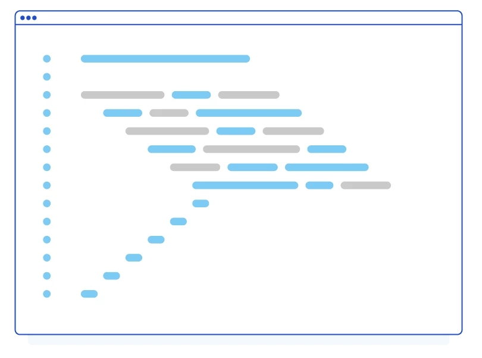

<!-- {"layout": "title"} -->
# **JavaScript** parte 7
## Destructuring, módulos, promessas, async/await

---
<!-- {"layout": "centered"} -->
# Na aula anterior...


---
<!-- {"layout": "centered"} -->
# Roteiro

1. [_Destructuring_](#destructuring)
1. [Módulos](#modulos)
1. [Promessas](#promessas)
1. [Async/await](#async-await)

---
<!-- {"layout": "section-header", "hash": "destructuring"} -->
# _Destructuring_
## Desconstruindo objetos/listas

- Propriedades curtinhas
- Motivação
- Exemplos
<!-- {ul:.content} -->

---
# Propriedades curtinhas

- As _shorthand property names_ são um açúcar sintático para propriedades de objetos
  1. <!-- {ol:.no-padding.no-bullets.no-margin.layout-split-2 style="justify-content: space-around"} -->
     Em vez disto:
     ```js
     let a = 'cat', 
         b = 2, 
         c = {};

     // sem usar o atalho:
     let obj = {a: a, b: b, c: c};
     ```
  1. Podemos fazer isto:
     ```js
     let a = 'cat', 
         b = 2, 
         c = {};

     // shorthand property names
     let obj = {a, b, c};
     ```

---
<!-- {"classes": "compact-code-more"} -->
# Motivação para _destructuring_

- Uma função pode retornar mais do que 1 coisa? <!-- {ul:.full-width.two-column-code} -->
  ```js
  function getPosicaoMouse() {
    return {x: getX(), y: getY()}
  }
  const posicao = getPosicaoMouse()
  console.log(posicao.x)
  console.log(posicao.y)
  ```
- Como saber os parâmetros de um `options`?
  ```js
  function filtraImagem(opcoes, imagem) {
    // ...
    if (opcoes.kernel === '3x3') {
      // ...
    }
    if (opcoes.padding > 0) {
      // ...
    }
  }
  const opcoes = {
    kernel: '5x5',
    padding: 0,
    shape: 'rect'
  }

  filtraImagem(opcoes, imagem)
  
  
  ```

---
<!-- {"layout": "2-column-content", "classes": "compact-code-more", "slideStyles": {"grid-template-columns": "0.4fr 1fr"}, "embeddedStyles": "#yay + pre {max-height:90%;}"} -->
# Destructuring <small>um objeto</small>

- Às vezes queremos que uma função tenha 1+ valores de retorno
- Ou então um função que espera um objeto que possua um certo formato
<!-- {ul:id="yay"} -->

```js
function desenhaGrafico({size = 'big', coords = { x: 0, y: 0 }, radius = 25} = {}) {
  console.log(size, coords, radius);
  // desenha aqui...
}

desenhaGrafico({
  coords: { x: 18, y: 30 },
  radius: 30
});


// do jeito old...
function desenhaGraficoES5(options) {
  options = options === undefined ? {} : options;
  var size = options.size === undefined ? 'big' : options.size;
  var coords = options.coords === undefined ? { x: 0, y: 0 } : options.coords;
  var radius = options.radius === undefined ? 25 : options.radius;
  console.log(size, coords, radius);
  // desenha aqui...
}

desenhaGraficoES5({
  cords: { x: 18, y: 30 },
  radius: 30
});
```

---
# Destructuring _arrays_

- Decapitando um _array_: <!-- {ul:.compact-code} -->
  ```js
  const [head, ...tail] = [1, 2, 3, 4];
  console.log(tail);                    // imprime [2, 3, 4]
  ```
  - Usa **destructuring** + o operador **spread**
- Trocando o valor de 2 variáveis sem usar uma terceira:
  ```js
  let a = 1;
  let b = 3;

  [a, b] = [b, a];                      // a=3, b=1
  ```

---
<!-- {"layout": "section-header", "hash": "modulos"} -->
# Módulos
## Organização de código

- Motivação/história
- Módulos ES6
- Importação dinâmica
- Módulos ES6 no navegador
<!-- {ul:.content} -->

---
# História

1. Ao longo dos anos 2000, a lógica das aplicações migrou para o _front-end_
   - Muito mais código JavaScript
   - Necessidade de organização
1.  <!-- {.push-right.medium-width} -->
   Problema:
   - Gestão de dependências "manual"
   - Poluição do _namespace_ global
   - Ambientes JavaScript fora do navegador
1. Diferentes soluções emergiram ao longo do tempo
   - AMD, CommonJS, UMD e Módulos ES6

---
# Módulos ES6

- Intenção de unificar módulos no navegador e em outros ambientes
- Cada módulo (arquivo) pode `import` o que outros módulos `export`
  - <!-- {ul:.layout-split-2.no-bullets.no-padding.no-margin style="gap: 1rem"} -->
    `math.js`:
    ```js
    export function fft1d(dados) {
      // ... calcula transformada
      // ...
      return resultado
    }
    ```
  - `processa-imagem.js`:
    ```js
    import { fft1d } from './math.js'

    export function compacta(imagem) {
      return fft1d(imagem.dados)
    }
    ```


---
# Módulos ES6 no navegador

- Para usar módulos no navegador:
  1. No arquivo HTML, inclua apenas o "ponto de entrada":
     ```html
       <script type="module" src="principal.js"></script>
     </body>
     </html>
     ```
  1. O navegador o baixará e, recursivamente, todos os que ele `import`
  1. `type="module"` instrui o navegador a considerar o arquivo como módulo
- Ganhamos gerência automática da ordem das dependências
- E também a "não poluição" do _namespace_ global

---
<!-- {"layout": "2-column-content", "classes": "compact-code-more"} -->
## Exemplo de **`export`** e `import`

```js
export const nome = 'quadrado';

export function desenha(ctx, tam, x, y, cor) {
  ctx.fillStyle = cor;
  ctx.fillRect(x, y, tam, tam);

  return {
    tamanho: tam,
    x,
    y,
    cor
  };
}
```

- Pode `export`:
  - Funções
  - `var`, `let`, `const`
  - Classes
- Outra sintaxe para exportar tudo:
  ```js
  export { nome, desenha }
  ```

---
## Exemplo de `export` e **`import`**

1. <!-- {ol:.flex-align-center.no-bullets.no-padding.no-margin} -->
   ```js
   import { nome, desenha } from './geometria/quad.js'
   import { area, perimetro } from './retangulos.js'

   let quad = desenha(canvasEl.ctx, 50, 50, 100, 'blue');
   area(quad.tamanho)
   perimetro(quad.tamanho)
   ```

- Pode `import` qualquer coisa que um módulo `export`
- Atenção ao `from`: deve ser um caminho relativo explícito ou completo <!-- {li:.note.info} -->

---
<!-- {"classes": "compact-code-more"} -->
## `import` e `export` padrão

- Caso um módulo exporte apenas 1 única coisa, ele pode defini-la como `export` padrão
- Quem fizer `import`, não precisará fazer _destructuring_. Exemplo:
  1. <!-- {ol:.no-bullets.no-padding.no-margin.layout-split-2.compact-code style="gap: 1rem"} -->
     `abelha.js`
     ```js
     export default class Abelha {
       static IMAGEM = 'imgs/abelha.gif'
       constructor(y) {
         this.y = y
       }
       desenha(ctx) {
         // ...
       }
       atualiza() {
         // ...
       }
     }
     ```
  1. `principal.js`
     ```js
     import Abelha from './abelhas.js'

     let abelhas = [
       new Abelha(Math.random()),
       new Abelha(Math.random()),
       new Abelha(Math.random())
     ]


     ```

---
# Importação dinâmica

- Adição mais recente, possibilita carregar módulos programaticamente (eg, condicionalmente)
  - Útil para carregar partes da aplicação apenas quando necessárias
  - Usa conceito de promessas (operação assíncrona)
- Exemplo: 
  ```js
  import('./filtros/convolucao.js')
    .then(modulo => {
      // módulo carregado
    }); 
  ```

---
<!-- {"layout": "section-header", "hash": "promessas"} -->
# Promessas
## Programação assíncrona

- _Loop_ de eventos
- Motivação
- Exemplos
<!-- {ul:.content} -->

---
# Motivação para promessas

Problema <!-- {dl:.width-20} -->
  ~  <!-- {.push-right style="width: 220px"} -->
    quando precisamos realizar várias chamadas assíncronas, podemos
    ter um **_callback hell_**: várias _callbacks_ aninhadas
    - Dificulta a leitura e escrita
    - Suscetível a erros do programador
    - Tratar erros apenas por _callback_, dificultando
      a legibilidade/manutenibilidade do código

Soluções
  ~ uso de promessas ou `async/await`

---
<!-- {"layout": "main-point", "state": "emphatic"} -->

# Exemplo usando a Star Wars API [🌐][swapi]

> Imprimir (4) todas as "pessoas"<br>(3) da mesma espécie do<br>(2) primeiro
>   residente do<br>(1) planeta Naboo

[swapi]: https://swapi.dev

---
# _Callback Hell_ <small>([no JSFiddle][jsf-callback])</small>

- Imprimir (4) todas as "pessoas" (3) da mesma espécie do (2) primeiro
  residente do (1) planeta Naboo (planeta `id=8`) <!-- {li:.compact-code-more} -->
  ```js
  sendAjax('https://swapi.dev/api/planets/8', planeta  => { // Naboo
    sendAjax(planeta.residents[0], residente => {           // R2-D2
      sendAjax(residente.species, especie => {              // Droid
        // pega todas as "pessoas" dessa espécie
        for (let pessoa of especie.people) {
          sendAjax(pessoa, p => {
            console.log(p.name + ', ')                      // ordem pode mudar!
          })
          // C-3PO, R2-D2, R5-D4, IG-88, BB8,
        }
      })
    })
  })
  ```

[jsf-callback]: https://jsfiddle.net/fegemo/mxu1bchp/

---
# Solução com **Promises** <small>([no JSFiddle][jsf-promise])</small>

- Imprimir (4) todas as "pessoas" (3) da mesma espécie do (2) primeiro
  residente do (1) planeta Naboo (planeta `id=8`)

```js
sendAjax('https://swapi.dev/api/planets/8')             // Naboo
  .then(planeta => sendAjax(planeta.residents[0]))      // R2-D2
  .then(residente => sendAjax(residente.species))       // Droid
  .then(especie => Promise.all(especie.people.map(pessoa => sendAjax(pessoa))))
  .then(pessoas => console.log(pessoas.map(p => p.name).join(', ')))
   // C-3PO, R2-D2, R5-D4, IG-88, BB8
  .catch(erro => console.error(`Deu ruim: ${erro}`));
```

[jsf-promise]: https://jsfiddle.net/fegemo/cxbguodz/

---
# Definição de **Promise**

- Uma **promise** é um objeto "_thenable_", _i.e._, podemos invocar `.then`,
  passando uma função que só será chamada quando a promessa for cumprida
  (com êxito ou falha)
  - `.then(callbackSuccess, callbackError)` pode receber 2 funções
  - ...ou podemos usar `.catch` para tratar o erro de uma "_promise chain_"
    de forma genérica
- É possível criar objetos do tipo `Promise` de forma que nós definimos
  quando elas estão resolvidas (com sucesso ou falha)
  - Próximo slide

---
# Criando uma **Promise** (exemplo)

- <!-- {ul:.two-column-code.full-width} -->
  Exemplo: aguardar 2s antes de fazer algo <!-- {ul:.compact-code-more} -->
  ```js
  function espera2s() {
    return new Promise(resolver => {
      setTimeout(resolver, 2000)
    })
  }
  espera2s()
    .then(() => console.log('2s depois'))


  ```
- Exemplo 2: aguardar `tempo` antes de fazer algo
  ```js
  function espera(tempo) {
    return new Promise(resolver => {
      setTimeout(resolver, tempo*1000)
    })
  }
  espera(5)
    .then(() => console.log('5s depois'))


  ```

---
<!-- {"layout": "section-header", "hash": "async-await"} -->
# Async/Await
## Assíncrono que parece síncrono

- Motivação
- `await` em vez de `.then`
- `async` para retornar `Promise`
- Tratando exceções
- Exemplos
- _Top-level `await`_
<!-- {ul:.content} -->

---
# Motivação: problemas com promessas

1. Promessas com `.then` encadeados reduzem (**mas não acabam**) com _callback hell_ 🔥
1. Há possibilidade de `.catch` **não capturar exceção**
   - Caso `.catch` seja atrasado (eg, devido a alguma espera na criação da promessa - [exemplo][promise-unhandled])
1. É difícil escrever um **fluxo condicional** em uma cadeia de promessas
1. **Depurar** ainda fica um pouco difícil com promessas
1. É possível **aumentar a legibilidade**, se o código parecer síncrono

[promise-unhandled]: https://jsfiddle.net/fegemo/g2h5rqem/

---
# Palavra-chave **`await`**

- <!-- {ul:.full-width.no-padding.no-bullets.no-margin.compact-code-more} -->
  ```js
  function espera(tempo) {
    return new Promise(resolver => {
      setTimeout(resolver, tempo*1000)
    })
  }
- <!-- {li:.two-column-code} -->
  ```js
  console.log('tempo = 0')
  await espera(2)   // <--
  console.log('tempo = 2')
  // tempo = 0
  // ...
  // tempo = 2 (2s depois)
  console.log('tempo = 0')
  espera(2).then(() => console.log('tempo = 2'))
  
  // tempo = 0
  // ...
  // tempo = 2 (2s depois)
  ```

1. `await` substitui o `.then`
1. Parece síncrono, mas suspende execução até a promessa ser cumprida
   - E isso não bloqueia a execução do processo (ie, é assíncrono)

---
## Retorno de `await funcao`

- <!-- {ul:.full-width.no-padding.no-margin.no-bullets.two-column-code.compact-code-more} -->
  ```js
  const db = {/*...*/}
  function dados(entidade) {
    return new Promise(resolver => {
      // faz algo assíncrono (eg, acessa banco ou ajax)
      // e resolve (cumpre) a promessa com o resultado
      resolver(db[entidade])
    })
  }

  // com await 🎉
  const noticia = await dados('noticias')
  const template = await formata(noticia)
  mostraNoticia(template)


  // com promise.then
  dados('noticias')
    .then(formata)
    .then(mostraNoticia)
  ```

1. O valor que é **resolvido** pela `Promise` é retornado
   pela função
1. ⬆️ Exemplo: pegar dados de notícias, criar um template e mostrar
   - 3x operações assíncronas em sequência:
     ```js
     mostraNoticia() << formata() << dados('noticia')
     ```

---
## Valores intermediários

- <!-- {li:.no-bullets.no-padding.compact-code-more.two-column-code} -->
  ```js
  // com await 🎉
  const noticia = await dados('noticia')
  const autor = await dados(`autor/${noticia.autor}`)
  mostraNoticia(noticia, autor)


  // com promise.then
  dados('noticia')
    .then(noticia => {
      return dados(`autor/${noticia.autor}`)
        .then(autor => mostraNoticia(noticia, autor))
    })
  ```
- Neste exemplo, o 3º passo depende tanto do 2º quanto do 1º
  - E o 2º depende do 1º:
    <!-- {li:.compact-code-more} -->
    ```js
    mostraNoticia() << noticia, autor
    autor << noticia
    ```
- Repare que, para usar valores intermediários usando `.then`,
  o código perde legibilidade
  - Com `await` o código parece síncrono (e fica mais legível)

---
# Tratando **erros**

- JavaScript possui `try / catch`, mas eles não funcionam com `Promise`
  - É necessário usar `.catch` ou passar uma `errorCallback` como 2º argumento para `.then`
- <!-- {li:.two-column-code.compact-code-more} -->
  Se usarmos `await`, podemos usar `try / catch` sem problemas:
  ```js
  // com await 🎉
  try {
    const noticia = await dados('noticias')
    const template = await formata(noticia)
    mostraNoticia(template)
  } catch (erro) {
    mostraUmaPropaganda()
    console.error(erro)
  }
  // com promise.catch
  dados('noticias')
    .then(formata)
    .then(mostraNoticia)
    .catch(erro => {
      mostraUmaPropaganda()
      console.error(erro)
    })

  ```

---
<!-- {"layout": "2-column-content"} -->
# Palavra-chave **`async`**

- Além do `await`, foi introduzida `async`
- `await` é permitido apenas dentro de funções `async`
  - Mas removemos essa restrição dentro de módulos ES6
- Ela **modifica a função fazendo retornar uma `Promise`**

1. São basicamente equivalentes:
   <!-- {ol:.two-column-code.compact-code-more.no-bullets.no-padding.no-margin} -->
   ```js
   // com async
   async function responder() {
     return 42
   }
   // promise explícita
   function responder() {
     return Promise.resolve(42)
   }
   ```
1. Função `async` sempre retorna uma `Promise`:
   ```js
   async function hello() {
     return 'Hello';
   }


   const b = hello();
   console.log(b);
   // ❌ [object Promise]

   b.then(texto => 
     console.log(texto))
   // ✅ 'Hello'
   ```

---
<!-- {"layout": "centered-horizontal", "classes": "compact-code-more"} -->
# `async/await` vs `Promise`

```js
try {
  const planeta = await sendAjax('https://swapi.dev/api/planets/8') // Naboo
  const residnt = await sendAjax(planeta.residents[0])              // R2-D2
  const especie = await sendAjax(residnt.species)                   // Droid
  const pessoas = await Promise.all(especie.people.map(pessoa => sendAjax(pessoa)))
  console.log(pessoas.map(p => p.name).join(', '))
  // C-3PO, R2-D2, R5-D4, IG-88, BB8
} catch(erro) {
  console.error(`Deu ruim: ${erro}`)
}
```
```js
sendAjax('https://swapi.dev/api/planets/8')                         // Naboo
  .then(planeta => sendAjax(planeta.residents[0]))                  // R2-D2
  .then(residnt => sendAjax(residnt.species))                       // Droid
  .then(especie => Promise.all(especie.people.map(pessoa => sendAjax(pessoa))))    
  .then(pessoas => console.log(pessoas.map(p => p.name).join(', ')))
   // C-3PO, R2-D2, R5-D4, IG-88, BB8
  .catch(erro => console.error(`Deu ruim: ${erro}`));
```

---
<!-- {"layout": "3-column-element-with-titles-expansible", "classes": "compact-code-more"} -->
## [Callbacks][jsf-callback]

```js
sendAjax('https://swapi.dev/api/planets/8', planeta  => { // Naboo
  sendAjax(planeta.residents[0], residente => {           // R2-D2
    sendAjax(residente.species, especie => {              // Droid
      // pega todas as "pessoas" dessa espécie
      for (let pessoa of especie.people) {
        sendAjax(pessoa, p => {
          console.log(p.name + ', ')
        })
        // C-3PO, R2-D2, R5-D4, IG-88, BB8,
      }
    })
  })
})
```

## [Promises][jsf-promise]

```js
sendAjax('https://swapi.dev/api/planets/8')             // Naboo
  .then(planeta => sendAjax(planeta.residents[0]))      // R2-D2
  .then(residente => sendAjax(residente.species))       // Droid
  .then(especie => Promise.all(especie.people.map(pessoa => sendAjax(pessoa))))
  .then(pessoas => console.log(pessoas.map(p => p.name).join(', ')))
   // C-3PO, R2-D2, R5-D4, IG-88, BB8
  .catch(erro => console.error(`Deu ruim: ${erro}`));
```

## [`async-await`][jsf-async-await]

```js
try {
  const planeta = await sendAjax('https://swapi.dev/api/planets/8')   // Naboo
  const residnt = await sendAjax(planeta.residents[0])      		      // R2-D2
  const especie = await sendAjax(residnt.species)       	            // Droid
  const pessoas = await Promise.all(especie.people.map(pessoa => sendAjax(pessoa)))
  console.log(pessoas.map(p => p.name).join(', '))
  // C-3PO, R2-D2, R5-D4, IG-88, BB8
} catch(erro) {
  console.error(`Deu ruim: ${erro}`)
}
```

[jsf-callback]: https://jsfiddle.net/fegemo/mxu1bchp/
[jsf-promise]: https://jsfiddle.net/fegemo/cxbguodz/
[jsf-async-await]: https://jsfiddle.net/fegemo/w5tcaxdq/

---
<!-- {"layout": "2-column-content", "classes": "compact-code-more"} -->
# Exemplo de **espera desnecessária**

```js
function espera(tempo) {
  return new Promise(resolver => 
    setTimeout(resolver, tempo))
}

async function quem() {
  await espera(200)
  return '🤡'
}

async function oque() {
  await espera(300)
  return 'espreita'
}

async function onde() {
  await espera(500)
  return 'nas sombras'
}
```

```js
async function mensagem1() { // ❌
  const a = await quem()
  const b = await oque()
  const c = await onde()

  console.log(`${a} ${b} ${c}`)
}
mensagem1() // depois de 1s:
// 🤡 espreita nas sombras


async function mensagem2() { // ✅
  const todas = Promise.all([quem(), oque(), onde()])
  const [a, b, c] = await todas 
  
  console.log(`${a} ${b} ${c}`)
}
mensagem2() // depois de 500ms:
// 🤡 espreita nas sombras
```

---
<!-- {"classes": "compact-code-more"} -->
# Cuidados com assincronia

- ::: figure .push-right
  ```js
  // ❌ espera sem precisar
  async function mensagem() {
    const a = await quem()
    const b = await oque()
    const c = await onde()

    console.log(`${a} ${b} ${c}`)
  }

  // ✅ faz a,b,c em paralelo
  async function mensagem() {
    const todas = Promise.all([
        quem(), oque(), onde()
      ])
    const [a, b, c] = await todas 
    
    console.log(`${a} ${b} ${c}`)
  }
  ```
  :::
  Quando atividades não possuem dependência entre si,
  **podemos executá-las em paralelo**
  - Usamos `Promise.all()` ou `Promise.allSettled()`
- Também há:
  - `Promise.race()`: resolve ou rejeita assim que a primeira resolve ou rejeita
  - `Promise.any()`: resolve quando a 1ª resolver
- **➡️** <!-- {.push-right} --> Exemplo: montar uma mensagem
  composta por 3 atividades independentes:
  ```js
  console.log << quem(), oque(), onde()
  ```

---
<!-- {"classes": "compact-code-more"} -->
# **_Top-level_** `await`

- `await` só podia ser usado dentro de funções `async`
  ```js 
  await Promise.resolve(console.log('🎉'));
  // → SyntaxError: await is only valid in async function

  (async function() {
    await Promise.resolve(console.log('🎉'));
    // → 🎉
  }());
  ```
- Mas há suporte incipiente para uso em _"top-level"_ de módulos ES6
  ```js
  await Promise.resolve(console.log('🎉'));
  // → 🎉
  ```

---
<!-- {"layout": "centered"} -->
# Referências

1. Na MDN:
   - [JavaScript modules na MDN](https://developer.mozilla.org/en-US/docs/Web/JavaScript/Guide/Modules)
   - [Destructuring](https://developer.mozilla.org/en-US/docs/Web/JavaScript/Reference/Operators/Destructuring_assignment)
   - [Promises](https://developer.mozilla.org/en-US/docs/Web/JavaScript/Reference/Global_Objects/Promise)
   - [Async](https://developer.mozilla.org/en-US/docs/Web/JavaScript/Reference/Statements/async_function)/[Await](https://developer.mozilla.org/en-US/docs/Web/JavaScript/Reference/Operators/await)
1. Livro Eloquent JavaScript:
   - [Capítulo 11: Async](https://eloquentjavascript.net/11_async.html)
1. Site Toptal
   - [Asynchronous JavaScript](https://www.toptal.com/javascript/asynchronous-javascript-async-await-tutorial)