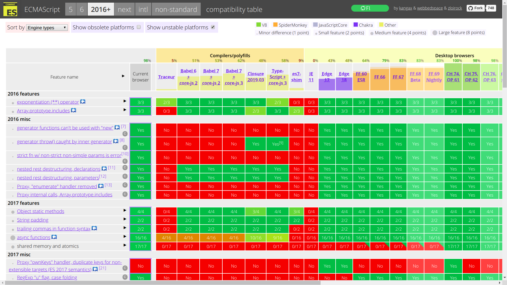

<!-- {"layout": "title"} -->
# Javascript parte 7
## ECMAScript 2015+

---
## Agenda

- Breve histórico do JavaScript
- Novas funcionalidades
  - Parâmetros _default_
  - Operadores _rest_ e _spread_
  - _Destructuring_
  - _String templates_
  - Promessas
  - Async/await
  - Módulos
- Executando novas funcionalidades hoje

---
# Breve histórico

1995
  ~ Brendan Eich criou JS para o Netscape

1996, Agosto
  ~ Micro$oft criou o JScript no IE e no IIS 3.0

1996, Novembro
  ~ Netscape enviou para a Ecma International -> ECMAScript

1997, Junho
  ~ ECMAScript 2

1999, Dezembro
  ~ ECMAScript 3

2009, Dezembro
  ~ ECMAScript 5

2011, Junho
  ~ ECMAScript 5.1

2014
  ~ ECMAScript 6

2015
  ~ ECMAScript 2015

2016
  ~ ECMAScript 2016+

---
<!--
{
  "scripts": ["../../scripts/classes/item-cloud.min.js"],
  "styles": ["../../styles/classes/item-cloud.min.css"],
  "layout": "regular"
}
-->

# Visão geral de funcionalidades

- Escopo de bloco
- Classes
- Parâmetros _default_
- _Destructuring_
- Operadores _Rest_ e _Spread_
- _Arrow functions_
- _Quasi-literals_
- _Generators_
- Módulos
- Promessas

<!-- {ul:data-state="itemcloud"} -->

---
# Usando novos recursos hoje

---
## _Can I Use_ caniuse.com?

- Ainda hoje, nenhum navegador suporta todas as funcionalidades do ES6
- Existe uma tabela curada que mostra a compatibilidade por _feature_:
   <!-- {.block.centered style="height: 240px;"} -->

- Veja na [ECMAScript 6 _compatibility table_](http://kangax.github.io/es5-compat-table/es6/) do Kangax
- Veja na [ECMAScript 2016+ _compatibility table_](http://kangax.github.io/es5-compat-table/es2016plus/) do Kangax

---
## Usando novos recursos hoje

- Podemos usar um **_transpiler_** para transformar ES6+ em ES5!!
- O mais usado hoje em dia é o [babel](https://babeljs.io/), que bastante
  agilmente implementa os _specs_ ES6
   <!-- {.block.centered style="height: 240px;"} -->
- Aqui está a
  [lista de funcionalidades](https://babeljs.io/docs/learn-es2015/#ecmascript-6-features)
  suportadas pelo babel

---
# Funcionalidades não cobertas

- ES Modules
- Generators
- Async/await

---
# Aprenda mais

1. [Understanding ECMAScript 6](https://leanpub.com/understandinges6/read)
1. [Use ECMAScript 6 Today, at tutsplus.com](http://code.tutsplus.com/articles/use-ecmascript-6-today--net-31582)
1. [Examples of use of let, const and optional params](http://peter.michaux.ca/articles/javascript-is-dead-long-live-javascript)
1. [ECMAScript 6 compatibility table](http://kangax.github.io/es5-compat-table/es6/)
1. [ES6 Classes](http://www.2ality.com/2012/07/esnext-classes.html)

---
## Aprenda mais ainda

1. [ES6 Modules](http://www.infoq.com/news/2013/08/es6-modules)
1. [A Critical Review of quasi-literals](http://www.nczonline.net/blog/2012/08/01/a-critical-review-of-ecmascript-6-quasi-literals/)
1. [Destructuring Assignment in ECMAScript 6](http://fitzgeraldnick.com/weblog/50/)
