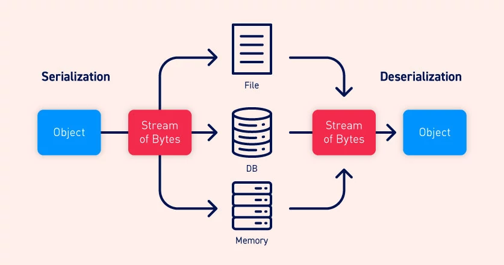
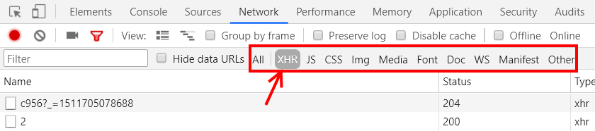

<!-- {"layout": "title"} -->
# **JavaScript** parte 8
## JSON, Web Storage, Ajax e Star Wars :stars:

---
<!-- {"layout": "centered"} -->
# Roteiro

1. [JSON](#json)
1. [Web Storage](#web-storage)
1. [Ajax](#ajax)
1. [Guerras Estelares](#guerras-estelares) 🌠

---
<!-- {"layout": "section-header", "hash": "json"} -->
# JSON
## Notação de objetos em JavaScript

- Origem e características
- Comparação com XML
- JSON no navegador
<!-- {ul:.content} -->

*[JSON]: JavaScript Object Notation
*[XML]: eXtensible Markup Language

---
<!-- {"classes": "compact-code-more"} -->
# Origem e características do JSON

*[JSON]: JavaScript Object Notation
*[XML]: eXtensible Markup Language
*[CSV]: comma-separated values
*[YAML]: YAML Ain't Markup Language

- ::: figure .floating-portrait-container.push-right
  
  :::
  JSON é um formato leve de troca de dados
- Usos:
  - (a) troca de informação entre programas em
  diversas linguagens (assim como o XML, CSV, YAML)
  - (b) serialização de dados
- Baseado na notação literal de objetos do JavaScript
- Criado por [Douglas Crockford](http://tools.ietf.org/html/rfc4627) ➡️
- É codificado como texto puro. Exemplo:
  `produto.json`
  ```json
  {
    "idProduto": 44235,
    "cores": ["azul", "verde"]
  }
  ```

---
# Formato JSON

*[JSON]: JavaScript Object Notation

- O formato possui apenas 6 tipos de valores:
  - Objetos
  - _Arrays_
  - `String`
  - `Number`
  - `Boolean`
  - `null` <!-- {ul:.multi-column-list-4} -->
- Um objeto JSON é como um objeto JavaScript: um _container_ de
  propriedades (nome, valor)
  - Um **nome de propriedade** é sempre uma **_String_ entre <u>áspas
    duplas</u>**
  - Um valor pode ser de qualquer tipo dos listados acima
- Toda string deve usar aspas duplas
- Espaço em branco ou quebras de linha não alteram a semântica

---
<!-- {"layout": "centered-horizontal"} -->
## **JSON** vs XML

*[JSON]: JavaScript Object Notation*
*[XML]: eXtensible Markup Language*

```json
[
  {
    "nome": "JavaScript - The Good Parts",
    "autores": ["Douglas Crockford"],
    "ano": 2005
  },
  {
    "nome": "Node.js in Action",
    "autores": ["Mike Cantelon", "Mark Harter"],
    "ano":  2014
  }
]
```
- 216 caracteres

---
<!-- {"layout": "centered-horizontal", "state": "show-active-slide-and-previous", "containerStyles": {"--show-2-slides-x-distance": "300px", "--show-2-slides-z-distance": "-440px"}} -->
## JSON vs **XML**

*[JSON]: JavaScript Object Notation*
*[XML]: eXtensible Markup Language*

```xml
<livros>
  <livro nome="JavaScript - The Good Parts" ano="2005">
    <autores>
      <autor>Douglas Crockford</autor>
    </autores>
  </livro>
  <livro nome="Node.js in Action" ano="2014">
    <autores>
      <autor>Mike Cantelon</autor>
      <autor>Mark Harter</autor>
    </autores>
  </livro>
</livros>
```
- 319 caracteres (48% maior)

---
<!-- {"layout": "centered-horizontal"} -->
# Serialização e Desserialização

 <!-- {.medium-width.rounded.bordered} -->
<!-- {p:.center-aligned} -->

---
# JSON no navegador

- O objeto `window` possui o objeto `JSON` que contém métodos de conversão
  do formato JSON entre _string_ e objetos JavaScript
  - De JavaScript para _string_ (serialização):
    ```js
    JSON.stringify({ nome: 'Flavio', sobrenome: 'Coutinho' });  // JSON.stringify
    // retorna '{"nome":"Flavio","sobrenome":"Coutinho"}'
    ```
  - De _string_ para JavaScript (desserialização):
    ```js
    let banco = JSON.parse('{"nome":"Itaú","codigo":"341"}');   // JSON.parse
    console.log(banco.nome);
    // imprime Itaú
    ```

---
# Serialização: JSON.**stringify**(...)

```js
JSON.stringify({})                    // '{}'
JSON.stringify(true)                  // 'true'
JSON.stringify('foo')                 // '"foo"'
JSON.stringify([1, 'false', false])   // '[1,"false",false]'
JSON.stringify({ x: 5 })              // '{"x":5}'
JSON.stringify({ x: 5, y: 6 })        // '{"x":5,"y":6}' ou '{"y":6,"x":5}'
```
```js
JSON.stringify({ uno: 1, dos: 2 }, null, 4); // <-- parâmetro spacer       
// saída formatada 🌟:
// '{
//      "uno": 1,
//      "dos": 2
// }'
```

---
# Desserialização: JSON.**parse**(...)

- <!-- {ul:.no-padding.no-bullets.full-width} -->
  ```js
  JSON.parse('{}')                        // {}
  JSON.parse('true')                      // true
  JSON.parse('"foo"')                     // "foo"
  JSON.parse('[1, 5, "false"]')           // [1, 5, "false"]
  JSON.parse('null')                      // null
  JSON.parse('{"x": 25,"y":"inválido"}')  // {x: 25, y: 'inválido'}
  ```


---
<!-- {"layout": "section-header", "hash": "web-storage"} -->
# **Web Storage**
## Salvando dados na página

- Por que e o que salvar?
- O Web Storage
  - `localStorage`
  - `sessionStorage`
<!-- {ul^1:.content} -->

---
# **Por que** e **o que** salvar?

- As nossas páginas podem querer salvar várias coisas:
  1. Exemplo: Moodle
     - **Motivo**: manter preferências do usuário sobre a interface
     - **O que salvar?** o que está aberto/fechado, a língua etc
  1. Exemplo: Slides da aula
     - **Motivo**: mostrar o "tutorial" apenas 3x
     - **O que salvar?** quantas vezes já mostrou o tutorial
  1. Exemplo: Trello
     - **Motivo**: guardar um "rascunho" que ainda não foi salvo
     - **O que salvar?** o conteúdo digitado pelo usuário

---
## O Web Storage

- O Web Storage permite páginas **armazenarem dados <u>
  no navegador</u>**
  - _storage_ === armazenamento
- Existem dois sabores:
  1. `localStorage`, salva os dados <u>"para sempre"</u>
  1. `sessionStorage`, salva <u>apenas "durante a sessão"</u>
- Os dados são salvos **apenas no próprio navegador** <!-- {li^0:.note} -->
  - Isto é, se você abrir a página em <u>outro</u> navegador ou computador,
    ainda não existem dados salvos
- Tamanho de cada um: ~10MB por _origin_
  - Lança exceção se estiver cheio

---
<!-- {"hash": "local-storage"} -->
## `localStorage` e `sessionStorage`

- Ambos nos permitem **armazenar valores dentro de _Strings_** <!-- {ul:.bulleted} -->
- Cada item armazenado é composto por **uma chave (nome) e um valor**
  - Exemplo (salvando):
    ```js
    localStorage.setItem('personagem', 'Jake');
    localStorage.setItem('quest', 'Salvar a Jujuba');
    ```
  - Exemplo (recuperando):
    ```js
    let nome = localStorage.getItem('personagem'); // retorna "Jake"
    let objetivo = localStorage.getItem('quest');  // retorna "Salvar a Jujuba"
    ```

---
<!-- {"layout": "2-column-content"} -->
## **localStorage**

- O navegador **armazena permanentemente**, ou até que o usuário limpe: <!-- {ul.bulleted} -->
     <!-- {img:.push-right style="max-height: 200px"} -->
1. É possível inspecionar o que foi salvo na aba _Application_:

   <video src="https://fegemo.github.io/cefet-front-end/videos/local-storage-hora-aventura.webm" controls preload width="482" height="262"></video>

---
## Exemplo de uso do **localStorage** <small>(1/2)</small>

- Um evento de clique em um botão que **faz o menu aparecer e desaparecer**:
  ```js
  // ...
  botaoMenuEl.addEventListener('click', function() {
    let menuEl = document.querySelector('#menu'),
      isExpandido = menuEl.classList.toggle('expandido');

    // isExpandido = true ou false
    localStorage.setItem('menu-esta-expandido', isExpandido);
  });
  ```
  - (continua no próximo slide)

---
## Exemplo de uso do **localStorage** <small>(2/2)</small>

- Após a página ter sido carregada (ex, um _script_ ao final do _body_):
  ```js
  let devoExpandirMenu = localStorage.getItem('menu-esta-expandido');

  if (devoExpandirMenu === 'true') {        // lembre-se: tudo é salvo como String
    let menuEl = document.querySelector('#menu');
    menuEl.classList.add('expandido');
  }
  ```
  - Ou seja, expande o menu se o usuário o havia deixado expandido antes

---
## Principais métodos do **localStorage**

- Salvar alguma coisa: <!-- {ul:.full-width} -->
  ```js
  localStorage.setItem('chave', 'valor');
  ```
- Recuperar um item a partir de sua chave:
  ```js
  localStorage.getItem('chave');
  ```
- Excluir um item:
  ```js
  localStorage.removeItem('chave');
  ```

---
<!-- {"hash": "session-storage"} -->
## **sessionStorage**

- Exata mesma funcionalidade do `localStorage`, porém o navegador armazena
  as informações apenas enquanto o **usuário está "em uma sessão"**
  - Uma sessão é encerrada:
    1. Com o usuário digitando outro endereço na barra
    1. O navegador fechando
    1. O usuário navegando para outro domínio naquela mesma janela/aba
- Os métodos do `sessionStorage` são os mesmos do `localStorage`

---
## Formato de armazenamento

- Como dito, o _web storage_ armazena apenas _Strings_
  - Mas seria útil armazenar objetos complexos. Por exemplo: <!-- {ul^0:.bulleted-0} -->
    ```js
    const jogo = { fase: 4, vidas: 5, jogador: 'Ariosvaldo' };
    localStorage.setItem('estado-do-jogo', jogo);

    console.log(localStorage.getItem('estado-do-jogo'));
    // Saída no console: "[object Object]"
    ```
  - Isso acontece porque existe `Object.prototype.toString` que é um
    método que sempre retorna `"[object Object]"` 
---
## Armazenando objetos serializados

- Na verdade, precisamos **serializar e desserializar** objetos em
  _Strings_, usando algo como JSON
  - Salvando:
    ```js
    localStorage.setItem('estado-do-jogo', JSON.stringify(jogo));
    // Salvou: {"fase":4,"vidas":5,"jogador":"Ariosvaldo"}"
    ```
  - Recuperando:
    ```js
    const jogo = localStorage.getItem('estado-do-jogo');
    jogo = JSON.parse(jogo);
    ```

*[JSON]: JavaScript Object Notation*

---
<!-- {"layout": "section-header", "hash": "ajax"} -->
# Ajax
## Requisições **assíncronas**

 <!-- {.medium-width.centered.block} -->

1. Exemplo antigão (`XMLHttpRequest`)
1. Exemplo com jQuery
1. Exemplo com fetch  <!-- {.on-line.bouncing-left} -->
<!-- {ol:.content} -->

---
## Ajax

- É a sigla para _Asynchronous JavaScript and XML_ <!-- {ul:.bullet} -->
  - Um nome melhor seria **requisição assíncrona**
- Surgiu no Internet Explorer, nos anos 2000,
  por [Jesse Gareth][ajax-article]
- Originalmente, usava-se JavaScript para fazer uma requisição de dados ao
  servidor, que respondia no formato XML (em vez de HTML)
- Hoje em dia, **responde-se com** qualquer objeto reconhecido pelo navegador
  (o mais comum é **JSON**)
- Podemos ver as requisições Ajax (XHR) da página: <!-- {li:.bullet} -->
   <!-- {.centered.bordered.rounded} -->

[ajax-article]: http://www.adaptivepath.org/ideas/ajax-new-approach-web-applications/
*[Ajax]: Asynchronous JavaScript and XML*
*[XML]: eXtensible Markup Language*
*[XHR]: XMLHttpRequest*

---
<!-- {"hash": "ajax-vanilla-1", "backdrop": "oldtimes"} -->
## (1) O **`XMLHttpRequest`** <small>(antigão)</small>

- Cada requisição Ajax é um objeto `XMLHttpRequest`. Exemplo do Twitter:
  ```js
  let requisicao = new XMLHttpRequest();
  requisicao.onreadystatechange = callbackMaisTweets;
  requisicao.responseType = 'json';
  requisicao.open('GET', '/tweets/pagina/5');
  requisicao.send();
  ```
- Uma _callback_ (definida em `onreadystatechange`) é invocada a cada **mudança
  de estado** da requisição (veja nos próximos 2 slides)
- [Referência](https://developer.mozilla.org/pt-BR/docs/Web/API/XMLHttpRequest) e [Tutorial](https://developer.mozilla.org/pt-BR/docs/Web/API/XMLHttpRequest/Usando_XMLHttpRequest) na MDN

---
<!-- {"layout": "centered-horizontal", "hash": "ajax-vanilla-2", "backdrop": "oldtimes"} -->
```js
function callbackMaisTweets() {
  if (requisicao.readyState === 4) {  // 4: DONE (resp. recebida)
    if (requisicao.status === 200) {  // 200: código Ok do HTTP
      // a resposta chegou e foi um arquivo
      // .json com um array de tweets:
      let novosTweets = requisicao.response.arrayComNovosTweets;
      novosTweets.forEach(colocaTweetNaPagina);
    } else {
      console.log('Erro ao carregar mais tweets. Código HTTP: '
        + requisicao.status);
    }
  }
}
```
- Invocada **a cada alteração** de estado
  - da requisição `XMLHttpRequest`

---
<!-- {"layout": "centered", "state":"show-active-slide-and-previous", "containerStyles": {"--show-2-slides-x-distance": "310px", "--show-2-slides-z-distance": "-400px", "--show-2-slides-rotation": "10deg"}, "backdrop": "oldtimes"} -->

- A resposta foi isto:
```json
{
  "quantidade": 20,
  "arrayComNovosTweets": [
    {
      "autor": "Sensacionalista",
      "texto": "Grupo de feministas pró-Bolsonaro
                cria novo grupo: Vegetarianos
                pró carne mal passada",
      "curtidas": 2
    } /* mais 19 tweets aqui... */
  ]
}
```

---
<!-- {"backdrop": "oldtimes"} -->
## Estados de um `XMLHttpRequest`

**0	`UNSENT`**
  ~ `open()` ainda não foi invocado

**1	`OPENED`**
  ~ `send()` ainda não foi invocado

**2	`HEADERS_RECEIVED`**
  ~ `send()` foi invocado e os cabeçalhos da resposta
  já estão disponíveis (chegaram)

**3	`LOADING`**
  ~ fazendo _download_ da resposta

**4	`DONE`**
  ~ operação finalizada

- Basicamente, precisamos de fazer algo apenas quando a requisição chega
  ao estado **4 `DONE`**

---
<!-- {"layout": "2-column-content"} -->
## Exemplo do Fumaceiro <small>(versão [_vanilla js_][fumaceiro])</small>

 <!-- {.bordered.rounded style="max-width: 100%; box-shadow: 3px 3px 3px silver"} -->

- Uma página de um jogo com **informações + avaliações**
- Como nem todos usuários lêem avaliações, elas não são carregadas inicialmente
  - Isso foi feito para **carregar a página mais rápido**
- Ao clicar no botão "Mostrar avaliações", fazemos uma **requisição Ajax
  para pegá-las** e, então, as mostramos

[fumaceiro]: https://fegemo.github.io/cefet-front-end-ajax/

---
<!-- {"layout": "centered", "classes": "compact-code"} -->
```js
// no clique, faz um Ajax para pegar o xcom-reviews.json
showReviewsEl.addEventListener('click', () => {
  let requisicao = new XMLHttpRequest();
  requisicao.open('GET', 'xcom-reviews.json');
  requisicao.responseType = 'json';
  requisicao.onreadystatechange = () => {
    // chegando a resposta, põe as avaliações na página
    if (requisicao.readyState === 4) {
      if (requisicao.status === 200) {
        // a resposta é um objeto js que tem 'avaliacoes'
        let avaliacoes = requisicao.response.avaliacoes;

        reviewsEl.innerHTML = '';
        avaliacoes.forEach(criaAvaliacaoNaPagina);
      }
    }
  }

  requisicao.send();
});
```

---
<!-- {"state": "show-active-slide-and-previous"} -->
```json
{
  "avaliacoes": [
    {
      "autor": "Astolfo Lombardi",
      "recomenda": true,
      "comentario": "Um jogo de ETs sinistrões",
      "curtidas": 18
    },
    {
      "autor": "Eymael Fortunato",
      "recomenda": true,
      "comentario": "Rola uma parada sadia entre
                     humanos e aliens neste jogo #sqn",
      "curtidas": 7
    } /* ...+2 avaliações */
  ]
}
```

---
<!-- {"hash": "ajax-jquery"} -->
## (2) Ajax mais facinho **com jQuery**

- O jQuery possui uma abstração do objeto `XMLHttpRequest` para facilitar a
  realização de requisições Ajax. Exemplo:
    ```js
    $.ajax({
      url: '/tweets/pagina/5',
      dataType: 'json',
      success: resposta => {
        let novosTweets = resposta.arrayComNovosTweets;
        novosTweets.forEach(colocaTweetNaPagina);
      }
    });
    ```
  - Existe [`$.getJSON({...})`][jquery-getjson], equivalente a
    [`$.ajax({...})`][jquery-ajax] com o `dataType: 'json'`

[jquery-getjson]: http://api.jquery.com/jQuery.getJSON/#jQuery-getJSON-url-data-success
[jquery-ajax]: http://api.jquery.com/jquery.ajax/#jQuery-ajax-url-settings

---
## Exemplo do Fumaceiro <small>(versão [jQuery][fumaceiro-jquery])</small>

```js
$('#show-reviews').click(() => {
  $.ajax({
    url: 'xcom-reviews.json',
    dataType: 'json',
    success: resposta => {
      // a resposta é um objeto js que contém uma propriedade avaliacoes
      let avaliacoes = resposta.avaliacoes;
      // limpamos a <div id="reviews">...</div>
      $reviews.empty();
      // percorremos as avaliacoes, colocando elementos na página
      avaliacoes.forEach(criaAvaliacaoNaPagina);
    }
  });
});
```

[fumaceiro-jquery]: https://fegemo.github.io/cefet-front-end-ajax/index-jquery.html

---
<!-- {"hash": "fetch"} -->
## (3) Ajax usando **fetch**  <!-- {.on-line.bouncing-left} -->

- Mais recentemente, foi introduzida nova forma: `fetch(...)` <!-- {ul:.full-width} -->
- Ele envia uma requisição Ajax e retorna uma **Promessa**
  > **Promessa**: algo que pode dar certo, ou errado.
  > <cite>Coutinho</cite>
- Formato:
  ```js
  fetch(url, opcoes)
    .then(callbackSucesso)
    .catch(callbackErro);
  ```
- Referência do [Fetch na MDN][fetch-mdn]

[fetch-mdn]: https://developer.mozilla.org/en-US/docs/Web/API/Fetch_API/Using_Fetch

---
## Exemplo do Fumaceiro <small>(versão [fetch][fumaceiro-fetch])</small>

```js
showReviewsEl.addEventListener('click', () => {
  fetch('xcom-reviews.json')                        // retorna uma *promessa*
    .then(resposta => resposta.json())              // lê a resp. como JSON
    .then(dados => {
      // a resposta é um objeto js que contém uma propriedade avaliacoes
      let avaliacoes = dados.avaliacoes;

      reviewsEl.innerHTML = '';
      avaliacoes.forEach(criaAvaliacaoNaPagina);      
    });
  });
});
```

[fumaceiro-fetch]: https://fegemo.github.io/cefet-front-end-ajax/index-fetch.html

---
## `fetch` ([na MDN][mdn-fetch])

- `fetch(url, opcoes)` retorna uma promessa
  - `url` é para onde a requisição será enviada
  - `opcoes` serão mostradas no próximo slide
- A promessa retornada é resolvida como uma [`Response`][mdn-response],
  que pode ser lida de diferentes formas:
  - **`response.json()`**
  - `response.text()`
  - `response.arrayBuffer()`
  - `response.blob()`
  - `response.formData()` <!-- {ul^0:.multi-column-list-3} -->
- <!-- {li:.two-column-code} -->
  Exemplos:
  ```js
  // usando .then, lendo como json
  fetch('https://lalala.com/users')
    .then(resposta => resposta.json())
    .then(dados => console.log(dados))
  // usando async/await (como json)
  const resposta = await fetch('htt...')
  const dados = await resposta.json()
  console.log(dados)
  ```

[mdn-fetch]: https://developer.mozilla.org/en-US/docs/Web/API/Fetch_API/Using_Fetch
[mdn-response]: https://developer.mozilla.org/en-US/docs/Web/API/Response

---
<!-- {"layout": "centered-horizontal"} -->
# Algumas opções de `fetch`

```js
fetch(url, {
    method: 'POST', // *GET, POST, PUT, DELETE, etc.
    headers: {
      'Content-Type': 'application/json'
      // 'Content-Type': 'application/x-www-form-urlencoded',
    },
    redirect: 'follow', // manual, *follow, error
    body: JSON.stringify(data) // deve ter mesmo "Content-Type" do header
  })
  .then(resposta => resposa.json())
  .then(....)
}
```

---
<!-- {"layout": "section-header", "hash": "guerras-estelares"} -->
# Guerras Estelares :stars:
## Intro nas estrelas

- Usos comuns de Ajax
- Atividade de hoje
<!-- {ul:.content} -->

---
<!-- {"backdrop": "starwars"} -->

---
## Usos comuns de Ajax

- Pegar novas informações depois que a página carregou. Exemplos:
  - Carregar mais _tweets_
  - Carregar mais produtos
  - Carregar avaliações, comentários
  - Carregar a próxima fase de um jogo
- Avisar ao _back-end_ que algo mudou, sem sair da página. Exemplos:
  - Botão curtir
  - Enviar um comentário
  - Adicionar produto ao carrinho
- Pegar informações **de outros sites** (se eles permitirem)
  - Basta usar uma URL absoluta, por exemplo, colocando
    [`https://swapi.dev/api/films/1/`][swapi-example] como a URL

[swapi-example]: https://swapi.dev/api/films/1/

---
# Intro nas Estrelas

- Vamos criar um letreiro Star Wars \o/
- Você deve escrever código JavaScript para fazer uma chamada Ajax para
  uma API pública com informações sobre Star Wars
  - Disponível em https://swapi.dev/
- Mais instruções no Moodle ou [na atividade][guerras-estelares]

[guerras-estelares]: https://github.com/fegemo/cefet-web-starwars


---
<!-- {"layout": "centered"} -->
# Referências

1. Capítulo 12 do livro "Head First: JavaScript"
1. Apêndice E do livro "JavaScript - The Good Parts"
1. Mozilla Developer Network (MDN)
   - [`JSON.stringify()`](https://developer.mozilla.org/pt-BR/docs/Web/JavaScript/Reference/Global_Objects/JSON/stringify)
   - [`JSON.parse()`](https://developer.mozilla.org/pt-BR/docs/Web/JavaScript/Reference/Global_Objects/JSON/parse)

---
<!-- {"hash": "setup-local-server"} -->
## Erro ao fazer o AJAX (slide oculto :P)

- Os navegadores têm uma política de permissões diferente para quando acessamos uma
página via o protocolo file:// que proíbe o uso de requisições AJAX, dentre
outras coisas
- Para contornar a restrição, precisamos hospedar nosso arquivo em um servidor
Web e acessar a página usando o protocolo http
  1. Navegue até seu diretório com o arquivo index.html **pelo terminal**
  1. Use um servidor http simples em python
     ```
     $ python -m SimpleHTTPServer
     ```
  1. Acesse http://localhost:8000 no navegador
