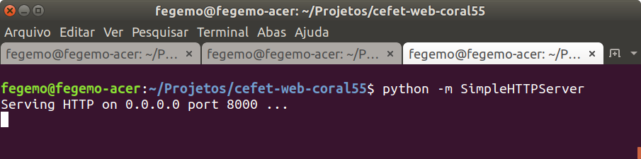
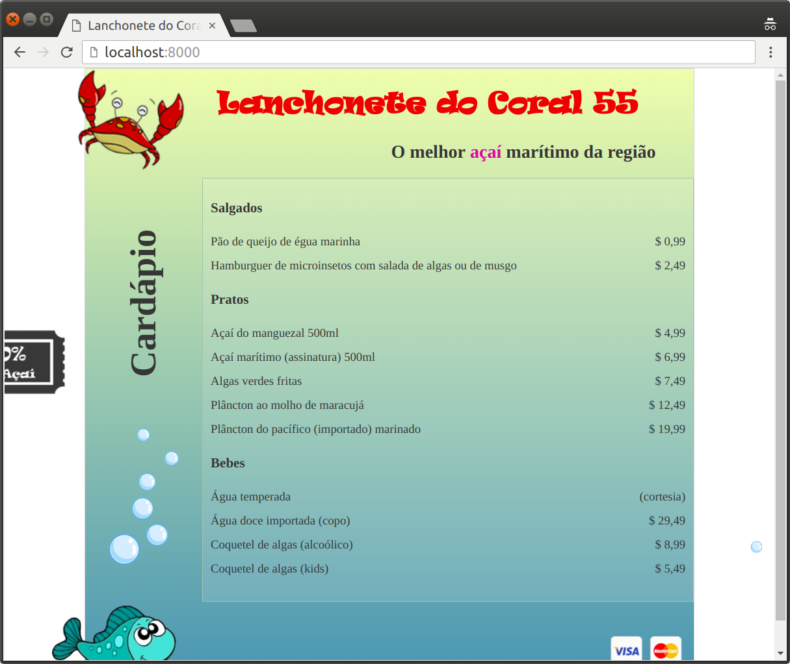

<!-- {"layout": "title"} -->
# Servidores Web
## O que são, como vivem, onde habitam

---
# Roteiro

1. A vida de um servidor Web
1. Exemplos de servidores
1. Node.js
1. O problem c10k

---
<!-- {"layout": "section-header"} -->
# Introdução
## A vida de um servidor Web

- Breve história
- Resonsabilidades
- Exemplos e tipos diferentes

<!-- {ul:.content} -->

---
<!-- {"layout": "regular"} -->
## Todos os caminhos levam a **Tim**


- ::: figure .floating-portrait-container.push-right
   <!-- {.portrait} -->
  :::
  Tim Berners-Lee desenvolveu as 4 tecnologias básicas da Web
  1. O formato HTML
  1. Um navegador que renderizava HTML e solicitava arquivos
  1. **Um servidor que entregava arquivos sob solicitação**
  1. O protocolo HTTP para navegador e servidor conversarem

---
<!-- {"layout": "regular"} -->
## O primeiro servidor web: **CERN httpd**

- O código fonte ainda pode ser baixado aqui: http://www.w3.org/Daemon/
  - Escrito em C
  - Mudou de nome para W3C httpd em 1996
- **Novidades da última versão:**
  - Botões de imagem 
    ```html
    <input type="image">
    ```
  - Autenticação em HTTP 
  - Scripts executáveis CGI
  - Configuração do servidor via arquivo

---
<!-- {"layout": "regular"} -->
## O computador onde o servidor executava

<a title="Coolcaesar at the English language Wikipedia [GFDL (www.gnu.org/copyleft/fdl.html) or CC-BY-SA-3.0 (http://creativecommons.org/licenses/by-sa/3.0/)], via Wikimedia Commons" href="http://commons.wikimedia.org/wiki/File%3AFirst_Web_Server.jpg"></a>

---
<!-- {"layout": "regular"} -->
## O NCSA HTTPd

- **Robert McCool desenvolveu**, entre 1993 e 1995 um **novo servidor Web**,
  muito parecido com o CERN httpd do Tim
- Em certo momento, **95% dos sites norte-americanos** usavam o NCSA HTTPd
  - Foi quando Robert resolveu que não queria mais brincar e encerrou seu
    desenvolvimento 😱
- Pouco tempo depois (1995), 8 pessoas começaram a trabalhar em consertar e
  re-alavancar o desenvolvimento do NCSA HTTPd
  - Eles se entitularam o **Apache Group**, em referência à população nativa da
    américa do norte
    - Também pode ser "*A patchy* web server", pelo fato de ter sido criado com
      diversos _patches_ em cima do NCSA HTTPd

---
<!-- {"layout": "regular"} -->
## Do Apache em diante

- Depois da criação do Apache HTTP Server, ele se tornou **o servidor mais
  utilizado** (<u>até hoje!!</u>)
- E incentivou outras iniciativas de criação de servidores por empresas e
  outras organizações
  - Microsoft &#8594; IIS
  - ~~Jakarta~~ ~~Sun~~ ASF &#8594; Tomcat
  - Russos &#8594; NginX
  - MonkeyServer (Unix-like)
  - Lighthttpd (Unix-like e Windows)

---
<!-- {"layout": "regular"} -->
## O que faz um servidor Web?

- "Servidor Web" refere-se ambiguamente ao _hardware_ e ao _software_
  cujo objetivo é **servir recursos Web**
  - Em nossas aulas, estamos nos referindo **apenas ao _software_**
- É um programa que **processa requisições HTTP** e alguns outros protocolos
  tipicamente usados em _internets_
  - A grosso modo, é um programa que tem _sockets_ escutando na porta 80
    (HTTP) e na 443 (HTTPS)
    - Quando um cliente estabelece a conexão com o servidor, o cliente faz um
      pedido (requisição HTTP), que o servidor precisa entender, tomar
      providências e então responder
      ```http
      GET /cefet-web/classes/ssn1/index.html
      Host: fegemo.github.io
      ```

---
<!-- {"layout": "regular"} -->
## O que faz um servidor Web? (cont.)

- O servidor Web **precisa**:
  1. Saber falar o protocolo HTTP para atender as requisições
  1. Conhecer o sistema de arquivos do SO para entregar arquivos solicitados
- O servidor Web **pode**:
  1. Permitir a :star: **geração dinâmica** de recursos (e.g., de arquivos HTML)
  1. Permitir a recepção de arquivos (formulários que fazem _upload_)
  1. Entender outros protocolos além de HTTP: HTTPS, FTP, SMTP etc.
  1. Gerenciar conexões simultâneas de vários "solicitantes"

---
## Geração dinâmica de recursos

- Exemplo de sintaxe (linguagem fictícia):
  ```html
  <ul>
    <% for (int i = 0; i < produtos.length; i++) { %>
      <li><%= produtos[i].name %><li>
    <% } %>
  </ul>
  ```
- Gerando HTML (que o navegador entende):
  ```html
  <ul>
    <li>Picolé</li>
    <li>Sorvete</li> ...
  ```

---
<!-- {"layout": "regular"} -->
## Um servidor Web simplão

-  <!-- {.push-right} -->
  Supondo que você tem Python 2.x instalado e esteja num diretório com alguns
  arquivos de páginas web:
  ```bash
  $ python -m SimpleHTTPServer
  ```
  - Com isso, temos um servidor Web funcional, servindo os arquivos do
    diretório atual

---
<!-- {"layout": "regular"} -->
## Um servidor Web simplão (cont.)




<!-- {p:.center-aligned} -->

---
## Tipos de servidor Web

- Existem dois tipos de servidor Web
  1. **Em espaço de usuário**:
     - É um programa, como qualquer outro, executando no computador. Precisa
       "entrar na fila" para conseguir recursos de _hardware_, solicitados ao
       Sistema Operacional (SO)
  1. **Em espaço de _kernel_**:
     - É parte do SO e não compete com aplicativos de usuário
       - Exemplos:
         1. IIS no Windows
         1. TUX no Linux

---
<!-- {"layout": "section-header"} -->
## Alguns Servidores Web

- Os servidores Web disponíveis hoje em dia tipicamente atendem a todas as
  demandas de um servidor Web listadas anteriormente
- Eles se **divergem**:
  1. Na linguagem com que se é permitido gerar páginas HTML dinamicamente
  1. No suporte a versões mais recentes de protocolos
  1. Nos protocolos "extras" suportados
  1. Na sua arquitetura

---
<!-- {"layout": "regular"} -->
# Apache

- **Em primeiro lugar desde 1995** como o mais utilizado
- Tipicamente (mas não exclusivamente) usado associado à linguagem PHP
- Fonte do sucesso:
  1. Projeto altamente modularizado e configurável
  1. Gratuito
  1. Extensível
  1. Bom desempenho
  1. Multi-plataforma

---
<!-- {"layout": "regular"} -->
## Um **hello world** em PHP + Apache

- Código de um arquivo `index.php`
  ```php
  <!DOCTYPE html>
  <html>
    <head>
      <title>PHP Teste</title>
    </head>
    <body>
      <?php echo "<p>Olá Mundo</p>"; ?>
    </body>
  </html>
  ```

---
<!-- {"layout": "regular"} -->
## Arquitetura do Apache

-  <!-- {style=" float:right;"} -->
  Os módulos são ativados/desativados e configurados por meio de arquivos de
  configuração
  - No arquivo `httpd.conf`

---
## Alguns módulos do Apache

- `mod_auth`
  - Gerencia o uso de acesso HTTP autenticado
- `mod_rewrite`
  - Gerencia um componente de reescrita de URLs
    - Usado para configurar _proxies_
- `mod_gzip`
  - Comprime as respostas HTML antes de enviá-las
- `mod_php`
  - Gerencia o uso do interpretador PHP para gerar páginas dinamicamente
- `mod_rails`
  - Gerencia o uso do interpretador Ruby para gerar páginas dinamicamente

---
## Outros servidores

- **IIS**
  - Servidor Web da Microsoft
  - Executa em Windows apenas
  - Em cima da plataforma .NET
  - Possibilita a utilização de linguagens da plataforma
- **Tomcat, Wildfly, Glassfish**
  - Servidores Web da ASF, ~~Sun~~ Oracle etc.
  - Executa em qualquer OS com máquinas virtuais Java
  - Em cima da plataforma Java
  - Possibilita a utilização de linguagens da plataforma

---
## Outros servidores

- **NginX** (_Engine X_)
  - Servidor russo, mais recente (2004)
  - Objetivos
    1. alta simultaneidade
    1. alto desempenho
    1. baixo uso de memória
  - Executa em sistemas baseados no Unix
  - Muito usado para fazer _load balancing_

---
# 

---
## Node.js

- Não é um servidor web (OMG!!!)
- ::: figure .floating-portrait-container.push-right
   <!-- {img.portrait} -->
  :::
  **Ryan Dahl**, seu criador, teve o seguinte raciocínio:
  1. Gosto de JavaScript e gostaria de poder usar a linguagem fora dos
     navegadores
  1. Hmm, o pessoal da Google fez um ótimo serviço ao criar a máquina virtual
     que executa JavaScript no Google Chrome: a V8
  1. Já sei: vou separar essa V8 do navegador e criar um ambiente para que
     programas JS possam acessar o sistema de arquivos **_y otras cositas más_**

---
## Node.js (cont.)

- É uma plataforma para se desenvolver **aplicações usando Javascript fora do
  navegador**
- Características:
  1. Escrito em C/C++ e Javascript
  1. Executa código Javascript de forma leve e rápida
  1. Arquitetura de **_thread_ única** e **orientada a eventos**
  1. E/S não-blocante (**_non-blocking I/O_**)
- É  uma ferramenta que serve bem para aplicações DIRTy (_data-intensive
  real-time applications_)

---
## _Y otras cositas más_

1. Uso de fluxos de dados (_streams_)
1. Acesso ao sistema de arquivos sem bloquear a execução
1. Um dialeto de métodos para conversar em HTTPês
1. Métodos para carregamento de arquivos
1. Criação muito simples de _sockets_ TCP ou UDP
1. [etc. etc. etc.](http://nodejs.org/api/)

---
## _Hello World_ em Node.js

- Instale o Node.js
- Crie um arquivo, `hello.js`, contendo:
  ```js
  console.log('woot woot');
  ```
- Execute seu arquivo no terminal:
  ```bash
  $ node hello.js
  ```

---
## Mas onde está "servidor web" nisso?

- A arquitetura do Node.js (_event-driven_ + _non-blocking I/O_), somados às
  facilidades desenvolvidas na plataforma tornam a criação de um servidor Web
  muito concisa e simples
- Vamos criar um servidor Web no próximo slide

---
## Servidor Web em Node.js

- Arquivo `servidor-simplao.js`:
  ```js
  var http = require('http');   // módulo "http", super útil
  http.createServer(function (req, res) {
    res.writeHead(200, {'Content-Type': 'text/html'});
    res.end('conteudo do arquivo html');
  }).listen(1337, '127.0.0.1');
  console.log('Server running at http://127.0.0.1:1337/');
  ```
- Para rodar:
  ```
  $ node servidor-simplao.js
  $ Server running at http://127.0.0.1:1337/
  ```

---
## Como ler um arquivo em Node.js

- Arquivo `lendoArquivo.js`
  ```js
  var fs = require('fs');     // fs é o módulo "file system"
  fs.readFile('./pessoas.json', function(erro, dados) {
    console.log(dados);
  })
  ```

---
## _Non-blocking I/O_

- Operações de E/S são caras, devido ao custo de acesso a memórias mais lentas
- _Non-blocking I/O_ significa que **operações de E/S**, que bloqueariam
  a execução do restante do programa, **não bloqueiam** :)
- Um banco de dados tipicamente reside em um disco rígido
  1. Vamos acessar uma tabela grande em <u>Apache + PHP</u>
     ```php
     $result = mysql_query('SELECT * FROM myVeryBigTable');
     print_r($result);
     ```
     - A execução da aplicação <u>fica parada na 1ª linha</u> até que a
      operação de E/S termine

---
## _Non-blocking I/O_ (cont.)

- Em <u>Node.js</u>  , escreveríamos:
    ```js
    c.query('SELECT * FROM myVeryBigTable',
      function(err, results, fields) {
        console.log(fields);
        c.end();
      }
    );
    ```
  - Enquanto a operação do `SELECT` está sendo feita, <u>o programa continua
    executando</u> as próximas instruções

---
## _Single threaded_ e _event driven_

- O <u>Apache</u> cria uma <u>nova _thread_</u> para atender <u>cada requisição</u>
- O <u>Node.js</u> executa todinho em uma <u>única _thread_</u>
  - Isso funciona por causa do _non-blocking I/O_ e do _event driven_
- Existe um _loop_ de eventos que fica esperando por "trabalhos assíncronos"
  que precisam ser executados
  - Assista à [apresentação de Philip Roberts sobre o Event Loop](http://2014.jsconf.eu/speakers/philip-roberts-what-the-heck-is-the-event-loop-anyway.html)

---
## Fluxos de dados (_streams_)

- Fluxos são como _arrays_, mas em vez de distribuir os dados no espaço, os
  distribui no tempo (:O)
- Exemplo:
  ```js
  var stream = fs.createReadStream('./arquivao-gigante.json');
  stream.on('data', function (chunk) {
    // chamada de vez em quando, quando foi lido mais um pouco (um chunk) do arquivo
    console.log(chunk);
  });
  stream.on('end', function () {
    // esta callback é chamada quando o arquivo foi todo lido
    console.log('finished');
  });
  ```

---
# O **c10k problem**

---
## _c10k_ ([referência](http://www.kegel.com/c10k.html))

- É um problema de otimização de _sockets_ de rede
- Sigla de _concurrently handling ten thousand connections_
  - 10 mil conexões simultâneas
- Não é um problema simples
  - Envolve limitações de _hardware_, do SO, da plataforma de execução do
    programa etc.
- Para servidores Web, o _c10k_ refere-se à capacidade de servir 10.000
  requisições ao mesmo tempo
  - Será que algum consegue??

---
## Testando servidores Web com o _c10k_

- Existe uma ferramenta de _benchmarking_ de servidores Web da ASF que vem
  junto com a distribuição do Apache
  ```
  $ ab -r -n 100000 -c 1000 <url>
  ```
- Um teste entre Apache e Node.js: http://zgadzaj.com/benchmarking-nodejs-basic-performance-tests-against-apache-php

---
## Para ler com calma

- [O segredo para 10 **milhões** de conexões simultâneas](http://highscalability.com/blog/2013/5/13/the-secret-to-10-million-concurrent-connections-the-kernel-i.html), no highscalability.com

---
# Referências

1. Capítulo 1 do livro "Node.js in Action"
1. [Apresentação Node.js do Peter Thorun, 2014](http://prthorun.github.io/talk-nodejs/#/20)
