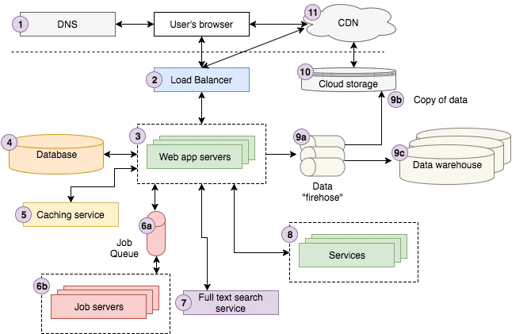

<!-- {"layout": "title"} -->
# **Server-side** parte 1
## Arquiteturas, servidores Web e Node.js

---
<!-- {"layout": "centered"} -->
# Roteiro

1. [Arquiteturas de aplicações web](#arquitetura-de-aplicacoes-web)
1. [Servidores Web](#servidores-web)
1. [Apache](#apache)
1. [Node.js](#node-js)

---
<!-- {"layout": "section-header", "hash": "arquitetura-de-aplicacoes-web"} -->
# Arquiteturas de aplicações web
## Componentes do sistema

- Relembrando funcionamento da web
- Arquitetura simples
- Arquiteturas mais complexas
<!-- {ul:.content} -->

---
<!-- {"embedSVG": "img[src$='.svg']", "styles": ["../../styles/classes/http-diagram.min.css"], "backdrop": "oldtimes"} -->
## **HTTP**

- É um **protocolo** na camada de aplicação
  > Conjunto de regras bem definidas descrevendo como
  > entidades se comunicam.
  - É a **"língua falada" pelo navegador e pelo servidor web**
- Modelo requisição &rarr; resposta

::: figure .http-diagram.flex-align-center.figure-slides.clean.no-margin.invert-colors-dark-mode
 <!-- {.step-1 style="height: 280px"} --> <!-- {p:.bullet.figure-step.bullet-no-anim} -->

 <!-- {.step-2 style="height: 280px"} --> <!-- {p:.bullet.figure-step.bullet-no-anim} -->

 <!-- {.step-3 style="height: 280px"} --> <!-- {p:.bullet.figure-step.bullet-no-anim} -->
:::

---
<!-- {"layout": "2-column-content", "embedSVG": "img[src$='.svg']", "backdrop": "oldtimes"} -->
### **Navegador requisita** algo e **Servidor responde**

-  <!-- {.full-width.centered.step-3.invert-colors-dark-mode style="height: 288px"} --> <!-- {ul:.http-diagram.no-bullets.no-padding.bullet} -->
  Requisição:
  ```http
  GET /index.html HTTP/1.1
  Host: www.twitter.com
  ```

1. Resposta: <!-- {ol:.bullet.no-bullets.no-padding.compact-code} -->
   ```http
   HTTP/1.1 200 OK
   Date: Mon, 23 May 2005 22:38:34 GMT
   Server: Apache/1.3.3.7 (Unix) (Red-Hat/Linux)
   Content-Type: text/html; charset=UTF-8
   Content-Length: 131

   <!DOCTYPE html>
   <html>
   <head>
     <title>Twitter</title>
   </head>
   <body>
     Olá mundo, este é um tweet.
   </body>
   </html>
   ```

---
<!-- {"layout": "2-column-content", "containerStyles": {"--cor-back-end": "#f00039", "--cor-servidor-web": "#000093"}, "embeddedStyles": ".back-end {color: var(--cor-back-end) !important; } .servidor-web { color: var(--cor-servidor-web) !important; }"} -->
# Arquitetura simples


- Além do **servidor web**<!-- {.servidor-web} -->, podemos ter um **_back-end_** <!-- {.back-end} -->
- **_Back-end_**<!-- {.back-end} --> é uma aplicação escrita por nós, executada pelo **servidor web**<!-- {.servidor-web} -->
- Cada requisição é recebida pelo servidor web, que a delega ao **_back-end_**<!-- {.back-end} -->
- Também podemos ter um SGBD

*[SGBD]: Sistema gerenciador de bancos de dados

---
# Arquiteturas mais complexas

 <!-- {.full-width} -->
<!-- {p:.flex-align-center.medium-width} -->

---
<!-- {"layout": "section-header", "hash": "servidores-web"} -->
# Servidores Web
## A vida de um servidor Web

- Breve história
- Responsabilidades
- Exemplos e tipos diferentes
<!-- {ul:.content} -->

---
# Todos os caminhos levam a **Tim**

- ::: figure .floating-portrait-container.push-right
   <!-- {.portrait} -->
  :::
  Tim Berners-Lee criou as 4 tecnologias básicas da Web
  1. O formato HTML
  1. Navegador, que renderizava HTML e solicitava arquivos
  1. **Servidor web, que entregava arquivos sob solicitação**
  1. O protocolo HTTP para navegador e servidor web conversarem

---
## O primeiro servidor web: **CERN httpd**

- O código fonte ainda pode ser baixado aqui: http://www.w3.org/Daemon/
  - Escrito em C
  - Mudou de nome para W3C httpd em 1996
- **Novidades da última versão:**
  - Botões de imagem 
    ```html
    <input type="image">
    ```
  - Autenticação em HTTP 
  - Scripts executáveis CGI
  - Configuração do servidor via arquivo

---
<!-- {"layout": "centered-horizontal"} -->
## O computador onde o servidor executava

 <!-- {.full-width.bordered.rounded} -->
<!-- {p:.medium-width} -->

---
## O NCSA HTTPd

- **Robert McCool desenvolveu**, entre 1993 e 1995 um **novo servidor Web**,
  muito parecido com o CERN httpd do Tim
- Em certo momento, **95% dos sites norte-americanos** usavam o NCSA HTTPd
  - Foi quando Robert resolveu que não queria mais brincar e encerrou seu
    desenvolvimento 😱
- Pouco tempo depois (1995), 8 pessoas começaram a trabalhar em consertar e
  re-alavancar o desenvolvimento do NCSA HTTPd
  - Eles se entitularam o **Apache Group**, em referência à população nativa da
    américa do norte
    - Também pode ser "*A patchy* web server", pelo fato de ter sido criado com
      diversos _patches_ em cima do NCSA HTTPd

---
## Do Apache em diante

- Depois da criação do Apache HTTP Server, ele se tornou **o servidor mais
  utilizado** (<u>até hoje!!</u>)
- E incentivou outras iniciativas de criação de servidores por empresas e
  outras organizações
  - Microsoft &#8594; IIS
  - ~~Jakarta~~ ~~Sun~~ ASF &#8594; Tomcat
  - Russos &#8594; NginX
  - MonkeyServer (Unix-like)
  - Lighthttpd (Unix-like e Windows)

---
## O que faz um servidor Web?

- "Servidor Web" refere-se ambiguamente ao _hardware_ e ao _software_
  cujo objetivo é **servir recursos Web**
  - Em nossas aulas, estamos nos referindo **apenas ao _software_**
- É um programa que **processa requisições HTTP** e alguns outros protocolos
  tipicamente usados em _internets_
  - A grosso modo, é um programa que tem _sockets_ escutando na porta 80
    (HTTP) e na 443 (HTTPS)
    - Quando um cliente estabelece a conexão com o servidor, o cliente faz um
      pedido (requisição HTTP), que o servidor precisa entender, tomar
      providências e então responder
      ```http
      GET /cefet-web/classes/ssn1/index.html
      Host: fegemo.github.io
      ```

---
## O que faz um servidor Web? (cont.)

- O servidor Web **precisa**:
  1. Saber falar o protocolo HTTP para atender as requisições
  1. Conhecer o sistema de arquivos do SO para entregar arquivos solicitados
- O servidor Web **pode**:
  1. Permitir a :star: **geração dinâmica** de recursos (e.g., de arquivos HTML)
  1. Permitir a recepção de arquivos (formulários que fazem _upload_)
  1. Entender outros protocolos além de HTTP: HTTPS, FTP, SMTP etc.
  1. Gerenciar conexões simultâneas de vários "solicitantes"

---
## Geração dinâmica de recursos

- Exemplo de sintaxe (linguagem fictícia): <!-- {ul:.compact-code} -->
  ```html
  <ul>
    <% for (int i = 0; i < produtos.length; i++) { %>
      <li><%= produtos[i].name %><li>
    <% } %>
  </ul>
  ```
- Gerando HTML (que o navegador entende):
  ```html
  <ul>
    <li>Picolé</li>
    <li>Sorvete</li> ...
  ```

---
## Um servidor Web simplão

-  <!-- {.push-right} -->
  Supondo que você tem Python 2.x instalado e esteja num diretório com alguns
  arquivos de páginas web:
  ```bash
  $ python -m SimpleHTTPServer
  ```
  - Com isso, temos um servidor Web funcional, servindo os arquivos do
    diretório atual

---
## Um servidor Web simplão (cont.)

 <!-- {style="max-height: 120px"} -->
 <!-- {style="max-height: 620px"} -->

<!-- {p:.center-aligned} -->

---
## Tipos de servidor Web

- Existem dois tipos de servidor Web
  1. **Em espaço de usuário**:
     - É um programa, como qualquer outro, executando no computador. Precisa
       "entrar na fila" para conseguir recursos de _hardware_, solicitados ao
       Sistema Operacional (SO)
  1. **Em espaço de _kernel_**:
     - É parte do SO e não compete com aplicativos de usuário
       - Exemplos:
         1. IIS no Windows
         1. TUX no Linux

---
## Alguns Servidores Web

- Os servidores Web disponíveis hoje em dia tipicamente atendem a todas as
  demandas de um servidor Web listadas anteriormente
- Eles se **divergem**:
  1. Na linguagem com que se é permitido gerar páginas HTML dinamicamente
  1. No suporte a versões mais recentes de protocolos
  1. Nos protocolos "extras" suportados
  1. Na sua arquitetura

---
<!-- {"layout": "section-header", "hash": "servidores-web"} -->
# Apache
## "Apache HTTP Server"

- Características
- Hello world
- Arquitetura
  - Visão geral
  - Módulos
- Outros servidores web comuns

<!-- {ul^1:.content} -->

---
## Apache

- **Em primeiro lugar desde 1995** como o mais utilizado
- Tipicamente (mas não exclusivamente) usado associado à linguagem PHP
- Fonte do sucesso:
  1. Projeto altamente modularizado e configurável
  1. Gratuito
  1. Extensível
  1. Bom desempenho
  1. Multi-plataforma

---
## Um **hello world** em PHP + Apache

- Código de um arquivo `index.php`
  ```html
  <!DOCTYPE html>
  <html>
    <head>
      <title>PHP Teste</title>
    </head>
    <body>
      <?php echo "<p>Olá Mundo</p>"; ?>
    </body>
  </html>
  ```

---
<!-- {"embeddedStyles": ".apache-conf pre { max-height: 300px; overflow-y: scroll; }"} -->
## Arquitetura do Apache

- Os módulos são ativados e configurados por meio de arquivos de
  configuração, no <code>httpd.conf</code>:
   <!-- {style="margin-top: calc(2em + 3px); max-width:420px; float:right;"} -->
  <!-- {ul:.compact-code-more.apache-conf} -->
  ```apache
  Listen 80
  ServerRoot /usr/local/apache2
  DocumentRoot /usr/local/webroot

  ServerName localhost:80
  ServerAdmin admin@localhost

  ServerSignature On
  ServerTokens Full

  DefaultType text/plain
  AddDefaultCharset ISO-8859-1

  UseCanonicalName Off

  HostnameLookups Off

  ErrorLog logs/error_log
  LogLevel warn

  PidFile logs/httpd.pid

  Timeout 300

  KeepAlive On
  MaxKeepAliveRequests 100
  KeepAliveTimeout 15

  User nobody
  Group nobody

  <IfModule prefork.c>
    MaxClients 150
    StartServers 5
    MinSpareServers 5
    MaxSpareServers 10
    MaxRequestsPerChild 0
  </IfModule>

  <IfModule worker.c>
    StartServers 2
    MaxClients 150
    MinSpareThreads 25
    MaxSpareThreads 75
    ThreadsPerChild 25
    MaxRequestsPerChild 0
  </IfModule>


  LoadModule access_module modules/mod_access.so
  LoadModule deflate_module modules/mod_deflate.so
  LoadModule log_config_module modules/mod_log_config.so
  LoadModule headers_module modules/mod_headers.so
  LoadModule setenvif_module modules/mod_setenvif.so
  <IfDefine SSL>
    LoadModule ssl_module modules/mod_ssl.so
  </IfDefine>
  LoadModule mime_module modules/mod_mime.so
  LoadModule status_module modules/mod_status.so
  LoadModule info_module modules/mod_info.so
  LoadModule dir_module modules/mod_dir.so
  LoadModule php4_module modules/libphp4.so


  <Location />
    <IfModule mod_deflate.c>
      AddOutputFilterByType DEFLATE text/html text/plain text/css
      <IfModule mod_headers.c>
        Header append Vary User-Agent
      </IfModule>
    </IfModule>
  </Location>


  <Directory />
    Options FollowSymLinks
    AllowOverride None
    order allow,deny
    deny from all
  </Directory>


  <Directory "/usr/local/webroot">
    order allow,deny
    allow from all
  </Directory>


  <IfModule mod_log_config.c>
    LogFormat "%h %l %u %t \"%r\" %>s %b \"%{Referer}i\" \"%{User-agent}i\"" combined
    CustomLog logs/access_log combined
    <IfModule mod_deflate.c>
      DeflateFilterNote Input instream
      DeflateFilterNote Output outstream
      DeflateFilterNote Ratio ratio
      LogFormat '"%r" %{outstream}n/%{instream}n (%{ratio}n%%)' deflate
      CustomLog logs/deflate_log deflate
    </IfModule>
  </IfModule>

  <IfModule mod_dir.c>
    DirectoryIndex index.html index.php
  </IfModule>

  <IfModule mod_mime.c>
    TypesConfig conf/mime.types
    AddType application/x-tar .tgz
    AddType application/x-rar-compressed .rar
    <IfModule sapi_apache2.c>
      AddType application/x-httpd-php .php
      AddType application/x-httpd-php-source .phps
    </IfModule>
  </IfModule>

  <IfModule mod_setenvif.c>
    BrowserMatch "Mozilla/2" nokeepalive
    BrowserMatch "MSIE 4\.0b2;" nokeepalive downgrade-1.0 force-response-1.0
    BrowserMatch "RealPlayer 4\.0" force-response-1.0
    BrowserMatch "Java/1\.0" force-response-1.0
    BrowserMatch "JDK/1\.0" force-response-1.0
    BrowserMatch "Microsoft Data Access Internet Publishing Provider" redirect-carefully
    BrowserMatch "^WebDrive" redirect-carefully
    BrowserMatch "^WebDAVFS/1.[012]" redirect-carefully
    BrowserMatch "^gnome-vfs" redirect-carefully
    <IfModule mod_deflate.c>
      BrowserMatch ^Mozilla/4 gzip-only-text/html
      BrowserMatch ^Mozilla/4\.0[678] no-gzip
      BrowserMatch \bMSIE !no-gzip !gzip-only-text/html
    </IfModule>
  </IfModule>

  <IfModule mod_status.c>
    ExtendedStatus On
    <Location /server-status>
      SetHandler server-status
      Order deny,allow
      Deny from all
      Allow from 127.0.0.1
    </Location>
  </IfModule>

  <IfModule mod_info.c>
    <Location /server-info>
      SetHandler server-info
      Order deny,allow
      Deny from all
      Allow from 127.0.0.1
    </Location>
  </IfModule>

  <IfModule mod_ssl.c>
    Include conf/ssl.conf
  </IfModule>
  ```

---
## Alguns módulos do Apache

:star2: `mod_php`
  ~ Uso do interpretador **PHP** para gerar páginas dinamicamente
  <span class="badge type2">unnoficial</span>

`mod_rails`
  ~ Uso do interpretador **Ruby** (_on Rails_) para gerar páginas dinamicamente
  <span class="badge type2">unnoficial</span>

`mod_wsgi`
  ~ Uso do interpretador **Python** para gerar páginas dinamicamente
  <span class="badge type2">unnoficial</span>

`mod_passenger`
  ~ Uso de **Ruby, Python ou Node.js** para gerar páginas dinamicamente
  <span class="badge type2">unnoficial</span>

`mod_auth`
  ~ Gerencia o uso de acesso **HTTP autenticado**

---
## Mais alguns módulos...


:star2: `mod_deflate`
  ~ **Comprime o _payload_** das respostas antes de enviá-las

`mod_http2`
  ~ Suporte ao formato **HTTP/2**

`mod_rewrite`
  ~ Componente de **reescrita de URLs** (para _reverse proxies_)

`mod_session`
  ~ Possibilita criar "**sessões** de usuário" (manter estado durante a navegação)

`mod_ratelimit`
  ~ Permite definir **limites de banda** para "cada site hospedado"

:star2: `mod_mime`
  ~ Determina o **MIME type** de um arquivo baseado em sua extensão

---
## Outros servidores

- **IIS**
  - Servidor Web da Microsoft
  - Executa em Windows apenas
  - Em cima da plataforma .NET
  - Possibilita a utilização de linguagens da plataforma
- **Tomcat, Wildfly, Glassfish**
  - Servidores Web da ASF, ~~Sun~~ Oracle etc.
  - Executa em qualquer OS com máquinas virtuais Java
  - Em cima da plataforma Java
  - Possibilita a utilização de linguagens da plataforma

---
## Outros servidores

- **NginX** (_Engine X_)
  - Servidor russo, mais recente (2004)
  - Objetivos
    1. alta simultaneidade
    1. alto desempenho
    1. baixo uso de memória
  - Executa em sistemas baseados no Unix
  - Muito usado para fazer _load balancing_
- Foi criado para ser um **servidor de arquivos estáticos**
  - Mas suporta programas CGI
    - Logo, podemos colocar PHP, Python, Ruby, Node.js etc.

---
<!-- {"layout": "section-header", "hash": "node-js"} -->
#  <!-- {style="max-width: 50%"} -->
## Um executador de JavaScript

- Historinha
- O que é, e o que não é
- Hello world
- Criando um servidor web (DIY)
<!-- {ul:.content} -->

---
## Node.js

- Não é um servidor web (OMG!!!)
- ::: figure .floating-portrait-container.push-right
   <!-- {img.portrait} -->
  :::
  **Ryan Dahl**, seu criador, teve o seguinte raciocínio:
  1. Gosto de JavaScript e gostaria de poder usar a linguagem fora dos
     navegadores
  1. Hmm, o pessoal da Google fez um ótimo serviço ao criar a máquina virtual
     que executa JavaScript no Google Chrome: a V8
  1. Já sei: vou separar essa V8 do navegador e criar um ambiente para que
     programas JS possam acessar o sistema de arquivos **_y otras cositas más_**

---
## Node.js (cont.)

- É uma plataforma para se desenvolver **aplicações usando JavaScript fora do
  navegador**
- Características:
  1. Escrito em C/C++ e JavaScript
  1. Executa JavaScript de forma leve (pouca memória) e rápida
  1. Arquitetura de **_thread_ única** e **orientada a eventos**
  1. E/S não-blocante (**_non-blocking I/O_**)
- Não é uma bala de prata!!
  - É  uma ferramenta que serve bem para aplicações DIRTy (_data-intensive
    real-time applications_)

---
## _Y otras cositas más_

1. Uso de fluxos de dados (_streams_)
1. Acesso ao sistema de arquivos sem bloquear a execução
1. Um dialeto de métodos para conversar em HTTPês
1. Métodos para carregamento de arquivos
1. Criação muito simples de _sockets_ TCP ou UDP
1. [etc. etc. etc.](http://nodejs.org/api/)
    <!-- {style="max-width: 100%;"} -->

---
## _Hello World_ em Node.js

1. Instale o Node.js
1. Crie um arquivo, `hello.js`, contendo:
   ```js
   console.log('woot woot');
   ```
1. Execute seu arquivo no terminal:
   ```bash
   $ node hello.js
   ```

---
## Mas onde está "servidor web" nisso?

- A arquitetura do Node.js (_event-driven_ + _non-blocking I/O_), somados às
  facilidades desenvolvidas na plataforma tornam a criação de um servidor Web
  muito concisa e simples
- Vamos criar um servidor Web no próximo slide

---
## Servidor Web em Node.js

- Arquivo `servidor-simplao.js`: <!-- {ul:.compact-code} -->
  ```js
  const http = require('http');   // módulo "http", super útil
  http.createServer(function (req, res) {
    res.writeHead(200, {'Content-Type': 'text/html'});
    res.write('conteudo do arquivo html');
    res.end();
  }).listen(1337, '127.0.0.1');
  console.log('Server running at http://127.0.0.1:1337/');
  ```
- Para executar:
  ```
  $ node servidor-simplao.js
  $ Server running at http://127.0.0.1:1337/
  ```

---
## Como ler um arquivo em Node.js

- Arquivo `lendo-um-arquivo.js`: <!-- {ul:.compact-code} -->
  ```js
  // fs é o módulo "file system"
  const fs = require('fs');

  // leitura assíncrona (não-blocante): 👍
  fs.readFile('./pessoas.json', function(erro, pessoas) {
    console.log(pessoas);
  });

  // também existe IO síncrona (blocante): 👎
  const produtos = fs.readFileSync('./produtos.json');
  console.log(produtos)
  ```

---
## _Non-blocking I/O_

- Operações de E/S são caras, devido ao custo de acesso a memórias mais lentas
- _Non-blocking I/O_ significa que **operações de E/S**, que bloqueariam
  a execução do restante do programa, **não bloqueiam** :)
- Um banco de dados tipicamente reside em um disco rígido
  1. Vamos acessar uma tabela grande em <u>Apache + PHP</u>
     ```php
     $result = mysql_query('SELECT * FROM myVeryBigTable');
     print_r($result);
     ```
     - A execução da aplicação <u>fica parada na 1ª linha</u> até que a
      operação de E/S termine

---
## _Non-blocking I/O_ (cont.)

- Em <u>Node.js</u>  , escreveríamos:
    ```js
    const mysql = require('mysql');   // módulo de driver do mysql
    const connection = mysql.createConnection(/*...*/);
    connection.connect();
    connection.query('SELECT * FROM myVeryBigTable', (err, results, fields) => {
      console.log(fields);
    });
    connection.end();
    ```
  - Enquanto o `SELECT` está sendo feito, <u>o programa continua
    executando</u> as próximas instruções, imediatamente prosseguindo

---
## _Single threaded_ e _event driven_

- O <u>Apache</u> cria uma <u>nova _thread_</u> para atender <u>cada requisição</u>
- O <u>Node.js</u> executa todinho em uma <u>única _thread_</u>
  - Isso funciona por causa do _non-blocking I/O_ e do _event driven_
- Existe um _loop_ de eventos que fica esperando por "trabalhos assíncronos"
  que precisam ser executados
  - Assista à [apresentação de Philip Roberts sobre o Event Loop](http://2014.jsconf.eu/speakers/philip-roberts-what-the-heck-is-the-event-loop-anyway.html)

---
## Fluxos de dados (_streams_)

- Fluxos são como _arrays_, mas em vez de distribuir os dados no espaço, os
  distribui no tempo :O. Por exemplo: <!-- {ul:.compact-code} -->
  ```js
  const fs = require('fs');
  const stream = fs.createReadStream('./arquivao-gigante.txt');

  stream.on('data', (chunk) => {
    // chamada de vez em quando, quando foi lido mais um pouco do arquivo
    console.log(`Recebi ${chunk.length} bytes`);
    console.log(chunk);
  });

  stream.on('end', () => {  // chamada quando o fluxo terminou
    console.log('Acabei!!');
  });
  ```

---
<!-- {"layout": "centered"} -->
# Referências

1. Capítulo 1 do livro "Node.js in Action"
