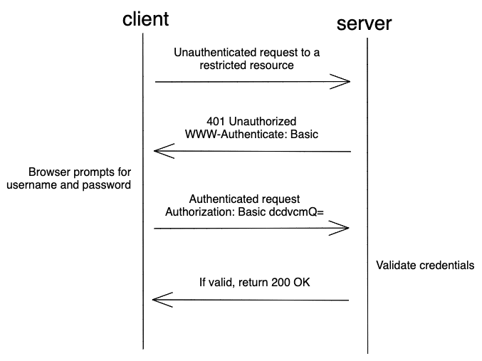
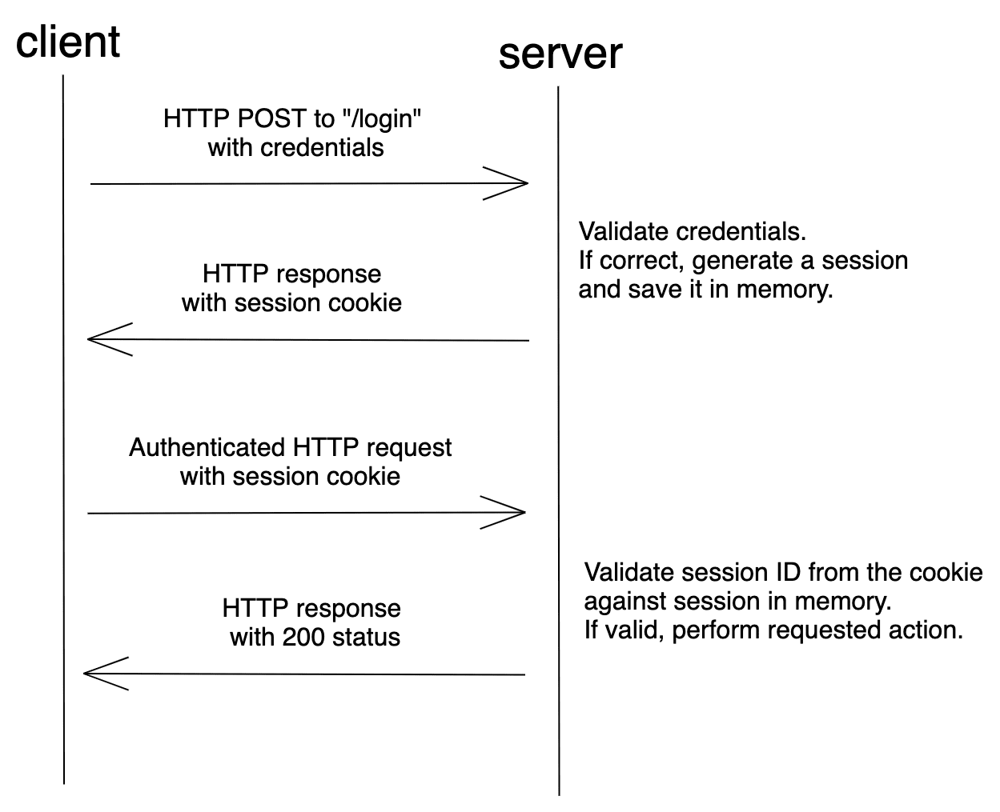
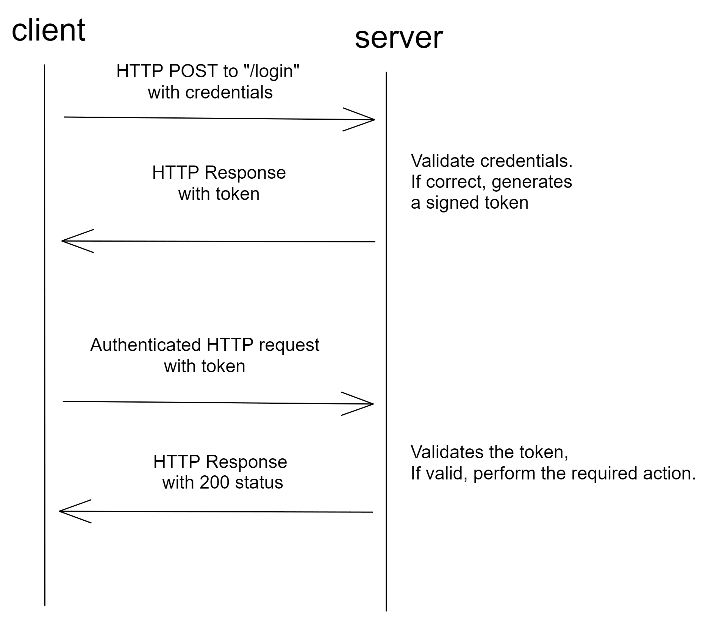
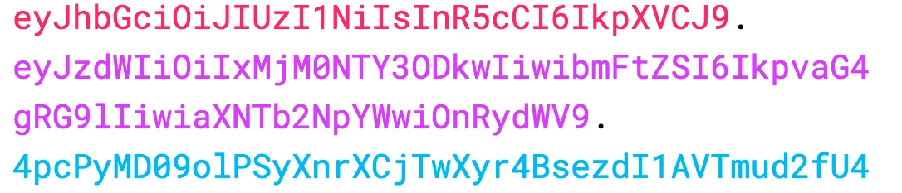

<!-- {"layout": "title"} -->
# **Server-side** parte 5
## Sessão, cookies, autenticação e autorização

---
<!-- {"layout": "centered"} -->
# Roteiro

1. [_Cookies_](#cookies)
1. [Sessões](#sessoes)
1. [Autenticação e autorização](#autenticacao-e-autorizacao)

---
<!-- {"layout": "section-header", "hash": "cookies"} -->
# _Cookies_
## 🍪🍪🍪

- Motivação
- Definição
- Tipos de _cookie_
- _Cookies_ no Express
<!-- {ul:.content} -->

---
## Interação cliente x servidor com estado

-  <!-- {.push-right.small-width.bordered.rounded} -->
  Alguns sites/páginas parecem lembrar que você passou por ele. Mas como eles fazem
  isso?
  - HTTP é um protocolo que **não armazena estado** (_stateless_)
    - Cada requisição/resposta **não armazena nenhum tipo de informação** de
      quem solicita
  - Um recurso dos navegadores chamado **_cookies_** possibilita o
    armazenamento de informações quando solicitado pelo servidor
    - Esse recurso é usado para a criação de **sessões de navegação**
- Mas o que é um _cookie_ 🍪? <!-- {ul:.bulleted-0} -->

---
## O que é um _cookie_ 🍪?

- _cookie_: um **pequeno objeto de informação** enviado pelo servidor para o <!-- {ul:.bulleted-0} -->
  navegador e então enviado de volta para o servidor nas próximas
  requisições de páginas <!-- {li:.note.info} -->
- _cookies_ possuem várias utilidades:
  1. Autenticação
  1. Rastreamento de usuário
  1. Armazenamento de preferências de usuários, carrinhos de compra...
- <!-- {li:.push-code-right.compact-code-more} -->
  ```http
  GET / HTTP/1.1
  Host: ava.cefetmg.br
  User-Agent: Mozilla/5.0 ...
  Accept: text/html,application/xhtml+xml...
  Referer: https://ava.cefetmg.br/login/index.php
  Cookie: MoodleSession=e1n9fquk3ee35ssn3odd993mlc
  ```
  A informação armazenada consiste de um par nome/valor
  (+ atributos), enviado no **cabeçalho da requisição** ➡️

---
## Como os _cookies_ são enviados

1.  <!-- {.push-right} -->
   O navegador faz uma requisição
1. O **servidor pode enviar _cookies_** de volta
   - O navegador pode salvar o dado em arquivo (eg, .txt) ou não
1. Havendo _cookies_ salvos para um domínio, **o navegador** os 
   **enviará de volta ao servidor** nas requisições seguintes <!-- {ol:.bullet} -->


Modelo alternativo: também é possível **criar e usar cookies** a partir **do lado
cliente**, usando JavaScript <!-- {p:.note.info.bullet style="margin-top: 1.5em"} -->

---
## Mitos sobre _cookies_

- Mitos:
  - _Cookies_ são como vírus que podem apagar dados do disco
  - _Cookies_ são _spyware_ e podem roubar informação pessoal
  - _Cookies_ geram _popups_ e _spam_
  - _Cookies_ são usados apenas para propagandas
- Fatos:
  - _Cookies_ são apenas dados, e não código
  - _Cookies_ não podem apagar ou ler informação do computador
  - _Cookies_ são normalmente anônimos - não contêm informação pessoal
  - _Cookies_ de um domínio não podem ser lidos por outro (_hacking_?)
  - _Cookies_ **podem** ser usados para rastrear seus hábitos de visualização
    em um site em particular

---
## Um "_cookie_ de rastreamento"

 <!-- {p:.flex-align-center} -->

- Uma empresa de anúncios envia um _cookie_ quando você visita um site e o vê
  novamente quando você visita outro site que também usa esses anúncios
- Assim, eles sabem que a mesma pessoa visitou os dois sites
- Pode ser corrigido dizendo-se ao navegador para não aceitar "_cookies_ de
  terceiros"

---
## Exemplo de uso de _cookie_ (1/5)

- Vamos criar uma página que guarda a informação sobre a língua de exibição
  - Que é inglês por padrão, mas pode ser alterada e deve ser mantida quando
    o usuário voltar
- Passos:
  - (1) Navegador **solicita** a página inicial:
     ```http
     GET /index.html HTTP/1.1
     Host: www.ispeakmanymanylanguages.com
     ```

---
## Exemplo de uso de _cookie_ (2/5)

- (2) Servidor **responde**, definindo um _cookie_ com nome "`lang`" com o
   valor (padrão) "`english`":
   ```http
   HTTP/1.1 200 OK
   Content-type: text/html
   Set-Cookie: lang=english <---

   (conteudo da pagina)
   ```
   - O cabeçalho HTTP `Set-Cookie` serve para o servidor criar _cookies_
   - O servidor instruiu o navegador a armazenar o dado `lang=english`
     em um _cookie_ para uso posterior
     - O navegador costuma salvar isso em um arquivo (eg, `.txt`)

---
## Exemplo de uso de _cookie_ (3/5)

- (3) Navegador armazenou o _cookie_. Agora, o usuário navega para outra
  página do site e **o _cookie_ é enviado na requisição**:
  ```http
  GET /promotions.html HTTP/1.1
  Host: www.ispeakmanymanylanguages.com
  Cookie: lang=english <---
  ```
  - Todas as páginas subsequentes serão mostradas em inglês, porque em toda <!-- {ul:.bulleted} -->
    nova requisição, **o navegador passa a enviar o cabeçalho `Cookie`**, que
    contém o _cookie_ criado pelo servidor para armazenar a língua selecionada
    - Na verdade contém todos os _cookies_ já salvos e ainda vigentes desse domínio

---
## Exemplo de uso de _cookie_ (4/5)

- (4) Usuário altera a língua para `"portuguese"`. A forma como nosso servidor
  de exemplo possibilita isso é por meio de uma **requisção** GET para
  `/change-language?l=portuguese`:
  ```http
  GET /change-language?l=portuguese HTTP/1.1
  Host: www.ispeakmanymanylanguages.com
  Cookie: lang=english
  ```

---
## Exemplo de uso de _cookie_ (5/5)

- (5) Recebendo esta mensagem, o servidor **responde** com a página inicial
  já em português e com um novo `Set-Cookie` para sobrescrever
  o _cookie_ `lang`:
  ```http
  HTTP/1.1 200 OK
  Content-type: text/html
  Set-Cookie: lang=portuguese <---

  (conteudo da pagina em Portugues)
  ```

---
<!-- {"layout": "2-column-content"} -->
## Quanto tempo um _cookie_ vive?

- **_Cookie_ de sessão** <!-- {ul:.no-bullets.no-padding.no-margin} -->
  - O tipo padrão, temporário, que fica
    gravado apenas na memória do navegador
  - Quando o navegador fecha, os _cookies_ temporários são apagados
  - Mais seguros: nenhum programa (exceto o navegador) pode acessá-los

1. **_Cookie_ persistente** <!-- {ol:.no-bullets.no-padding.no-margin.bullet} --> <!-- {strong:.alternate-color} -->
   - Fica armazenado no computador do cliente 
   - Pode armazenar informação a longo prazo
   - Menos seguro: usuários (ou qualquer programa) podem abrir os arquivos dos
    _cookies_, ver/alterar valores etc.

O Chrome, por exemplo, armazena cookies persistentes 
com valores criptografados em um banco SQLite (`~/.config/chromium/Default/Cookies`) <!-- {p:.note.info.span-columns.bullet} -->

---
## Consertando nosso exemplo (1/2)

- No nosso exemplo, criamos um _cookie_ de sessão, que é a forma padrão
  - Mas queremos criar um _cookie_ persistente para manter a língua
    selecionada mesmo depois que o navegador seja fechado
  - Para isso, além de `nome=valor`, os _cookies_ possuem **outros atributos
    que podem ser definidos**:
    1. **`Expires`, `Max-Age`**, define até quando o _cookie_ deve persistir
    1. `Domain`, `Path`
    1. `Secure`
    1. `HttpOnly`

---
## Consertando nosso exemplo (2/2)

- Ao incluir o atributo `Expires` ou `Max-Age` no cabeçalho `Set-Cookie`,
  dizemos ao navegador para criar um _cookie_ **persistente**
  - `Expires` define a data em que o navegador deve excluir o _cookie_
  - `Max-Age` define um valor em milissegundos a partir de quando o navegador
    deve excluir o _cookie_
- Para consertar, o servidor deve enviar o `Set-Cookie` do passo 5:
  ```http
  HTTP/1.0 200 OK
  Content-type: text/html
  Set-Cookie: lang=portuguese; Expires=Wed, 01-Jan-2020 00:00:00 GMT

  (conteudo da pagina)
  ```

---
<!-- {"layout": "main-point", "state": "emphatic"} -->
# Cookies no Express.js

---
## Definindo _cookies_ no Express.js (1/2)

- O servidor insere um `Set-Cookie` para instruir o navegador a criá-lo: <!-- {.compact-code} -->
  ```js
  // rota para ALTERAR LÍNGUA
  app.get('/change-language', (req, res) => {
    // pega parâmetro com nome "lang" da querystring
    let desiredLang = req.params.lang
    // inclui o cabeçalho Set-Cookie "lang=%%%;Expires=Wed..."
    res.cookie('lang', desiredLang, { expires: 'Wed...' }) // <--- Set-Cookie
    // redireciona para a rota do index
    res.redirect('index')
  })

  // rota da PÁGINA INICIAL
  app.get('/', (req, res) => { // usa cookie ou 'english' (padrão)
    res.render('index', { lang: req.cookies.lang || 'english' })
  })
  ```

---
## Definindo _cookies_ no Express.js (2/2)

- Como o Express.js é extremamente modular (por meio dos _middlewares_),
  para que um servidor utilize os _cookies_ enviados nas requisições HTTP,
  é necessário usar o _middleware_ [`cookie-parser`](https://github.com/expressjs/cookie-parser):
  ```js
  import express from 'express'
  import cookieParser from 'cookie-parser'

  const app = express()
  app.use(cookieParser())
  ```
  - Ele processará o cabeçalho `Cookie` das requisições e populará
    `res.cookies` com os _cookies_ presentes
    ```
    $ npm i cookie-parser
    ```

---
## Adendo: _web storage_ vs _cookies_

- _local storage_, _session storage_ e _cookies_ servem para armazenar
  informações no navegador
- Contudo, apenas os _cookies_ são enviados nas requisições HTTP para o
  servidor
  - _web storage_ é um recurso puramente do navegador e o protocolo HTTP não
    tem nenhum acesso a ele
- Portanto, para manter uma sessão entre cliente e servidor, **ainda precisamos
  dos _cookies_** ;)
- Ademais, **_cookies_ surgiram 1994-1997** (Netscape) e _Web Storage_ é uma API
  do HTML5 (2009+)

---
<!-- {"layout": "section-header", "hash": "sessoes"} -->
# Sessões
## Servidores usando estado

- O que é sessão
- Como estabelecer sessão
- Sessão no Express
<!-- {ul:.content} -->

---
## O que é uma sessão?

- **sessão**: conceito abstrato que representa **uma série de requisições
  e respostas HTTP** entre um navegador e um servidor <!-- {li:.note.info} -->
- O protocolo HTTP não conhece o conceito de sessão (é _stateless_), 
  mas _frameworks_ Web sim (Express.js, PHP, ASP .NET, Java etc.)
- sessões _vs._ _cookies_:
  - Um _cookie_ é um dado armazenado no cliente
  - Os dados de uma sessão são armazenados no servidor
- **Sessões são normalmente criadas usando _cookies_**
  - A única informação guardada pelo cliente é um _cookie_ contendo um
    **identificador único de sessão**
  - A cada requisição, o cliente envia o _cookie_ de sessão e o servidor o
    utiliza para recuperar as informações da sessão

---
<!-- {"layout": "regular"} -->
## Como sessões são estabelecidas

1. O navegador faz requisição inicial ao servidor
1. Servidor guarda o endereço IP/navegador do cliente, gera um identificador
   único de sessão e envia um _cookie_ de volta
   -  <!-- {.push-right} -->
     Em PHP, esse _cookie_ tem o nome `PHPSESSID`
   - Em Java, `JSESSIONID`
   - Express.js, **`connect.sid`**
1. O cliente envia o mesmo ID da sessão de volta ao servidor
1. Servidor usa o ID recebido para recuperar os dados da sessão do cliente

---
## Sessões no Express.js (1/2)

- Assim como com _cookies_, vamos dizer ao Express.js para usar sessões <!-- {ul:.compact-code} -->
  - Para isso, incluímos o [_middleware_ de sessões](https://github.com/expressjs/session):
    ```js
    import express from 'express'
    import session from 'express-session'
    const app = express()

    app.use(session({
      secret: 'octocats and octodogs'
    }));
    ```
    - A opção `secret` é uma string usada para criar um _hash_ do valor do
      _cookie_ de sessão, como uma medida de segurança
      ```
      $ npm i express-session
      ```

---
## Sessões no Express.js (2/2)

- Para **armazenar algum dado** referente a uma sessão, usamos **o objeto
  `req.session`**:
  ```js
  app.get('/', (req, res) => {
    if (req.session.views) {  // um contador de visualizações nesta sessão
      req.session.views++
      res.setHeader('Content-Type', 'text/html')
      res.end(`<p>views: ${req.session.views}</p>`)
    } else {
      req.session.views = 1
      res.end('welcome to the session demo. refresh!')
    }
  })
  ```

---
<!-- {"layout": "section-header", "hash": "autenticacao-e-autorizacao"} -->
# Autenticação e Autorização
## Identificação e permissões

- O que é
- Como funciona
- Tipos
  1. HTTP básica
  1. Via sessão
- No Express
<!-- {ul:.content} -->


---
# Autenticação e autorização

Autenticação
~ Quem é você? Prove!
~ Tipicamente: usuário e senha
~ Mas também: _one-time passwords_, 2 fatores

Autorização
~ Ok, e o que você tem permissão pra fazer?
~ Tipicamente, definido em "papéis de usuário"

- Vamos ver 3 tipos de autenticação:
  1. HTTP básica
  1. Com sessão
  1. Com _tokens_

---
## Autenticação **HTTP básica**


1.  <!-- {.push-right style="max-width: 30%"} -->
   Cliente desconhecido **requisita um recurso protegido**
1. Servidor responde **`401 Unauthorized`** com **cabeçalho HTTP `WWW-Authenticate: Basic`**
1. Cliente lê esse cabeçalho e mostra janelinha **pedindo usuário e senha**
1. Usuário digita e **navegador inclui cabeçalho** `Authorization: Basic dcdvcmQ=`
   - `dcdvcmQ=` está ilustrando que o navegador codifica os 
     valores digitados `usuario:senha` em Base64

**Bom**: simples. **Ruim**: muito inseguro, péssima experiência de uso, difícil fazer "logout". <!-- {p:.note.info} -->

---
## Autenticação com **sessão**


1.  <!-- {.push-right style="max-width: 40%"} -->
   Cliente desconhecido **provê suas credenciais**
1. Servidor as **valida** (autentica) apenas uma vez **e cria sessão**
1. Cliente **inclui identificação da sessão** nas requisições subsequentes
1. Servidor apenas **avalia se a sessão ainda está válida** a cada requisição
   - Convém **expirar a sessão** com o tempo <!-- {ol:.bulleted-0} -->

**Bom**: ainda simples, boa UX. **Ruim**: mantém estado (dificulta distribuição), _cookies_ enviados em toda requisição, suscetível a _session hijacking_. <!-- {p:.note.info} -->

---
## Autenticação com **_tokens_**


-  <!-- {.push-right style="max-width: 34%"} -->
  Usa _tokens_ em cabeçalhos HTTP em vez de _cookies_
- Forma mais comum: JWT (_JSON Web Token_), em 3 partes:
  1. _Header_
  1. _Payload_
  1. _Signature_ <!-- {ol:.multi-column-list-3} -->
- Formato do cabeçalho enviado pelo servidor
  ```http
  Authentication: Bearer 1111.22222.3333
  ```
- As 3 partes são codificadas em Base64 e separadas por `.`
- Não é necessário salvar os _tokens_ (nem cliente nem servidor)
- Mas o que colocar nas 3 partes?

*[JWT]: JSON Web Token

---
## Partes do JWT: (1) _Header_

- O cabeçalho tipicamente contém 2 dados: tipo do token e algoritmo de assinatura
  ```json
  {
    "alg": "HS256",
    "typ": "JWT"
  }
  ```
- Esse conteúdo é codificado em Base64 para formar a primeira parte do JWT
  - Neste exemplo ficaria: `eyJhbGciOiJIUzI1NiIsInR5cCI6IkpXVCJ9`

---
## Partes do JWT: (2) _Payload_

- O _payload_ contém as reivindicações (_claims_), tipicamente com dados sobre o usuário autorizado
  - <!-- {ul:.layout-split-2.no-bullets.no-padding.no-margin} -->
    ```json
    {
      "sub": "1234567890",
      "name": "John Doe",
      "admin": true
    }
    ```
  - Há [3 tipos de _claims_][claim-types]:<!-- {li:style="margin-left: 1.5em"} -->
    - **Registradas** são as padronizadas e recomendadas (eg, `sub` de _subject_)
    - **Públicas** vêm de uma lista mais ampla
    - **Privadas** são da aplicação
- Codificado em Base64: `eyAgInN1YiI6ICIxMjM0NTY3ODkwIiwgICJuYW1lIjogIkpvaG4gRG9lIiwgICJhZG1pbiI6IHRydWV9`

[claim-types]: https://jwt.io/introduction

---
## Partes do JWT: (3) _Signature_

- Para criar a assinatura, precisamos do _header_ e _payload_ codificados, um segredo e o algoritmo especificado
- No nosso exemplo, ela seria gerada assim:
  ```js
  HMACSHA256(toBase64(header) + '.' + toBase64(payload), segredo)
  ```
- A assinatura é usada pra verificar que a mensagem não foi alterada pelo caminho
-  <!-- {.push-right style="max-width: 250px;"} -->
  Como resultado, temos as 3 partes codificadas: ➡️
- Após autenticado, o navegador incluir o cabeçalho em toda requisição:
  ```http
  Authorization: Bearer <token ↗️>
  ```

---
## Funcionamento do JWT

1.  <!-- {.push-right style="max-width: 34%"} -->
   Cliente **provê suas credenciais**
1. Servidor valida e retorna um JWT
1. Cliente envia o cabeçalho para próximas requisições
   ```http
   Authorization: Bearer <token>
   ```
1. Servidor recebe requisição para recurso protegido, verifica se está conforme esperado e responde normalmente

**Bom**: sem estado, bom para serviços. **Ruim**: ainda suscetível a _session hijacking_, _tokens_ não podem ser excluídos (devem expirar), não armazenar dados sensíveis. <!-- {p:.note.info} -->

<!-- ## Sumário de métodos de autorização

When should you use each? It depends. Basic rules of thumb:

For web applications that leverage server-side templating, session-based auth via username and password is often the most appropriate. You can add OAuth and OpenID as well.
For RESTful APIs, token-based authentication is the recommended approach since it's stateless.
If you have to deal with highly sensitive data, you may want to add OTPs to your auth flow. -->

---
# Referências

1. Seções 7.1, 7.2 e 9.1 do livro "Node.js in Action"
