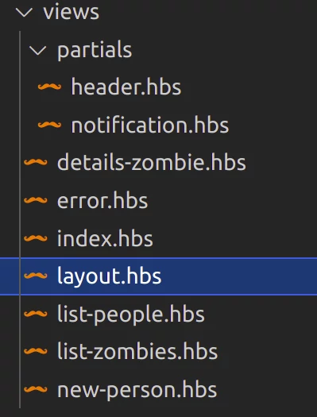

<!-- {"layout": "title"} -->
# **Server-side** parte 6
## Bancos de dados, Formulários, Arquiteturas REST e o Jardim Zumbi 🧟

---
<!-- {"layout": "centered"} -->
# Roteiro

1. Acesso a [bancos de dados](#bancos-de-dados)
1. [Envio de formulários](#envio-de-formularios)
1. [Arquitetura REST](#arquitetura-rest)
1. Entrando no [Jardim Zumbi](#jardim-zumbi)

---
<!-- {"layout": "section-header", "hash": "bancos-de-dados"} -->
# Bancos de dados
## Acesso aos dados armazenados

- Revisão de SGBDs
- MySQL
- Acesso via _driver_
- Acesso via ORM/ODM
<!-- {ul:.content} -->

*[SGBD]: Sistema gerenciador de bancos de dados
*[ORM]: Object-relational mapping
*[ODM]: Object-document mapping

---
## SGBDs **relacionais**

- Fazem armazenamento, recuperação, manutenção e concorrência de dados
- Baseados na normalização de **relações e tuplas**
- Mantém **propriedades ACID** em suas transações
- Tradicionalmente usados para aplicações como:
  1. Gerenciadores de conteúdo (CMS)
  1. Gerenciadores de relação com cliente (CRM)
  1. Carrinhos de compra
- Interface com aplicações via SQL

*[ACID]: atomic, consistent, integral, durable
*[CMS]: Content Management System
*[CRM]: Customer Relationship Manager
*[SQL]: Structured Query Language
*[SGBD]: Sistema gerenciador de bancos de dados

---
## SGBDs **_NoSQL_** <!-- {.alternate-color} -->

- Movimento surgido em ~2005 de popularização de formas de armazenamento **não-relacional** <!-- {.alternate-color} -->
- Divididos em 4 modelos de dados:
  1. **Chave-valor** <!-- {.alternate-color} -->
  1. **Documentos** <!-- {.alternate-color} -->
  1. **Família de colunas** <!-- {.alternate-color} -->
  1. **Grafos** <!-- {ol:.multi-column-list-2} -->
- Modelos "orientados a agregados" são **próprios para _sharding_** <!-- {strong:.alternate-color} -->
  - Em ~2005 precisávamos ter bastante escalabilidade horizontal das aplicações Web
- Interface com aplicações frequentemente **não usa** <!-- {.alternate-color} --> **SQL**

*[SGBD]: Sistema gerenciador de bancos de dados

---
## Conexão da aplicação com SGBDs

- Aplicação conecta ao banco de 2 formas: <!-- {.push-right} -->
  1. "Diretamente" por meio do _driver_ do SGBD
  1. Camada de mapeamento para objetos (ORM/ODM)
     - Ideia: manter estilo de programação OO "sem restrições" do modelo de dados
- Passos:
  1. Aplicação **abre uma conexão (ou _pool_)** ao inicializar
  1. A cada requisição, submete consultas ao SGBD

Um **pool** de conexões visa evitar _overhead_ de abertura de conexões ao reutilizá-las
quando se tornam ociosas. <!-- {p:.note.info} -->

*[ORM]: Object-relational mapping
*[ODM]: Object-document mapping
*[OO]: Orientação a objetos
*[SGBD]: Sistema gerenciador de bancos de dados

---
<!-- {"layout": "main-point", "state": "emphatic"} -->
# MySQL

---
## MySQL

- É um dos SGBDs relacionais mais populares
- Criado na Suécia na década de 1990
- Gratuito, _open source_, adquirido pela Oracle em 2009
- Criadores originais criaram o MariaDB quando foi comprado pela Oracle
- Há _drivers_ feitos pela comunidade Node.js para o MySQL
  - Vamor usar o [pacote `mysql2`][package-mysql2] (para versões MySQL > 5)
- Também há ORMs comuns, como o [pacote `sequelize`][package-sequelize]

*[SGBD]: Sistema gerenciador de bancos de dados

[package-mysql2]: https://www.npmjs.com/package/mysql2
[package-sequelize]: https://www.npmjs.com/package/sequelize

---
<!-- {"layout": "2-column-content", "classes": "compact-code-more"} -->
## Primeiros passos (_connection vs pool_)

- <!-- {ul:.no-bullets.no-padding.no-margin} -->
  Usando 1 conexão:
  ```js
  import mysql from 'mysql2/promise'
  const db = mysql.createConnection({
    host: 'localhost',
    database: 'nome-do-db',
    user: 'me',
    password: 'secret',
    port: 3306

    // configuração das conexões
    multipleStatements: true,


  })
  ```

1. <!-- {ol:.no-bullets.no-padding.no-margin} -->
   Usando um _pool_ de conexões: ✅
   ```js
   import mysql from 'mysql2/promise'
   const db = mysql.createPool({
     host: 'localhost',
     database: 'nome-do-db',
     user: 'me',
     password: 'secret',
     port: 3306

     // configuração das conexões
     multipleStatements: true,

     // configuração da pool
     waitForConnections: true,
     connectionLimit: 10,
     queueLimit: 0
   })
   ```

- <!-- {ul:.no-bullets.no-margin.no-padding.span-columns} -->
  ```js
  // chamada assíncrona com await para FAZER UMA CONSULTA
  // para conseguirmos non-blocking I/O - woot woot
  const [result] = await db.execute('SELECT * FROM meals')      // db.query(...) ou db.execute(...) <-- melhor
  console.log(`First meal is: ${result[0].mealName}`)
  ```


---
## Fazendo consultas

- <!-- {ul:.two-column-code.compact-code-more} -->
  As consultas são feitas por meio do método:
  ```js
  // só faz consulta
  db.query(query)
  // consulta e armazena plano de execução ✅
  db.execute(query)
  ```
  - `query` é uma `string` contendo uma consulta SQL
  - retorna uma promessa que resolve com um vetor dos elementos:
    1. **`result`**, um vetor em que cada elemento é um registro do resultado da
       consulta (para `SELECT`s)
    1. **`fields`**, contém metadados adicionais dos resultados
- `db.execute(...)` faz a consulta e armazena o plano de execução para agilizar próximas solicitações dessa mesma consulta

---
<!-- {"embeddedStyles": "#meals li { font-size: 0.7em; }"} -->
## Exemplos de consultas: refeições dos Hobbits

- Um `SELECT`: <!-- {ul:.bulleted-0} -->
  ```js
  const [result, fields] = await db.execute('SELECT name, time FROM meals')
  result.forEach(meal => console.log(`${meal.time} - ${meal.name}`)
  ```
- Saída:
  - 07:00 - Breakfast <!-- {ul:#meals.multi-column-list-3} -->
  - 09:00 - Snd Breakfast
  - 11:00 - Elevensies
  - 13:00 - Luncheon
  - 16:00 - Afternoon Tea
  - 18:00 - Dinner
  - 20:00 - Supper
- Além do `SELECT`, vejamos também `INSERT`, `DELETE` e `UPDATE`...

---
## Inserindo um registro

- Também é usado o método `db.execute(query, params)`, mas há duas diferenças:
  - Segundo argumento por onde passamos valores para a consulta
  - Resolução da promessa: `result.affectedRows` tem
    o número de registros afetados na operação e `result.insertId` o código de
    auto-incremento do registro (se houver)
- <!-- {li:.compact-code-more.bullet} -->
  Exemplo de `INSERT`:
  ```js
  const nomeDaRefeicao = 'Tea'
  const [result] = await db.execute('INSERT INTO food (id, name) VALUES (NULL, ?)', [nomeDaRefeicao])
  console.log(`Comidas inseridas: ${result.affectedRows} com id ${result.insertId}`)
  ```

Daria pra concatenar o valor de parâmetro na string de consulta (em vez do `?`),
mas deve-se tomar **cuidado com ataque _SQL-injection_**. Faça como mostrado, ou concatene
usando `db.escape(nomeDaRefeicao)`. <!-- {p:.note.warning.bullet.no-margin} -->

---
## Excluindo um registro

- Análogo à inserção de registro. Exemplo: <!-- {ul:.bulleted-0} -->
  ```js
  const [result] = await db.execute('DELETE FROM food WHERE id=?', [foodId])
  console.log(`Comidas excluídas ${result.affectedRows}`)
  ```
- Se quiser montar a consulta, ficaria:
  ```js
  const foodId = db.escape(req.params.foodId)
  const [result] = await db.execute(`DELETE FROM food WHERE id=${foodId}`)

---
## Atualizando um registro

- Análogo à inserção e exclusão de registro, porém...
- O 2º argumento da `callback` possui `result.changedRows` com o número de
  registros alterados.
- Exemplo:
  ```js
  const [result] = await db.execute(`
    UPDATE food
    SET name="bad"
    WHERE name LIKE '%?%'`, ['elvish'])
  console.log(`Comidas alteradas: ${result.changedRows}')
  ```

---
## Tratamento de erros

- Usando o pacote `mysql2/promises` devemos proteger as chamadas de `db.query/execute`:
  1. ⬇️ Em blocos `try/catch`, se usando `async/await`
  1. Registrada em `.catch(...)` ou 2º argumento de `.then`, se promessas ⬇️
- <!-- {li:.two-column-code.compact-code-more style="list-style-type: none"} -->
  ```js
  try {
    const [result] = await db.execute('...', [...])
    // faz coisas com result

  } catch (erro) {
    console.error(erro)
    erro.mensagemAmigavel = 'Erro ao ...'
    throw erro
  }
  db.execute('...', [...])
    .then(([result]) => {
      // faz coisas com result
    })
    .catch(erro => {
      console.error(erro)
      erro.mensagemAmigavel = 'Erro...'
      throw erro
    })
  ```

---
<!-- {"layout": "main-point", "state": "emphatic"} -->
# Operações em Transações

---
<!-- {"classes": "compact-code-more"} -->
## Transações

- Quando há uma sequência de **operações que devem ser atômicas** (executa todas ou nenhuma),
  podemos usar o conceito de **transação** dos SGBD relacionais
  ```js
  const transaction = await db.getConnection()
  try {
    await transaction.beginTransaction()
    await transaction.query('SET FOREIGN_KEY_CHECKS = 0;')
    await transaction.query('TRUNCATE TABLE `zombies`.`person`;')
    await transaction.query('TRUNCATE TABLE `zombies`.`zombie`;')
    await transaction.query('SET FOREIGN_KEY_CHECKS = 1;')
    await transaction.query("INSERT INTO `zombies`.`zombie` ...")
    await transaction.query("INSERT INTO `zombies`.`person` ...")
    await transaction.commit()

  } catch (error) {
    await transation.rollback()
  } finally {
    await transaction.release()
  }
  ```

---
<!-- {"layout": "section-header", "hash": "enviando-formularios"} -->
# Envio de Formulários
## Recebendo info no servidor

- Relembrando `<form>`
- Métodos `GET`/`POST`
- Tipo de conteúdo
<!-- {ul:.content} -->

---
oldtimes

---
<!-- {"layout": "section-header", "hash": "arquitetura-rest"} -->
# Arquitetura REST
## Usando HTTP para entidades de dados

- Relembrando HTTP
- Definição
- Exemplos
- Negociação de conteúdo
<!-- {ul:.content} -->

---
<!-- {"backdrop": "oldtimes"} -->
## Relembrando o HTTP

- Protocolo para comunicação entre cliente e servidor
- Modelo de requisição e resposta
- Gere recursos na web, que podem ser:
  1. Páginas
  1. Imagens
  1. Scripts
  1. Folhas de estilo
  1. Fontes
  1. Vídeo etc. <!-- {ol:.multi-column-list-3} -->
- Operações sobre recursos feitas pelos verbos HTTP (`GET`, `POST`...)
- Recursos identificados por URLs
- Prevê possibilidade de _caching_ de recursos
- É totalmente _stateless_

---
## Ideia do REST: dados como recursos

- Os dados são vistos como um **recurso HTTP** (assim como uma imagem,
  uma página HTML etc.) <!-- {ul:.bulleted-0} -->
  - Cada informação exposta pelo banco de dados tem uma URL
  - Operações (buscar, excluir, atualizar etc.) são realizadas
    na informação usando verbos HTTP (`GET, DELETE, POST, PUT` etc.)
- _Stateless_ (sem estado)
  - Nenhum contexto é armazenado após o atendimento
    de uma requisição
- "Cacheável"
  - Clientes podem guardar as respostas, se interessante
- Uniformidade de interface
  - As operações e as URLs são padronizadas e fáceis de infereir

*[URL]: Unique Resource Locator
*[REST]: REpresentational State Transfer

---
## Uma API REST


> **API**: conjunto de métodos públicos de um programa
>
> **API REST**: conjunto de métodos públicos expostos por meio de
>  um _web service_ na arquitetura REST

- ::: figure .floating-portrait-container.push-right
   <!-- {.portrait} -->
  :::
  Proposto por Roy Fielding em 2000 ([tese de doutorado][tese-fielding])
- Abordagens: purista ou **"inspirada"**
- Como fazer?
  1. **Identifique os recursos** de dados do banco
  1. **Identifique as operações sobre recursos** que são permitidas
  1. **Implemente os métodos** para cada recurso, respondendo
     possivelmente em vários formatos (`.html, .json, .xml`)

[tese-fielding]: https://www.ics.uci.edu/~fielding/pubs/dissertation/top.htm

*[API]: Application Programming Interface
*[REST]: REpresentational State Transfer

---
## Exemplo de API REST (1/5)

- Vamos criar uma API REST de acesso ao banco de dados
  de um **cemitério zumbi <u>fictício</u>**
- Devemos **identificar os recursos de dados** e as **operações** sobre eles
- Veja o banco de dados:
   <!-- {.block.centered} -->

---
## Exemplo de API REST (2/5)

-  <!-- {.small-width.push-right} -->
  Recursos: <!-- {ul:.full-width.bulleted-0} -->
  1. Zumbi (na URL `/zombies/`)
  1. Pessoa (na URL `/people/`)
     - Por exemplo: `jardim-zumbi.com/people/`
- Operações:
  1. Listar todas as pessoas (e.g., `GET /people/`)
  1. Listar todos os zumbis (e.g., `GET /zombies/`)
  1. Ver detalhes de um zumbi (e.g., `GET /zombies/8`)
  1. Converter pessoa em zumbi (e.g., `POST /zombies/brains/`)
  1. Matar uma pessoa completamente (e.g., `DELETE /people/4`)

---
## Exemplo de API REST (3/5)

- Usando express, podemos definir as rotas usando verbos HTTP:
  Vamos definir o método que **lista todas as pessoas**:
  ```js
  app.get('/people/', async (req, res) => {
    const [result] = await db.execute('SELECT * FROM person')
    res.render('list-of-people', { pessoas: result })
  })
  ```
  - Omitido aqui: (a) tratamento de erros, (b) paginação (se tiver) e 
    ( c) negociação de conteúdo (se tiver)

---
## Exemplo de API REST (4/5)

- A rota para listar todos os zumbis é análoga. Vamos agora mostrar
  **o detalhamento de um zumbi**: <!-- {ul:.compact-code-more} -->
  ```js
  app.get('/zombies/:id', async (req, res) => {
    const id = db.escape(req.params.id)   // pega o parâmetro "id" no caminho da rota (eg, 4 em /zombies/4)

    try {
      const [result] = await db.execute(`SELECT * FROM zombie WHERE id=${id}`)
      if (result.length === 0) {
        throw new Error(`Ninguém conhece um zumbi com id ${id}.`)
      }

      res.render('detail-of-zombie', { zumbi: result[0] })

    } catch (error) {
      res.send(404, "Zumbi inexistente")

    }
  })
  ```
  - Omitido: negociação de conteúdo (se houver)

---
## Exemplo de API REST (5/5)

- O método para **excluir um Zumbi**: <!-- {ul:.full-width} -->
  ```js
  app.delete('/zombies/:id', async (req, res) => {
    const id = req.params.id
    const [result] = await db.execute(`DELETE FROM zombie WHERE id=?`, id)
    res.redirect('/zombies/') // ou 'back' para voltar à mesma URL de antes
  })
  ```
  - Omitido: tratamento de erros, negociação de conteúdo

---
<!-- {"layout": "main-point", "state": "emphatic"} -->
# Negociação de conteúdo

---
## Negociação de conteúdo ([na MDN][mdn-content-negotiation])

- É a ideia de servir diferentes representações de um mesmo recurso sob uma mesma URL
- Por exemplo: mesmo recurso porém em idioma, formato ou codificação diferente
- Há diversos **cabeçalhos HTTP de <u>requisição</u>** que servem esse propósito:
  1. **`Accept`** <!-- {ol:.multi-column-list-4} -->
  1. `Accept-Charset`
  1. `Accept-Encoding`
  1. `Accept-Language`
- O cliente especifica um ou mais deles e o servidor então escolhe qual representação enviar na resposta

[mdn-content-negotiation]: https://developer.mozilla.org/en-US/docs/Web/HTTP/Content_negotiation

---
## Exemplo de negociação de conteúdo

- A Star Wars API (https://swapi.dev) tem diferentes representações para um mesmo recurso:
  
  Formato
  ~ HTML ou JSON
  ~ Via cabeçalho `Accept: text/html` ou `Accept: application/json`
  
  Língua
  ~ Inglês ou Wookie
  ~ Via parâmetro de _query string_ `format=wookiee`
- Testando usando o comando `curl`:
  ```bash
  $ curl -H "Accept: application/json" https://swapi.dev/api/people/1
  ```

---
## Respondendo HTML e JSON

- Uma API REST costuma responder apenas em JSON <!-- {ul:.compact-code} -->
- Mas podemos **usar negociação de conteúdo** para transformar
  o _back-end_ **servir como uma API REST** também
- No Express, fazemos assim:
  ```js
  app.verbo('caminho', async (req, res) => {
    const [dados] = await db.execute(...)
    const contexto = {
      dados
    }

    res.format({  // <-- res.format recebe um objeto cujas props. são callbacks
      html: () => res.render('view', contexto),
      json: () => res.send(dados)
    })
  })
  ```

---
<!-- {"layout": "main-point", "state": "emphatic"} -->
# Entrando no ... <!-- {.inline-image.shadowed} -->

---
<!-- {"layout": "section-header", "hash": "jardim-zumbi"} -->
# Jardim Zumbi 🧟
## Fictício

- Atividade de hoje
- Roteador no Express
- Redirecionamento
- Mais sobre _templates_
- Mensagens flash
<!-- {ul:.content} -->

---
<!-- {"backdrop": "zombies"} -->

---
## Atividade de hoje 🧟

- O  <!-- {.inline-image.shadowed} -->
  é um simulador de jardins-infestados-por-zumbis-de-noite-mas-que-de-dia-as-pessoas-frequentam
- O programa já possui quase todas as funcionalidades implementadas, exceto:
  1. A rota e a lógica de banco para **excluir uma pessoa**
  1. A rota e a lógica de banco para **adicionar uma pessoa**
  1. Fazer negociação de conteúdo para **listagem de pessoas**
- Seu trabalho é implementar essas funcionalidades faltantes
  - Crie um _fork_ do repositório [cefet-web-zombie-garden](https://github.com/fegemo/cefet-web-zombie-garden) e clone-o
  - Suas alterações devem ser feitas no arquivo `router/people.js`, que
    descreve as rotas que começam com `/people/`

---
## Roteador do Express ([na documentação][express-routing])

- Quando uma aplicação Express cresce, ela possui muitas rotas e é importante organizar
- Podemos usar `Router`s para representar cada parte do fluxo
  <!-- {li:.two-column-code.compact-code-more} -->
  ```js
  // routes/zombies.js
  import express from 'express'
  const router = express.Router()

  router.get('/', cb)       // lista todos zumbis
  router.post('/', cb)      // cria novo zumbi
  router.delete('/:id', cb) // exclui
  router.put('/:id', cb)    // atualiza


  export default router
  // app.js
  import express from 'express'
  import index from './routes/index.js'
  import people from './routes/people.js'
  import zombies from './routes/zombies.js'
  const app = express()

  // roteador é um middleware
  app.use('/', index)
  app.use('/people', people)
  app.use('/zombies', zombies)
  // ...
  ```
- Registramos o roteador com o prefixo `/zombies` (todas suas rotas o possuem)

[express-routing]: https://expressjs.com/en/guide/routing.html#express-router

---
## Layout e _templates_ parciais no handlebars <small>(1/2)</small>

- É super comum aplicações web repetirem alguns pedaços em várias páginas: Exemplo:
  - O cabeçalho
  - O menu
  - Barra lateral
  - Rodapé <!-- {ul:.multi-column-list-4} -->
-  <!-- {.push-right style="max-width: 180px"} -->
  Usando _handlebars_ no Express, podemos ter: (a) um _layout_ e (b) _templates_ parciais
  - <!-- {ul:.code-split-3.no-bullets.no-padding.no-margin.compact-code-more style="justify-content: space-around"} -->
    Exemplo: `layout.hbs`:
    ```hbs
    <!DOCTYPE html>
    <html>
    <head>...</head>
    <body>
      <!-- inclui 2 partials -->
      {{> header}} 
      {{> notification}}
      {{{body}}} <!-- "buraco"
                     do body -->
    </body>
    </html>
    ```
  - Exemplo: `index.hbs`:
    ```hbs
    <main>
      <h1>Título</h1>
      
      <div>
        <!-- ...-->
      </div>
    </main>

    ```
  - Exemplo: `header.hbs`:
    ```hbs
    <header>
      
      <nav>...</nav>
    </header>
    ```

---
<!-- {"classes": "compact-code-more"} -->
## Layout e _templates_ parciais no handlebars <small>(2/2)</small>

- Para os _layouts_, o nome `layout.hbs` é usado por padrão
- É possível definir outro arquivo ao renderizar:
  ```js
  res.render('nome-da-view', { layout: 'nome-do-layout'})
  ```
  ...ou...
  ```js
  app.set('view options', { layout: 'nome-do-layout' }) // mesmo layout para todas views
  ```
- E para os _templates_ parciais, precisamos especificar sua pasta:
  ```js
  import hbs from 'hbs'
  const __dirname = new URL('.', import.meta.url).pathname
  
  hbs.registerPartials(`${__dirname}/views/partials`, console.error)
  ```

---
<!-- {"classes": "compact-code-more"} -->
## Mensagens **_flash_**

- Aplicações web interativas costumam apresentar _feedback_ das ações
- Podemos usar "mensagens _flash_"
  - Mensagem será mostrada apenas 1x na próxima renderização
  - Usa recurso de sessão de usuário
- Como usar no Express:
  ```js
  import session from 'express-session'
  import flash from 'connect-flash' // habilita req.flash(nome, valor)
  app.use(session({ secret: 'lalala', resave: false, saveUninitialized: true }))
  app.use(flash())
  ```
- <!-- {li:.two-column-code.no-bullets.no-margin} -->
  ```js
  app.post('/zombies', (req, res) => {
    // ...faz coisas...
    req.flash('sucesso', 'Zumbi nasceu')
    // req.flash('erro', 'Erro ao criar')
    
    req.redirect('/zombies')
  })

  app.get('/zombies', (req, res) => {
    // ...faz coisas...
    res.render('zombie-list', {
      zombies: [...],
      sucesso: req.flash('sucesso'),
      erro: req.flash('erro')
    })
  })
  ```

---
<!-- {"layout": "centered"} -->
# Referências

1. Documentação do [node-mysql](https://github.com/felixge/node-mysql/)
1. Seções 5.2 do livro "Node.js in Action"
1. [REST vs RESTful][rest-vs-restful]: diferença
1. [REST APIs must be hypertext-driven][fielding-xingando]: Roy fielding xingando programadores

[rest-vs-restful]: https://blog.ndepend.com/rest-vs-restful/
[fielding-xingando]: https://roy.gbiv.com/untangled/2008/rest-apis-must-be-hypertext-driven