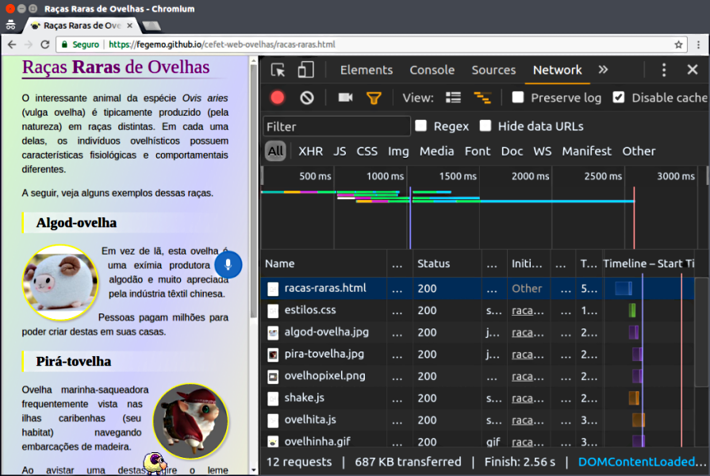
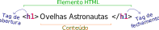
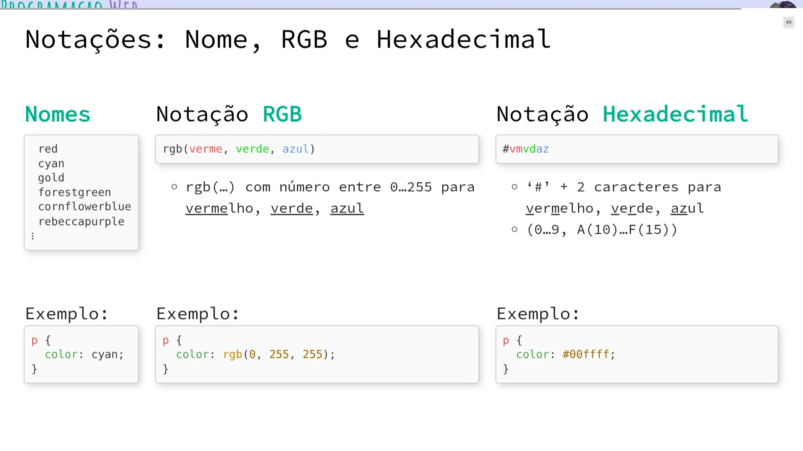
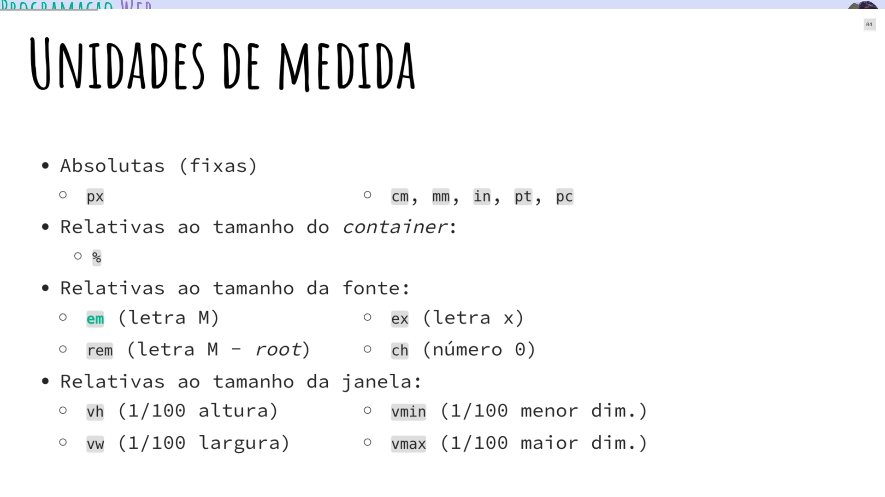
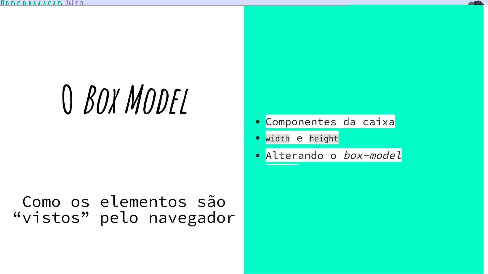
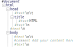

<!-- {"layout": "title"} -->
# **Introdução** à Web
## Modelo, Linguagens e Funcionamento

<!--xxx Criada para ser usada em CG do 7º período, introdução à Web -->
<!--xxx
  Temas:
  - formatos da web (req/res, html etc.)
  - html (tags básicas)
  - css (box-model e props)
  - js (window, document, DOM)
-->

---
<!-- {"layout": "centered"} -->
# Roteiro

1. [Como funciona a Web](#como-funciona-a-web)
1. [Estrutura via HTML](#estrutura-via-html)
1. [Aparência via CSS](#aparencia-via-css)
1. [Comportamento via JavaScript](#comportamento-via-javascript)

---
<!-- {"layout": "section-header", "hash": "como-funciona-a-web"} -->
# Como funciona a Web
## e tudo o mais

- Definição de Web
- Linguagens da Web
- Modelo Requisição e Resposta
<!-- {ul:.content} -->

---
## Definição **(~~in~~formal)** de Web

- **World Wide Web**, ou WWW, traduz em "teia mundial"
  - Normalmente falamos apenas: a **Web**

1ª definição
  ~ É o que estamos vendo e interagindo quando abrimos um navegador
    (Chrome, Firefox etc.)

2ª definição
  ~ Um conjunto de documentos de **hipermídia** **interconectados**, tipicamente
    acessados pela Internet. Esses documentos são as **páginas web**.
    - **Hipermídia**: conteúdo digital que envolve texto, imagens, sons,
      vídeos etc.
    - **Interconectado**: um documento contém "links" (referências) a outros
      (daí a ideia de teia :spider_web:)

<!-- {dl:.bulleted} -->

---
## Definição **(formal)** de Web

Segundo Andrew Tanembaum (autor de vários livros de Computação):

> A Web é um **arcabouço arquitetural** para acessar<br>
> **conteúdo relacionado** que está espalhado em milhões<br>
> de computadores pela Internet.

<!-- {blockquote:.centered} -->

"Arcabouço arquitetural"
  ~ Conjunto de regras para a descrição, visualização e transmissão das
    páginas web

"Conteúdo relacionado"
  ~ As páginas podem conter referências (_links_, ou melhor, _hyperlinks_) para
    outras páginas

<!-- {dl:.width-40} -->

---
<!-- { "layout": "2-column-highlight-and-content" , "hash": "o-que-compoe-web"} -->
## O que **compõe** uma página web?

::: figure . height: 90%
<figcaption><a href="https://fegemo.github.io/cefet-web-ovelhas/racas-raras.html" target="_blank"><code>racas-raras.html</code></a></figcaption>
<iframe src="https://fegemo.github.io/cefet-web-ovelhas/racas-raras.html" height="90%" width="100%" allow="microphone; accelerometer; gyroscope; xr-spatial-tracking">
  
</iframe>
:::

- Uma página web é formada por **arquivos**:
  - **01** arquivo no formato HTML (*e.g.*, `racas-raras.html`)
  - Arquivos CSS (*e.g.*, `estilo.css`)
  - Arquivos JavaScript (*e.g.*, `ovelhita.js`)
  - Imagens (`.png`, `.jpg`, `.gif`)
  - Vídeos etc.

*[HTML]: Hypertext Markup Language*
*[CSS]: Cascading Stylesheets*

---
<!-- {"layout": "3-column-element-with-titles-expansible","preventSelection": "code"} -->
##  <!-- {.emoji} --> `racas-raras.`**`html`**

```html
<!DOCTYPE html>
<html>
  <head>
    <meta charset="utf-8">
    <meta name="viewport" content="width=device-width">
    <title>Raças Raras de Ovelhas</title>
    <link rel="stylesheet" href="estilos.css">
    <link rel="shortcut icon" href="favicon.ico" type="image/x-icon" />
  </head>
  <body>
    <h1>Raças <strong>Raras</strong> de Ovelhas</h1>
    <p>O interessante animal da espécie <em>Ovis aries</em> (vulga ovelha) é
      tipicamente produzido (pela natureza) em raças distintas. Em cada uma
      delas, os indivíduos ovelhísticos possuem características fisiológicas e
      comportamentais diferentes.</p>
    <p>A seguir, veja alguns exemplos dessas raças.</p>
    <h2>Algod-ovelha</h2>
    
    <p>Em vez de lã, esta ovelha é uma exímia produtora de algodão e
      muito apreciada pela indústria têxtil chinesa.</p>
    <p>Pessoas pagam milhões para poder criar destas em suas casas.</p>
    <h2>Pirá-tovelha</h2>
    
    <p>Ovelha marinha-saqueadora frequentemente vista nas ilhas caribenhas
      (seu habitat) navegando embarcações de madeira.</p>
    <p>Ao avistar uma destas, gire o leme completamente a estibordo, ice as
      velas e fuja para terra firme.</p>
    <h2>Ovelhopixel</h2>
    
    <p>Uma ovelha digital formada por um conjunto de quadradinhos coloridos.</p>
    <p>Ela precisa se recarregar de tempos em tempos.</p>
    <h2>Outras</h2>
    <ul>
      <li>Robôvelha</li>
      <li>Ninjo-velha</li>
      <li>Legovelha</li>
    </ul>
    <figure id="ovelha" class="sprite">
      
    </figure>
    <script src="shake.js"></script>
    <script src="ovelhita.js"></script>
  </body>
</html>
```

##  <!-- {.emoji} --> `estilos.`**`css`**

```css
body {
  margin: 0 auto;
  max-width: 600px;
  border-left: 3px double silver;
  border-right: 3px double silver;
}

h1 {
  margin-top: 0;
  font-family: "Comic Sans", cursive;
  font-weight: normal;
  color: purple;
}

h2 {
  clear: both;
  color: black;
  font-family: "Comic Sans", cursive;
  background-image: linear-gradient(to right, yellow 1%, rgba(255,255,255,.5) 1%, transparent);
  padding: 0.15em 0.15em 0.15em 1em;
}

.circular {
  border-radius: 50%;
  shape-outside: circle(50%);
}

.foto-ovelha {
  display: inline-block;
  width: 125px;
  border: 2px solid yellow;
  box-shadow: 3px 3px 3px silver;
}

p {
  text-align: justify;
  line-height: 1.5em;
}

ul {
  list-style-image: url(ovelhinha.gif);
}

.sprite {
  width: 40px;
  height: 40px;
  overflow: hidden;
  position: fixed;
  bottom: 0;
  right: 0;
  margin: 0;
  cursor: move;
}

.sprite.invertido {
  transform: rotateY(.5turn);
}

.sprite > img {
  position: absolute;
  top: calc(-1*40px);
  left: calc(-3*40px);
}

.sprite.parado > img {
  top: calc(-1*40px);
  left: calc(-3*40px);
  animation: parado 1.5s steps(1) 1;
}

@keyframes parado {
  100% { left: calc(-3*40px); }
}
```

##  <!-- {.emoji} --> `ovelhita.`**`js`**

```js
const ANIMACOES = ['parado', 'andando', 'correndo', 'rolando', 'virando',
  'adormecendo', 'dormindo', 'despencando', 'despencado', 'pendurada'];

const ESTADOS = {
  reflexiva: { loop: 'parado', proximo: ['dormindo', 'andando', 'reflexiva'] },
  dormindo: { loop: 'dormindo', pre: 'adormecendo', pos: { anim: 'parado', duracao: 500 }, proximo: ['andando', 'reflexiva'] },
  andando: { loop: 'andando', proximo: ['andando', 'reflexiva', 'virando', 'correndo'] },
  correndo: { loop: 'correndo', proximo: ['andando', 'correndo'] },
  virando: { loop: 'virando', proximo: ['reflexiva', 'andando'] },
  rolando: { loop: 'rolando', proximo: ['reflexiva', 'dormindo'] },
  pendurada: { loop: 'pendurada', proximo: ['despencando'] },
  despencando: { loop: 'despencando', pos: { anim: 'despencado', duracao: 2000 }, proximo: ['reflexiva']}
};

const vibraTela = () => {
  // chama a vibração da bateria, se houver
  if ('vibrate' in navigator) {
    navigator.vibrate(1000);
  }

  // faz os elementos dentro do tela tremerem
  document.body.classList.add('vibrando');
  document.body.addEventListener('animationend', function(e) {
    e.target.removeEventListener(e.type, arguments.callee);
    document.body.classList.remove('vibrando');
  });
};

let ovelha = {
  el: document.querySelector('#ovelha'),

  // estado inicial
  estado: ESTADOS.reflexiva,
  tempoNoEstado: 0,
  estadosAnteriores: [],
  orientacao: 1,

  // define qual animação será tocada
  defineAnimacao(nomeAnimacao) {
    ANIMACOES.forEach((anim) => this.el.classList.remove(anim));
    this.el.classList.add(nomeAnimacao);
  },

  // define se a ovelha está olhando para esquerda ou direita
  defineOrientacao(novaOrientacao) {
    if (novaOrientacao <= 0) {
      this.el.classList.add('invertido');
    } else {
      this.el.classList.remove('invertido');
    }
    this.orientacao = novaOrientacao;
  },

  largura: 40,
  altura: 40,
  // coordenadas definem a posição do centro da ovelha
  x: 20,
  y: 20,
  // sistema de coordenadas começa na direita e embaixo
  definePosicao(x, y) {
    this.x = x;
    this.el.style.right = `${x - this.largura/2}px`;
    if (!!y) {
      this.y = y
      this.el.style.bottom = `${y - this.altura/2}px`;
    }
  },

  // invocada quando quisermos trocar o estado
  mudaEstado(novoEstado) {    
    switch (novoEstado) {
      case ESTADOS.despencando:
        this.velocidadeY = 0;
        break;
    }

    this.estadosAnteriores.unshift(this.estado);
    while (this.estadosAnteriores.length > 3) {
      this.estadosAnteriores.pop();
    }
    this.estado = novoEstado;
    this.tempoNoEstado = 0;
  },

  sorteiaProximoEstado() {
    return ESTADOS[this.estado.proximo[Math.floor(Math.random() * this.estado.proximo.length)]];
  },

  bateuNaTela() {
    return (this.x - this.largura/2 < 0 || this.x + this.largura/2 > window.innerWidth);
  },

  saiuDaTela() {
    return (this.x + this.largura/2 < 0 || this.x - this.largura/2 > window.innerWidth);
  },

  revolucionaNaTela() {
    let newX;
    if (this.x - this.largura/2 < 0) {
      newX = this.x + window.innerWidth + this.largura/2;
    } else if (this.x + this.largura/2 > window.innerWidth) {
      newX = -this.largura/2;
    }
    this.definePosicao(newX);    
  },

  passouDoChao() {
    return (this.y - this.altura/2 < 0);
  },

  tempoAntes: 0,
  atualiza(tempo) {
    let delta = tempo - this.tempoAntes;
    this.tempoNoEstado += delta;

    switch (this.estado) {
      case ESTADOS.reflexiva:
        if (this.tempoNoEstado > 1000) {
          this.mudaEstado(this.sorteiaProximoEstado());
        }
        break;

      case ESTADOS.dormindo:
        if (this.tempoNoEstado > 4000) {
          this.mudaEstado(this.sorteiaProximoEstado());
        }
        break;

      case ESTADOS.andando:
        this.definePosicao(this.x += this.orientacao * .025 * delta);
        if (this.tempoNoEstado > 3000) {
          this.mudaEstado(this.sorteiaProximoEstado());
        }
        if (this.saiuDaTela()) {
          this.revolucionaNaTela();
        }
        if (this.bateuNaTela() && this.estadosAnteriores.indexOf(ESTADOS.virando) === -1) {
          this.mudaEstado(ESTADOS.virando);
        }
        break;

      case ESTADOS.correndo:
        this.definePosicao(this.x += this.orientacao * .085 * delta);
        if (this.tempoNoEstado > 2500) {
          this.mudaEstado(this.sorteiaProximoEstado());
        }
        if (this.saiuDaTela()) {
          // dá a volta na tela
          this.revolucionaNaTela();
        }
        break;

      case ESTADOS.virando:
        // 500ms é o mesmo tempo definido na animação em CSS
        if (this.tempoNoEstado > 500) {
          this.defineOrientacao(this.orientacao * -1);
          this.mudaEstado(this.sorteiaProximoEstado());
        }
        break;

      case ESTADOS.rolando:
        // rola até bater na tela
        this.definePosicao(this.x += this.orientacao * .085 * delta);
        if (this.bateuNaTela()) {
          this.mudaEstado(this.sorteiaProximoEstado());
        }
        break;

      case ESTADOS.despencando:
        // vai caindo até atingir o chão
        this.definePosicao(this.x, this.y += this.velocidadeY * .085 * delta);
        this.velocidadeY -= 0.025;
        if (this.passouDoChao()) {
          this.definePosicao(this.x, this.altura/2);
          vibraTela();
          this.mudaEstado(this.sorteiaProximoEstado());
        }
        break;        
    }

    if (!this.deveParar) {
      requestAnimationFrame(this.atualiza.bind(this));
    }
    this.deveParar = false;
    this.tempoAntes = tempo;
  },

  para: function() {
    this.deveParar = true;
  }
};


ovelha.inicializa();
```

---
<!-- { "layout": "circling-balloons" } -->
## As três linguagens

- 

  Linguagem:
    ~ HTML: Hypertext Markup Language

  O que faz:
    ~ Conteúdo e estrutura da página (*e.g.*, o texto, imagens)

- 

  Linguagem:
    ~ CSS: Cascading Stylesheets

  O que faz:
    ~ Apresentação (estilos) da página (*e.g.*, core, tamanhos, detalhes)

- 

  Linguagem:
    ~ JavaScript

  O que faz:
    ~ Comportamento dinâmico na página (*e.g.*, a ovelhita)

---
<!-- {
  "layout": "2-column-highlight-and-content",
  "embeddedStyles": ".titulo-raras-ovelhas { color: purple; font-family: 'Comic Sans', cursive; font-weight: normal; border-bottom: 2px solid currentColor; }"
} -->
## A página das **Raças Raras de Ovelhas** <!-- {.titulo-raras-ovelhas} -->

 <!-- {.block} -->

- O arquivo HTML referencia (usa, inclui) os arquivos de imagem, os arquivos
  de estilo e os de script. Por exemplo:
  - Incluindo imagem:
    ```html
    
    ```
  - Referenciando um arquivo CSS:
    ```html
    <link href="estilos.css" rel="stylesheet">
    ```

---
<!-- {"embedSVG": "img[src$='.svg']", "styles": ["../../styles/classes/http-diagram.min.css"]} -->
## Modelo Requisição e Resposta e o **HTTP**

::: figure .http-diagram.flex-align-center.figure-slides.clean.no-margin.invert-colors-dark-mode
 <!-- {.step-1 style="height: 300px"} --> <!-- {p:.bullet.figure-step.bullet-no-anim} -->

 <!-- {.step-2 style="height: 300px"} --> <!-- {p:.bullet.figure-step.bullet-no-anim} -->

 <!-- {.step-3 style="height: 300px"} --> <!-- {p:.bullet.figure-step.bullet-no-anim} -->
:::

- HTTP é um **protocolo** na camada de aplicação
  > Conjunto de regras bem definidas descrevendo como
  > entidades se comunicam.
  - É a **"língua falada" pelo navegador e pelo servidor web**

---
<!-- {"layout": "2-column-content", "embedSVG": "img[src$='.svg']"} -->
### **Navegador requisita** algo e **Servidor responde**

-  <!-- {.full-width.block.centered.step-3.invert-colors-dark-mode style="height: auto;"} --> <!-- {ul:.http-diagram.no-bullets.no-padding.bullet} -->
  Requisição:
  ```http
  GET /index.html HTTP/1.1
  Host: www.twitter.com
  ```

1. Resposta: <!-- {ol:.bullet.no-bullets.no-padding.compact-code} -->
   ```http
   HTTP/1.1 200 OK
   Date: Mon, 23 May 2005 22:38:34 GMT
   Server: Apache/1.3.3.7 (Unix) (Red-Hat/Linux)
   Content-Type: text/html; charset=UTF-8
   Content-Length: 131

   <!DOCTYPE html>
   <html>
   <head>
     <title>Twitter</title>
   </head>
   <body>
     Olá mundo, este é um tweet.
   </body>
   </html>
   ```

---
<!-- {"layout": "regular"} -->
# Servidor Web

- É o **programa que executa** em um computador **24/7** e _"conversa" com os
  navegadores_
- **Atende _solicitações_** de *download* de arquivos e **entrega as _respostas_**
- Funções:
  - armazenar, processar e entregar páginas web para clientes
  - receber dados de clientes (*upload*, formulários)
  - gerar páginas HTML dinamicamente
- Exemplos hoje em dia:
  - Apache
  - Tomcat
  - Nginx
  - IIS <!-- {ul:.multi-column-list-4} -->

---
## O que é um URL?

- URL: Unique **Resource** Locator <!-- {ul:.bulleted} -->
  - É o **endereço de coisas**: **páginas, imagens, arquivos**, etc.   
     <!-- {.block.full-width} -->
    
    domínio <!-- {dl.bulleted} -->
    ~ Em que computador estão os arquivos

    porta
    ~ Qual endereço do programa dentro do computador

    caminho
    ~ Qual o endereço até o arquivo

- Assim que recebe a resposta, o navegador mostra na tela, _se der_
 
*[URL]: Unique Resource Locator*


---
# Simulando um navegador

- A ferramenta `curl` é um **cliente web** (_aka_ _user-agent_), assim
  como é um navegador, porém, em linha de comando
  - Como o navegador trabalha:
    1. **Solicita a página** das ovelhas: `curl -v https://fegemo.github.io/cefet-web-ovelhas/racas-raras.html`
       - Então, **começa a fazer o _parsing_** do arquivo HTML
    1. Encontra a referência e **solicita o arquivo CSS**: `curl -v https://fegemo.github.io/cefet-web-ovelhas/estilos.css`
    1. Solicita **o ícone**... depois, **cada imagem**...
    1. Solicita os **dois arquivos JavaScript**... fim.

---
<!-- {"fullPageElement": "#sheep"} -->
] <!-- {#sheep.slide-contain.bordered} -->

---
<!-- {"layout": "section-header", "hash": "estrutura-via-html"} -->
# Estrutura via HTML
## Linguagem de Marcação

- Características da linguagem
- Esqueleto básico
- Anatomia de uma _tag_
- Algumas _tags_ comuns
<!-- {ul:.content} -->

---
## HyperText Markup Language (HTML)

- É um _formato de arquivo_ (`.html`) em texto simples (*plain-text*) em que
  **seleciona-se um texto** e **demarca-se suas partes para dar estrutura**:

  Texto puro:
    ~ ```html
      Este é um texto sem ênfases.
      ```

  Texto html:
    ~ ```html
      Este é um texto com um trecho <em>enfatizado</em>.
      ```

---
## Um **arquivo `html`** quase completo

- `pagina-singela.html`:
  ```html
  <!DOCTYPE html>
  <html>
  <head>
    <title>Uma página web!</title>
  </head>
  <body>
    Olá pessoal, esta é uma página com apenas este singelo texto!
  </body>
  </html>
  ```

---
<!-- {"layout": "regular"} -->
## Estrutura de um arquivo HTML

- Um punhado de **tags** no texto <!-- {ul:.bulleted-0} -->
  - As _tags_ fazem a marcação da estrutura do texto
  - Existem dezenas de tags (umas 80? 100?) e cada uma tem um propósito e um
    resultado visual
  - A grande maioria delas precisam ser fechadas
    - Por exemplo: parágrafo (`<p>...</p>`), título (`<h1>...</h1>`)
    - Contraexemplo: imagem (``)
- **Indentação e espaçamento** são livres e não afetam o resultado
- Um arquivo html é _plain-text_, ou puramente textual
  - em contraposição a um arquivo binário, por exemplo

---
<!-- {"layout": "2-column-content"} -->
## A _tag_ &lt;html&gt;

- Envolve **todas** as outras _tags_ <!-- {ul:.bulleted} -->
  - **Exceto** a _tag_ especial `<!DOCTYPE html>`
- Dentro dela, devem sempre existir as seguintes _tags_, nesta ordem:
  - `<head>...</head>`
  - `<body>...</body>`

```html
<!DOCTYPE html>          
<html>  ⬅️         
  <head>
    ...
  </head>
  <body>
    ...
  </body>
</html> ⬅️
```

---
<!-- {"layout": "2-column-content"} -->
## A _tag_ &lt;head&gt;

- Do inglês: cabeça
- Contém **meta-informação** sobre este arquivo HTML, por exemplo: <!-- {li:.bulleted} -->
  - **Codificação** (_encoding_) da página
  - **Título da página** na aba/janela do navegador
  - Iconezinho (_favicon_)
  - Inclusão de outros arquivos (`.css`, `.js`)

```html
<!DOCTYPE html>
<html>
  <head>   ⬅️
    <meta charset="utf-8">
    <title>Título na aba/janela</title>
    <link rel="icon" href="icone.png">
    ...
  </head>  ⬅️
  <body>
    ...
  </body>
</html>
```

---
<!-- {"layout": "2-column-content"} -->
## A _tag_ &lt;body&gt;

- Do inglês: corpo
- Contém **todo o conteúdo da página**: _tags_ de
  - parágrafos (`<p>...</p>`)
  - títulos e subtítulos (`<h1>...</h1>`)
  - imagens (``), etc.
- É tudo visível logo abaixo da barra de endereços até o "chão"

```html
<!DOCTYPE html>
<html>
  <head>...</head>
  <body>   ⬅️
    ...
    <h1>Título Grandão</h1>
    ...
    <p>Um textinho qualquer</p>
    
    ...
  </body>  ⬅️
<html>
```

---
<!-- {"embedSVG": "img[src$='.svg']", "styles": ["../../styles/classes/tag-anatomy.min.css"]} -->
## Anatomia de uma **_tag_**

::: figure .figure-slides.tag-anatomy.clean.flex-align-center.invert-colors-dark-mode
 <!-- {p:.bullet.figure-step.bullet-no-anim.step-0} -->

 <!-- {p:.bullet.figure-step.bullet-no-anim.step-1} -->

 <!-- {p:.bullet.figure-step.bullet-no-anim.step-2} -->

 <!-- {p:.bullet.figure-step.bullet-no-anim.step-3} -->

 <!-- {p:.bullet.figure-step.bullet-no-anim.step-4} -->
:::

- Tags de abertura podem ter **atributos**: <!-- {ul:.bulleted} -->
  ```html
  
  ```
  - Em ``, o atributo `src="..."` aponta para a URL do arquivo
  - **Não deve haver espaço** entre seu nome e seu valor:
    - `` <span style="color: red">:thumbsdown:</span>
    - `` <span style="color: green">:thumbsup:</span>

---
<!-- {"hash": "tag-paragrafo"} -->
## _Tag_ de **<u>Parágrafo</u>** (`<p>...</p>`)

- **Quebras de linha** são feitas automaticamente <!-- {li:.compact-code} -->
  ```html
  <p>
    "Um dos maiores problemas encontrados em viajar no tempo não é vir a se tornar
    acidentalmente seu próprio pai ou mãe. Não há nenhum problema em tornar-se
    seu próprio pai ou mãe com que uma família de mente aberta e bem ajustada não
    possa lidar."
  </p>
  ```
  ::: result . width: 80%; margin: 1em auto;
  "Um dos maiores problemas encontrados em viajar no tempo não é vir a se tornar acidentalmente seu próprio pai ou mãe. Não há nenhum problema em tornar-se seu próprio pai ou mãe com que uma família de mente aberta e bem ajustada não possa lidar."
  :::

---
<!-- {"layout": "2-column-content","hash": "tag-titulo-subtitulo"} -->
## _Tag_ de **<u>Títulos</u>** e **<u>Subtítulos</u>** (`h1`, `h2` ... `h6`)

```html
<h1>Título de 1º nível</h1>
<p>Este é o corpo da seção</p>
<h2>Subtítulo (2º nível)</h2>
<p>Este é o corpo da subseção</p>
```

<iframe width="100%" height="230" src="//jsfiddle.net/fegemo/wxd5s6be/2/embedded/result/" loading="lazy" allowtransparency="true" allowfullscreen="true"></iframe>

- Há a possibilidade de ter **6 <u>níveis</u> de títulos**
  - Mas a quantidade de títulos é infinita... por exemplo :arrow_right:

<iframe width="100%" height="230" src="//jsfiddle.net/fegemo/qLc41vs3/embedded/html,result/dark/"  loading="lazy" allowtransparency="true" allowfullscreen="true"></iframe>

---
<!-- {"hash": "tag-imagem"} -->
## _Tag_ de **<u>Imagem</u>**: ``

-   
  <!-- {.push-right style="height: 100px; margin-left: 1em"} -->
  Para exibir imagens...
  ```html
  
  ```
- Neste exemplo, usamos **a URL de uma imagem hospedada em outro
  site** na Internet
- O atributo `src="..."` (abreviação de _source_) é usado para definir o
  endereço (URL) da imagem
- Uma URL pode ser **externa** ou **interna** <!-- {.alternate-color} -->
  - Veja a diferença no próximo slide

---
<!-- {"hash": "tag-hiperlink"} -->
## _Tag_ de **_Hyperlink_** (`<a href="">...</a>`)

- [Link externo](http://www.google.com) (para fora da página):
  ```html
  <a href="http://www.google.com">Texto do link externo</a>
  ```
  ::: result

    <a href="http://www.google.com">Texto do link externo</a>

  :::

- [Link interno](../../attachments/exemplo.zip) (para algo hospedado no
  próprio computador)
  ```html
  <a href="downloads/exemplo.zip">Texto do link interno</a>
  ```
  ::: result

    <a href="../../attachments/exemplo.zip">Texto do link interno</a>

  :::

---
<!-- {"layout": "regular"} -->
## Punhado de Outras _Tags_

- _Tags_ de listas <!-- {li:.bullet} -->
  - `<ul>` lista de itens  <!-- {ul^0:.multi-column-list-3} -->
  - `<ol>` lista numerada
  - `<dl>` definições
- _Tags_ de texto <!-- {li:.bullet} -->
  - `<strong>` forte <!-- {ul^0:.multi-column-list-4} -->
  - `<em>` ênfase
  - `<del>` excluído
  - `<ins>` inserido
- _Tags_ multimídia <!-- {li:.bullet} -->
  - `` imagem <!-- {ul^0:.multi-column-list-4} -->
  - `<audio>` áudio
  - `<video>` vídeo
  - `<canvas>` tela
- _Tags_ estruturais <!-- {li:.bullet} -->
  - `<div>` divisão _block_ <!-- {ul^0:.multi-column-list-2} -->
  - `<span>` divisão _inline_

---
<!-- {"layout": "main-point", "state": "emphatic"} -->
## Como o navegador <u>vai desenhar</u> as _tags_ HTML?

- Ele usa estilos padrão: <!-- {ul:.bulleted} -->
  
  Cor do texto
  ~ preta
  
  Cor de fundo
  ~ branca

  Fonte
  ~ Times New Roman para títulos (no Windows)
  ~ Arial para parágrafos
- Cada navegador pode ter um estilo padrão diferente
- É possível e altamente recomendável <u>criar estilos próprios</u>
- Vamos conhecer agora uma segunda linguagem: CSS


---
<!-- {"layout": "section-header", "hash": "aparencia-via-css"} -->
# Aparência via CSS
## Linguagem de Estilos

- Características da linguagem
- Anatomia de uma regra
- Formas de inclusão
- Propriedades básicas
<!-- {ul:.content} -->

---
<!-- {"layout": "regular"} -->
# A Linguagem **CSS**

- ::: figure .floating-portrait-container.push-right
    
  :::
  Sigla para _**C**ascading **S**tyle**s**heets_
- Criada entre 1994 e 1996 por Håkon Wium Lie ➡️
- Proposta para separar a definição de aparência (CSS) da estrutura 
  e conteúdo (HTML) <!-- {li:.compact-code} -->
  - Cascata: estilos se propagam de pai para filhos
  - Ideia: uma única regra pode estilizar vários elementos de uma vez
    ```css
    p {
      color: red; /* todos elementos <p> terão cor do texto vermelha */
    }
    ```
- Escrevemos **regras** com uma ou mais **declarações**

---
<!-- {"layout": "centered", "embedSVG": "img[src$='.svg']", "styles": ["../../styles/classes/css-rule-anatomy.min.css"]} -->

::: figure .figure-slides.clean
 <!-- {.css-rule-anatomy} --> <!-- {p:.bullet.figure-step.bullet-no-anim} -->

 <!-- {.css-rule-anatomy.rule} --> <!-- {p:.bullet.figure-step.bullet-no-anim} -->
:::

---
<!-- {"layout": "centered", "embedSVG": "img[src$='.svg']", "state": "show-active-slide-and-previous", "containerStyles": {"--show-2-slides-x-distance": "200px", "--show-2-slides-z-distance": "-150px", "--show-2-slides-rotation": "5deg"}} -->

 <!-- {.css-rule-anatomy.selector.declaration} -->

---
<!-- {"layout": "centered", "embedSVG": "img[src$='.svg']"} -->

 <!-- {.css-rule-anatomy.property.value} -->

---
<!-- {"layout": "regular"} -->
## Há 3 formas para **incluir CSS**

1. Via atributo `style` de cada elemento: <!-- {ol:.compact-code-more style="display: grid;grid-template-columns: 1fr 1.2fr; grid-template-rows: auto auto; gap: 0 4rem;"} --> <!-- {li:.bullet} -->
   ```html
   <p style="margin-left: 20px">......</p>
   ```
   - Aplica apenas àquele elemento (nenhum reuso, mistura responsabilidades)
1. Via elemento `<style>` no `<head>`: <!-- {li:.bullet} -->
   ```html
    <style>
      p {
        margin-left: 20px;
      }
    </style>
   </head>
   ```
   - Pega todos elementos do seletor (mais reuso, mistura respons.)
1. Via arquivo `.css` separado <!-- {li:.bullet style="grid-column: 1/3;"} -->
   ```html
    ...
    <link rel="stylesheet" href="estilos.css">
   </head>
   ```
   - 🌟 Todos do seletor, e várias páginas podem incluir o arquivo

---
<!-- {"layout": "tall-figure-left", "embedSVG": "img[src$='.svg']", "hash": "seletores-css", "slideStyles": {"grid-template-columns": ".2fr 1fr"}} -->
## Tipos de **Seletores** CSS

 <!-- {.css-rule-anatomy.selector style="width: 242px" data-viewbox="50 0 100 65"} -->

- O seletor define a **que(ais) elemento(s)** HTML da página a **regra CSS será aplicada** <!-- {ul:.bulleted-0} -->
- Há [diversos tipos de seletores][outros-seletores]. Os 3 principais:
  1. _tag_
  1. `id`
  1. `class`
- Regras podem ter 1+ seletor, separados por vírgula:
  ```css
  /* tanto <p>, qto <h1>, qto <ul> */
  p, h1, ul {
    color: black; 
  }
  ```

[outros-seletores]: ../css1/#outros-seletores

---
<!-- {"hash": "seletor-de-tag"} -->
## Seletor de <u>_tag_</u>

- Se usarmos um seletor que é **o nome de uma _tag_**...
  ```css
  p { /* usamos 'p', que é o nome da tag de parágrafo */
    margin-left: 5%;
  }
  ```
  - ...selecionamos **todos os elementos da página <u>com aquela _tag_</u>**
    (_e.g._, todos os parágrafos)
- Outros exemplos: <!-- {li:.three-column-code} -->
  ```css
  img {
    border-radius: 50%;
  }
  body {
    font-size: 20px;
  }
  strong {
    color: forestgreen;
  }
  ```

---
<!-- {"hash": "seletor-de-id"} -->
## Seletor de <u>`id`</u>

- Todo elemento HTML pode ter um atributo `id`. Exemplos: <!-- {li:.compact-code.push-code-right} -->
  ```html
  <h1 id="titulo-principal">...</h1>
  
  <ul id="melhores-pokemon">...</ul>
  ```
  - O atributo `id` **<u>deve ser único</u> na página**
    - Não pode haver 2+ elementos com um mesmo `id`
- Se usarmos um seletor **que começa com o símbolo `#`** (_hashtag_)...
  ```css
  #titulo-principal {
    font-family: 'Verdana', sans-serif;
  }
  ```
  - ...selecionamos **<u>apenas o</u> elemento que possua aquele <u>atributo `id`</u>**
  - Mas e se quisermos selecionar **mais do que um elemento**?

---
<!-- {"hash": "seletor-de-classe"} -->
## Seletor **de classe** <small>(1/2)</small>

- Dada a seguinte estrutura de um `<body></body>`:
  ```html
  <p>Primeiro</p>
  <p>Segundo</p>
  <p>Terceiro</p>
  ```
- Para criar uma regra CSS para, digamos, os dois primeiros parágrafos, podemos
  alterar a estrutura HTML para:
  ```html
  <p class="destacado">Primeiro</p>
  <p class="destacado">Segundo</p>
  <p>Terceiro</p> <!-- continua no próximo slide -->
  ```

---
## Seletor de classe <small>(2/2)</small>

- E, em um arquivo CSS, podemos escrever o nome da _tag_, seguido por um ponto
   "`.`", seguido pelo nome da classe:
  ```css
  p.destacado {
    font-weight: bold; /* negrito */
  }
  ```
- Ou, se quisermos usar a classe `destacado` para outros elementos além de
  `<p></p>`, podemos omitir o nome da _tag_ (o mais comum é omitir):
  ```css
  .destacado {
    font-weight: bold;
  }
  ```

---
<!-- {"layout": "regular", "embeddedStyles": ".basic-props img {width: 90%; border: 2px solid silver; box-shadow: 4px 4px #999; transition: all 200ms; will-change: translate; &:hover {translate: 0 -4px; box-shadow: 6px 6px 4px #ccc} }"} -->
## Algumas **Propriedades** Básicas

- Definem cores: <!-- {ul:.basic-props.card-list.full-width style="justify-content: space-between;"} -->
  
  [`color`][mdn-color] <!-- {dl:.dl-grid style="font-size: 0.8em; line-height: 1; gap: 0.75rem"} -->
    ~ cor do texto

  [`background-color`][mdn-background-color]
    ~ cor de fundo

  [`background-image`][mdn-background-image]
    ~ imagem de fundo
  
  [`opacity`][mdn-opacity]
    ~ opacidade

  [Especificando cores:][slides-cores] <!-- {p:style="text-align: center; margin: 1rem 0 0"} -->
  [][slides-cores] 
- Definem texto:

  [`font-family`][mdn-font-family] <!-- {dl:.dl-grid style="font-size: 0.8em; line-height: 1; gap: 0.75rem"} -->
    ~ nome da fonte
  
  [`font-size`][mdn-font-size]
    ~ tamanho
  
  [`font-weight`][mdn-font-weight]
    ~ negrito?

  [`text-align`][mdn-text-align]
    ~ alinhamento

  [Especificando tamanhos:][slides-tamanhos] <!-- {p:style="text-align: center; margin: 1rem 0 0"} -->
  [][slides-tamanhos]
- Tamanhos e espaços:

  [`width`][mdn-width] <!-- {dl:.dl-grid style="font-size: 0.8em; line-height: 1; gap: 0.75rem"} -->
    ~ largura
  
  [`height`][mdn-height]
    ~ altura

  [`padding`][mdn-padding]
    ~ espaço interno

  [`margin`][mdn-margin]
    ~ espaço externo

  [O Box Model:][slides-box-model] <!-- {p:style="text-align: center; margin: 1rem 0 0"} -->
  [][slides-box-model] 
  
  
  

[slides-cores]: ../css1/#49
[slides-tamanhos]: ../css4/#4
[slides-box-model]: ../html4/#o-box-model

[mdn-color]: https://developer.mozilla.org/en-US/docs/Web/CSS/Reference/Properties/color
[mdn-background-color]: https://developer.mozilla.org/en-US/docs/Web/CSS/Reference/Properties/background-color
[mdn-background-image]: https://developer.mozilla.org/en-US/docs/Web/CSS/Reference/Properties/background-image
[mdn-opacity]: https://developer.mozilla.org/en-US/docs/Web/CSS/Reference/Properties/opacity

[mdn-font-size]: https://developer.mozilla.org/en-US/docs/Web/CSS/Reference/Properties/font-size
[mdn-font-family]: https://developer.mozilla.org/en-US/docs/Web/CSS/Reference/Properties/font-family
[mdn-font-weight]: https://developer.mozilla.org/en-US/docs/Web/CSS/Reference/Properties/font-weight
[mdn-text-align]: https://developer.mozilla.org/en-US/docs/Web/CSS/Reference/Properties/text-align

[mdn-width]: https://developer.mozilla.org/en-US/docs/Web/CSS/Reference/Properties/width
[mdn-height]: https://developer.mozilla.org/en-US/docs/Web/CSS/Reference/Properties/height
[mdn-margin]: https://developer.mozilla.org/en-US/docs/Web/CSS/Reference/Properties/margin
[mdn-padding]: https://developer.mozilla.org/en-US/docs/Web/CSS/Reference/Properties/padding
---
<!-- {"layout": "section-header", "hash": "comportamento-via-javascript"} -->
# Comportamento via JavaScript
## Linguagem de Script

- Três formas de inclusão
- _Hello World_
- Tipos de Dados
- Objetos notáveis
  - window
  - document
- DOM
<!-- {ul:.content} -->

---
## Três formas de inclusão

- **Há 3 formas para incluir** (similar ao CSS):
  1. **Externa** :thumbsup:
     ```html
       ...  <!-- dentro do HEAD -->
       <script src="executa-no-inicio.js"></script>
     </head>
     <body>
       ...
       <!-- última coisa antes de fechar /BODY (é melhor aqui) -->
       <script src="executa-no-fim-da-pagina.js"></script>
     </body>
     ```

---
## Inclusão em páginas

2. Embutida :thumbsdown:
   ```html
   <script>
     // código javascript aqui
   </script>
   ```
   - Não reaproveita entre arquivos, mistura com HTML
3. *Inline* :thumbsdown::thumbsdown::thumbsdown:
   ```html
   <button onclick="javascript: alert();">Mensagem</button>
   ```
   - Nenhum reaproveitamento, mistura uma mesma linha

---
<!-- {"layout": "2-column-content"} -->
## <span style="font-family: 'Amatica SC',cursive;">hello-world.js</span> e imprimindo no console

- <!-- {ul:.no-bullets.bullet.compact-code-more} -->
  ```html
  <!DOCTYPE html>
  <html>
  <head>
    <title>...</title>
  </head>
  <body>
    <!-- ... -->
    <script src="hello-world.js"></script>
  </body>
  </html>
  ```
  ```js
  // imprime no console do navegador
  console.log('Hello world');

  // abre uma janelinha infernal
  window.alert('Sou das trevas');
  ```

1. Um arquivo JavaScript incluído por um HTML é **baixado e executado linha a linha** <!-- {ol:.bullet.compact-code-more style="margin-left: auto;"} -->
2. Para testar escrevemos no console do navegador com
   ```js
   console.log('.......');
   ```
3. Também pode abrir uma janelinha
   ```js
   window.alert('......');
   ```
   - ...mas não faça isto, jovem, porque essa janelinha é muito chata ;)

---
<!-- {"layout": "2-column-content", "hash": "tipos-de-dados"} -->
## Tipos de dados

- Há sete **tipos primitivos** de dados:
  - `1. Boolean` <!-- {.tipo-js.tipo-boolean} -->
  - `2. Number` <!-- {.tipo-js.tipo-number} -->
  - `3. String` <!-- {.tipo-js.tipo-string} -->
  - `4. Null` <!-- {.tipo-js} -->
  - `5. Undefined` <!-- {.tipo-js} -->
  - `6. Symbol` <!-- {.tipo-js} -->
  - `7. BigInt` <!-- {.tipo-js} --> <!-- {ul:.multi-column-list-2} -->
- Um **tipo composto** de dados:
  `8. Object` <!-- {.tipo-js.tipo-object} -->
  - Há outros derivados de `Object`...
  - Você pode criar seus objetos também

1. Para verificar o tipo de uma variável, usamos `typeof` <!-- {.compact-code-more} -->
   ```js
   let vacinou = true;
   console.log(typeof vacinou);
   // imprime "boolean"

   let nota = 10;
   console.log(typeof nota);
   // imprime "number"

   let aluno = 'Adamastor';
   console.log(typeof aluno);
   // imprime "string"

   let inimigo = {
     vida: 100,
     nome: 'Slime'
   };
   console.log(typeof inimigo); // impr. "object"
   ```

---
<!-- {"classes": "compact-code"} -->
## O tipo `8. Object` <!-- {.tipo-js.tipo-object} -->

- É um **"saquinho" de propriedades**: <!-- {ul:.push-code-right.full-width} -->
  ```js
  let jogador = {
    pontos: 1420,
    vidas: 2
  };
  console.log(jogador.pontos);
  // imprime 1420
  ```  
  - Propriedade: (**nome → valor**)
    - Nome: uma String
    - Valor: qualquer coisa, exceto `undefined`
- No exemplo, o objeto tem 2 propriedades: <!-- {li^0:.bullet} -->
  1. Nome: `pontos`, valor: `1420`
  1. Nome: `vidas`, valor: `2`
- Para acessar as propriedades, há 2 formas: <!-- {li:.bullet} -->
  - <!-- {.code-split-2} -->
    ```js
    // notação ponto
    console.log(jogador.vidas);
    ```
    ```js
    // notação colchete
    console.log(jogador['vidas']);
    ```

---
## Objetos conhecidos

- ::: did-you-know .push-right width: 250px;
  Quando um objeto tem uma **propriedade que é uma função**, chamamos ela de **método**.
  :::
  Há vários objetos comuns que usamos no dia a dia: `Math`, `console`, `window`. Exemplos:
  - O objeto `Math` possui uma propriedade:
    - ```js
      Math.PI
      ```
      (PI → 3.14159) (cujo valor é `Number`) <!-- {.tipo-js.tipo-number} -->      
  - O objeto `console` possui uma propriedade
    - ```js
      console.log
      ```
      (log → function() {...})
  - O objeto `window` possui uma propriedade
    - ```js
      window.alert
      ```
      (alert → function() {...})

<!-- {ul^3:.bulleted-0.push-code-right-without-clearing.compact-code-more} -->

---
<!-- {"hash": "operadores", "embeddedStyles": ".less-padding ul li{padding-left:0em;list-style-type:none}"} -->
# Operadores

- Aritméticos <!-- {ul^0:.less-padding} -->
  - **`+`** soma&nbsp;&nbsp;&nbsp;**`-`** subtração
  - **`*`** multiplicação
  - **`**`** exponenciação
  - **`/`** divisão
  - **`%`** resto da divisão
  - **`++`** incremento&nbsp;&nbsp;&nbsp;**`--`** decremento
- Atribuição
  - **`=`** simples&nbsp;&nbsp;&nbsp;**`+=  /=  %=`** composta
- Relacionais (comparação)
  - **`==`** igualdade
  - **`===`** igualdade forte (!!)
  - **`!=`** desigualdade
  - **`!==`** desigualdade forte  (!!)
  - **&lt;  &lt;=** menor/menor igual
  - **&gt;  &gt;=** maior/maior igual
- Lógicos
  - **`!`** não&nbsp;&nbsp;&nbsp;**`&&`** e&nbsp;&nbsp;&nbsp;**`||`** ou <!-- {ul^4:.multi-column-list-2} -->

---
<!-- {"layout": "2-column-content-zigzag", "embeddedStyles": ".push-code-right pre{float:right;}", "hash": "declarando-e-invocando-funcoes"} -->
# Declarando e invocando **funções**

- Funções são **declaradas** usando a palavra-chave `function` <!-- {style="float:initial"} --> + nome + parâmetros + corpo ➜
  - Há outras formas, como funções anônimas e seta

```js
// DECLARA a função dizOla()
function dizOla(nome, pronome) {
  const alvo = nome + ' ' pronome;
  console.log('olá ' + alvo);
}
```

```js
// INVOCA a função dizOla()
dizOla('sr.', 'fegemo');
// imprime: olá sr. fegemo
```
- Funções são **invocadas** (chamadas) por seu nome, seguido de parênteses <!-- {ul:.no-margin} -->

---
<!-- {"hash": "o-objeto-global-window"} -->
# O objeto global: **window**

- O navegador **expõe um único objeto** por janela chamado `window`
- Ele possui informações e utilidades sobre a janela corrente.
  Exemplos:
  ```js
  window.alert('mensagenzinha feia 🔥');                  // retorna undefined
  window.confirm('janela pedindo confirmacao');           // retorna true, false
  window.prompt('escreva seu nome, champz', 'b. verde');  // retorna uma string
  ```
  ```js
  // url, título, opções
  window.open('/popup.html', 'Enquete', 'resizable,scrollbars');  // péssima ux
  ```

---
## O objeto global: **window** (cont.)

- Mais algumas utilidades de **window**
  ```js
  window.setTimeout(f, 200);   // chama daqui a 200ms, 1x. retorna um id do timer
  window.setInterval(f, 1000); // chama a cada 1s, forever. retorna um id
  window.clearTimeout(id);
  window.clearInterval(id);
  ```
- ::: did-you-know .push-right width: 360px;
  `window` é o único obj. global. Logo, podemos omiti-lo, por ex.: <code><del>window.</del>console.log</code>.
  :::
  Além de utilidades, o objeto `window` também possui outros objetos muito
  importantes
  - `window.console`
    - Objeto de acesso ao terminal
  - **`window.document`**
    - Acesso à estrutura `html` da página

---
<!-- {"hash": "conhecendo-o-dom"} -->
# Conhecendo o DOM

- DOM: _Document Object Model_
  - É a versão "viva" do código HTML da página 
- É uma **visão dos elementos** HTML da página **como uma árvore**:
- <!-- {.code-split-2.compact-code} -->
  ```html
  <!DOCTYPE html>
  <html>
  <head>
    <title>HTML</title>
  </head>
  <body>
    <!-- Add your content here -->
  </body>
  </html>
  ```
   <!-- {.full-width} -->
*[DOM]: Document Object Model*

---
<!-- {"classes": "compact-code-more"} -->
## O objeto **document**

- O objeto `document` dá acesso ao **Document Object Model**, ou DOM <!-- {ul:.bulleted-0} -->
- DOM !== código fonte
  - É a visão viva da árvore de elementos HTML gerada pelo navegador
  - Vivo: pode ser alterado, interagido, aumentado/reduzido
- Ao interagir com o DOM, precisamos de uma referência ao elemento
  - Por exemplo, para pegar um elemento a partir de seu `id`:
    ```js
    let botaoDeliciaEl = document.querySelector('#botao-delicia');
    ```
    - Agora é possível fazer várias coisas com o botão, como:
      1. Associar um evento de clique ([exemplo](#evento-clique))
      1. Pegar ou alterar seus atributos ([exemplo][js-atributos])
      1. Alterar seu conteúdo ([exemplo][js-conteudo])
      1. Alterar suas classes ou estilo ([classe][js-classe] e [propriedade][js-propriedade])

[js-atributos]: ../js2/#alterando-atributos
[js-conteudo]: ../js2/#alterando-o-conteudo
[js-classe]: ../js2/#colocando-removendo-classes
[js-propriedade]: ../js4/#alterando-o-estilo-de-elementos

---
<!-- {"hash": "recuperando-elemento-dom"} -->
# Selecionando um elemento

- A função `document.querySelector(seletor)` permite que, a partir de um código
  JavaScript, recuperemos uma referência a um elemento do DOM
  - Ela recebe um único **argumento** que é um **seletor CSS**. Exemplo:
    ```js
    let logoEl = document.querySelector('#logomarca');
    let tabelaEl = document.querySelector('#tesouros-pirata');
    let principalEl = document.querySelector('main');
    ```
    - Ela retorna um elemento HTML com que podemos interagir
  - Também existe `document.querySelectorAll(seletor)` (repare o **`all`**),
    que retorna mais de um elemento

---
<!-- {"hash": "evento-clique"} -->
# **Exemplo**: clique em um botão

- Para **executar alguma coisa quando um botão** (ou qualquer elemento, na verdade)
  **é clicado**, precisamos **registrar uma função para ser chamada** quando um
  clique for feito nele:
  ```js
  // recupera o elemento do botão no DOM
  let botaoDeliciaEl = document.querySelector('#botao-delicia');

  // atrela uma função ao evento de 'click' do botão
  botaoDeliciaEl.addEventListener('click', function() { /* ... */ });
  ```
  - Chamamos essa função de **_callback_**

---
## Exemplo de _callback_

- Uma _callback_ é só um nome especial para quando uma função passada
  como argumento:
  ```js
  // recupera o elemento do botão no DOM
  let botaoDeliciaEl = document.querySelector('#botao-delicia');

  // atrela uma callback ao evento de 'click' do botão
  botaoDeliciaEl.addEventListener('click', function() {
    alert('O botão delícia foi clicado!!');
    // pode fazer várias coisas aqui
  });
  ```

---
## Eventos

- Eventos são **atrelados a nós específicos** e causam a invocação de uma função
  "manipuladora" (_event handler_ ou apenas _handler_)
- Eventos de mouse:
  - `click`
  - `dblclick`
  - `mousedown`
  - `mouseup`
  - `mousemove`
  - `mouseover`
  - `mouseout` <!-- {ul:.multi-column-list-4}-->
- Eventos de entrada de dados:
  - `change`
  - `blur`
  - `focus`
  - `keydown`
  - `keyup`
  - `reset`
  - `submit` <!-- {ul:.multi-column-list-4}-->
- (Muitos) outros tipos: [Eventos na MDN](https://developer.mozilla.org/en-US/docs/Web/Events)

---
<!-- {"layout": "centered"} -->
# Referências

1. Capítulos 5, 6 e 7 do livro Head First HTML and CSS
1. Livro "Javascript: The Good Parts" (Douglas Crockford)
1. [Mozilla Developer Network](https://developer.mozilla.org/)


